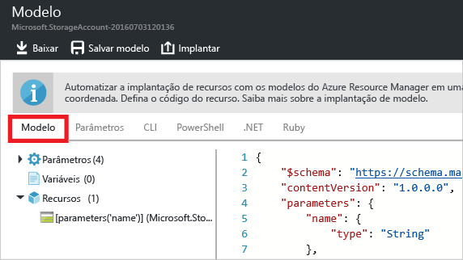

<properties
	pageTitle="Exportar o modelo do Azure Resource Manager | Microsoft Azure"
	description="Use o Azure Resource Manager para exportar um modelo a partir de um grupo de recursos existente."
	services="azure-resource-manager"
	documentationCenter=""
	authors="tfitzmac"
	manager="timlt"
	editor="tysonn"/>

<tags
	ms.service="azure-resource-manager"
	ms.workload="multiple"
	ms.tgt_pltfrm="na"
	ms.devlang="na"
	ms.topic="get-started-article"
	ms.date="05/10/2016"
	ms.author="tomfitz"/>

# Exportar um modelo do Azure Resource Manager a partir dos recursos existentes

Compreender como criar modelos do Azure Resource Manager pode ser desanimador. Felizmente, o Resource Manager ajuda nessa tarefa porque você pode exportar um modelo dos recursos existentes em sua assinatura. Você pode usar esse modelo gerado para saber mais sobre a sintaxe do modelo ou automatizar a reimplantação de sua solução, conforme o necessário.

Neste tutorial, você entrará no portal do Azure, criará uma conta de armazenamento e exportará o modelo para essa conta de armazenamento. Você adicionará uma rede virtual para modificar o grupo de recursos. Por fim, exportará um novo modelo que representa seu estado atual. Embora este artigo foque em uma infraestrutura simplificada, você poderia usar essas mesmas etapas para exportar um modelo para uma solução mais complicada.

## Criar uma conta de armazenamento

1. No [portal do Azure](https://portal.azure.com), selecione **Novo** > **Dados + Armazenamento** > **Conta de armazenamento**.

      

2. Crie uma conta de armazenamento com o nome **armazenamento**, suas iniciais e a data. O nome da conta de armazenamento deve ser exclusivo no Azure. Se você tentar inicialmente um nome que já está em uso, experimente uma variação. Para o grupo de recursos, use **ExportGroup**. Você pode usar valores padrão para as outras propriedades. Selecione **Criar**.

      

Depois da implantação terminar, sua assinatura conterá a conta de armazenamento.

## Exportar o modelo da implantação

1. Vá para a folha do grupo de recursos do novo grupo de recursos. Você notará que o resultado da última implantação está listado. Selecione este link.

      

2. Você verá um histórico das implantações do grupo. Em seu caso, provavelmente há apenas uma implantação listada. Selecione essa implantação.

     

3. Será exibido um resumo da implantação. O resumo inclui o status da implantação, suas operações e os valores que você forneceu para os parâmetros. Para ver o modelo usado para a implantação, selecione **Exibir modelo**.

     

4. O Resource Manager recupera os cinco arquivos a seguir para você:

   - O modelo que define a infraestrutura de sua solução. Quando você criou a conta de armazenamento por meio do portal, o Gerenciador de Recursos usou um modelo para implantá-la e salvou esse modelo para uma futura referência.

   - Um arquivo de parâmetro que você pode usar para passar valores durante a implantação. Ele contém os valores fornecidos durante a primeira implantação, mas você pode alterar qualquer um desses valores ao reimplantar o modelo.

   - Um arquivo de script do Azure PowerShell que você pode usar para implantar o modelo.

   - Um arquivo de script CLI (interface da linha comando) do Azure que você pode usar para implantar o modelo.

   - Uma classe .NET que você pode usar para implantar o modelo.

     Os arquivos estão disponíveis por meio de links na folha. Por padrão, o modelo é selecionado.

       

     Vamos prestar atenção particular no modelo. O modelo deve ser semelhante a:

        {
          "$schema": "https://schema.management.azure.com/schemas/2015-01-01/deploymentTemplate.json#",
          "contentVersion": "1.0.0.0",
          "parameters": {
            "name": {
              "type": "String"
            },
            "accountType": {
              "type": "String"
            },
            "location": {
              "type": "String"
            },
            "encryptionEnabled": {
              "defaultValue": false,
              "type": "Bool"
            }
          },
          "resources": [
            {
              "type": "Microsoft.Storage/storageAccounts",
              "sku": {
                "name": "[parameters('accountType')]"
              },
              "kind": "Storage",
              "name": "[parameters('name')]",
              "apiVersion": "2016-01-01",
              "location": "[parameters('location')]",
              "properties": {
                "encryption": {
                  "services": {
                    "blob": {
                      "enabled": "[parameters('encryptionEnabled')]"
                    }
                  },
                  "keySource": "Microsoft.Storage"
                }
              }
            }
          ]
        }

     Observe que o modelo define os parâmetros para o nome da conta de armazenamento, o tipo e o local. Um parâmetro também indica se a criptografia está habilitada e se o valor padrão é **false**. Na seção **recursos**, você verá a definição da conta de armazenamento a implantar.

Os colchetes contêm uma expressão que é avaliada durante a implantação. As expressões entre colchetes no modelo são usadas para obter os valores do parâmetro durante a implantação. Você pode usar muitas outras expressões e verá exemplos de outras expressões neste artigo. Para obter a lista completa, consulte [Funções do modelo do Azure Resource Manager](resource-group-template-functions.md).

Para saber mais sobre a estrutura de um modelo, consulte [Criando modelos do Azure Resource Manager](resource-group-authoring-templates.md).

## Adicionar uma rede virtual

O modelo que você baixou na seção anterior representava a infraestrutura dessa implantação original, mas ele não levará em conta nenhuma alteração feita após a implantação. Para ilustrar esse problema, modificaremos o grupo de recursos adicionando uma rede virtual por meio do portal.

1. Na folha do grupo de recursos, selecione **Adicionar**, em seguida, selecione **rede virtual** nos recursos disponíveis.

2. Nomeie sua rede virtual como **VNET** e use valores padrão para as outras propriedades. Selecione **Criar**.

      

3. Depois da rede virtual ser implantada com êxito para o grupo de recursos, veja novamente o histórico de implantações. Agora, você verá duas implantações. Selecione a implantação mais recente.

      

4. Veja o modelo dessa implantação. Observe que ele define apenas as alterações feitas para adicionar a rede virtual.

Geralmente, é melhor trabalhar com um modelo que implanta toda a infraestrutura para sua solução em uma única operação, em vez de lembrar de vários modelos diferentes para implantar.

## Exportar o modelo para o grupo de recursos

Embora cada implantação mostre apenas as alterações feitas em seu grupo de recursos, a qualquer momento você pode exportar um modelo para exibir os atributos de todo o seu grupo de recursos.

1. Para exibir o modelo de um grupo de recursos, selecione **Exportar modelo**.

      

2. Novamente, você verá os cinco arquivos que pode usar para reimplantar a solução, mas desta vez, o modelo é um pouco diferente. Esse modelo tem somente dois parâmetros: um para o nome da conta de armazenamento e outro para o nome da rede virtual.

        "parameters": {
          "virtualNetworks_VNET_name": {
            "defaultValue": "VNET",
            "type": "String"
          },
          "storageAccounts_storagetf05092016_name": {
            "defaultValue": "storagetf05092016",
            "type": "String"
          }
        },

     O Gerenciador de Recursos não recuperou os modelos usados durante a implantação. Em vez disso, ele gerou um novo modelo com base na configuração atual dos recursos. O Resource Manager não sabe quais valores você deseja passar como parâmetros. Portanto, ele codifica a maioria dos valores com base nos valores no grupo de recursos. Por exemplo, o local da conta de armazenamento e o valor da replicação são definidos para:

        "location": "northeurope",
        "tags": {},
        "properties": {
            "accountType": "Standard_RAGRS"
        },

3. Baixe o modelo para que você possa trabalhar nele localmente.

      

4. Localize o arquivo .zip que você baixou e extraia o conteúdo. Você pode usar esse modelo baixado para reimplantar sua infraestrutura.

## Próximas etapas

Parabéns! Você aprendeu a exportar um modelo a partir dos recursos criados no portal.

- Na segunda parte deste tutorial, você irá personalizar o modelo que acabou de baixar adicionando mais parâmetros e irá reimplantá-lo por meio de um script. Consulte [Personalizar e reimplantar o modelo exportado](resource-manager-customize-template.md).
- Para ver como exportar um modelo por meio do PowerShell, consulte [Usando o Azure PowerShell com o Azure Resource Manager](powershell-azure-resource-manager.md).
- Para ver como exportar um modelo por meio da CLI do Azure, consulte [Usar a CLI do Azure para Mac, Linux e Windows com o Azure Resource Manager](xplat-cli-azure-resource-manager.md).

<!---HONumber=AcomDC_0518_2016-->