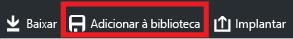
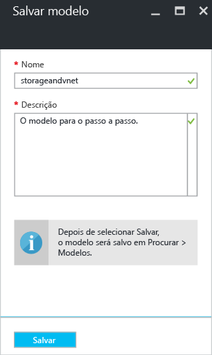
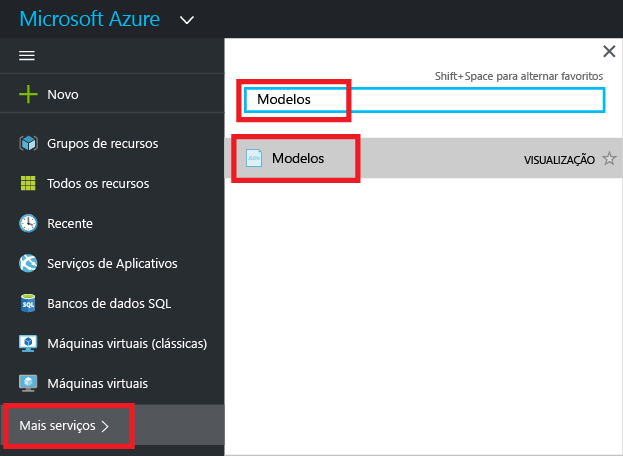
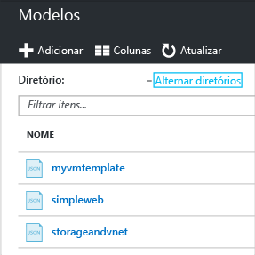
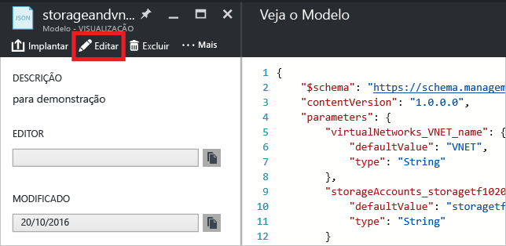
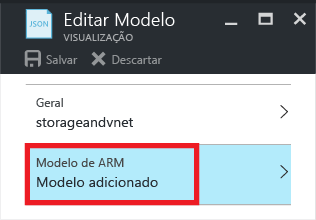
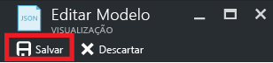
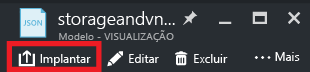

# <a name="export-an-azure-resource-manager-template-from-existing-resources"></a>Exportar um modelo do Azure Resource Manager a partir dos recursos existentes
O Gerenciador de Recursos permite que você exporte um modelo do Gerenciador de Recursos a partir dos recursos existentes em sua assinatura. Você pode usar esse modelo gerado para saber mais sobre a sintaxe do modelo ou automatizar a reimplantação de sua solução, conforme o necessário.

É importante observar que há duas maneiras diferentes de exportar um modelo:

* Você pode exportar o modelo real que usou para uma implantação. O modelo exportado inclui todas as variáveis e parâmetros exatamente como apareceram no modelo original. Essa abordagem é útil quando você implantou recursos pelo portal. Agora, você deve ver como construir o modelo para criar esses recursos.
* Você pode exportar um modelo que representa o estado atual do grupo de recursos. O modelo exportado não é baseado em nenhum modelo que você usou para a implantação. Ao contrário, ele cria um modelo que é um instantâneo do grupo de recursos. O modelo exportado tem muitos valores embutidos e provavelmente menos parâmetros do que você normalmente definiria. Essa abordagem é útil quando você modificou o grupo de recursos pelo portal ou com scripts. Agora, você precisa capturar o grupo de recursos como um modelo.

Este tópico mostra as duas abordagens.

Neste tutorial, você entra no portal do Azure, cria uma conta de armazenamento e exporta o modelo para essa conta de armazenamento. Você adiciona uma rede virtual para modificar o grupo de recursos. Por fim, exporta um novo modelo que representa seu estado atual. Embora este artigo foque em uma infraestrutura simplificada, você poderia usar essas mesmas etapas para exportar um modelo para uma solução mais complicada.

## <a name="create-a-storage-account"></a>Criar uma conta de armazenamento
1. No [Portal do Azure](https://portal.azure.com), selecione **Novo** > **Armazenamento** > **Conta de armazenamento**.
   
      
2. Crie uma conta de armazenamento com o nome **armazenamento**, suas iniciais e a data. O nome da conta de armazenamento deve ser exclusivo no Azure. Se o nome já estiver em uso, você verá uma mensagem de erro indicando que o nome está em uso. Tente uma variação. Para o grupo de recursos, crie um novo grupo de recursos e chame-o de **ExportGroup**. Você pode usar valores padrão para as outras propriedades. Selecione **Criar**.
   
      

A implantação pode demorar um pouco. Depois da implantação terminar, sua assinatura conterá a conta de armazenamento.

## <a name="view-a-template-from-deployment-history"></a>Exibir um modelo do histórico de implantações
1. Vá para a folha do grupo de recursos do novo grupo de recursos. Observe que a folha mostra o resultado da última implantação. Selecione este link.
   
      
2. Você vê um histórico das implantações do grupo. No seu caso, a folha provavelmente lista apenas uma implantação. Selecione essa implantação.
   
     
3. A folha exibe um resumo da implantação. O resumo inclui o status da implantação, suas operações e os valores que você forneceu para os parâmetros. Para ver o modelo usado para a implantação, selecione **Exibir modelo**.
   
     
4. O Resource Manager recupera os seguintes seis arquivos para você:
   
   1. **Modelo** - O modelo que define a infraestrutura de sua solução. Quando você criou a conta de armazenamento por meio do portal, o Gerenciador de Recursos usou um modelo para implantá-la e salvou esse modelo para uma futura referência.
   2. **Parâmetros** - Um arquivo de parâmetro que você pode usar para passar valores durante a implantação. Ele contém os valores fornecidos durante a primeira implantação, mas você pode alterar qualquer um desses valores ao reimplantar o modelo.
   3. **CLI** - Um arquivo de script CLI (interface da linha comando) do Azure que você pode usar para implantar o modelo.
   4. **PowerShell** - Um arquivo de script do Azure PowerShell que você pode usar para implantar o modelo.
   5. **.NET** - Uma classe .NET que você pode usar para implantar o modelo.
   6. **Ruby** - uma classe Ruby que você pode usar para implantar o modelo.
      
      Os arquivos estão disponíveis por meio de links na folha. Por padrão, a folha exibe o modelo.
      
       
      
      Vamos prestar atenção particular no modelo. O modelo deve ser semelhante a:
      
        {
      
          "$schema": "https://schema.management.azure.com/schemas/2015-01-01/deploymentTemplate.json#",
          "contentVersion": "1.0.0.0",
          "parameters": {
            "name": {
              "type": "String"
            },
            "accountType": {
              "type": "String"
            },
            "location": {
              "type": "String"
            },
            "encryptionEnabled": {
              "defaultValue": false,
              "type": "Bool"
            }
          },
          "resources": [
            {
              "type": "Microsoft.Storage/storageAccounts",
              "sku": {
                "name": "[parameters('accountType')]"
              },
              "kind": "Storage",
              "name": "[parameters('name')]",
              "apiVersion": "2016-01-01",
              "location": "[parameters('location')]",
              "properties": {
                "encryption": {
                  "services": {
                    "blob": {
                      "enabled": "[parameters('encryptionEnabled')]"
                    }
                  },
                  "keySource": "Microsoft.Storage"
                }
              }
            }
          ]
        }

Esse modelo é o modelo real usado para criar sua conta de armazenamento. Observe que ele contém parâmetros que permitem implantar diferentes tipos de contas de armazenamento. Para saber mais sobre a estrutura de um modelo, confira [Criando modelos do Azure Resource Manager](resource-group-authoring-templates.md). Para obter a lista completa de funções que você pode usar em um modelo, consulte [Funções do modelo do Azure Resource Manager](resource-group-template-functions.md).

## <a name="add-a-virtual-network"></a>Adicionar uma rede virtual
O modelo que você baixou na seção anterior representa a infraestrutura da implantação original. No entanto, ele não mostrará as alterações feitas após a implantação.
Para ilustrar esse problema, modificaremos o grupo de recursos adicionando uma rede virtual por meio do portal.

1. Na folha do grupo de recursos, selecione **Adicionar**.
   
      
2. Selecione **Rede virtual** nos recursos disponíveis.
   
      
3. Nomeie sua rede virtual como **VNET**e use os valores padrão para as outras propriedades. Selecione **Criar**.
   
      
4. Depois da rede virtual ser implantada com êxito para o grupo de recursos, veja novamente o histórico de implantações. Agora, você vê duas implantações. Se você não vir a segunda implantação, precisará fechar a folha do grupo de recursos e abri-la novamente. Selecione a implantação mais recente.
   
      
5. Exiba o modelo dessa implantação. Observe que ela define somente a rede virtual. Não inclui a conta de armazenamento implantada anteriormente. Você não tem mais um modelo que representa todos os recursos em seu grupo de recursos.

## <a name="export-the-template-from-resource-group"></a>Exportar o modelo do grupo de recursos
Para obter o estado atual do seu grupo de recursos, exporte um modelo que mostre um instantâneo do grupo de recursos.  

> [!NOTE]
> Você não pode exportar um modelo para um grupo de recursos que tenha mais de 200 recursos.
> 
> 

1. Para exibir o modelo de um grupo de recursos, selecione **Script de automação**.
   
      
   
     Nem todos os tipos de recursos suportam a função para exportar o modelo. Se o grupo de recursos contiver somente a conta de armazenamento e a rede virtual mostradas neste artigo, você não verá um erro. No entanto, se você criou outros tipos de recursos, verá um erro indicando que há um problema com a exportação. Você aprende a lidar com esses problemas na seção [Corrigir os problemas da exportação](#fix-export-issues) .
2. Novamente, você vê os seis arquivos que pode usar para reimplantar a solução, mas dessa vez, o modelo é um pouco diferente. Esse modelo tem somente dois parâmetros: um para o nome da conta de armazenamento e outro para o nome da rede virtual.
   
        "parameters": {
          "virtualNetworks_VNET_name": {
            "defaultValue": "VNET",
            "type": "String"
          },
          "storageAccounts_storagetf05092016_name": {
            "defaultValue": "storagetf05092016",
            "type": "String"
          }
        },
   
     O Gerenciador de Recursos não recuperou os modelos que você usou durante a implantação. Em vez disso, ele gerou um novo modelo com base na configuração atual dos recursos. Por exemplo, o modelo define o local da conta de armazenamento e o valor da replicação como:
   
        "location": "northeurope",
        "tags": {},
        "properties": {
            "accountType": "Standard_RAGRS"
        },
3. Você tem algumas opções para continuar a trabalhar com esse modelo. Você pode baixar o modelo e trabalhar nele localmente com um editor de JSON. Ou pode salvar o modelo em sua biblioteca e trabalhar com ele por meio do portal.
   
     Se você estiver familiarizado com o uso de um editor de JSON como o [VS Code](resource-manager-vs-code.md) ou o [Visual Studio](vs-azure-tools-resource-groups-deployment-projects-create-deploy.md), talvez você prefira baixar o modelo localmente e usar o editor. Se você não estiver confortável com um editor de JSON, talvez prefira a edição do modelo por meio do portal. O restante deste tópico pressupõe que você tenha salvo o modelo para sua biblioteca no portal. No entanto, você fará as mesmas alterações de sintaxe para o modelo se trabalhar localmente com um editor de JSON ou por meio do portal.
   
     Para trabalhar localmente, selecione **Baixar**.
   
      
   
     Para trabalhar no portal, selecione **Adicionar à biblioteca**.
   
      
   
     Ao adicionar um modelo à biblioteca, atribua um nome e uma descrição ao modelo. Em seguida, selecione **Salvar**.
   
     
4. Para exibir um modelo salvo na biblioteca, selecione **Mais serviços**, digite **Modelos** para filtrar os resultados, selecione **Modelos**.
   
      
5. Selecione o modelo com o nome que você salvou.
   
      

## <a name="customize-the-template"></a>Personalizar o modelo
O modelo exportado funcionará bem se você quiser criar a mesma conta de armazenamento e rede virtual para cada implantação. No entanto, o Resource Manager fornece opções para que você possa implantar modelos com muito mais flexibilidade. Por exemplo, durante a implantação, talvez você queira especificar o tipo de conta de armazenamento a criar ou os valores a usar para os prefixos do endereço e da sub-rede da rede virtual.

Nesta seção, você adicionará parâmetros ao modelo exportado para poder reutilizar o modelo ao implantar esses recursos em outros ambientes. Você também adicionará alguns recursos ao modelo que reduzem a probabilidade de encontrar um erro ao implantar o modelo. Você não terá mais que adivinhar um nome exclusivo para sua conta de armazenamento. Em vez disso, o modelo cria um nome exclusivo. Você restringirá os valores que podem ser especificados para o tipo da conta de armazenamento apenas para as opções válidas.

1. Selecione **Editar** para personalizar o modelo.
   
     
2. Selecione o modelo.
   
     
3. Para habilitar a passagem dos valores que talvez você queira especificar durante a implantação, substitua a seção **parâmetros** pelas novas definições de parâmetro. Observe os valores de **allowedValues** para **storageAccount_accountType**. Se você fornecer acidentalmente um valor inválido, esse erro será reconhecido antes da implantação iniciar. E mais: observe também que você está fornecendo apenas um prefixo para o nome da conta de armazenamento e o prefixo é limitado a 11 caracteres. Ao limitar o prefixo a 11 caracteres, você garante que o nome completo não excederá o número máximo de caracteres para uma conta de armazenamento. O prefixo permite que você aplique uma convenção de nomenclatura em suas contas de armazenamento. Você verá como criar um nome exclusivo na próxima etapa.
   
        "parameters": {
          "storageAccount_prefix": {
            "type": "string",
            "maxLength": 11
          },
          "storageAccount_accountType": {
            "defaultValue": "Standard_RAGRS",
            "type": "string",
            "allowedValues": [
              "Standard_LRS",
              "Standard_ZRS",
              "Standard_GRS",
              "Standard_RAGRS",
              "Premium_LRS"
            ]
          },
          "virtualNetwork_name": {
            "type": "string"
          },
          "addressPrefix": {
            "defaultValue": "10.0.0.0/16",
            "type": "string"
          },
          "subnetName": {
            "defaultValue": "subnet-1",
            "type": "string"
          },
          "subnetAddressPrefix": {
            "defaultValue": "10.0.0.0/24",
            "type": "string"
          }
        },
4. A seção **variáveis** do modelo está vazia atualmente. Na seção **variáveis** , você pode criar valores que simplificam a sintaxe para o resto do modelo. Substitua esta seção por uma nova definição de variável. A variável **storageAccount_name** concatena o prefixo do parâmetro a uma cadeia de caracteres exclusiva gerada com base no identificador do grupo de recursos. Você não precisa adivinhar um nome exclusivo ao fornecer um valor de parâmetro.
   
        "variables": {
          "storageAccount_name": "[concat(parameters('storageAccount_prefix'), uniqueString(resourceGroup().id))]"
        },
5. Para usar os parâmetros e a variável nas definições do recurso, substitua a seção **recursos** pelas novas definições a seguir. Observe que pouco mudou nas definições do recurso além do valor que é atribuído à propriedade do recurso. As propriedades são iguais às propriedades do modelo exportado. Você está simplesmente atribuindo propriedades aos valores do parâmetro, em vez de valores codificados. O local dos recursos é definido para usar o mesmo local do grupo de recursos por meio da expressão **resourceGroup ().location** . A variável criada para o nome da conta de armazenamento é referenciada por meio da expressão **variables** .
   
        "resources": [
          {
            "type": "Microsoft.Network/virtualNetworks",
            "name": "[parameters('virtualNetwork_name')]",
            "apiVersion": "2015-06-15",
            "location": "[resourceGroup().location]",
            "properties": {
              "addressSpace": {
                "addressPrefixes": [
                  "[parameters('addressPrefix')]"
                ]
              },
              "subnets": [
                {
                  "name": "[parameters('subnetName')]",
                  "properties": {
                    "addressPrefix": "[parameters('subnetAddressPrefix')]"
                  }
                }
              ]
            },
            "dependsOn": []
          },
          {
            "type": "Microsoft.Storage/storageAccounts",
            "name": "[variables('storageAccount_name')]",
            "apiVersion": "2015-06-15",
            "location": "[resourceGroup().location]",
            "tags": {},
            "properties": {
                "accountType": "[parameters('storageAccount_accountType')]"
            },
            "dependsOn": []
          }
        ]
6. Selecione **OK** quando terminar a edição do modelo.
7. Selecione **Salvar** para salvar as alterações no modelo.
   
     
8. Para implantar o modelo atualizado, selecione **Implantar**.
   
     
9. Forneça valores de parâmetro e selecione um novo grupo de recursos para o qual os recursos serão implantados.

## <a name="update-the-downloaded-parameters-file"></a>Atualizar o arquivo de parâmetros baixado
Se você estiver trabalhando com os arquivos baixados (em vez da biblioteca do portal), precisará atualizar o arquivo de parâmetros baixado. Ele não corresponde aos parâmetros em seu modelo. Você não precisa usar um arquivo de parâmetro, mas ele pode simplificar o processo na reimplantação de um ambiente. Você usará os valores padrão definidos no modelo para muitos parâmetros, de modo que o arquivo de parâmetros só precise de dois valores.

Substitua o conteúdo do arquivo parameters.json por:

```
{
  "$schema": "https://schema.management.azure.com/schemas/2015-01-01/deploymentParameters.json#",
  "contentVersion": "1.0.0.0",
  "parameters": {
    "storageAccount_prefix": {
      "value": "storage"
    },
    "virtualNetwork_name": {
      "value": "VNET"
    }
  }
}
```

O arquivo de parâmetros atualizado fornece apenas os valores para os parâmetros que não têm um valor padrão. Você poderá fornecer valores para outros parâmetros quando quiser que um valor seja diferente do valor padrão.

## <a name="fix-export-issues"></a>Corrigir os problemas da exportação
Nem todos os tipos de recursos suportam a função para exportar o modelo. O Gerenciador de Recursos não exporta alguns tipos de recursos especificamente para evitar a exposição de dados confidenciais. Por exemplo, se você tiver uma cadeia de conexão na configuração de seu site, provavelmente não desejará que ela seja exibida explicitamente em um modelo exportado. Você pode resolver esse problema adicionando manualmente os recursos que faltam de volta ao seu modelo.

> [!NOTE]
> Você só encontra problemas de exportação quando exporta de um grupo de recursos em vez de seu histórico de implantações. Se sua última implantação apresentar com precisão o estado atual do grupo de recursos, você deverá exportar o modelo do histórico de implantações, em vez do grupo de recursos. Exporte somente a partir de um grupo de recursos quando você fez alterações no grupo de recursos que não são definidas em um único modelo.
> 
> 

Por exemplo, se você exportar um modelo para um grupo de recursos que contém um aplicativo Web, Banco de Dados SQL e uma cadeia de conexão na configuração do site, verá a seguinte mensagem de erro:


Selecionar a mensagem mostra exatamente quais tipos de recursos não foram exportados. 


Este tópico mostra correções comuns.

### <a name="connection-string"></a>Cadeia de conexão
No recurso dos sites da Web, adicione uma definição da cadeia de conexão ao banco de dados:

```
{
  "type": "Microsoft.Web/sites",
  ...
  "resources": [
    {
      "apiVersion": "2015-08-01",
      "type": "config",
      "name": "connectionstrings",
      "dependsOn": [
          "[concat('Microsoft.Web/Sites/', parameters('<site-name>'))]"
      ],
      "properties": {
          "DefaultConnection": {
            "value": "[concat('Data Source=tcp:', reference(concat('Microsoft.Sql/servers/', parameters('<database-server-name>'))).fullyQualifiedDomainName, ',1433;Initial Catalog=', parameters('<database-name>'), ';User Id=', parameters('<admin-login>'), '@', parameters('<database-server-name>'), ';Password=', parameters('<admin-password>'), ';')]",
              "type": "SQLServer"
          }
      }
    }
  ]
}
```    

### <a name="web-site-extension"></a>Extensão do site da Web
No recurso do site da Web, adicione uma definição para o código a instalar:

```
{
  "type": "Microsoft.Web/sites",
  ...
  "resources": [
    {
      "name": "MSDeploy",
      "type": "extensions",
      "location": "[resourceGroup().location]",
      "apiVersion": "2015-08-01",
      "dependsOn": [
        "[concat('Microsoft.Web/sites/', parameters('<site-name>'))]"
      ],
      "properties": {
        "packageUri": "[concat(parameters('<artifacts-location>'), '/', parameters('<package-folder>'), '/', parameters('<package-file-name>'), parameters('<sas-token>'))]",
        "dbType": "None",
        "connectionString": "",
        "setParameters": {
          "IIS Web Application Name": "[parameters('<site-name>')]"
        }
      }
    }
  ]
}
```

### <a name="virtual-machine-extension"></a>Extensão da máquina virtual
Para obter exemplos das extensões da máquina virtual, consulte [Exemplos de Configuração da Extensão da VM do Windows do Azure](virtual-machines/virtual-machines-windows-extensions-configuration-samples.md).

### <a name="virtual-network-gateway"></a>Gateway de rede virtual
Adicione um tipo de recurso do gateway de rede virtual.

```
{
  "type": "Microsoft.Network/virtualNetworkGateways",
  "name": "[parameters('<gateway-name>')]",
  "apiVersion": "2015-06-15",
  "location": "[resourceGroup().location]",
  "properties": {
    "gatewayType": "[parameters('<gateway-type>')]",
    "ipConfigurations": [
      {
        "name": "default",
        "properties": {
          "privateIPAllocationMethod": "Dynamic",
          "subnet": {
            "id": "[resourceId('Microsoft.Network/virtualNetworks/subnets', parameters('<vnet-name>'), parameters('<new-subnet-name>'))]"
          },
          "publicIpAddress": {
            "id": "[resourceId('Microsoft.Network/publicIPAddresses', parameters('<new-public-ip-address-Name>'))]"
          }
        }
      }
    ],
    "enableBgp": false,
    "vpnType": "[parameters('<vpn-type>')]"
  },
  "dependsOn": [
    "Microsoft.Network/virtualNetworks/codegroup4/subnets/GatewaySubnet",
    "[concat('Microsoft.Network/publicIPAddresses/', parameters('<new-public-ip-address-Name>'))]"
  ]
},
```

### <a name="local-network-gateway"></a>Gateway de rede local
Adicione um tipo de recurso do gateway de rede local.

```
{
    "type": "Microsoft.Network/localNetworkGateways",
    "name": "[parameters('<local-network-gateway-name>')]",
    "apiVersion": "2015-06-15",
    "location": "[resourceGroup().location]",
    "properties": {
      "localNetworkAddressSpace": {
        "addressPrefixes": "[parameters('<address-prefixes>')]"
      }
    }
}
```

### <a name="connection"></a>Conexão
Adicione um tipo de recurso de conexão.

```
{
    "apiVersion": "2015-06-15",
    "name": "[parameters('<connection-name>')]",
    "type": "Microsoft.Network/connections",
    "location": "[resourceGroup().location]",
    "properties": {
        "virtualNetworkGateway1": {
        "id": "[resourceId('Microsoft.Network/virtualNetworkGateways', parameters('<gateway-name>'))]"
      },
      "localNetworkGateway2": {
        "id": "[resourceId('Microsoft.Network/localNetworkGateways', parameters('<local-gateway-name>'))]"
      },
      "connectionType": "IPsec",
      "routingWeight": 10,
      "sharedKey": "[parameters('<shared-key>')]"
    }
},
```


## <a name="next-steps"></a>Próximas etapas
Parabéns! Você aprendeu a exportar um modelo a partir dos recursos criados no portal.

* Você pode implantar um modelo por meio do [PowerShell](resource-group-template-deploy.md), da [CLI do Azure](resource-group-template-deploy-cli.md) ou da [API REST](resource-group-template-deploy-rest.md).
* Para ver como exportar um modelo por meio do PowerShell, consulte [Usando o Azure PowerShell com o Azure Resource Manager](powershell-azure-resource-manager.md).
* Para ver como exportar um modelo por meio da CLI do Azure, consulte [Usar a CLI do Azure para Mac, Linux e Windows com o Azure Resource Manager](xplat-cli-azure-resource-manager.md).


<!--HONumber=Nov16_HO2-->


