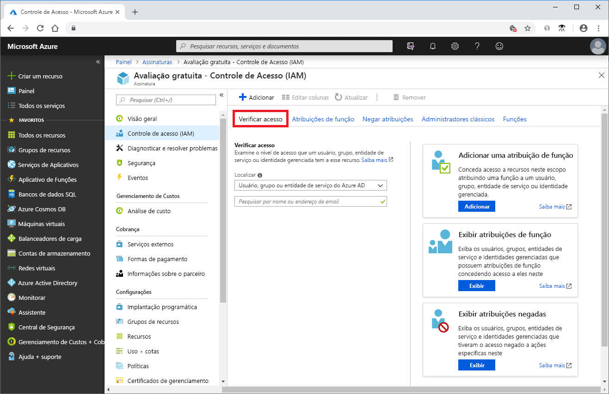
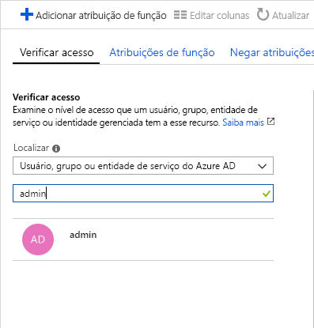
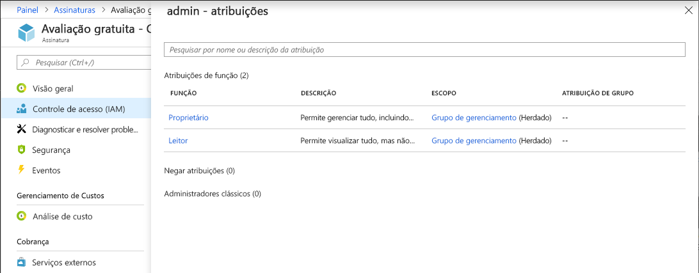

# Início Rápido - exibir funções atribuídas a um usuário usando o portal do Azure

Você pode usar a folha **controle de acesso (IAM)** no [controle de acesso baseado em função (RBAC)](overview.md) para exibir as atribuições de função para vários usuários, grupos, entidades de serviço e identidades gerenciadas, mas, às vezes, basta exibir rapidamente as atribuições de função para um único usuário, grupo, entidade de serviço ou identidade gerenciada. A maneira mais fácil de fazer isso é usar o recurso **Verificar acesso** no portal do Azure.

## Exibir atribuições de função

Siga essas etapas para exibir as atribuições de função para um único usuário, grupo, entidade de serviço ou identidade gerenciada no escopo de assinaturas.

1. No portal do Microsoft Azure, clique em **Todos os serviços** e, em seguida, em **Assinaturas**.

1. Clique em sua assinatura.

1. Clique em **Controle de acesso (IAM)**.

1. Clique na guia **Verificar acesso**.

    

1. Na lista **Localizar**, selecione o tipo de entidade de segurança para a qual você deseja verificar o acesso.

1. Na caixa de pesquisa, insira uma cadeia de caracteres para pesquisar no diretório nomes de exibição, endereços de e-mail ou identificadores de objetos.

    

1. Clique na entidade de segurança para abrir o painel **atribuições**.

    

    Nesse painel, você pode ver as funções atribuídas à entidade de segurança selecionada e o escopo. Se houver alguma atribuição de negação nesse escopo ou herdada para esse escopo, ela será listada.

## Próximas etapas

> [!div class="nextstepaction"]
> [Tutorial: Conceder acesso a um usuário usando o RBAC e o portal do Azure](quickstart-assign-role-user-portal.md)
