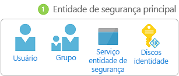
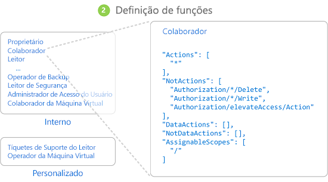
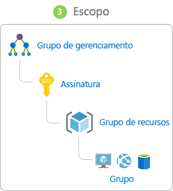
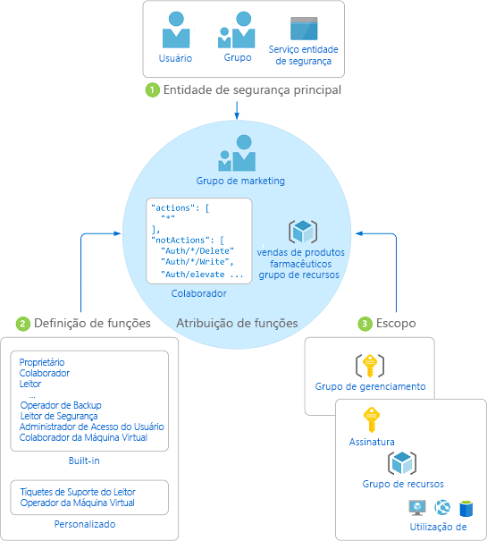

# O que é o controle de acesso baseado em função (RBAC)?

O gerenciamento de acesso para recursos de nuvem é uma função crítica para qualquer organização que esteja usando a nuvem. O controle de acesso baseado em funções (RBAC) ajuda a gerenciar quem tem acesso aos recursos do Azure, o que pode fazer com esses recursos e a quais áreas tem acesso.

O RBAC é um sistema de autorização baseado no [Azure Resource Manager](../azure-resource-manager/resource-group-overview.md) que fornece gerenciamento de acesso refinado aos recursos no Azure. Com o RBAC, você pode separar as tarefas dentro de sua equipe e conceder somente a quantidade de acesso que os usuários precisam para realizar seus trabalhos. Em vez de apresentar todos irrestrito permissões em sua assinatura do Azure ou recursos, você pode permitir apenas determinadas ações para um escopo específico.

## O que posso fazer com o RBAC?

Aqui estão alguns exemplos do que você pode fazer com o RBAC:

- Permitir que um usuário gerencie máquinas virtuais em uma assinatura e outro usuário gerencie redes virtuais
- Permitir que um grupo de DBA gerencie bancos de dados SQL em uma assinatura
- Permitir que um usuário gerencie todos os recursos em um grupo de recursos, como máquinas virtuais, sites e sub-redes
- Permitir que um aplicativo acesse todos os recursos em um grupo de recursos

## Como funciona o RBAC

A maneira de controlar o acesso aos recursos usando RBAC é criar atribuições de função. Esse é um conceito fundamental que deve ser entendido, isto é, como as permissões são aplicadas. Uma atribuição de função consiste em três elementos: entidade de segurança, definição de função e escopo.

### Entidade de segurança

Uma *entidade de segurança* é um objeto que representa um usuário, grupo ou entidade de serviço que está solicitando acesso aos recursos do Azure.

- Usuário – Um indivíduo que tem um perfil no Azure Active Directory. Você também pode atribuir funções a usuários em outros locatários. Para obter informações sobre usuários de outras organizações, consulte [Azure Active Directory B2B](/azure/active-directory/active-directory-b2b-what-is-azure-ad-b2b).
- Grupo - Um grupo de usuários criados no Azure Active Directory. Quando você atribuir uma função a um grupo, todos os usuários dentro desse grupo têm essa função. 
- Entidade de serviço - Uma identidade de segurança usada por aplicativos ou serviços para acessar recursos específicos do Azure. Você pode pensar nela como uma *identidade do usuário* (nome de usuário e senha ou certificado) para um aplicativo.

### Definição de função

Uma *definição de função* é um conjunto de permissões. Às vezes, é chamada apenas de *função*. Uma definição de função lista as operações que podem ser executadas, como leitura, gravação e exclusão. Funções podem ser de alto nível, como proprietário, ou específicas, como leitor de máquina virtual.

O Azure inclui várias [funções internas](built-in-roles.md) que você pode usar. A seguir são listadas quatro funções internas fundamentais. As três primeiras se aplicam a todos os tipos de recursos.

- [Proprietário](built-in-roles.md#owner) - Possui acesso total a todos os recursos, inclusive o direito de delegar acesso a outros usuários.
- [Colaborador](built-in-roles.md#contributor) - Pode criar e gerenciar todos os tipos de recursos do Azure, mas não pode conceder acesso a outras pessoas.
- [Leitor](built-in-roles.md#reader) - Pode exibir os recursos existentes do Azure.
- [Administrador de Acesso do Usuário](built-in-roles.md#user-access-administrator) - Permite gerenciar o acesso do usuário aos recursos do Azure.

As demais funções internas permitem o gerenciamento de recursos específicos do Azure. Por exemplo, a função [Colaborador de Máquina Virtual](built-in-roles.md#virtual-machine-contributor) permite que um usuário crie e gerencie máquinas virtuais. Se as funções internas não atenderem às necessidades específicas de sua organização, você poderá criar suas próprias [funções personalizadas](custom-roles.md).

O Azure introduziu as operações de dados (atualmente em versão prévia) que permitem que você conceda acesso a dados dentro de um objeto. Por exemplo, se um usuário tem acesso de leitura de dados para uma conta de armazenamento, eles podem ler blobs ou mensagens dentro dessa conta de armazenamento. Para saber mais, veja [Noções básicas sobre definições de função](role-definitions.md).

### Escopo

*Escopo* é o limite ao qual o acesso se aplica. Quando você atribui uma função, você pode limitar ainda mais as ações permitidas definindo um escopo. Isso será útil se você quiser tornar alguém um [colaborador do site](built-in-roles.md#website-contributor), mas apenas para um grupo de recursos.

No Azure, você pode especificar um escopo em vários níveis: assinatura, grupo de recursos ou recurso. Escopos são estruturados em uma relação pai-filho no qual todos os filhos terão apenas um pai.

O acesso que você atribui a um escopo pai é herdado no escopo filho. Por exemplo:

- Se você atribuir a função [Leitor](built-in-roles.md#reader) função a um grupo no escopo da assinatura, os membros desse grupo pode exibir todos os grupo de recursos e recursos na assinatura.
- Se você atribuir a função [Colaborador](built-in-roles.md#contributor) a um aplicativo no escopo do grupo de recursos, ele pode gerenciar recursos de todos os tipos nesse mesmo grupo de recursos, mas não em outros grupos de recursos na assinatura.

O Azure também inclui um escopo acima das assinaturas chamado [grupos de gerenciamento](../azure-resource-manager/management-groups-overview.md), que está em versão prévia. Grupos de gerenciamento são uma maneira de gerenciar várias assinaturas. Quando você especifica o escopo para o RBAC, você pode especificar um grupo de gerenciamento ou especificar uma assinatura, grupo de recursos ou hierarquia de recursos.

### Atribuição de função

Uma *atribuição de função* é o processo de associar uma definição de função a um usuário, grupo ou entidade de serviço em um escopo específico com a finalidade de conceder acesso. O acesso é concedido criando uma atribuição de função, e é revogado removendo uma atribuição de função.

O diagrama a seguir mostra um exemplo de uma atribuição de função. Neste exemplo, o grupo de Marketing foi atribuído à função [Colaborador](built-in-roles.md#contributor) para o grupo de recursos vendas farmacêuticas. Isso significa que os usuários do grupo de Marketing podem criar ou gerenciar qualquer recurso do Azure no grupo de recursos de vendas do setor farmacêutico. Os usuários de Marketing não possuem acesso a recursos fora do grupo de recursos de vendas do setor farmacêutico, a menos que sejam parte de outra atribuição de função.

Você pode criar atribuições de função usando o portal do Azure, CLI do Azure, Azure PowerShell, SDKs do Azure ou APIs REST. Em cada assinatura, você pode ter até 2.000 atribuições de função. Para criar e remover as atribuições de função, você deve ter a permissão `Microsoft.Authorization/roleAssignments/*`. Essa permissão deve ser concedida pelas funções [Proprietário](built-in-roles.md#owner) ou [Administrador de Acesso do Usuário](built-in-roles.md#user-access-administrator).

## Próximas etapas

- [Início Rápido: Conceder acesso a um usuário usando o RBAC e o Portal do Azure](quickstart-assign-role-user-portal.md)
- [Gerenciar acesso usando o RBAC e o Portal do Azure](role-assignments-portal.md)
- [Entender as diferentes funções no Azure](rbac-and-directory-admin-roles.md)
