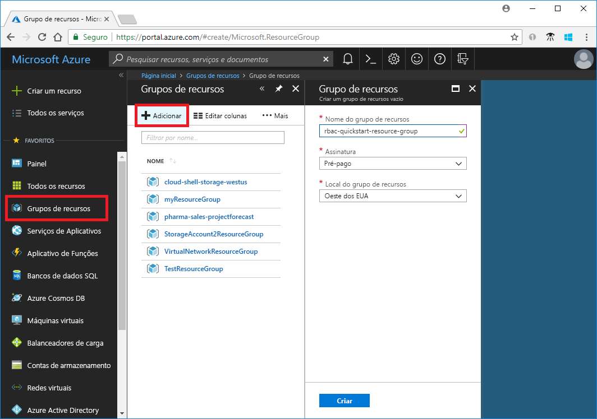
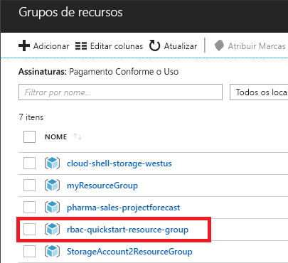
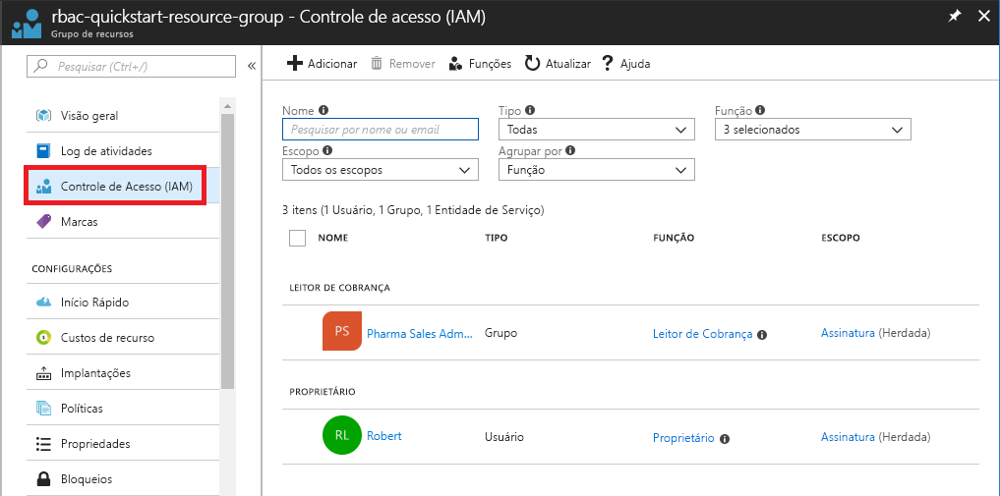
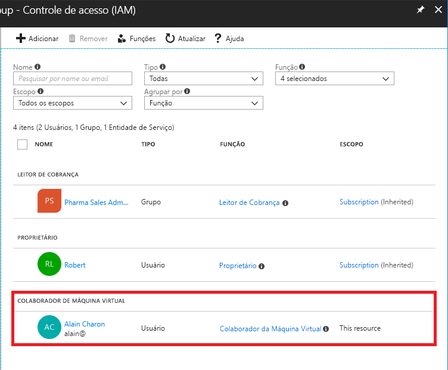
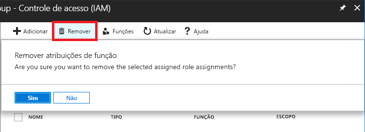
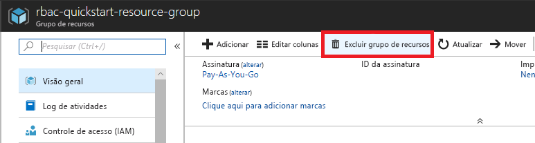

# Tutorial: Permitir acesso a um usuário aos recursos do Azure usando o RBAC e o portal do Azure

O [RBAC (controle de acesso baseado em função)](overview.md) é a maneira usada para gerenciar o acesso aos recursos no Azure. Neste tutorial, você concede acesso a um usuário para criar e gerenciar máquinas virtuais em um grupo de recursos.

Neste tutorial, você aprenderá como:

> [!div class="checklist"]
> * Conceder acesso a um usuário em um escopo do grupo de recursos
> * Remover acesso

Se você não tiver uma assinatura do Azure, crie uma [conta gratuita](https://azure.microsoft.com/free/?WT.mc_id=A261C142F) antes de começar.

## Entrar no Azure

Entre no Portal do Azure em http://portal.azure.com.

## Criar um grupo de recursos

1. Na lista de navegação, escolha **Grupos de recursos**.

1. Escolha **Adicionar** para abrir a folha **Grupo de recursos**.

   

1. Para o **Nome do grupo de recursos**, insira **rbac-resource-group**.

1. Selecione uma assinatura e localização.

1. Clique em **Criar** para criar o grupo de recursos.

1. Clique em **Atualizar** para atualizar a lista de grupos de recursos.

   O novo grupo de recursos é exibido em sua lista de grupos de recursos.

   

## Conceder acesso

No RBAC, para conceder acesso, você cria uma atribuição de função.

1. Na lista de **Grupos de recursos**, clique no novo grupo de recursos **rbac-resource-group**.

1. Clique em **Controle de acesso (IAM)**.

1. Clique na guia **Atribuições de função** para ver a lista atual das atribuições de função.

   

1. Clique em **Adicionar** > **Adicionar atribuição de função** para abrir o painel Adicionar atribuição de função.

   Se você não tiver permissões para atribuir funções, a opção Adicionar atribuição de função será desativada.

   

   

1. Na lista suspensa **Função**, selecione **Colaborador da Máquina Virtual**.

1. Na lista **Selecionar**, selecione você mesmo ou outro usuário.

1. Clique em **Salvar** para criar a atribuição de função.

   Após alguns instantes, a função Colaborador da Máquina Virtual é atribuída ao usuário no escopo do grupo de recursos rbac-resource-group.

   

## Remover acesso

No RBAC, para remover o acesso, você deve remover uma atribuição de função.

1. Na lista de atribuições de função, adicione uma marca de seleção ao lado do usuário com a função de Colaborador da Máquina Virtual.

1. Clique em **Remover**.

   

1. Na mensagem para remover a atribuição de função exibida, clique em **Sim**.

## Limpar

1. Na lista de navegação, escolha **Grupos de recursos**.

1. Clique em **rbac-resource-group** para abrir o grupo de recursos.

1. Clique em **Excluir grupo de recursos** para excluir o grupo de recursos.

   

1. Na folha **Tem certeza de que deseja excluir**, digite o nome do grupo de recursos: **rbac-resource-group**.

1. Clique em **Excluir** para excluir o grupo de recursos.

## Próximas etapas

> [!div class="nextstepaction"]
> [Tutorial: Permitir acesso a um usuário aos recursos do Azure usando o RBAC e o Azure PowerShell](tutorial-role-assignments-user-powershell.md)

