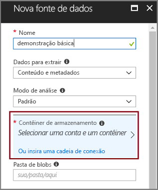
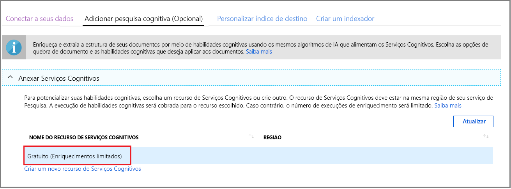
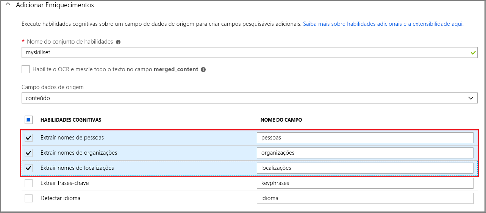
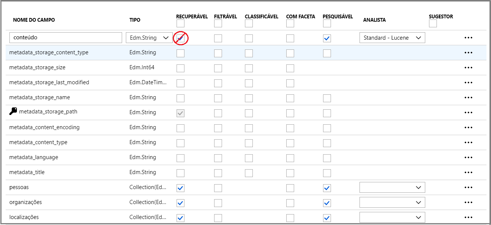
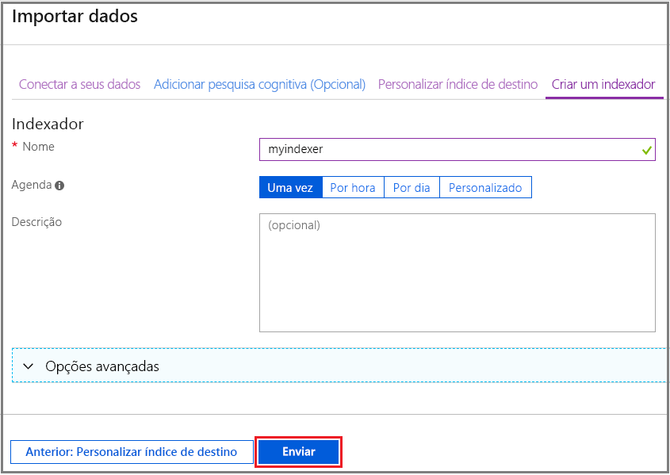
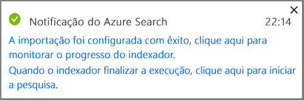
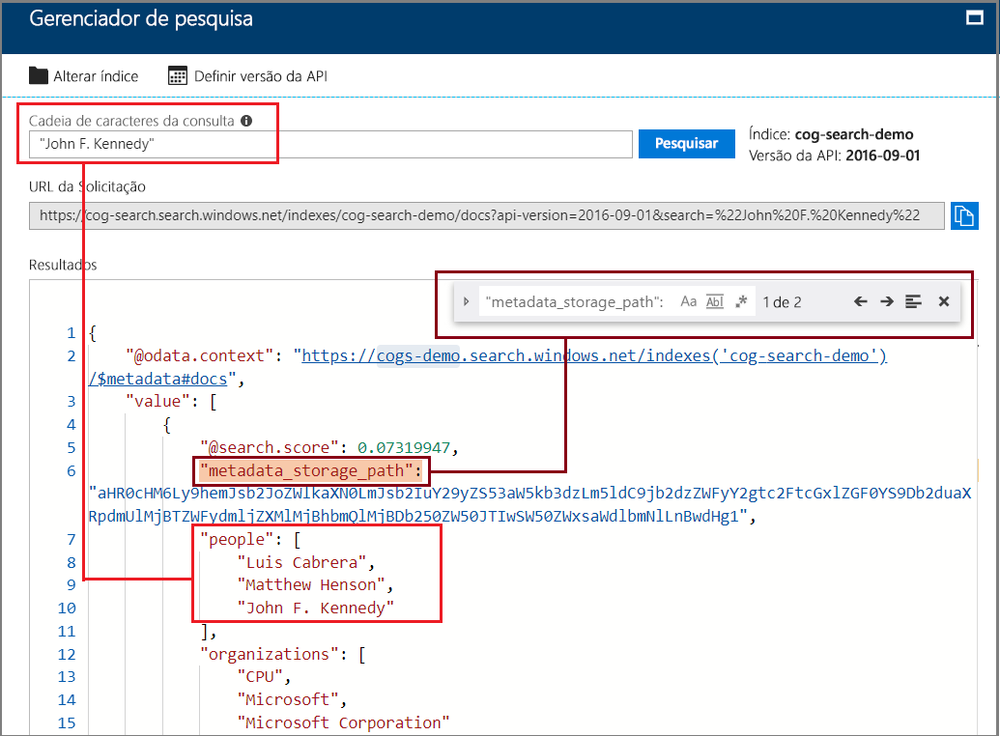

# Início Rápido: Criar um pipeline de indexação de IA usando habilidades cognitivas e dados de exemplo

O Azure Search é integrado aos [Serviços Cognitivos](https://azure.microsoft.com/services/cognitive-services/), adicionando habilidades de extração de conteúdo, NLP (processamento em idioma natural) e processamento de imagem a um pipeline de indexação do Azure Search, tornando o conteúdo não pesquisável ou não estruturado mais pesquisável. 

Muitos recursos dos Serviços Cognitivos – como [OCR](cognitive-search-skill-ocr.md), [detecção de idioma](cognitive-search-skill-language-detection.md) e [reconhecimento de entidade](cognitive-search-skill-entity-recognition.md), para mencionar alguns – podem ser anexados a um processo de indexação. Os algoritmos de IA dos Serviços Cognitivos são usados para encontrar padrões, recursos e características em dados de origem, retornando estruturas e conteúdo textual que podem ser usados em soluções de pesquisa de texto completo baseadas no Azure Search.

Neste início rápido, crie seu primeiro pipeline de enriquecimento no [portal do Azure](https://portal.azure.com) antes de escrever uma única linha de código:

> [!div class="checklist"]
> * Comece com dados de exemplo no armazenamento de blob do Azure
> * Configurar o assistente para [**Importação de dados**](search-import-data-portal.md) para indexação e enriquecimento cognitivos 
> * Execute o Assistente (uma habilidade de entidade detecta pessoas, local e organizações)
> * Usar o [**Gerenciador de pesquisa**](search-explorer.md) para consultar os dados enriquecidos

Este Início Rápido é executado no serviço Gratuito, mas o número de transações gratuitas é limitado a 20 documentos por dia. Caso deseje executar este Início Rápido mais de uma vez no mesmo dia, use um arquivo menor definido para que você pode encaixar mais execuções.

> [!NOTE]
> Conforme você expandir o escopo aumentando a frequência de processamento, adicionando mais documentos ou adicionando mais algoritmos de IA, você precisará anexar um recurso faturável dos Serviços Cognitivos. As cobranças são geradas ao chamar APIs nos Serviços Cognitivos e para a extração de imagem como parte do estágio de decodificação de documentos no Azure Search. Não há encargos para extração de texto em documentos.
>
> A execução das habilidades internas é cobrada com base no [preço de pagamento conforme o uso dos Serviços Cognitivos](https://azure.microsoft.com/pricing/details/cognitive-services/). O preço da extração de imagem é cobrado com o preço da versão prévia, o que está descrito na [página de preços do Azure Search](https://go.microsoft.com/fwlink/?linkid=2042400). Saiba [mais](cognitive-search-attach-cognitive-services.md).

Se você não tiver uma assinatura do Azure, crie uma [conta gratuita](https://azure.microsoft.com/free/?WT.mc_id=A261C142F) antes de começar.

## Pré-requisitos

[Crie um serviço Azure Search](search-create-service-portal.md) ou [localize um serviço existente](https://ms.portal.azure.com/#blade/HubsExtension/BrowseResourceBlade/resourceType/Microsoft.Search%2FsearchServices) na assinatura atual. É possível usar um serviço gratuito para este início rápido.

Os [Serviços Cognitivos](https://azure.microsoft.com/services/cognitive-services/) fornecem a IA. Este Início Rápido inclui etapas para adicionar esses recursos em linha, durante a especificação do pipeline. Não é necessário configurar contas com antecedência.

Os serviços do Azure são necessários para fornecer as entradas para o pipeline de indexação. Use qualquer fonte de dados compatível com os [indexadores do Azure Search](search-indexer-overview.md), exceto o Armazenamento de Tabelas do Azure, que não é compatível com a indexação de IA. Este Início Rápido usa o [Armazenamento de Blobs do Azure](https://azure.microsoft.com/services/storage/blobs/) como um contêiner para arquivos de dados de origem. 

### Configurar o serviço Blob do Azure e carregar dados de amostra

1. [Fazer o download de dados de exemplo](https://1drv.ms/f/s!As7Oy81M_gVPa-LCb5lC_3hbS-4) consiste em um conjunto de pequenos arquivos de tipos diferentes. 

1. [Inscreva-se no Armazenamento de Blobs do Azure](https://docs.microsoft.com/azure/storage/common/storage-quickstart-create-account?tabs=azure-portal), crie uma conta de armazenamento, abra as páginas de serviços Blob e crie um contêiner.  Crie a conta de armazenamento na mesma região do Azure Search.

1. No contêiner criado, clique em **Carregar** para carregar os arquivos de exemplo baixados em uma etapa anterior.

   

## Criar o pipeline de enriquecimento

Retorne à página do painel do serviço Azure Search e clique em **Importar dados** na barra de comandos para configurar o enriquecimento cognitivo em quatro etapas.

  

### Etapa 1: Criar uma fonte de dados

Em **Conectar-se aos seus dados**, escolha **Armazenamento de Blobs do Azure** e selecione a conta e o contêiner criados. Dê um nome de fonte de dados e use valores padrão para o restante. 

  

Continue para a próxima página.

  

### Etapa 2: Adicionar habilidades cognitivas

Em seguida, adicione etapas de enriquecimento para o pipeline de indexação. Caso não tenha um recurso dos Serviços Cognitivos, inscreva-se para usar uma versão gratuita que fornece 20 transações diariamente. Os dados de exemplo consistem em 14 arquivos e, portanto, grande parte de sua alocação diária será consumida quando você executar esse assistente.

1. Expanda **Anexar Serviços Cognitivos** para exibir opções para obter recursos para as APIs de Serviços Cognitivos. Para os fins deste tutorial, você poderá usar o recurso **Gratuito**.

   

2. Expanda **Adicionar Enriquecimentos** e selecione as habilidades que executam o processamento de idioma natural. Para este guia de início rápido, escolha o reconhecimento de entidade para pessoas, empresas e locais.

   

   O portal oferece habilidades internas para processamento de OCR e análise de texto. No portal, um conjunto de qualificações opera em um campo de origem única. Isso pode parecer assim como um destino pequeno, mas para blobs do Azure o campo `content` contém a maior parte do documento blob (por exemplo, um documento do Word ou PowerPoint). Como tal, esse campo é uma entrada ideal porque todo o conteúdo de um blob está lá.

3. Continue para a próxima página.

   

> [!NOTE]
> Capacidade de processamento de idioma natural opera em conteúdo de texto do conjunto de dados de exemplo. Como não selecionamos a opção de OCR, os arquivos JPEG e PNG encontrados no conjunto de dados de exemplo não serão processados neste início rápido. 

### Etapa 3: Configurar o índice

O assistente geralmente pode inferir um índice padrão. Nesta etapa, você poderá exibir o esquema de índice gerado e, potencialmente, revisar todas as configurações. Veja abaixo o índice padrão criado para o conjunto de dados de Blob de demonstração.

Para este guia de início rápido, o assistente faz um bom trabalho configurando padrões razoáveis: 

+ O nome padrão é *azureblob-index* com base no tipo de fonte de dados. 

+ Campos padrão baseiam-se no campo de dados de origem original (`content`), além dos campos de saída (`people`, `organizations` e `locations`) criados pelo pipeline cognitivo. Tipos de dados padrão são inferidos de amostragem de dados e metadados.

+ A chave padrão é *metadata_storage_path* (esse campo contém valores exclusivos).

+ Os atributos padrão são **Recuperável** e **Pesquisável** para esses campos. **Pesquisável** indica que um campo pode ser pesquisado. **Recuperável** significa que ele pode ser retornado nos resultados. O assistente pressupõe que você deseja que esses campos sejam recuperáveis e pesquisáveis porque você os criou por meio de um conjunto de qualificações esses campos.

  

Note que o ponto de interrogação e tachado no atributo **Recuperável** ao lado do campo `content`. Para documentos de blob com muito texto, o campo `content` contém a maior parte do arquivo, potencialmente em execução em milhares de linhas. Se você precisar transmitir o conteúdo do arquivo para o código de cliente, verifique se **Recuperável** permanece selecionada. Caso contrário, considere limpar esse atributo em `content` se os elementos extraídos (`people`, `organizations` e `locations`) forem suficientes para suas finalidades.

Marcar um campo como **Recuperável** não significa que ele *deve* estar presente nos resultados da pesquisa. Você pode controlar com precisão a composição de resultados da pesquisa usando o parâmetro de consulta **$select** para especificar quais campos serão incluídos. Para campos de texto com uso intenso, como `content`, o parâmetro **$select** é sua solução para fornecer resultados da pesquisa gerenciáveis para usuários humanos do seu aplicativo, ao mesmo tempo garantindo que o código do cliente tenha acesso a todas as informações necessárias por meio do atributo **Recuperável**.
  
Continue para a próxima página.

  

### Etapa 4: Configurar o indexador

O indexador é um recurso de alto nível que orienta o processo de indexação. Ele especifica o nome da fonte de dados, um índice de destino e a frequência de execução. O resultado final de assistente **importar dados** é sempre um indexador que você pode executar várias vezes.

Na página **Indexador**, você pode aceitar o nome padrão e usar a opção de agenda **Executar uma vez** para executá-lo imediatamente. 

  

Clique em **Enviar** para criar e executar simultaneamente o indexador.

## Monitorar a indexação

As etapas de enriquecimento levam mais tempo para serem concluídas em comparação à indexação típica baseada em texto. O assistente deverá abrir a lista Indexador na página de visão geral, de modo que você possa acompanhar o progresso. Para a autonavegação, acesse a página Visão Geral e clique em **Indexadores**.

O aviso ocorre porque os arquivos JPG e PNG são arquivos de imagem e omitimos a habilidade de OCR nesse pipeline. Você também encontrará notificações de truncamento. O Azure Search limita a extração a 32.000 caracteres na camada Gratuita.

  

A indexação e enriquecimento podem levar tempo, por isso, os conjuntos de dados menores são recomendados para exploração inicial. 

## Consultar no Gerenciador de pesquisa

Depois que um índice é criado, você pode enviar consultas para retornar os documentos do índice. No portal, use **Gerenciador de pesquisa** para executar consultas e exibir os resultados. 

1. Na página de painel do serviço de pesquisa, clique em **Gerenciador de pesquisa** na barra de comandos.

1. Clique em **Alterar índice** na parte superior para selecionar o índice que você criou.

1. Insira uma cadeia de caracteres de pesquisa para consultar o índice, como `search=Microsoft&searchFields=organizations`.

Os resultados são retornados em JSON, que pode ser difíceis de ler, especialmente em documentos grandes provenientes de blobs do Azure e detalhado. Se você não pode examinar os resultados facilmente, use CTRL-F para pesquisar dentro de documentos. Para essa consulta, você poderá pesquisar termos específicos no JSON. 

CTRL + F pode ajudá-lo a determinar quantos documentos estão em um determinado resultado definidos. Para blobs do Azure, o portal escolhe "metadata_storage_path" como a chave, porque cada valor é exclusivo para o documento. Usar CTRL + F, pesquise "metadata_storage_path" obter uma contagem de documentos. 

  

## Observações

Agora você concluiu seu primeiro exercício de indexação enriquecida cognitivamente. A finalidade deste guia de início rápido foi introduz conceitos importantes e orientá-lo por meio do Assistente para que você possa rapidamente o protótipo de uma solução de pesquisa cognitivas usando seus próprios dados.

Alguns conceitos-chave Esperamos que você pegou incluem a dependência em fontes de dados do Azure. Enriquecimento cognitivas pesquisa está associado a indexadores e indexadores são Azure e específico de fonte. Embora este guia de início rápido Use o armazenamento de BLOBs do Azure, outras fontes de dados do Azure são possíveis. Para obter mais informações, consulte [Indexadores no Azure Search](search-indexer-overview.md).

Outro conceito importante é que as habilidades operam em campos de entrada. No portal, você precisa escolher um campo de origem única para todas as habilidades. No código, entradas podem ser outros campos, ou a saída de uma habilidade de upstream.

 Entradas para uma habilidade são mapeadas para um campo de saída em um índice. Internamente, o portal configura [anotações](cognitive-search-concept-annotations-syntax.md) e define uma [conjunto de qualificações](cognitive-search-defining-skillset.md), estabelecendo a ordem das operações e o fluxo geral. Essas etapas estão ocultos no portal, mas quando você começar a escrever código, esses conceitos tornam-se importantes.

Por fim, você aprendeu que exibindo resultados é obtida pela consulta do índice. No final, o que fornece o Azure Search é um índice de pesquisado, que podem ser consultados usando a [simples](https://docs.microsoft.com/rest/api/searchservice/simple-query-syntax-in-azure-search) ou [totalmente estendida sintaxe de consulta](https://docs.microsoft.com/rest/api/searchservice/lucene-query-syntax-in-azure-search). Um índice que contém campos enriquecidos é como qualquer outro. Se você quiser incorporar padrão ou [analisadores personalizados](search-analyzers.md), [perfis de pontuação](https://docs.microsoft.com/rest/api/searchservice/add-scoring-profiles-to-a-search-index), [sinônimos](search-synonyms.md), [filtros Facetado](search-filters-facets.md), pesquisa geográfica ou qualquer outro recurso do Azure Search, você pode certamente fazê-lo.

## Limpar recursos

Se sua exploração é concluída, a maneira mais rápida para limpar é excluindo o grupo de recursos que contém o serviço do Azure Search e o serviço de Blob do Azure.  

Supondo que você colocar ambos os serviços no mesmo grupo, exclua o grupo de recursos agora para excluir permanentemente todo o conteúdo, incluindo os serviços e qualquer conteúdo armazenado criado para este exercício. No portal, o nome do grupo de recurso está na página de Visão geral de cada serviço.

## Próximas etapas

Dependendo de como você provisionou o recurso de Serviços Cognitivos, você poderá fazer experimentos com a indexação e o enriquecimento executando novamente o assistente com diferentes habilidades e campos de dados de origem. Para repetir as etapas, excluir o índice e o indexador e recrie o indexador com uma nova combinação de seleções.

+ Em **visão geral** > **índices**, selecione o índice que você criou e, em seguida, clique em **excluir**.

+ Em **visão geral**, clique duas vezes o **indexadores** lado a lado. Localize o indexador que você criou e excluí-lo.

Como alternativa, reutilize os dados de exemplo e serviços que você criou e saiba como executar as mesmas tarefas programaticamente no tutorial do próximo. 

> [!div class="nextstepaction"]
> [Tutorial: Aprender as APIs REST de Pesquisa Cognitiva](cognitive-search-tutorial-blob.md)
