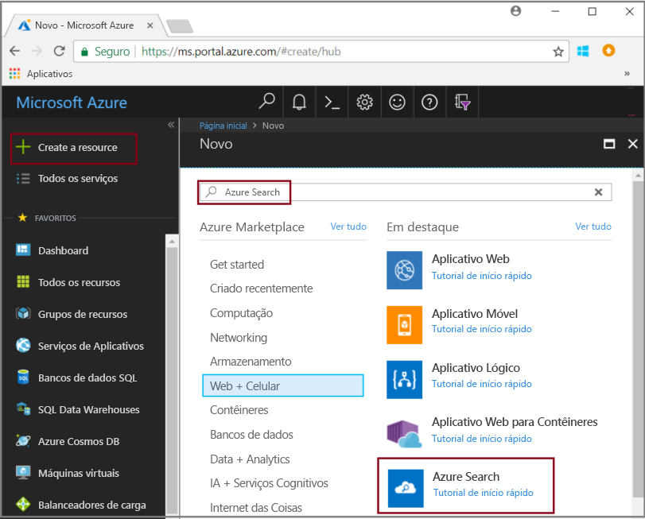
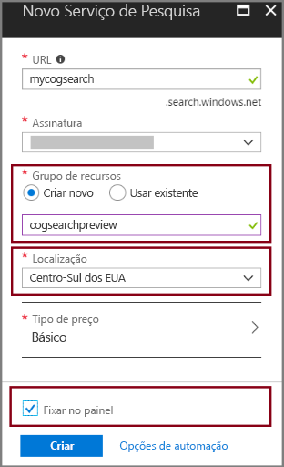

# Início Rápido: Criar um pipeline de pesquisa cognitivas usando habilidades e dados de exemplo

Pesquisa cognitiva (visualização) adiciona a extração de dados, processamento de linguagem natural (NLP) e imagem, processamento de habilidades para um pipeline de indexação do Azure Search, tornando o conteúdo não pesquisável ou não estruturado mais pesquisável. Informações criadas por uma habilidade, como a análise de imagem ou reconhecimento de entidade, serão adicionadas a um índice no Azure Search.

Neste guia de início rápido, tente pipeline enriquecimento no [portal do Azure](https://portal.azure.com) antes de gravar uma única linha de código:

* Comece com dados de exemplo no armazenamento de blob do Azure
* Configurar o [Assistente de importação de dados](search-import-data-portal.md) para indexação e enriquecimento 
* Execute o Assistente (uma habilidade de entidade detecta pessoas, local e organizações)
* Use o [Gerenciador de Pesquisa](search-explorer.md) para consultar os dados enriquecidos.

##  Regiões com suporte

Você pode experimentar pesquisa cognitiva em um serviço do Azure Search criado nas seguintes regiões:

* Centro-Oeste dos EUA
* Centro-Sul dos Estados Unidos
* Leste dos EUA
* Europa Ocidental
* Norte da Europa
* Sudeste Asiático

Se você não tiver uma assinatura do Azure, crie uma [conta gratuita](https://azure.microsoft.com/free/?WT.mc_id=A261C142F) antes de começar.

> [!NOTE]
> Pesquisa Cognitiva está na visualização pública. A execução do conjunto de habilidades e a extração e normalização de imagem são oferecidas gratuitamente no momento. Posteriormente, os preços dessas funcionalidades serão anunciados. 

## Pré-requisitos

[“O que é pesquisa cognitiva?”](cognitive-search-concept-intro.md) apresenta a arquitetura de enriquecimento e componentes. 

Os serviços do Azure são usados exclusivamente nesse cenário. A criação de serviços que você precisa é parte da preparação.

+ O Armazenamento de Blobs do Azure fornece dados de origem.
+ O Azure Search lida com a inclusão de dados e indexação, enriquecimento pesquisa cognitivas e consultas de pesquisa de texto completo.

### Configurar o Azure Search

Primeiro, inscreva-se no serviço do Azure Search. 

1. Acesse o [Portal do Azure](https://portal.azure.com) e entre usando sua conta do Azure.

1. Clique em **Criar um recurso**, pesquise por Azure Search e clique em **Criar**. Consulte [Criar um serviço do Azure Search no portal de](search-create-service-portal.md) se você estiver configurando um serviço de pesquisa pela primeira vez e precisar de mais ajuda.

  

1. Para o grupo de recursos, crie um grupo de recursos para conter todos os recursos que você cria neste guia de início rápido. Isso torna mais fácil limpar os recursos, depois de concluir o guia de início rápido.

1. Para o local, escolha uma das [regiões com suporte](#supported-regions) para Pesquisa Cognitiva.

1. Para a camada de preços, você pode criar um serviço **Livre** para completar tutoriais e guias de início rápido. Para uma investigação mais detalhada usando seus próprios dados, crie um [serviço pago](https://azure.microsoft.com/pricing/details/search/) como **Básico** ou **Standard**. 

  Um serviço gratuito está limitado a 3 índices, tamanho máximo do blob de 16 MB e 2 minutos de indexação, o que não é suficiente para exercer todos os recursos de pesquisa cognitiva. Para examinar os limites para as diferentes camadas, consulte [Limites de Serviço](search-limits-quotas-capacity.md).

  > [!NOTE]
  > A pesquisa cognitiva está na visualização pública. Execução do conjunto de qualificações está disponível em todas as camadas, incluindo livre. Posteriormente, o preço desse recurso será anunciado.

1. Fixe o serviço no painel de controle para acesso rápido a informações de serviço.

  

### Configurar o serviço Blob do Azure e carregar dados de amostra

O pipeline de enriquecimento recebe de fontes de dados do Azure com suporte [indexadores do Azure Search](search-indexer-overview.md). Para este exercício, usamos o armazenamento de blob para apresentar múltiplos tipos de conteúdo.

1. [Fazer o download de dados de exemplo](https://1drv.ms/f/s!As7Oy81M_gVPa-LCb5lC_3hbS-4) consiste em um conjunto de pequenos arquivos de tipos diferentes. 

1. Inscreva-se para o armazenamento de Blobs do Azure, crie uma conta de armazenamento, entre no Gerenciador de Armazenamento e crie um contêiner. Veja [Início Rápido do Gerenciador de Armazenamento do Azure](../storage/blobs/storage-quickstart-blobs-storage-explorer.md) para instruções em todas as etapas.

1. Usando o Gerenciador de Armazenamento do Microsoft Azure, no contêiner que você criou, clique em **carregar** para carregar os arquivos de exemplo.

  

## Criar o pipeline de enriquecimento

Volte para a página de painel do serviço do Azure Search e clique em **Importar dados** na barra de comandos para configurar o enriquecimento em quatro etapas.

### Etapa 1: Criar uma fonte de dados

Em **conectar aos seus dados** > **armazenamento de BLOBs do Azure**, selecione a conta e o contêiner que você criou. Dê um nome de fonte de dados e use valores padrão para o restante. 

   

Clique em **OK** para criar a origem dos dados.

Uma vantagem de usar o assistente **Importar dados** é que ele também pode criar o índice. Como a fonte de dados é criada, o assistente simultaneamente constrói um esquema de índice. Pode levar alguns minutos para criar o índice.

### Etapa 2: Adicionar habilidades cognitivas

Em seguida, adicione etapas de enriquecimento para o pipeline de indexação. O portal fornece habilidades cognitivas predefinidas para análise de imagem e a análise de texto. No portal, um conjunto de qualificações opera em um campo de origem única. Isso pode parecer assim como um destino pequeno, mas para blobs do Azure o campo `content` contém a maior parte do documento blob (por exemplo, um documento do Word ou PowerPoint). Como tal, esse campo é uma entrada ideal porque todo o conteúdo de um blob está lá.

Às vezes você deseja extrair a representação textual de arquivos que são compostos principalmente por imagens digitalizadas, como um PDF gerado por um scanner. O Azure Search pode extrair automaticamente o conteúdo de imagens incorporadas no documento. Para fazer isso, selecione a opção **Habilitar OCR e mesclar todo o texto no campo merged_content**. Isso criará automaticamente um campo `merged_content` que contém o texto extraído do documento, bem como a representação textual das imagens incorporadas no documento. Quando você seleciona essa opção `Source data field` será definida como `merged_content`.

Em **Adicionar habilidades cognitivas**, escolha as habilidades que executam o processamento de idioma natural. Para este guia de início rápido, escolha o reconhecimento de entidade para pessoas, empresas e locais.

Clique em **OK** para aceitar a definição.
   
  

Capacidade de processamento de idioma natural opera em conteúdo de texto do conjunto de dados de exemplo. Já que nós não selecionamos nenhuma imagem opções de processamento, os arquivos JPEG encontrados no conjunto de dados de exemplo não serão processados neste guia de início rápido. 

### Etapa 3: Configurar o índice

Lembra-se do índice que foi criado com a fonte de dados? Nesta etapa, você pode exibir seu esquema e potencialmente revisar todas as configurações. 

Para este guia de início rápido, o assistente faz um bom trabalho configurando padrões razoáveis: 

+ Todos os índices devem ter um nome. Para esse tipo de fonte de dados, o nome padrão é *azureblob-index*.

+ Cada documento deve ter uma chave. O Assistente escolhe um campo com valores exclusivos. Neste guia de início rápido, a chave é *metadata_storage_path*.

+ Cada coleção de campos deve ter campos com um tipo de dados que descreve seus valores, e cada campo deve ter atributos de índice que descrevem como usado em um cenário de pesquisa. 

Como você definiu um conjunto de qualificações, o assistente pressupõe que você deseja que o campo de fonte de dados, mais os campos de saída criados pelas habilidades. Por esse motivo, o portal adiciona campos de índice para `content`, `people`, `organizations`, e `locations`. Observe que o assistente habilita automaticamente Retornável e Pesquisável para esses campos.

Em **personalizar índice**, revise os atributos de campos para ver como eles são usados em um índice. Pesquisável indica que um campo pode ser pesquisado. Recuperável significa que ele possa ser retornado nos resultados. 

Considere limpar Retornável do campo `content`. Em blobs, este campo pode ser executada em milhares de linhas, difícil de ler em uma ferramenta como o **Gerenciador de pesquisa**.

Clique em **OK** para aceitar a definição de índice.

  

> [!NOTE]
> Campos não utilizados serão considerados na captura de tela para fins de brevidade. Se você estiver acompanhando no portal, sua lista mostra os campos extras.

### Etapa 4: Configurar o indexador

O indexador é um recurso de alto nível que orienta o processo de indexação. Especifica o nome da fonte de dados, o índice e a frequência de execução. O resultado final de assistente **importar dados** é sempre um indexador que você pode executar várias vezes.

Na página **Indexador**, nomeie o indexador e usar o padrão "executado uma vez" para executá-lo imediatamente. 

  

Clique em **Ok** para importar, enriquecer e indexar os dados.

  

A indexação e enriquecimento podem levar tempo, por isso, os conjuntos de dados menores são recomendados para exploração inicial. Você pode monitorar a indexação na página de notificações do portal do Azure. 

## Consultar no Gerenciador de pesquisa

Depois que um índice é criado, você pode enviar consultas para retornar os documentos do índice. No portal, use **Gerenciador de pesquisa** para executar consultas e exibir os resultados. 

1. Na página de painel do serviço de pesquisa, clique em **Gerenciador de pesquisa** na barra de comandos.

1. Clique em **Alterar índice** na parte superior para selecionar o índice que você criou.

1. Insira uma cadeia de caracteres de pesquisa para consultar o índice, como "John F. Kennedy".

Os resultados são retornados em JSON, que pode ser difíceis de ler, especialmente em documentos grandes provenientes de blobs do Azure e detalhado. 

Se você não pode examinar os resultados facilmente, use CTRL-F para pesquisar dentro de documentos. Para essa consulta, você pode pesquisar em JSON em "John F. Kennedy" para exibir instâncias do termo de pesquisa. 

CTRL + F pode ajudá-lo a determinar quantos documentos estão em um determinado resultado definidos. Para blobs do Azure, o portal escolhe "metadata_storage_path" como a chave, porque cada valor é exclusivo para o documento. Usar CTRL + F, pesquise "metadata_storage_path" obter uma contagem de documentos. Para essa consulta, dois documentos no conjunto de resultados contêm o termo "John F. Kennedy".

  

## Observações

Agora você concluiu o exercício de indexação enriquecido primeiro. A finalidade deste guia de início rápido foi introduz conceitos importantes e orientá-lo por meio do Assistente para que você possa rapidamente o protótipo de uma solução de pesquisa cognitivas usando seus próprios dados.

Alguns conceitos-chave Esperamos que você pegou incluem a dependência em fontes de dados do Azure. Enriquecimento cognitivas pesquisa está associado a indexadores e indexadores são Azure e específico de fonte. Embora este guia de início rápido Use o armazenamento de BLOBs do Azure, outras fontes de dados do Azure são possíveis. Para obter mais informações, consulte [Indexadores no Azure Search](search-indexer-overview.md).

Outro conceito importante é que as habilidades operam em campos de entrada. No portal, você precisa escolher um campo de origem única para todas as habilidades. No código, entradas podem ser outros campos, ou a saída de uma habilidade de upstream.

 Entradas para uma habilidade são mapeadas para um campo de saída em um índice. Internamente, o portal configura [anotações](cognitive-search-concept-annotations-syntax.md) e define uma [conjunto de qualificações](cognitive-search-defining-skillset.md), estabelecendo a ordem das operações e o fluxo geral. Essas etapas estão ocultos no portal, mas quando você começar a escrever código, esses conceitos tornam-se importantes.

Por fim, você aprendeu que exibindo resultados é obtida pela consulta do índice. No final, o que fornece o Azure Search é um índice de pesquisado, que podem ser consultados usando a [simples](https://docs.microsoft.com/rest/api/searchservice/simple-query-syntax-in-azure-search) ou [totalmente estendida sintaxe de consulta](https://docs.microsoft.com/rest/api/searchservice/lucene-query-syntax-in-azure-search). Um índice que contém campos enriquecidos é como qualquer outro. Se você quiser incorporar padrão ou [analisadores personalizados](search-analyzers.md), [perfis de pontuação](https://docs.microsoft.com/rest/api/searchservice/add-scoring-profiles-to-a-search-index), [sinônimos](search-synonyms.md), [filtros Facetado](search-filters-facets.md), pesquisa geográfica ou qualquer outro recurso do Azure Search, você pode certamente fazê-lo.

## Limpar recursos

Se sua exploração é concluída, a maneira mais rápida para limpar é excluindo o grupo de recursos que contém o serviço do Azure Search e o serviço de Blob do Azure.  

Supondo que você colocar ambos os serviços no mesmo grupo, exclua o grupo de recursos agora para excluir permanentemente todo o conteúdo, incluindo os serviços e qualquer conteúdo armazenado criado para este exercício. No portal, o nome do grupo de recurso está na página de Visão geral de cada serviço.

## Próximas etapas

Você pode fazer experiências com indexação e enriquecimento executando novamente o assistente com diferentes habilidades e campos de dados de origem. Para repetir as etapas, excluir o índice e o indexador e recrie o indexador com uma nova combinação de seleções.

+ Em **visão geral** > **índices**, selecione o índice que você criou e, em seguida, clique em **excluir**.

+ Em **visão geral**, clique duas vezes o **indexadores** lado a lado. Localize o indexador que você criou e excluí-lo.

Como alternativa, reutilize os dados de exemplo e serviços que você criou e saiba como executar as mesmas tarefas programaticamente no tutorial do próximo. 

> [!div class="nextstepaction"]
> [Tutorial: Aprenda a pesquisa cognitiva APIs REST](cognitive-search-tutorial-blob.md)
