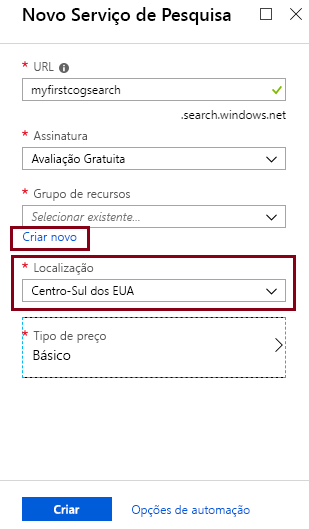
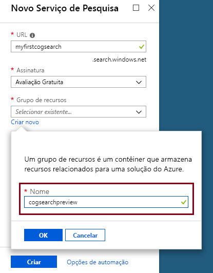

# <a name="tutorial-learn-how-to-call-cognitive-search-apis-preview"></a>Tutorial: Saiba como chamar APIs de Pesquisa Cognitiva (Versão Prévia)

Neste tutorial, você aprenderá a mecânica de programação enriquecimento de dados no Azure Search usando *habilidades cognitivas*. Habilidades cognitivas são processamento de linguagem natural (NLP) e a imagem de operações de análise que extrair texto e representações de texto de uma imagem, detectar idioma, entidades, frases-chave e muito mais. O resultado final é rico conteúdo adicional em um índice do Azure Search, criado por um pipeline de indexação de pesquisa cognitivas. 

Neste tutorial, você deve fazer chamadas da API REST para executar as seguintes tarefas:

> [!div class="checklist"]
> * Criar um pipeline de indexação que enriquece dados de exemplo em rota para um índice
> * Aplique as qualificações internas: o reconhecimento de entidade, a detecção de idioma, manipulação de texto e extração de frase-chave
> * Saiba como encadear habilidades mapeando entradas para saídas em um conjunto de qualificações
> * Executar solicitações e analisar resultados
> * Redefinir o índice e indexadores para desenvolvimento futuro

Saída é um índice de pesquisa de texto completo no Azure Search. Você pode aprimorar o índice com outros recursos padrão, como [sinônimos](search-synonyms.md), [perfis de pontuação](https://docs.microsoft.com/rest/api/searchservice/add-scoring-profiles-to-a-search-index), [analisadores](search-analyzers.md), e [filtros](search-filters.md).

Se você não tiver uma assinatura do Azure, crie uma [conta gratuita](https://azure.microsoft.com/free/?WT.mc_id=A261C142F) antes de começar.

> [!NOTE]
> Iniciando em 21 de dezembro de 2018, você poderá associar um recurso de Serviços Cognitivos com um conjunto de habilidades do Azure Search. Isso nos permitirá começar a cobrar pela execução do conjunto de habilidades. Nessa data, também passaremos a cobrar pela extração de imagem como parte do estágio de decodificação de documentos. A extração de texto de documentos continuará sendo oferecida sem custo adicional.
>
> A execução do conjunto de qualificações será cobrada com o [Preço pago conforme o uso dos Serviços Cognitivos](https://azure.microsoft.com/pricing/details/cognitive-services/) existente. O preço da extração de imagem será cobrado com o preço da versão prévia, o que está descrito na [página de preço do Azure Search](https://go.microsoft.com/fwlink/?linkid=2042400). Saiba [mais](cognitive-search-attach-cognitive-services.md).

## <a name="prerequisites"></a>Pré-requisitos

Novo na pesquisa cognitiva? Leia [“O que é pesquisa cognitiva?”](cognitive-search-concept-intro.md) para se familiarizar ou tente o [quickstart portal](cognitive-search-quickstart-blob.md) para obter uma introdução prática para conceitos importantes.

Para fazer chamadas REST para Azure Search, use PowerShell ou uma ferramenta de teste na web como o Telerik Fiddler ou Postman para formular HTTP solicitações. Se estas ferramentas forem novas para você, veja [Explorar as APIs REST do Azure Search usando o Fiddler ou Postman](search-fiddler.md).

Use o [portal do Azure](https://portal.azure.com/) para criar serviços usados em um fluxo de trabalho de ponta a ponta. 

### <a name="set-up-azure-search"></a>Configurar o Azure Search

Primeiro, inscreva-se no serviço do Azure Search. 

1. Acesse o [Portal do Azure](https://portal.azure.com) e entre usando sua conta do Azure.

1. Clique em **Criar um recurso**, pesquise por Azure Search e clique em **Criar**. Consulte [Criar um serviço do Azure Search no portal de](search-create-service-portal.md) se você estiver configurando um serviço de pesquisa pela primeira vez.

  

1. Para o grupo de recursos, crie um grupo de recursos para conter todos os recursos que você cria neste tutorial. Isso torna mais fácil limpar os recursos, depois de concluir o tutorial.

1. Para o local, escolha uma das [regiões com suporte](https://docs.microsoft.com/azure/search/cognitive-search-quickstart-blob#supported-regions) para Pesquisa Cognitiva.

1. Para a camada de preços, você pode criar um serviço **Livre** para completar tutoriais e guias de início rápido. Para uma investigação mais detalhada usando seus próprios dados, crie um [serviço pago](https://azure.microsoft.com/pricing/details/search/) como **Básico** ou **Standard**. 

  Um serviço gratuito está limitado a 3 índices, tamanho máximo do blob de 16 MB e 2 minutos de indexação, o que não é suficiente para exercer todos os recursos de pesquisa cognitiva. Para examinar os limites para as diferentes camadas, consulte [Limites de Serviço](search-limits-quotas-capacity.md).

  
  

 
1. Fixe o serviço no painel de controle para acesso rápido a informações de serviço.

  

1. Depois que o serviço é criado, colete as seguintes informações: **URL** na página de Visão Geral e **api-key** (primária ou secundária) na página Chaves.

  

### <a name="set-up-azure-blob-service-and-load-sample-data"></a>Configurar o serviço de Blob do Azure e carregar dados de amostra

O pipeline de enriquecimento extrai de fontes de dados do Azure. Fonte de dados deve originar-se de um tipo de fonte de dados com suporte de um [indexador do Azure Search](search-indexer-overview.md). Observe que não há suporte para o Armazenamento de Tabelas do Azure para Pesquisa Cognitiva. Para este exercício, usamos o armazenamento de blob para apresentar múltiplos tipos de conteúdo.

1. [Baixe os dados de exemplo](https://1drv.ms/f/s!As7Oy81M_gVPa-LCb5lC_3hbS-4). Dados de exemplo consistem em um conjunto de pequenos arquivos de tipos diferentes. 

1. Inscreva-se para o armazenamento de Blobs do Azure, crie uma conta de armazenamento, entre no Gerenciador de Armazenamento e crie um contêiner nomeado `basicdemo`. Veja [Início Rápido do Gerenciador de Armazenamento do Azure](../storage/blobs/storage-quickstart-blobs-storage-explorer.md) para instruções em todas as etapas.

1. Usando o Gerenciador de Armazenamento do Microsoft Azure, no contêiner `basicdemo` que você criou, clique em **Carregar** para carregar os arquivos de exemplo.

1. Depois que os arquivos de exemplo são carregados, obter o nome do contêiner e uma cadeia de caracteres de conexão para o armazenamento de Blob. Você pode fazer isso navegando até você conta de armazenamento no portal do Azure. Em **chaves de acesso**e, em seguida, copie o campo **cadeia de caracteres de Conexão**.

  A cadeia de conexão de armazenamento deve ser uma URL semelhante ao seguinte exemplo:

      ```http
      DefaultEndpointsProtocol=https;AccountName=cogsrchdemostorage;AccountKey=<your account key>;EndpointSuffix=core.windows.net
      ```

Existem outras maneiras de especificar a cadeia de caracteres de conexão, como fornecer uma assinatura de acesso compartilhado. Para saber mais sobre as credenciais de fonte de dados, consulte [indexação armazenamento de BLOBs do Azure](search-howto-indexing-azure-blob-storage.md#Credentials).

## <a name="create-a-data-source"></a>Criar uma fonte de dados

Agora que os serviços e os arquivos de origem estão preparados, comece montando os componentes do pipeline de indexação. Começar com uma [o objeto de fonte de dados](https://docs.microsoft.com/rest/api/searchservice/create-data-source) que informa o Azure Search como recuperar dados de origem externa.

Para este tutorial, use a API REST e uma ferramenta que pode formular e enviar solicitações HTTP, como o Fiddler, Postman ou PowerShell. No cabeçalho da solicitação, forneça o nome do serviço que você usou ao criar o serviço do Azure Search e a chave de api gerado para o serviço de pesquisa. No corpo da solicitação, especifique a cadeia de conexão e de nome de contêiner do blob.

### <a name="sample-request"></a>Solicitação de Exemplo
```http
POST https://[service name].search.windows.net/datasources?api-version=2017-11-11-Preview
Content-Type: application/json  
api-key: [admin key]  
```
#### <a name="request-body-syntax"></a>Sintaxe de Corpo da Solicitação
```json
{   
    "name" : "demodata",  
    "description" : "Demo files to demonstrate cognitive search capabilities.",  
    "type" : "azureblob",
    "credentials" :
    { "connectionString" :
      "DefaultEndpointsProtocol=https;AccountName=<your account name>;AccountKey=<your account key>;"
    },  
    "container" : { "name" : "<your blob container name>" }
}  
```
Enviar a solicitação. A ferramenta de teste da web deve retornar um código de status de 201 confirmando êxito. 

Como esta é sua primeira solicitação, verifique o portal do Azure para confirmar a fonte de dados foi criado no Azure Search. Na página de painel do serviço de pesquisa, verifique se o bloco de fontes de dados tem um novo item. Talvez seja necessário aguardar alguns minutos para que a página do portal atualizar. 

  

Se você receber um erro 403 ou 404, verifique a construção da solicitação: `api-version=2017-11-11-Preview` deve ser no ponto de extremidade, `api-key` deve estar no cabeçalho após `Content-Type`, e seu valor deve ser válido para um serviço de pesquisa. Você pode reutilizar o cabeçalho para as etapas restantes neste tutorial.

> [!TIP]
> Agora, antes de você fazer muito trabalho, é um bom momento para verificar se o serviço de pesquisa está em execução em um dos locais com suporte, fornecendo a versão prévia do recurso: Centro-Sul dos EUA ou Europa Ocidental.

## <a name="create-a-skillset"></a>Criar um conjunto de habilidades

Nesta etapa, você deve definir um conjunto de etapas de enriquecimento que você deseja aplicar aos seus dados. Chamar cada etapa enriquecimento um *habilidade*e o conjunto de etapas de enriquecimento um *conjunto de qualificações*. Este tutorial usa [predefinidos habilidades cognitivas](cognitive-search-predefined-skills.md) para o conjunto de qualificações:

+ [A detecção de idioma](cognitive-search-skill-language-detection.md) para identificar o idioma do conteúdo.

+ [Divisão de texto](cognitive-search-skill-textsplit.md) para dividir o conteúdo grande em partes menores antes de chamar a habilidade de extração de frase-chave. Extração de frase-chave aceita entradas de 50.000 caracteres ou menos. Alguns dos arquivos de exemplo precisam dividir para se ajustar dentro desse limite.

+ [Reconhecimento de entidade de chamada](cognitive-search-skill-named-entity-recognition.md) para extrair os nomes das organizações de conteúdo no contêiner de blob.

+ [Extração de frase chave](cognitive-search-skill-keyphrases.md) para destacar as principais frases-chave. 

### <a name="sample-request"></a>Solicitação de Exemplo
Antes de fazer esta chamada REST, lembre-se de trocar o nome de serviço e a chave de administrador na solicitação abaixo se a ferramenta não preservar o cabeçalho de solicitação entre chamadas. 

Essa solicitação cria um conjunto de qualificações. Referência ao nome do conjunto de qualificações ```demoskillset``` para o restante deste tutorial.

```http
PUT https://[servicename].search.windows.net/skillsets/demoskillset?api-version=2017-11-11-Preview
api-key: [admin key]
Content-Type: application/json
```
#### <a name="request-body-syntax"></a>Sintaxe de Corpo da Solicitação
```json
{
  "description": 
  "Extract entities, detect language and extract key-phrases",
  "skills":
  [
    {
      "@odata.type": "#Microsoft.Skills.Text.NamedEntityRecognitionSkill",
      "categories": [ "Organization" ],
      "defaultLanguageCode": "en",
      "inputs": [
        {
          "name": "text", "source": "/document/content"
        }
      ],
      "outputs": [
        {
          "name": "organizations", "targetName": "organizations"
        }
      ]
    },
    {
      "@odata.type": "#Microsoft.Skills.Text.LanguageDetectionSkill",
      "inputs": [
        {
          "name": "text", "source": "/document/content"
        }
      ],
      "outputs": [
        {
          "name": "languageCode",
          "targetName": "languageCode"
        }
      ]
    },
    {
      "@odata.type": "#Microsoft.Skills.Text.SplitSkill",
      "textSplitMode" : "pages", 
      "maximumPageLength": 4000,
      "inputs": [
      {
        "name": "text",
        "source": "/document/content"
      },
      { 
        "name": "languageCode",
        "source": "/document/languageCode"
      }
    ],
    "outputs": [
      {
            "name": "textItems",
            "targetName": "pages"
      }
    ]
  },
  {
      "@odata.type": "#Microsoft.Skills.Text.KeyPhraseExtractionSkill",
      "context": "/document/pages/*",
      "inputs": [
        {
          "name": "text", "source": "/document/pages/*"
        },
        {
          "name":"languageCode", "source": "/document/languageCode"
        }
      ],
      "outputs": [
        {
          "name": "keyPhrases",
          "targetName": "keyPhrases"
        }
      ]
    }
  ]
}
```

Enviar a solicitação. A ferramenta de teste da web deve retornar um código de status de 201 confirmando êxito. 

#### <a name="about-the-request"></a>Sobre a solicitação

Observe como a habilidade de extração de frase-chave é aplicada para cada página. Ao definir o contexto como ```"document/pages/*"``` executar este enricher para cada membro da matriz de páginas do documento (para cada página do documento).

Cada uma delas executa no conteúdo do documento. Durante o processamento, o Azure Search danifique cada documento para ler o conteúdo de diferentes formatos de arquivo. Encontrado um texto de origem no arquivo de origem é colocado em um campo gerado ```content```, uma para cada documento. Como tal, defina a entrada como ```"/document/content"```.

Uma representação gráfica do conjunto de qualificações é mostrada abaixo. 


Saídas podem ser mapeadas para um índice usado como entrada para uma habilidade de downstream, ou ambos, como é o caso com o código de idioma. No índice, um código de idioma é útil para filtragem. Como uma entrada, o código de idioma é usado por habilidades de análise de texto para informar as regras linguísticas em torno de quebra de palavras.

Para obter mais informações sobre conceitos básicos do conjunto de qualificações, consulte [como definir um conjunto de qualificações](cognitive-search-defining-skillset.md).

## <a name="create-an-index"></a>Crie um índice

Nesta seção, você define o esquema de índice especificando quais campos serão incluídos no índice de pesquisa e os atributos de pesquisa para cada campo. Campos têm um tipo e podem levar a atributos que determinam como o campo é usado (pesquisável, classificável e assim por diante). Nomes de campo em um índice não são necessários para identicamente correspondem aos nomes de campo na fonte. Em uma etapa posterior, você deve adicionar mapeamentos de campo em um indexador para conectar-se campos de origem-destino. Nesta etapa, defina o índice usando as convenções de nomenclatura de campo relevantes para o aplicativo de pesquisa.

Este exercício usa os seguintes campos e tipos de campo:

| nomes de campo: | ID       | conteúdo   | languageCode | keyPhrases         | organizações     |
|--------------|----------|-------|----------|--------------------|-------------------|
| nomes de campo: | Edm.String|Edm.String| Edm.String| List<Edm.String>  | List<Edm.String>  |


### <a name="sample-request"></a>Solicitação de Exemplo
Antes de fazer esta chamada REST, lembre-se de trocar o nome de serviço e a chave de administrador na solicitação abaixo se a ferramenta não preservar o cabeçalho de solicitação entre chamadas. 

Essa solicitação cria um índice. Use o nome do índice ```demoindex``` para o restante deste tutorial.

```http
PUT https://[servicename].search.windows.net/indexes/demoindex?api-version=2017-11-11-Preview
api-key: [api-key]
Content-Type: application/json
```
#### <a name="request-body-syntax"></a>Sintaxe de Corpo da Solicitação

```json
{
  "fields": [
    {
      "name": "id",
      "type": "Edm.String",
      "key": true,
      "searchable": true,
      "filterable": false,
      "facetable": false,
      "sortable": true
    },
    {
      "name": "content",
      "type": "Edm.String",
      "sortable": false,
      "searchable": true,
      "filterable": false,
      "facetable": false
    },
    {
      "name": "languageCode",
      "type": "Edm.String",
      "searchable": true,
      "filterable": false,
      "facetable": false
    },
    {
      "name": "keyPhrases",
      "type": "Collection(Edm.String)",
      "searchable": true,
      "filterable": false,
      "facetable": false
    },
    {
      "name": "organizations",
      "type": "Collection(Edm.String)",
      "searchable": true,
      "sortable": false,
      "filterable": false,
      "facetable": false
    }
  ]
}
```
Enviar a solicitação. A ferramenta de teste da web deve retornar um código de status de 201 confirmando êxito. 

Para saber mais sobre como definir um índice, consulte [Criar Índice (API REST do Azure Search)](https://docs.microsoft.com/rest/api/searchservice/create-index).


## <a name="create-an-indexer-map-fields-and-execute-transformations"></a>Crie um indexador, mapear os campos e executar transformações

Até agora, você criou uma fonte de dados, um conjunto de qualificações e um índice. Esses três componentes se tornam parte de um [indexador](search-indexer-overview.md) que reúne cada item em uma única operação de várias fases. Para unir esses em um indexador, você deve definir mapeamentos de campo. Mapeamentos de campo são parte da definição do indexador e executar as transformações ao enviar a solicitação.

Para não aprimorada de indexação, a definição do indexador fornece uma seção opcional *fieldMappings* se os tipos de dados ou nomes de campo não coincidem com precisão, ou se você quiser usar uma função.

Para cargas de trabalho de pesquisa cognitivas tendo um pipeline de enriquecimento, um indexador requer *outputFieldMappings*. Esses mapeamentos são usados quando um processo interno (pipeline enriquecimento) é a origem dos valores de campo. Comportamentos exclusivos *outputFieldMappings* incluem a capacidade de lidar com tipos complexos criados como parte da enriquecimento (por meio de habilidade shaper). Além disso, pode haver vários elementos por documento (por exemplo, várias organizações em um documento). O *outputFieldMappings* construção pode direcionar o sistema para coleções de elementos em um único registro de "mesclar".

### <a name="sample-request"></a>Solicitação de Exemplo

Antes de fazer esta chamada REST, lembre-se de trocar o nome de serviço e a chave de administrador na solicitação abaixo se a ferramenta não preservar o cabeçalho de solicitação entre chamadas. 

Forneça também o nome do seu indexador. Você pode fazer referência a ele como ```demoindexer``` para o restante deste tutorial.

```http
PUT https://[servicename].search.windows.net/indexers/demoindexer?api-version=2017-11-11-Preview
api-key: [api-key]
Content-Type: application/json
```
#### <a name="request-body-syntax"></a>Sintaxe de Corpo da Solicitação

```json
{
  "name":"demoindexer", 
  "dataSourceName" : "demodata",
  "targetIndexName" : "demoindex",
  "skillsetName" : "demoskillset",
  "fieldMappings" : [
        {
          "sourceFieldName" : "metadata_storage_path",
          "targetFieldName" : "id",
          "mappingFunction" : 
            { "name" : "base64Encode" }
        },
        {
          "sourceFieldName" : "content",
          "targetFieldName" : "content"
        }
   ],
  "outputFieldMappings" : 
  [
        {
          "sourceFieldName" : "/document/organizations", 
          "targetFieldName" : "organizations"
        },
        {
          "sourceFieldName" : "/document/pages/*/keyPhrases/*", 
          "targetFieldName" : "keyPhrases"
        },
        {
            "sourceFieldName": "/document/languageCode",
            "targetFieldName": "languageCode"
        }      
  ],
  "parameters":
  {
    "maxFailedItems":-1,
    "maxFailedItemsPerBatch":-1,
    "configuration": 
    {
        "dataToExtract": "contentAndMetadata",
        "imageAction": "generateNormalizedImages"
        }
  }
}
```

Enviar a solicitação. A ferramenta de teste da web deve retornar um código de status de 201 confirmando processamento bem-sucedido. 

Espere essa ação levar vários minutos para ser concluída. Embora o conjunto de dados é pequeno, capacidades analíticas são intensivas na computação. Algumas técnicas, como a análise de imagem, são demoradas.

> [!TIP]
> Criar um indexador invoca o pipeline. Se houver problemas ao acessar os dados, as entradas de mapeamento e saídas ou ordem de operações, eles aparecem neste estágio. Para executar novamente o pipeline com as alterações de código ou script, você precisará primeiro descarte de objetos. Para saber mais, confira [Reiniciar e Reexecutar](#reset).

### <a name="explore-the-request-body"></a>Explore o corpo da solicitação

O script define ```"maxFailedItems"``` como -1, que instrui o mecanismo de indexação para ignorar erros durante a importação de dados. Isso é útil porque há portanto alguns documentos na fonte de dados de demonstração. Para uma fonte de dados maior, você definirá o valor maior que 0.

Observe também o ```"dataToExtract":"contentAndMetadata"``` instrução nos parâmetros de configuração. Essa instrução informa o indexador para extrair automaticamente o conteúdo de diferentes formatos de arquivo, como também os metadados relacionados a cada arquivo. 

Quando o conteúdo é extraído, você pode definir ```ImageAction``` para extrair o texto da imagem foi encontrada na fonte de dados. O ```"ImageAction":"generateNormalizedImages"``` informa o indexador para extrair texto de imagens (por exemplo, a palavra "stop" de um sinal de parada de tráfego) e incorporá-lo como parte do campo de conteúdo. Esse comportamento se aplica a ambas as imagens inseridas nos documentos (imagine uma imagem dentro de um PDF), bem como imagens encontradas na fonte de dados, por exemplo um arquivo JPG.

Nesta visualização, ```"generateNormalizedImages"``` é o único valor válido para ```"ImageAction"```.

## <a name="check-indexer-status"></a>Checar o status do indexador

Depois que o indexador for definido, ele é executado automaticamente quando você enviar a solicitação. Dependendo de quais habilidades cognitivas definida, a indexação pode demorar mais do que o esperado. Para descobrir se o indexador ainda está em execução, envie a solicitação a seguir para verificar o status do indexador.

```http
GET https://[servicename].search.windows.net/indexers/demoindexer/status?api-version=2017-11-11-Preview
api-key: [api-key]
Content-Type: application/json
```

A resposta indica se o indexador está em execução. Depois que a indexação é concluída, use outra HTTP GET para o ponto de extremidade STATUS (como acima) para ver os relatórios de erros e avisos que ocorreram durante enriquecimento.  

Os avisos são comuns com algumas combinações de arquivo e a habilidade de origem e sempre não indicam um problema. Neste tutorial, os avisos são benignos (por exemplo, nenhuma entrada de texto dos arquivos JPEG). Você pode analisar a resposta de status para obter informações detalhadas sobre os avisos emitidos durante a indexação.
 
## <a name="verify-content"></a>Verifique o conteúdo

Depois de terminar de indexação, execute consultas que retornam o conteúdo dos campos individuais. Por padrão, o Azure Search retorna os 50 melhores resultados. Os dados de exemplo serão pequenos para que o padrão funciona bem. No entanto, ao trabalhar com grandes conjuntos de dados, você precisará incluir parâmetros na cadeia de caracteres de consulta para retornar mais resultados. Para obter instruções, consulte [como página de resultados do Azure Search](search-pagination-page-layout.md).

Como uma etapa de verificação, consulte o índice para todos os campos.

```http
GET https://[servicename].search.windows.net/indexes/demoindex?api-version=2017-11-11-Preview
api-key: [api-key]
Content-Type: application/json
```

A saída é o esquema de índice, com o nome, tipo e atributos de cada campo.

Enviar uma segunda consulta para `"*"` para retornar todo o conteúdo de um único campo, como `organizations`.

```http
GET https://[servicename].search.windows.net/indexes/demoindex/docs?search=*&$select=organizations&api-version=2017-11-11-Preview
api-key: [api-key]
Content-Type: application/json
```

Repita para campos adicionais: conteúdo, idioma, frases-chave e organizações neste exercício. Você pode retornar vários campos via `$select` usando uma lista delimitada por vírgulas.

Você pode usar GET ou POST, dependendo do tamanho e complexidade de cadeia de caracteres de consulta. Para obter mais informações, consulte a [Consulta usando a API REST](https://docs.microsoft.com/azure/search/search-query-rest-api).

<a name="access-enriched-document"></a>

## <a name="accessing-the-enriched-document"></a>Acessando o documento enriquecido

Pesquisa cognitiva permite que você veja a estrutura do documento enriquecida. Documentos enriquecidos são estruturas temporárias criado durante enriquecimento e excluído, em seguida, quando o processo for concluído.

Para capturar um instantâneo do documento enriquecido criado durante a indexação, adicione um campo chamado ```enriched``` ao índice. O indexador despeja automaticamente no campo uma representação de cadeia de caracteres de todos os enriquecimentos do documento.

O campo ```enriched``` conterá uma cadeia de caracteres que é uma representação lógica do documento enriquecido na memória em JSON.  No entanto, o valor do campo é um documento JSON válido. As aspas são ignoradas para que você precisará substituir `\"` com `"` para ver como o documento formatado JSON.  

O ```enriched``` campo destina-se para depuração, apenas para ajudá-lo a entender a forma lógica do conteúdo que expressões estão sendo avaliadas em relação. Pode ser uma ferramenta útil para entender e depurar seu conjunto de qualificações.

Repita o exercício anterior, incluindo um `enriched` campo capturar os conteúdos de um documento enriquecido:

### <a name="request-body-syntax"></a>Sintaxe de Corpo da Solicitação
```json
{
  "fields": [
    {
      "name": "id",
      "type": "Edm.String",
      "key": true,
      "searchable": true,
      "filterable": false,
      "facetable": false,
      "sortable": true
    },
    {
      "name": "content",
      "type": "Edm.String",
      "sortable": false,
      "searchable": true,
      "filterable": false,
      "facetable": false
    },
    {
      "name": "languageCode",
      "type": "Edm.String",
      "searchable": true,
      "filterable": false,
      "facetable": false
    },
    {
      "name": "keyPhrases",
      "type": "Collection(Edm.String)",
      "searchable": true,
      "filterable": false,
      "facetable": false
    },
    {
      "name": "organizations",
      "type": "Collection(Edm.String)",
      "searchable": true,
      "sortable": false,
      "filterable": false,
      "facetable": false
    },
    {
      "name": "enriched",
      "type": "Edm.String",
      "searchable": false,
      "sortable": false,
      "filterable": false,
      "facetable": false
    }
  ]
}
```
<a name="reset"></a>

## <a name="reset-and-rerun"></a>Redefinir e execute novamente

Nos primeiros estágios experimentais de desenvolvimento de pipeline, a abordagem mais prática para iterações de design é excluir os objetos do Azure Search e permitir que seu código para recriá-los. Nomes de recurso são exclusivos. Excluir um objeto permite que você recriá-la usando o mesmo nome.

Reindexar seus documentos com as novas definições:

1. Exclua o índice para remover dados persistentes. Exclua o indexador para recriá-la em seu serviço.
2. Modificar uma definição de conjunto de qualificações e índice.
3. Recrie um índice e um indexador no serviço para executar o pipeline. 

Você pode usar o portal para excluir índices, indexadores e Conjuntos de habilidades.

```http
DELETE https://[servicename].search.windows.net/skillsets/demoskillset?api-version=2017-11-11-Preview
api-key: [api-key]
Content-Type: application/json
```

Código de status 204 é retornado na exclusão com êxito.

Como seu código amadurece, talvez queira refinar uma estratégia de reconstrução. Para saber mais, confira [Como recompilar um índice](search-howto-reindex.md).

## <a name="takeaways"></a>Observações

Este tutorial demonstra as etapas básicas para a criação de um pipeline de indexação enriquecido durante a criação de componentes: uma fonte de dados, o conjunto de qualificações, o índice e o indexador.

[Predefinidos habilidades](cognitive-search-predefined-skills.md) foram introduzidas, junto com a definição de conjunto de qualificações e a mecânica de encadear habilidades por meio de entradas e saídas. Você também aprendeu que `outputFieldMappings` no indexador definição é necessária para roteamentos valores enriquecidos do pipeline em um índice de pesquisado em um serviço do Azure Search.

Por fim, você aprendeu como resultados de teste e reinicie o sistema para obter mais iterações. Você aprendeu que emitir consultas em relação ao índice retorna a saída criada pelo pipeline de indexação enriquecido. Nesta versão, há um mecanismo para exibir as construções internas (enriquecidas documentos criados pelo sistema). Você também aprendeu como verificar o status do indexador e quais objetos a serem excluídos antes de executar novamente um pipeline.

## <a name="clean-up-resources"></a>Limpar recursos

A maneira mais rápida para limpar depois de um tutorial é excluindo o grupo de recursos que contém o serviço do Azure Search e o serviço de Blob do Azure. Supondo que você colocar ambos os serviços no mesmo grupo, exclua o grupo de recursos agora para excluir permanentemente todo o conteúdo, incluindo os serviços e qualquer conteúdo armazenado que você tenha criado para este tutorial. No portal, o nome do grupo de recurso está na página de Visão geral de cada serviço.

## <a name="next-steps"></a>Próximas etapas

Personalizar ou estender o pipeline com qualificações personalizadas. Criando uma habilidade personalizada e adicionando-a a um conjunto de qualificações permite que você carregue texto ou análise de imagem que você escreve por conta própria. 

> [!div class="nextstepaction"]
> [Exemplo: criar uma habilidade personalizada](cognitive-search-create-custom-skill-example.md)
