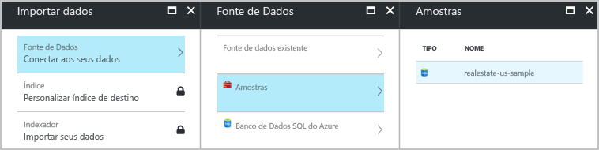
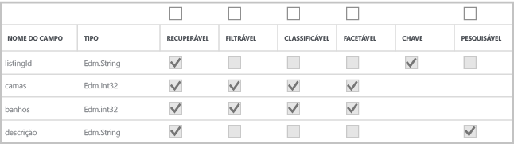
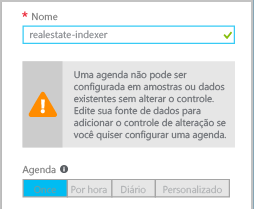
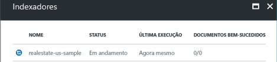

# Início Rápido: Usar ferramentas internas do portal para importação, indexação e consultas do Azure Search
> [!div class="op_single_selector"]
> * [Portal](search-get-started-portal.md)
> * [PowerShell](search-howto-dotnet-sdk.md)
> * [Postman](search-fiddler.md)
> * [C#](search-create-index-dotnet.md)
>*

Para se familiarizar rapidamente com os conceitos do Azure Search, experimente as ferramentas internas no portal do Azure. Os assistentes e os editores não oferecem a paridade completa com o .NET e as APIs REST, mas você pode começar rapidamente com uma introdução sem código, escrevendo consultas interessantes em dados de exemplo em minutos.

> [!div class="checklist"]
> * Começar com um conjunto de dados de exemplo público gratuito hospedado no Azure
> * Execute o assistente para **Importação de dados** no Azure Search para carregar dados e gerar um índice
> * Monitorar o progresso de indexação no portal
> * Exibir um índice existente e as opções para modificá-lo
> * Explore a pesquisa de texto completo, filtros, facetas, pesquisa difusa e pesquisa geográfica com o **Search Explorer**

Se as ferramentas forem muito limitadas, considere a possibilidade de começar com uma [introdução à programação do Azure Search no .NET baseada em código](search-howto-dotnet-sdk.md) ou usar o [Postman ou o Fiddler para fazer chamadas à API REST](search-fiddler.md).

Se você não tiver uma assinatura do Azure, crie uma [conta gratuita](https://azure.microsoft.com/free/?WT.mc_id=A261C142F) antes de começar. Você também pode assistir a uma demonstração de seis minutos das etapas deste tutorial a partir do minuto 3 neste [vídeo de visão geral do Azure Search](https://channel9.msdn.com/Events/Connect/2016/138).

## Pré-requisitos

[Crie um serviço Azure Search](search-create-service-portal.md) ou [localize um serviço existente](https://ms.portal.azure.com/#blade/HubsExtension/BrowseResourceBlade/resourceType/Microsoft.Search%2FsearchServices) na assinatura atual. É possível usar um serviço gratuito para este início rápido. 

### Verificar o espaço

Muitos clientes começam com o serviço gratuito. Essa versão é limitada a três índices, três fontes de dados e três indexadores. Verifique se há espaço para itens extras antes de começar. Este tutorial cria uma unidade de cada objeto.

As seções no painel de serviço mostram quantos índices, indexadores e fontes de dados você já tem. 

##  Criar um índice e carregar dados

As consultas de pesquisa de iteram em um [ *índice* ](search-what-is-an-index.md) que contém dados e metadados pesquisáveis e construções adicionais que otimizam certos comportamentos de pesquisa.

Para este tutorial, utilizamos um conjunto de dados interno de exemplo que pode ser rastreado com um [*indexador*](search-indexer-overview.md) via assistente **Importar dados**. Um indexador é um rastreador específico de fonte que pode ler metadados e conteúdo de fontes de dados do Azure que tenham suporte. Normalmente, os indexadores são usados de forma programática, mas no portal, você pode acessá-los por meio do assistente para **Importação de dados**. 

### Etapa 1 – Iniciar o assistente para Importação de dados e criar uma fonte de dados

1. No painel do serviço Azure Search, clique em **Importar dados** na barra de comandos para criar e popular um índice de pesquisa.

   

2. No assistente, clique em **Conectar-se aos seus dados** > **Exemplos** > **realestate-us-sample**. Essa fonte de dados é interna. Se você estiver criando sua própria fonte de dados, precisará especificar um nome, um tipo e as informações de conexão. Depois de criada, ela se torna uma "fonte de dados existente" que pode ser reutilizada em outras operações de importação.

   

3. Continue para a próxima página.

   

### Etapa 2 – Ignorar Habilidades cognitivas

O assistente dá suporte à criação de um [pipeline de habilidades cognitivas](cognitive-search-concept-intro.md) para incorporar os algoritmos de IA dos Serviços Cognitivos na indexação. 

Ignoraremos esta etapa por enquanto e passaremos diretamente para **Personalizar o índice de destino**.

   

> [!TIP]
> Você pode experimentar a versão prévia do novo recurso de pesquisa cognitiva do Azure Search no [início rápido](cognitive-search-quickstart-blob.md) ou no[tutorial](cognitive-search-tutorial-blob.md) de pesquisa cognitiva.

### Etapa 3 – Configurar o índice

Normalmente, a criação de índice é um exercício baseado em código, concluído antes do carregamento de dados. No entanto, conforme indicado neste tutorial, o assistente pode gerar um índice básico para qualquer fonte de dados que ele possa rastrear. No mínimo, um índice requer um nome e uma coleção de campos; um dos campos deve estar marcado como a chave do documento para identificar cada documento de forma exclusiva. Além disso, será possível especificar analisadores de linguagem ou sugestores se você desejar obter o preenchimento automático ou consultas sugeridas.

Campos têm atributos e tipos de dados. As caixas de seleção na parte superior são *atributos de índice* que controlam como o campo é usado.

* **Recuperável** significa que ele aparece na lista de resultados da pesquisa. Você pode marcar campos individuais como fora dos limites para os resultados de pesquisa ao desmarcar essa caixa de seleção, por exemplo, quando os campos forem usados somente em expressões de filtro.
* **Chave** é o identificador exclusivo do documento. É sempre uma cadeia de caracteres e é obrigatório.
* **Filtrável**, **Classificável** e **Com faceta** determinam se os campos são usados em um filtro, uma classificação ou uma estrutura de faceted navigation.
* **Pesquisável** significa que um campo é incluído na pesquisa de texto completo. As cadeias de caracteres são pesquisáveis. Campos numéricos e boolianos geralmente são marcados como não pesquisáveis.

Os requisitos de armazenamento não variam como resultado de sua seleção. Por exemplo, se você definir o atributo **Recuperável** em vários campos, os requisitos de armazenamento não aumentarão.

Por padrão, o assistente procura na fonte de dados identificadores exclusivos como base para o campo de chave. As *cadeias de caracteres* são atribuídas como **Recuperáveis** e **Pesquisáveis**. Os *inteiros* são atribuídos como **Recuperáveis**, **Filtráveis**, **Classificáveis** e **Com Faceta**.

1. Aceite os padrões. 

   Se você executar o assistente uma segunda vez usando uma fonte de dados de imóveis existente, o índice não será configurado com os atributos padrão. Você precisará selecionar manualmente os atributos em importações futuras.

   

2. Continue para a próxima página.

   

### Etapa 4 – Configurar o indexador

Ainda no assistente **Importar dados**, clique em **Indexador** > **Nome**e digite um nome para o indexador.

Esse objeto define um processo executável. Você poderá colocá-lo em uma agenda recorrente, mas, por enquanto, use a opção padrão para executar o indexador uma vez, imediatamente.

Clique em **Enviar** para criar e executar simultaneamente o indexador.

  

## Monitorar o progresso

O assistente levará você para a lista Indexadores, na qual você poderá monitorar o progresso. Para a autonavegação, acesse a página Visão Geral e clique em **Indexadores**.

Podem ser necessários alguns minutos para que o portal atualize a página, mas você deverá ver o indexador recém-criado na lista, com o status indicando "em andamento" ou êxito, juntamente com o número de documentos indexados.

   

## Exibir índice

A página principal de serviço fornece links para os recursos criados no serviço Azure Search.  Para exibir o índice que você acabou de criar, clique em **Índices** na lista de links. 

   

Nesta lista, você pode clicar no índice *realestate-us-sample* que acabou criou, exibir o esquema de índice. e, opcionalmente, adicionar novos campos. 

A guia **Campos** mostra o esquema de índice. Role até a parte inferior da lista para inserir um novo campo. Na maioria dos casos, você não pode alterar os campos existentes. Os campos existentes têm uma representação física no Azure Search e, portanto, não podem ser modificados, nem mesmo no código. Para alterar fundamentalmente um campo existente, crie um índice, removendo o original.

   

Outros constructos, como perfis de pontuação e opções de CORS, podem ser adicionados a qualquer momento.

Para entender claramente o que é possível editar ou não durante o design de índice, reserve um minuto para ver as opções de definição de índice. Opções esmaecidas são um indicador de que um valor não pode ser modificado ou excluído. 

##  Consulta usando o Search Explorer

Agora você terá um índice de pesquisa que está pronto para consulta na página de consulta interna [**Gerenciador de pesquisa** ](search-explorer.md). Ele fornece uma caixa de pesquisa para que você possa testar cadeias de caracteres de consulta arbitrárias.

O **Gerenciador de pesquisa** só é capaz de lidar com [Solicitações da API REST](https://docs.microsoft.com/rest/api/searchservice/search-documents), mas aceita a sintaxe de [consulta simples](https://docs.microsoft.com/rest/api/searchservice/simple-query-syntax-in-azure-search) e [completa do analisador de consulta Lucene](https://docs.microsoft.com/rest/api/searchservice/lucene-query-syntax-in-azure-search), além de todos os parâmetros de pesquisa disponíveis nas operações da [API REST de pesquisa de documento](https://docs.microsoft.com/rest/api/searchservice/search-documents#bkmk_examples).

> [!TIP]
> As etapas a seguir são demonstradas no momento 6m08s do [vídeo Visão geral do Azure Search](https://channel9.msdn.com/Events/Connect/2016/138).
>

1. Clique em **Gerenciador de pesquisa** na barra de comandos.

   

2. Clique em **Alterar índice** na barra de comando para alternar para *realestate-us-sample*. Clique em **Definir versão de API** na barra de comandos para ver quais APIs REST estão disponíveis. Para as consultas abaixo, use a versão disponível (2017-11-11).

   

3. Na barra de pesquisa, cole as cadeias de consulta abaixo e clique em **Pesquisar**.

   

## Consultas de exemplo

Você pode inserir termos e frases, semelhante ao que poderá fazer em uma pesquisa do Bing ou do Google, ou expressões de consulta totalmente especificadas. Os resultados são retornados como documentos JSON detalhados.

### Consulta simples com os primeiros N resultados

#### Exemplo (consulta de cadeia de caracteres): `search=seattle`

* O parâmetro **search** é usado para inserir uma palavra-chave de pesquisa de texto completo, neste caso, retornando listagens no estado de King County, estado de Washington, contendo *Seattle* em algum campo pesquisável no documento.

* O **Search Explorer** retorna os resultados em JSON, que é detalhado e difícil de ler quando os documentos têm uma estrutura densa. Isso é intencional; a visibilidade de todo o documento é importante para fins de desenvolvimento, especialmente durante o teste. Para uma melhor experiência de usuário, você precisará escrever código que [trate os resultados](search-pagination-page-layout.md) para destacar elementos importantes.

* Os documentos contêm todos os campos marcados como recuperáveis no índice. Para exibir atributos de índice no portal, clique em *realestate-us-sample* na lista **Índices**.

#### Exemplo (consulta parametrizada): `search=seattle&$count=true&$top=100`

* O símbolo **&** é usado para acrescentar os parâmetros de pesquisa, que podem ser especificados em qualquer ordem.

* O parâmetro **$count = true** retorna a contagem total de todos os documentos retornados. Esse valor aparece próximo ao início dos resultados da pesquisa. Você pode verificar consultas de filtro monitorando alterações relatadas por **$count=true**. Contagens menores indicam que seu filtro está funcionando.

* O **$top=100** retorna o 100 documentos com maior classificação do total. Por padrão, o Azure Search retorna as primeiras 50 melhores correspondências. Você pode aumentar ou diminuir a quantidade via **$top**.

###  Filtrar a consulta

Os filtros são incluídos nas solicitações de pesquisa quando você acrescenta o parâmetro **$filter**. 

#### Exemplo (filtrado): `search=seattle&$filter=beds gt 3`

* O parâmetro **$filter** retorna resultados que correspondem aos critérios fornecidos. Nesse caso, quartos maiores que 3.

* A sintaxe de filtro é uma construção de OData. Para saber mais, confira [Sintaxe de filtro OData](https://docs.microsoft.com/rest/api/searchservice/odata-expression-syntax-for-azure-search).

###  Facetar a consulta

Os filtros de faceta estão incluídos em solicitações de pesquisa. Você pode usar o parâmetro facet para retornar uma contagem agregada de documentos que correspondam a um valor de faceta que você fornecer.

#### Exemplo (facetado com redução de escopo): `search=*&facet=city&$top=2`

* **search=*** é uma pesquisa vazia. Pesquisas vazias pesquisam tudo. Um motivo de envio de uma consulta vazia é fazer a filtragem ou faceta no conjunto completo de documentos. Por exemplo, você deseja que uma estrutura de navegação de facetas contenha todas as cidades no índice.

* **facet** retorna uma estrutura de navegação que você pode passar para um controle de interface do usuário. Ela retorna categorias e uma contagem. Nesse caso, categorias se baseiam na quantidade de cidades. Não há nenhuma agregação no Azure Search, mas você pode aproximar agregação com `facet`, que retorna uma contagem de documentos em cada categoria.

* **$top=2** recupera dois documentos, ilustrando a que você pode usar `top` para reduzir ou aumentar os resultados.

#### Exemplo (faceta em valores numéricos): `search=seattle&facet=beds`**

* Essa consulta é faceta para camas em uma pesquisa de texto para *Seattle*. O termo *beds* pode ser especificado como uma faceta porque o campo é marcado como recuperável, filtrável e facetável no índice e valores que ele contém (numérico, 1 a 5) são adequados para categorizar as listagens em grupos (listagens com 3 quartos, 4 quartos).

* Somente campos filtráveis podem ser facetados. Somente os campos recuperáveis podem ser retornados nos resultados.

###  Realçar resultados da pesquisa

Realce de ocorrências refere-se à formatação de texto correspondentes à palavra-chave, considerando que existam correspondências em um campo específico. Se o termo de pesquisa estiver escondido em uma descrição, você poderá adicionar o realce de ocorrências para facilitar a localização.

#### Exemplo (marca-texto): `search=granite countertops&highlight=description`

* Neste exemplo, a frase formatada *balcões de granito* é mais fácil de identificar no campo de descrição.

#### Exemplo (análise linguística): `search=mice&highlight=description`

* A pesquisa de texto completo localiza formas com semântica semelhante. Nesse caso, os resultados da pesquisa contêm texto realçado para "rato", para residências que têm a infestação de ratos, em resposta a uma pesquisa de palavra-chave "ratos". Formas diferentes da mesma palavra podem aparecer nos resultados devido a análise linguística.

* O Azure Search dá suporte a 56 analisadores da Lucene e da Microsoft. O padrão usado pelo Azure Search é o analisador Lucene standard.

###  Experimentar pesquisa difusa

Por padrão, as palavras com grafia incorreta, como *samamish* para o planalto Sammamish na área de Seattle, não retornam correspondências em uma pesquisa típica. O exemplo a seguir não retorna resultados.

#### Exemplo (termo digitado incorretamente, sem tratamento): `search=samamish`

Para lidar com erros de ortografia, você pode usar a pesquisa difusa. A pesquisa difusa é habilitada quando você usa a sintaxe de consulta Lucene completa, que ocorre quando você faz duas coisas: definir **queryType = full** na consulta e acrescentar o **~** na cadeia de caracteres de pesquisa.

#### Exemplo (termo digitado incorretamente, com tratamento): `search=samamish~&queryType=full`

Agora, o exemplo retorna documentos que incluem a correspondências com "Sammamish".

Quando **queryType** for especificado, o analisador de consulta simples padrão será usado. O analisador de consulta simples é mais rápido, mas se você precisar de pesquisa difusa, expressões regulares, pesquisa por proximidade ou outros tipos de consulta avançada, será necessário obter a sintaxe completa.

A pesquisa difusa e a pesquisa curinga têm implicações nos resultados da pesquisa. A análise linguística não é executada nesses formatos de consulta. Antes de usar pesquisas difusa e curinga, reveja [Como a pesquisa de texto completa funciona no Azure Search](search-lucene-query-architecture.md#stage-2-lexical-analysis) e procure a seção sobre exceções à análise léxica.

Para saber mais sobre cenários de consulta habilitados pelo analisador de consulta completo, confira [Sintaxe de consulta Lucene no Azure Search](https://docs.microsoft.com/rest/api/searchservice/lucene-query-syntax-in-azure-search).

###  Experimentar a pesquisa geoespacial

A pesquisa geográfica tem suporte pelo [tipo de dados edm.GeographyPoint](https://docs.microsoft.com/rest/api/searchservice/supported-data-types) em um campo que contém coordenadas. A pesquisa geográfica é um tipo de filtro, especificado na [sintaxe do filtro OData](https://docs.microsoft.com/rest/api/searchservice/odata-expression-syntax-for-azure-search).

#### Exemplo (filtros de coordenadas geográficas): `search=*&$count=true&$filter=geo.distance(location,geography'POINT(-122.121513 47.673988)') le 5`

O exemplo de consulta filtra os dados posicionais de todos os resultados e os resultados ficam a menos de 5 km de um determinado ponto (especificado como coordenadas de latitude e longitude). Ao adicionar **$count**, você poderá ver quantos resultados são retornados quando se altera a distância ou as coordenadas.

A pesquisa geográfica é útil se seu aplicativo de pesquisa tem um recurso de “encontrar nas proximidades” ou usa a navegação de mapa. Entretanto, ela não é uma pesquisa de texto completo. Se você tiver requisitos de usuário para pesquisar em uma cidade ou país por nome, adicione campos que contêm nomes de cidade ou países, além de coordenadas.

## Observações

Este tutorial forneceu uma rápida introdução ao Azure Search usando o portal do Azure.

Você aprendeu a criar um índice de pesquisa usando o assistente **Importar dados**. Você aprendeu sobre [indexadores](search-indexer-overview.md) e sobre o fluxo de trabalho básico para criar índices, incluindo [modificações com suporte em um índice publicado](https://docs.microsoft.com/rest/api/searchservice/update-index).

Usando o **explorador do Search** no portal do Azure, você aprendeu algumas sintaxes de consulta básicas por meio de exemplos práticos que demonstraram os recursos principais, como filtros, realce de ocorrência, pesquisa difusa e pesquisa geográfica.

Você também aprendeu a encontrar índices, indexadores e fontes de dados no portal. Considerando novas fonte de dados no futuro, você poderá usar o portal para verificar rapidamente suas definições ou coleções de campos com um mínimo de esforço.

## Limpar

Se este tutorial foi seu primeiro uso do serviço Azure Search, exclua o grupo de recursos que contém o serviço Azure Search. Caso contrário, pesquise o nome do grupo de recurso correto na lista de serviços e exclua-o.

## Próximas etapas

Você pode explorar mais o Azure Search usando as ferramentas programáticas:

* [Criar um índice usando o SDK do .NET](https://docs.microsoft.com/azure/search/search-create-index-dotnet)
* [Criar um índice usando APIs REST](https://docs.microsoft.com/azure/search/search-create-index-rest-api)
* [Criar um índice usando o Postman ou o Fiddler e as APIs REST do Azure Search](search-fiddler.md)
