# Alertas de segurança por tipo na Central de Segurança do Azure
Este artigo ajuda você a compreender os diferentes tipos de alertas de segurança disponíveis na Central de Segurança do Azure. Para saber mais sobre como gerenciar os alertas, confira [Gerenciar e responder aos alertas de segurança na Central de Segurança do Azure](security-center-managing-and-responding-alerts.md).

> [!NOTE]
> Para configurar as detecções avançadas, atualize para a Central de Segurança do Azure Standard. Há uma avaliação gratuita de 60 dias disponível. Para atualizar, selecione **Tipo de Preço** na [política de segurança](security-center-policies.md). Para saber mais, consulte a [página de preços](https://azure.microsoft.com/pricing/details/security-center/).
>
>

## Que tipo de alerta está disponível?
A Central de Segurança do Azure fornece vários alertas que se alinham com os estágios da cadeia cyber kill. A ilustração a seguir mostra vários alertas e como eles se relacionam a alguns desses estágios.

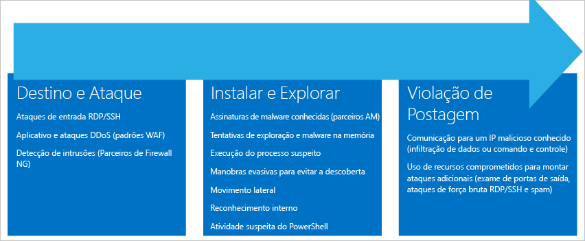

**Alvo e ataque**

* Ataques RDP/SSH de entrada
* Ataques de DDoS e aplicativo (parceiros WAF)
* Detecção de intrusão (parceiros NG Firewall)

**Instalar e explorar**

* Assinaturas de malware conhecidas (parceiros AM)
* Tentativas de malware e exploração na memória
* Execução de processo suspeita
* Manobras evasivas para evitar a descoberta
* Movimento lateral
* Reconhecimento interno
* Atividade suspeita do PowerShell

**Violação de postagem**  

* Comunicação com um IP mal-intencionado conhecido (extração de dados ou comando e controle)
* Usando recursos comprometidos para montar ataques adicionais (ataques de força bruta RDP/SSH para verificar porta de saída e spam)

Diferentes tipos de ataques são associados a cada estágio e eles se destinam a diferentes subsistemas. Para endereçar os ataques durante os estágios, a Central de Segurança tem três categorias de alertas:

* Análise de Comportamento da Máquina Virtual (VMBA)
* Análise de Rede
* Análise de Recursos

## Análise de comportamento da máquina virtual
A Central de Segurança do Azure pode usar a análise de comportamento para identificar os recursos comprometidos com base na análise dos logs de evento da máquina virtual. Por exemplo, Eventos de Criação do Processos e Eventos de Logon. Além disso, há uma correlação com outros sinais para verificar se há suporte a evidências de uma campanha generalizada.

> [!NOTE]
> Para saber mais sobre como funcionam os recursos de detecção da Central de Segurança, confira [Recursos de detecção da Central de Segurança do Azure](security-center-detection-capabilities.md).
>
>

### Análise de falha
A análise do despejo de memória é um método usado para detectar um malware sofisticado capaz de escapar das soluções de segurança tradicionais. Várias formas de malware tentam reduzir a chance de serem detectadas por produtos antivírus nunca gravando no disco ou criptografando os componentes de software gravados no disco. Isso torna o malware difícil de detectar usando as abordagens tradicionais antimalware. No entanto, esse tipo de malware pode ser detectado usando a análise de memória, pois o malware deve deixar rastreamentos na memória para poder funcionar.

Quando o software falha, um despejo de memória captura uma parte da memória no momento da falha. A falha pode ser causada por malware, problemas gerais do aplicativo ou do sistema. Analisando a memória no despejo de falha, a Central de Segurança pode detectar as técnicas usadas para explorar as vulnerabilidades no software, acessar os dados confidenciais e manter-se de maneira furtiva em uma máquina comprometida. Isso é feito com um mínimo de impacto no desempenho para os hosts quando a análise é executada pelo back-end da Central de Segurança.

Os campos a seguir são comuns aos exemplos de alerta de despejo de memória que aparecem posteriormente neste artigo:

* DUMPFILE: nome do arquivo de despejo de memória.
* PROCESSNAME: nome do processo de falha.
* PROCESSVERSION: versão do processo de falha.

### Shellcode descoberto
Shellcode é a carga executada depois que o malware explorou uma vulnerabilidade do software. Esse alerta indica que a análise do despejo de memória detectou um código executável com um comportamento normalmente executado por cargas mal-intencionadas. Embora software que não seja mal-intencionado possa executar esse comportamento, não é comum às práticas de desenvolvimento de software normal.

Esse exemplo de alerta do Shellcode fornece o seguinte campo adicional:

* ADDRESS: o local do shellcode na memória.

Eis um exemplo desse tipo de alerta:

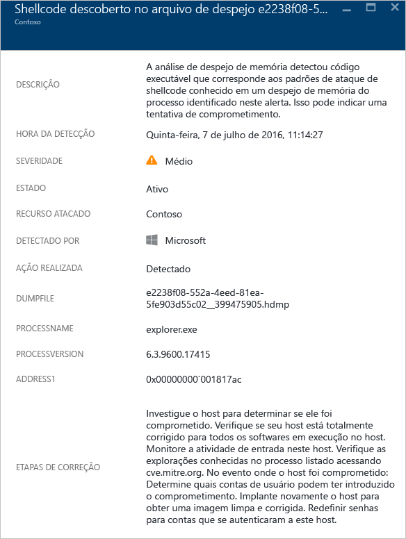

### Descoberta de sequestro do módulo
O Windows usa DLLs (bibliotecas de vínculo dinâmico) para permitir que o software use funcionalidades comuns de sistema do Windows. O sequestro de DLL ocorre quando o malware altera a ordem de carregamento de DLL para carregar cargas maliciosas na memória, onde o código arbitrário pode ser executado. Este alerta indica que a análise de despejo de memória detectou um módulo com um nome parecido carregado de dois caminhos diferentes. Um dos caminhos carregados vem de um local de binários de sistema comuns do Windows.

Os desenvolvedores de software legítimos ocasionalmente alteram a ordem de carregamento de DLL por motivos lícitos, por exemplo, para instrumentação, extensão do sistema operacional Windows ou de aplicativos do Windows. Para ajudar a diferenciar as alterações mal-intencionadas das bem-intencionadas na ordem de carregamento de DLL, a Central de Segurança do Azure verifica se um módulo carregado se encaixa em um perfil suspeito. O resultado dessa verificação é indicado pelo campo "ASSINATURA" do alerta e refletido na gravidade, na descrição e nas etapas de solução do alerta. Para pesquisar se o módulo é legítimo ou mal-intencionado, analise a cópia em disco do módulo sequestrado. Por exemplo, você pode verificar a assinatura digital do arquivo ou executar uma verificação antivírus.

Além dos campos comuns descritos na seção "Shellcode descoberto" acima, esse alerta fornece os seguintes campos:

* SIGNATURE: indica se o módulo de sequestro se encaixa em um perfil de comportamento suspeito.
* HIJACKEDMODULE: o nome do módulo do sistema Windows sequestrado.
* HIJACKEDMODULEPATH: o caminho do módulo do sistema Windows sequestrado.
* HIJACKINGMODULEPATH: o caminho do módulo sequestrado.

Eis um exemplo desse tipo de alerta:

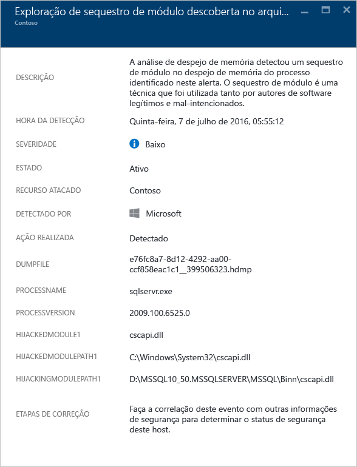

### Módulo do Windows simulado detectado
O malware pode usar nomes comuns de binários (por exemplo, SVCHOST.EXE) ou módulos (por exemplo, NTDLL. DLL) do sistema Windows para *se misturar* e ocultar a natureza do software mal-intencionado dos administradores de sistema. O alerta indica que a análise de despejo de memória detectou que o arquivo de despejo de memória contém módulos que usam nomes de módulo do sistema Windows, mas não atendem a outros critérios típicos de módulos do Windows. A análise da cópia em disco do módulo simulado pode fornecer mais informações sobre a natureza legítima ou mal-intencionada do módulo. A análise pode incluir:

* A confirmação de que o arquivo em questão é enviado como parte de um pacote de software legítimo.
* Verifique a assinatura digital do arquivo.
* Execute uma varredura antivírus no arquivo.

Além dos campos comuns descritos anteriormente na seção "Shellcode descoberto", o alerta fornece os seguintes campos adicionais:

* DETAILS: descreve se os metadados dos módulos são válidos e se o módulo foi carregado de um caminho do sistema.
* NAME: o nome do módulo do Windows simulado.
* PATH: o caminho do módulo do Windows simulado.

Esse alerta também extrai e exibe determinados campos do cabeçalho PE do módulo, como "CHECKSUM" e "TIMESTAMP". Esses campos serão exibidos somente se os campos estiverem presentes no módulo. Confira a [Especificação Microsoft PE e COFF](https://msdn.microsoft.com/windows/hardware/gg463119.aspx) para obter detalhes sobre esses campos.

Eis um exemplo desse tipo de alerta:

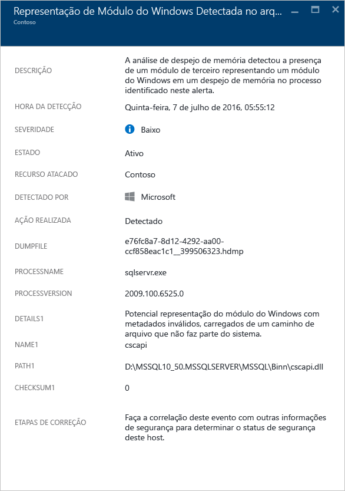

### Binário do sistema modificado descoberto
Malware pode modificar os principais binários do sistema para acessar dados secretamente ou persistir furtivamente em um sistema comprometido. O alerta indica que a análise de despejo de memória detectou binários principais do sistema operacional Windows que foram modificados na memória ou no disco.

Os desenvolvedores de software legítimos ocasionalmente modificam módulos do sistema na memória por motivos lícitos, por exemplo, para desvios ou para compatibilidade de aplicativos. Para ajudar a diferenciar módulos bem-intencionadas de mal-intencionados, a Central de Segurança do Azure verifica se um módulo alterado se encaixa em um perfil suspeito. O resultado dessa verificação é indicado pela severidade, pela descrição e pelas etapas de solução do alerta.

Além dos campos comuns descritos anteriormente na seção "Shellcode descoberto", o alerta fornece os seguintes campos adicionais:

* MODULENAME: nome do binário do sistema modificado.
* MODULEVERSION: versão do binário do sistema modificado.

Eis um exemplo desse tipo de alerta:

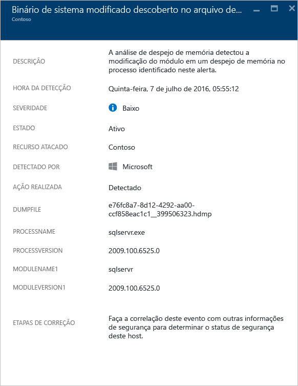

### Processo suspeito executado
A Central de Segurança identifica um processo suspeito executado na máquina virtual de destino e dispara um alerta. A detecção não procura o nome específico, mas procura pelo parâmetro do arquivo executável. Portanto, mesmo que o invasor renomeie o arquivo executável, a Central de Segurança ainda poderá detectar o processo suspeito.

Eis um exemplo desse tipo de alerta:

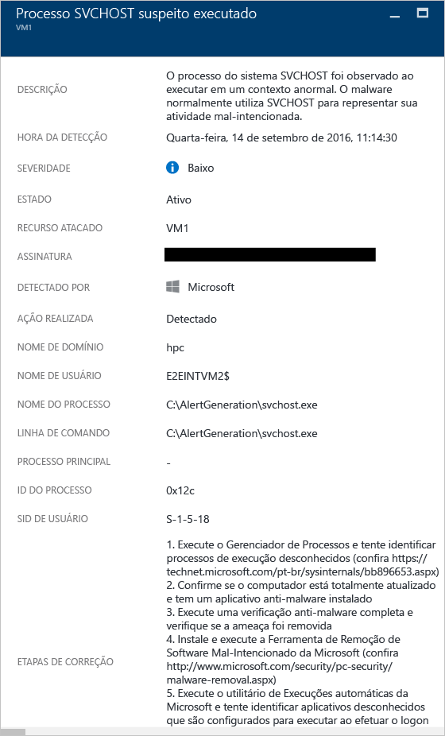

### Várias contas de domínio consultadas
A Central de Segurança pode detectar várias tentativas para consultar as contas do Domínio do Active Directory, sendo algo que normalmente é feito pelo invasores durante o reconhecimento da rede. Os invasores podem aproveitar essa técnica para consultar o domínio a fim de identificar os usuários, quais são as contas do administrador de domínio, quais computadores são os controladores de domínio e também a relação de confiança de domínio potencial com outros domínios.

Eis um exemplo desse tipo de alerta:

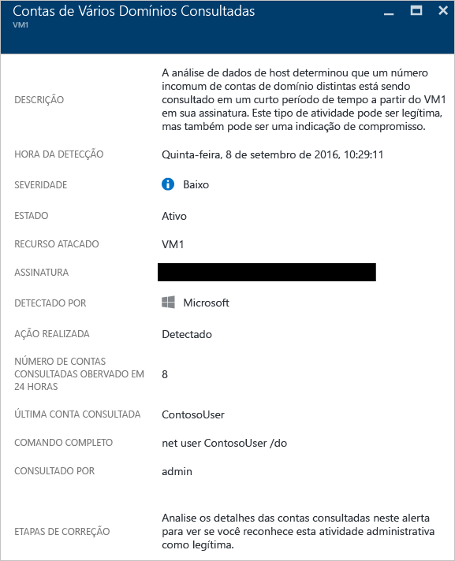

### Os membros do grupo Administradores locais foram enumerados

A Central de Segurança vai disparar um alerta quando o evento de segurança 4798, no Windows Server 2016 e no Windows 10, for disparado. Isso acontece quando os grupos de administradores locais são enumerados, que é algo normalmente feito por invasores durante o reconhecimento de rede. Os invasores podem aproveitar essa técnica para consultar a identidade de usuários com privilégios administrativos.

Eis um exemplo desse tipo de alerta:

### Mistura anormal de caracteres maiúsculos e minúsculos

A Central de Segurança vai disparar um alerta ao detectar o uso de uma combinação de caracteres maiúsculos e minúsculos na linha de comando. Alguns invasores podem usar essa técnica para ocultar de maiúsculas e minúsculas ou regra de computador com base em hash.

Eis um exemplo desse tipo de alerta:

### Ataque de tíquete do ouro do Kerberos

Uma chave [krbtgt](https://technet.microsoft.com/library/dn745899.aspx) comprometida pode ser usada por um invasor para criar "Tíquetes de ouro" Kerberos, permitindo que o invasor represente qualquer usuário desejado. A Central de segurança vai disparar um alerta quando detectar esse tipo de atividade.

> [!NOTE] 
> Para saber mais sobre o Tíquete de ouro Kerberos, leia [Guia de atenuação de roubo de credenciais do Windows 10](http://download.microsoft.com/download/C/1/4/C14579CA-E564-4743-8B51-61C0882662AC/Windows%2010%20credential%20theft%20mitigation%20guide.docx).

Eis um exemplo desse tipo de alerta:

### Conta suspeita criada

A Central de Segurança vai disparar um alerta quando uma conta for criada com bastante semelhança à uma conta de privilégios de administrador interna existente. Essa técnica pode ser usada pelos invasores para criar uma conta de invasor que passe despercebida pela verificação humana.
 
Eis um exemplo desse tipo de alerta:

### Regra de firewall suspeita criada

Os invasores podem tentar contornar a segurança do host criando regras de firewall personalizadas para permitir que aplicativos mal-intencionados se comuniquem com o comando e controle, ou para iniciar ataques pela rede por meio do host comprometido. A Central de Segurança vai disparar um alerta quando detectar que uma nova regra de firewall foi criada de um arquivo executável em um local suspeito.
 
Eis um exemplo desse tipo de alerta:

### Combinação suspeita de HTA e PowerShell

A Central de Segurança vai disparar um alerta quando detectar que um host de aplicativo HTML da Microsoft (HTA) está iniciando comandos do PowerShell. Essa é uma técnica usada pelos invasores para iniciar scripts do PowerShell mal-intencionados.
 
Eis um exemplo desse tipo de alerta:

## Análise de Rede
A detecção de ameaças da rede da Central de Segurança funciona coletando automaticamente as informações de segurança de seu tráfego do Azure IPFIX (Internet Protocol Flow Information Export). Ele analisa essas informações geralmente correlacionando informações de várias fontes para identificar ameaças.

### Tráfego de saída suspeito detectado
Os dispositivos de rede podem ser descobertos e analisados da mesma forma que outros tipos de sistemas. Os invasores normalmente começam com verificação de porta ou varredura de porta. No exemplo a seguir, você tem um tráfego suspeito de SSH (Secure Shell) de uma VM. Nesse cenário, é possível usar força bruta de SSH ou um ataque de varredura de porta contra um recurso externo.

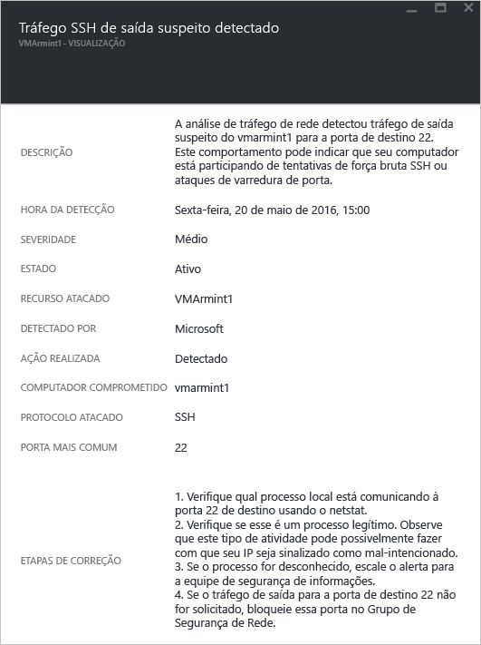

Esse alerta fornece informações que você pode usar para identificar o recurso que foi usado para iniciar esse ataque. Esse alerta também fornece informações para identificar a máquina comprometida, o tempo de detecção, além do protocolo e da porta que foram usados. Essa folha também fornece uma lista de etapas de correção que podem ser usadas para atenuar esse problema.

### Comunicação de rede com uma máquina mal-intencionada
Aproveitando os feeds de inteligência de ameaças da Microsoft, a Central de Segurança do Azure pode detectar máquinas comprometidas que estão se comunicando com endereços IP mal-intencionados. Em muitos casos, o endereço mal-intencionado é um centro de comando e controle. Nesse caso, a Central de Segurança detectou que a comunicação foi feita usando o malware Pony Loader (também conhecido como [Fareit](https://www.microsoft.com/security/portal/threat/encyclopedia/entry.aspx?Name=PWS:Win32/Fareit.AF)).

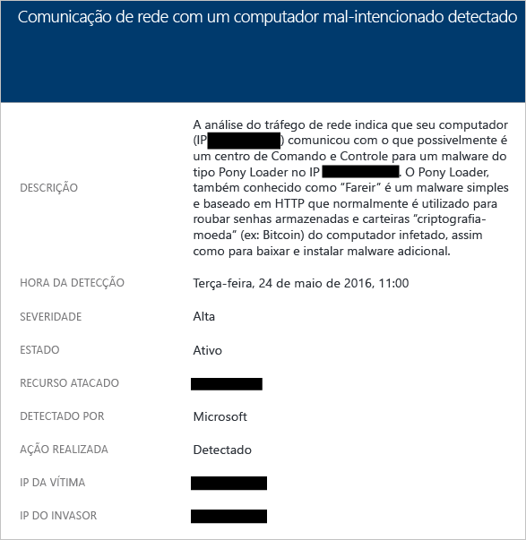

Esse alerta fornece informações que permitem a identificação do recurso usado para iniciar esse ataque, o recurso atacado, o IP da vítima, o IP do invasor e o tempo de detecção.

> [!NOTE]
> Endereços IP ativos foram removidos nesta captura de tela por fins de privacidade.
>
>

### Possível saída do ataque de negação de serviço detectada
O tráfego de rede anormal proveniente de uma máquina virtual pode levar a Central de Segurança a disparar um possível tipo de ataque de negação de serviço.

Eis um exemplo desse tipo de alerta:

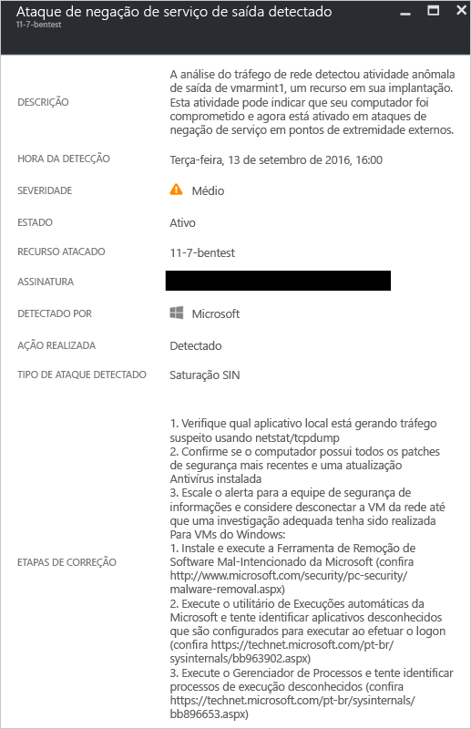

## Análise de Recursos
A análise de recursos da Central de Segurança concentra-se em serviços PaaS (plataforma como serviço), como a integração com o recurso [Detecção de ameaças do Banco de Dados SQL do Azure](../sql-database/sql-database-threat-detection.md). Com base nos resultados da análise dessas áreas, a Central de Segurança dispara um alerta relacionado aos recursos.

### Potencial injeção de SQL
A injeção de SQL é um ataque em que o código mal-intencionado é inserido em cadeias de caracteres, passadas posteriormente para uma instância do SQL Server para análise e execução. Qualquer procedimento que constrói instruções SQL deve ser revisado em busca de vulnerabilidades de injeção, pois o SQL Server executa todas as consultas sintaticamente válidas que recebe. A Detecção de Ameaças SQL usa o aprendizado de máquina, análise de comportamento e detecção de anomalias para determinar os eventos suspeitos que podem estar ocorrendo em seus Bancos de Dados SQL do Azure. Por exemplo:

* Tentativa de acesso do banco de dados por um antigo funcionário
* Ataques de injeção de SQL
* Acesso incomum e um banco de dados de produção de um usuário em casa

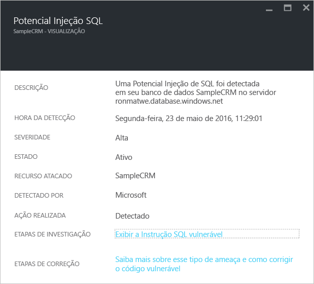

As informações neste alerta podem ser usadas para identificar o recurso atacado, o tempo de detecção e o estado do ataque. Também fornecem um link para mais etapas de investigação.

### Vulnerabilidade à Injeção de SQL
Este alerta é disparado quando um erro de aplicativo é detectado em um banco de dados. Esse alerta pode indicar uma possível vulnerabilidade a ataques de injeção de SQL.

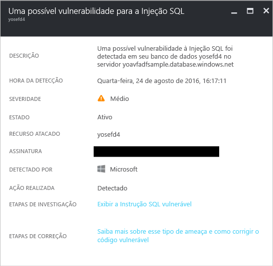

### Acesso incomum de um local desconhecido
Este alerta é disparado quando um evento de acesso de um endereço IP desconhecido foi detectado no servidor, que não foi visto no último período.

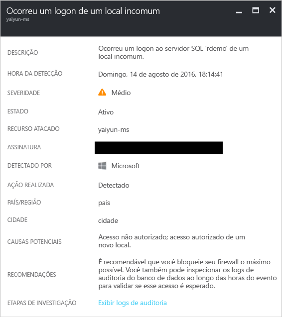

## Consulte também
Neste artigo, você aprendeu sobre os diferentes tipos de alertas de segurança na Central de Segurança. Para saber mais sobre a Central de Segurança, confira o seguinte:

* [Manipulação de incidente de segurança na Central de Segurança do Azure](security-center-incident.md)
* [Recursos de detecção da Central de Segurança do Azure](security-center-detection-capabilities.md)
* [Guia de planejamento e operações da Central de Segurança do Azure](security-center-planning-and-operations-guide.md)
* [Perguntas frequentes da Central de Segurança do Azure](security-center-faq.md): encontre as perguntas frequentes sobre como usar o serviço.
* [Blog de segurança do Azure](http://blogs.msdn.com/b/azuresecurity/) encontre postagens no blog sobre conformidade e segurança do Azure.

