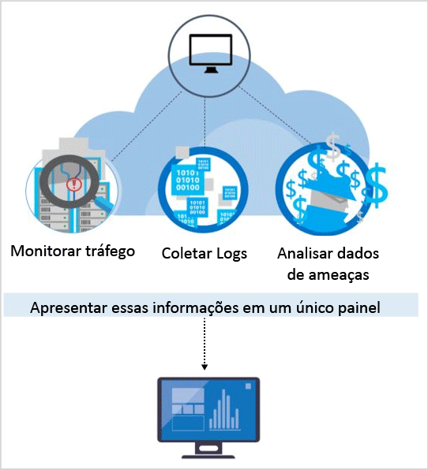

# Recursos de detecção da Central de Segurança do Azure
Este documento aborda os recursos de detecção avançada da Central de Segurança do Azure, que ajuda a identificar ameaças ativas aos recursos do Microsoft Azure, Windows e Linux e fornece as informações necessárias para uma resposta rápida.

Detecções avançadas estão disponíveis na camada Standard da Central de Segurança do Azure. Há uma avaliação gratuita disponível. Você pode atualizar na seleção de Tipo de Preço na [Política de Segurança](tutorial-security-policy.md). Visite a [página do Centro de Segurança](https://azure.microsoft.com/pricing/details/security-center/) para saber mais sobre preços.

## Respondendo às ameaças atuais
Houve alterações significativas no panorama de ameaças nos últimos 20 anos. Antigamente, as empresas normalmente só precisavam preocupar-se com a desfiguração do site por invasores individuais, que basicamente tinham interesse em ver “o que poderiam fazer”. Os hackers de hoje em dia são muito mais sofisticados e organizados. Eles geralmente têm objetivos estratégicos e financeiros específicos. Eles também têm mais recursos disponíveis, já que podem ser financiados por nações ou pelo crime organizado.

Esta abordagem levou a um nível de profissionalismo nas classificações do invasor sem precedentes. Eles não estão mais interessados em desfiguração da Web. Agora, eles estão interessados em roubo de informações, de contas financeiras e de dados privados, que podem usar para gerar dinheiro no mercado aberto ou para se aproveitar de um negócio específico, para fins políticos ou militares. Ainda mais preocupante que esses invasores com um objetivo financeiro, são os invasores que violam as redes prejudicar a infraestrutura e pessoas.

Em resposta, as organizações geralmente implantam várias soluções pontuais, com foco em defender o perímetro ou os pontos de extremidade da empresa procurando assinaturas de ataques conhecidos. Essas soluções tendem a gerar um alto volume de alertas de baixa fidelidade, que exigem que um analista de segurança faça a triagem e investigue. A maioria das organizações não têm o tempo e o conhecimento necessário para responder a esses alertas; vários ficam sem investigação.  Enquanto isso, os invasores têm evoluído seus métodos para examinar as várias defesas baseadas em assinatura e [adaptar-se a ambientes em nuvem](https://azure.microsoft.com/blog/detecting-threats-with-azure-security-center/). Novas abordagens são necessárias para identificar ameaças emergentes e agilizar a detecção e a resposta mais rapidamente.

## Como a Central de Segurança do Azure detecta e responde às ameaças
Os pesquisadores de segurança da Microsoft estão constantemente à procura de ameaças. Eles têm acesso a um conjunto expansivo de telemetria obtida com a presença global da Microsoft na nuvem e localmente. Esta coleção diversa e abrangente de conjuntos de dados permite que a Microsoft descubra novos padrões de ataque e tendências em seus produtos de consumidor e empresariais no local, bem como em serviços on-line. Como resultado, a Central de Segurança pode atualizar rapidamente seus algoritmos de detecção conforme os invasores lançam explorações novas e cada vez mais sofisticadas. Isso ajuda a acompanhar o ritmo de um ambiente de ameaças que muda rapidamente.

A detecção de ameaças da Central de Segurança funciona coletando informações de segurança de seus recursos do Azure, de rede e de soluções de parceiros conectados automaticamente. Ele analisa essas informações geralmente correlacionando informações de várias fontes para identificar ameaças. Os alertas de segurança são priorizados na Central de Segurança, juntamente com recomendações sobre como corrigir a ameaça.

A Central de Segurança emprega análise de segurança avançada, que vai além das abordagens baseadas em assinatura. Inovações em tecnologias de big data e [aprendizado de máquina](https://azure.microsoft.com/blog/machine-learning-in-azure-security-center/) são usadas para aproveitar os eventos de avaliação em toda a malha de nuvem, detectando ameaças que seriam impossíveis de identificar usando abordagens manuais e prevendo a evolução de ataques. Essas análises de segurança incluem:

* **Inteligência contra ameaças globais**: procura atores ruins aproveitando a inteligência contra ameaça e produtos e serviços Microsoft, da unidade de Crimes digitais da Microsoft (DCU), do Microsoft Security Response Center (MSRC) e de feeds externos.
* **Análise comportamental**: aplica padrões conhecidos para descobrir os comportamentos mal-intencionados.
* **Detecção de anomalias**: usa estatísticas de criação de perfil para criar uma linha de base histórica. Ela o alertará sobre desvios das linhas de base estabelecidas em conformidade com um vetor de possível ataque.

### Inteligência contra ameaças
A Microsoft tem uma grande quantidade de inteligência contra ameaças globais. A telemetria flui de várias fontes, como o Azure, o Office 365, o Microsoft CRM online, o Microsoft Dynamics AX, o outlook.com, o MSN.com, a DCU (Unidade de Crimes Digitais da Microsoft) e o Microsoft Security Response Center (MSRC). Os pesquisadores também recebem informações de inteligência de ameaça que são compartilhadas entre os principais provedores de serviços de nuvem e assinam feeds de inteligência contra ameaças de terceiros. A Central de Segurança do Azure pode usar essas informações para alertá-lo de ameaças vindas de maus atores conhecidos. Alguns exemplos incluem:

* **Comunicação de saída para um endereço IP mal-intencionado**: o tráfego de saída para um botnet ou darknet conhecido provavelmente indica que o recurso foi comprometido e um invasor está tentando executar comandos de sistema ou exfiltrar dados. A Central de Segurança do Azure compara o tráfego de rede com o banco de dados de ameaças globais da Microsoft e o alerta se detecta uma comunicação com um endereço IP mal-intencionado.

## Análise comportamental
A análise de comportamento é uma técnica que analisa e compara dados em uma coleção de padrões conhecidos. No entanto, esses padrões não são assinaturas simples. Eles são determinados por meio de algoritmos de aprendizado de máquina complexos que são aplicados a grandes conjuntos de dados. Eles também são determinados pela análise cuidadosa de comportamentos mal-intencionados por analistas especialistas. A Central de Segurança do Azure pode usar a análise de comportamento para identificar recursos comprometidos baseado na análise dos logs de máquina virtual, dos logs de dispositivo de rede virtual, dos logs da malha, dos despejos de memória e de outras fontes.

Além disso, há uma correlação com outros sinais para verificar se há suporte a evidências de uma campanha generalizada. Essa correlação ajuda a identificar os eventos que são consistentes com os indicadores de comprometimento estabelecidos. Alguns exemplos incluem:

* **Execução de processo suspeito**: Os invasores empregam várias técnicas para executar um software mal-intencionado sem detecção. Por exemplo, um invasor pode dar os mesmos nomes de arquivos do sistema legítimos ao malware, mas colocar esses arquivos em locais alternativos, usar um nome que é muito semelhante a um arquivo benigno ou mascarar a extensão verdadeira do arquivo. Os modelos da Central de Segurança processam comportamentos e monitoram execuções de processo para detectar exceções como essas.  
* **Malware oculto e tentativas de exploração**: O malware sofisticado é capaz de escapar dos produtos antimalware tradicionais não gravando no disco ou criptografando os componentes do software armazenados no disco.  No entanto, esse tipo de malware pode ser detectado usando a análise de memória, já que o malware deve deixar rastreamentos na memória para poder funcionar. Quando o software falha, um despejo de memória captura uma parte da memória no momento da falha.  Analisando a memória no despejo, a Central de Segurança do Azure pode detectar técnicas usadas para explorar vulnerabilidades no software, acessar dados confidenciais e se manter em uma máquina comprometida de maneira furtiva sem afetar o desempenho do seu computador.
* **Movimentação lateral e reconhecimento interno**: Para persistir em uma rede comprometida e localizar/coletar dados valiosos, os invasores geralmente tentam mover-se lateralmente do computador comprometido para outras dentro da mesma rede. A Central de Segurança monitora as atividades de processo e de logon para detectar tentativas de expandir a presença do invasor dentro da rede, como sondagem de rede de execução de comando remoto e a enumeração de contas.
* **Scripts do PowerShell mal-intencionados**: O PowerShell está sendo usado pelos invasores para executar código mal-intencionado em máquinas virtuais de destino com diversas finalidades. A Central de Segurança inspeciona a atividade do PowerShell para obter evidência de atividades suspeitas.
* **Ataques de saída**: Os invasores costumam atacar os recursos de nuvem com a meta de usá-los para montar ataques adicionais. Máquinas virtuais comprometidas, por exemplo, podem ser usadas para iniciar ataques de força bruta contra outras máquinas virtuais, enviar SPAM ou verificar portas abertas e outros dispositivos na Internet. Aplicando o aprendizado de máquina ao tráfego de rede, a Central de Segurança pode detectar quando as comunicações de rede de saída excedem a norma. No caso de SPAM, a Central de Segurança também correlaciona o tráfego de email incomum com inteligência do Office 365 para determinar se o email é possivelmente perigoso ou o resultado de uma campanha de email legítima.  

### Detecção de anomalias
A Central de Segurança do Azure também usa detecção de anomalias para identificar ameaças. Ao contrário da análise de comportamento (que depende de padrões conhecidos derivados de grandes conjuntos de dados), a detecção de anomalias é mais "personalizada" e se concentra nas linhas de base que são específicas das suas implantações. O aprendizado de máquina é aplicado para determinar a atividade normal das implantações e, em seguida, as regras são geradas para definir condições de exceção que possam representar um evento de segurança. Aqui está um exemplo:

* **Ataques de força bruta vindos de RDP/SSH**: Suas implantações podem ter máquinas virtuais ocupadas com uma grande quantidade diária de logons e outras máquinas virtuais que têm muito poucos ou nenhum logon. A Central de Segurança do Azure pode determinar a linha de base da atividade de logon para essas máquinas virtuais e usar o aprendizado de máquina para definir o que está fora da atividade de logon normal. Se o número de logons, a hora do dia dos logons, o local do qual os logons forem solicitados ou outras características de logon forem significativamente diferentes da linha de base, um alerta poderá ser gerado. Novamente, o aprendizado de máquina determina o que é relevante.

## Monitoramento contínuo de inteligência contra ameaças
A Central de Segurança do Azure têm equipes de pesquisas de segurança e de ciência de dados que monitoram continuamente em busca de alterações no panorama de ameaças. Isso inclui as seguintes iniciativas:

* **Monitoramento de inteligência contra ameaças**: A inteligência contra ameaças inclui mecanismos, indicadores, implicações e conselhos acionáveis sobre ameaças iminentes ou existentes. Essas informações são compartilhadas na comunidade de segurança e a Microsoft monitora continuamente os feeds de inteligência contra ameaças de fontes internas e externas.
* **Compartilhamento de sinal**: Ideias de equipes de segurança de todo o amplo portfólio da Microsoft de serviços locais e de nuvem, servidores e dispositivos de ponto de extremidade cliente são compartilhadas e analisadas.
* **Especialistas de segurança da Microsoft**: Comprometimento contínuo com as equipes da Microsoft que trabalham em campos de segurança especializada, como computação forense e detecção de ataque à Web.
* **Ajuste de detecção**: Algoritmos são executados em conjuntos de dados de clientes reais e os pesquisadores de segurança trabalham com os clientes para validar os resultados. Verdadeiros e falsos positivos são usados para refinar os algoritmos de aprendizado de máquina.

Esses esforços combinados culminam em detecções novas e aprimoradas de que você pode se beneficiar instantaneamente. Não há nenhuma ação a ser tomada.

## Consulte também
Neste documento, você aprendeu como funcionam os recursos de detecção da Central de Segurança do Azure. Para saber mais sobre a Central de Segurança, confira o seguinte:

* [Guia de planejamento e operações da Central de Segurança do Azure](security-center-planning-and-operations-guide.md)
* [Gerenciando e respondendo a alertas de segurança na Central de segurança do Azure](security-center-managing-and-responding-alerts.md)
* [Alertas de Segurança por Tipo na Central de Segurança do Azure](security-center-alerts-type.md)
* [Monitoramento da integridade de segurança na Central de Segurança do Azure](security-center-monitoring.md) – saiba como monitorar a integridade dos recursos do Azure.
* [Monitorando as soluções de parceiros com a Central de Segurança do Azure](security-center-partner-solutions.md) – saiba como monitorar o status de integridade de suas soluções de parceiros.
* [Perguntas frequentes da Central de Segurança do Azure](security-center-faq.md) : encontre as perguntas frequentes sobre como usar o serviço.
* [Blog de Segurança do Azure](https://blogs.msdn.com/b/azuresecurity/) : encontre postagens no blog sobre conformidade e segurança do Azure.
