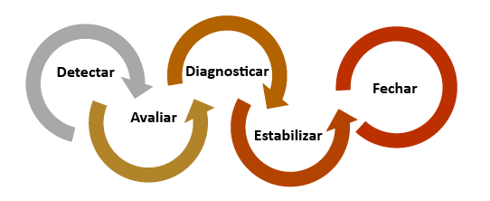
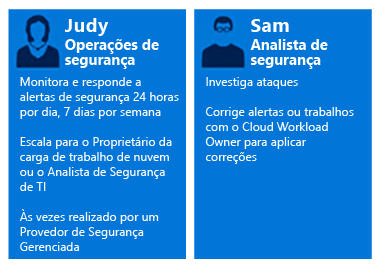
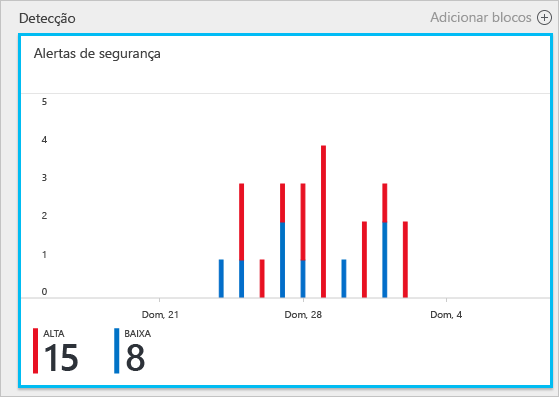
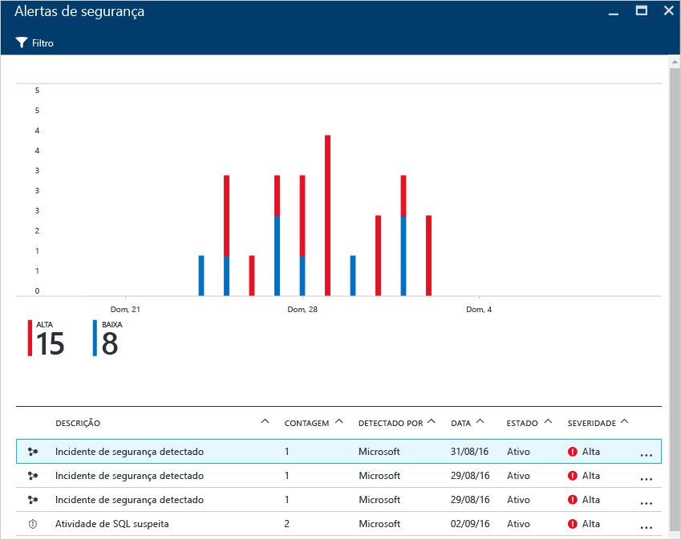
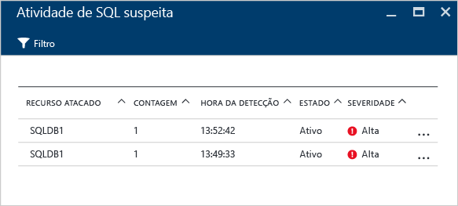
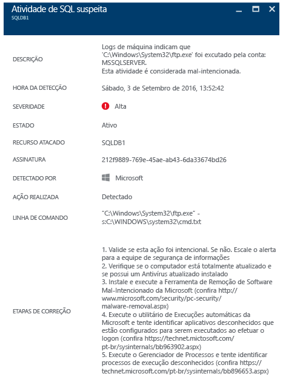

# Usando a Central de Segurança do Azure para uma resposta a incidentes
Muitas organizações aprendem como responder aos incidentes de segurança somente depois de sofrer um ataque. Para reduzir os custos e danos, é importante ter um plano de resposta aos incidentes em vigor antes que ocorra um ataque. A Central de Segurança do Azure pode ser usada em diferentes estágios de uma resposta a incidentes.

## Planejamento de resposta a incidentes
Um plano eficaz depende de três recursos principais: capacidade de proteger, detectar e responder a ameaças. Proteção significa prevenção de incidentes, detecção é identificar as ameaças no início e resposta é remover o invasor e restaurar os sistemas para atenuar o impacto de uma violação.

Este artigo usará os estágios de resposta a incidentes de segurança do artigo [Resposta de Segurança do Microsoft Azure na Nuvem](https://gallery.technet.microsoft.com/Azure-Security-Response-in-dd18c678) conforme mostrado no diagrama a seguir:

Você pode usar a Central de Segurança durante os estágios Detectar, Avaliar e Diagnosticar. Veja exemplos de como a Central de Segurança pode ser útil durante os três estágios de resposta a incidentes inicial:

* **Detectar**: revisa a primeira indicação de uma investigação de eventos
  * Exemplo: revise a verificação inicial de que um alerta de segurança de alta prioridade foi gerado no painel da Central de Segurança.
* **Avaliar**: realiza a avaliação inicial para obter mais informações sobre a atividade suspeita.
  * Exemplo: obtenha mais informações sobre o alerta de segurança.
* **Diagnosticar**: conduzir uma investigação técnica e identificar estratégias de contenção, atenuação e solução.
  * Exemplo: siga as etapas de correção descritas pela Central de Segurança nesse alerta de segurança específico.

O cenário que segue mostra como utilizar a Central de Segurança durante os estágios de detecção, avaliação e diagnóstico/resposta de um incidente de segurança. Na Central de Segurança, um [incidente de segurança](security-center-incident.md) é uma agregação de todos os alertas de um recurso que se alinham com os padrões da [cadeia de desativações](https://blogs.technet.microsoft.com/office365security/addressing-your-cxos-top-five-cloud-security-concerns/) . Incidentes aparecem no bloco e folha [Alertas de Segurança](security-center-managing-and-responding-alerts.md) . Um incidente revela a lista de alertas relacionados, o que permite a obtenção de mais informações sobre cada ocorrência. A Central de Segurança também apresenta alertas de segurança autônomos que também podem ser usados para rastrear uma atividade suspeita.

## Cenário
A Contoso migrou recentemente alguns dos seus recursos locais para o Azure, incluindo uma linha de cargas de trabalho de negócios e bancos de dados SQL baseada em máquinas virtuais. No momento, a principal Equipe de Resposta a Incidentes de Segurança de Computação (CSIRT) da Contoso tem um problema para investigar os problemas de segurança devido à inteligência de segurança não estar integrada em suas ferramentas atuais de resposta a incidentes. Essa falta de integração apresenta um problema durante a detecção (muitos falsos positivos) e durante os estágios de avaliação e diagnóstico. Como parte da migração, eles decidiram optar pela Central de Segurança para ajudar a resolver o problema.

A primeira fase da migração terminou após a integração de todos os recursos e do endereçamento de todas as recomendações de segurança da Central de Segurança. A CSIRT da Contoso é o ponto focal para lidar com os incidentes de segurança do computador. A equipe consiste em um grupo de pessoas com responsabilidades para lidar com qualquer incidente de segurança. Os membros da equipe definiram claramente as tarefas para garantir que nenhuma área de resposta fique descoberta.

Para esse cenário, focaremos nas funções do personas a seguir que fazem parte da CSIRT da Contoso:

A Laura está no setor de operações de segurança. Suas responsabilidades incluem:

* Monitorar e responder às ameaças de segurança 24 horas por dia.
* Expandir o proprietário das cargas de trabalho de nuvem ou o analista de segurança quando necessário.

Sam é analista de segurança e suas responsabilidades incluem:

* Investigar os ataques.
* Corrigir os alertas.
* Trabalhar com os proprietários da carga de trabalho para determinar e aplicar atenuações.

Como você pode ver, Laura e Sam têm responsabilidades diferentes e devem trabalhar juntos para compartilhar as informações da Central de Segurança.

## Solução recomendada
Como Laura e Sam têm funções diferentes, eles usarão diferentes áreas da Central de Segurança para obter informações relevantes para suas atividades diárias. Laura usará os **Alertas de Segurança** como parte do seu monitoramento diário.

Laura usará os Alertas de Segurança durante as fases de Detecção e Avaliação. Quando Laura terminar a avaliação inicial, poderá expandir o problema para Sam, se uma investigação adicional for necessária. Neste ponto, Sam usará as informações fornecidas pela Central de Segurança, às vezes, em conjunto com outras fontes de dados, para passar para o estágio de Diagnóstico.

## Como implementar esta solução
Para ver como você usaria a Central de Segurança do Azure em um cenário de resposta a incidentes, seguiremos as etapas de Laura nos estágios para Detectar e Avaliar, em seguida, veremos o que Sam faz para diagnosticar o problema.

### Estágios de resposta a incidentes para detecção e avaliação
Laura se conectou ao portal do Azure e está trabalhando no console da Central de Segurança. Como parte de suas atividades diárias de monitoramento, ela iniciou a revisão dos alertas de segurança de alta prioridade executando as seguintes etapas:

1. Clique no bloco **Alertas de segurança** e acesse a folha **Alertas de segurança**.
    

   > [!NOTE]
   > Para este cenário, Laura fará uma avaliação sobre o alerta de Atividade do SQL mal-intencionada, como visto na figura anterior.
   >
   >
2. Clique no alerta **Atividade de SQL mal-intencionada** e examine os recursos atacados na folha **Atividades do SQL mal-intencionadas**:  

    Nessa folha, Laura pode fazer anotações sobre os recursos atacados, quantas vezes esse ataque aconteceu e quando ele foi detectado.
3. Clique no **recurso atacado** para obter mais informações sobre o ataque.

Depois de ler a descrição, Laura está convencida de que isso não é um falso positivo e que deve expandir o caso para Sam.

### Estágio para diagnosticar a resposta a incidentes
Sam recebe o caso de Laura e começa a revisar as etapas de correção sugeridas pela Central de Segurança.

### Recursos adicionais
Para as empresas que usam a solução SIEM (Security Information and Event Management) durante o processo de investigação, elas também podem [integrar a Central de Segurança em sua solução](security-center-integrating-alerts-with-log-integration.md). Você também pode integrar os logs de auditoria do Azure e os eventos de segurança da VM usando a [ferramenta de integração de logs do Azure](https://azure.microsoft.com/blog/introducing-hdinsight-integration-with-azure-log-analytics/). Para investigar um ataque, essas informações podem ser usadas junto com as informações fornecidas pela Central de Segurança. Você também pode usar o recurso de [investigação](https://docs.microsoft.com/azure/security-center/security-center-investigation) na Central de Segurança, para ajudá-lo a determinar a causa raiz de um incidente.

## Conclusão
Montar uma equipe antes que ocorra um incidente é muito importante para sua organização e influenciará positivamente em como os incidentes são lidados. Ter as ferramentas certas para monitorar os recursos pode ajudar a essa equipe a dar passos precisos para corrigir um incidente de segurança. Os recursos de detecção da [Central de Segurança](security-center-detection-capabilities.md) poderão auxiliar a TI a responder rapidamente aos incidentes de segurança e corrigir os problemas.
