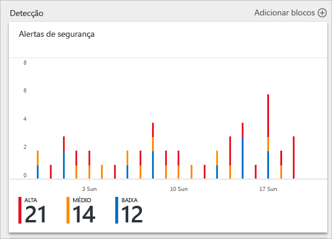
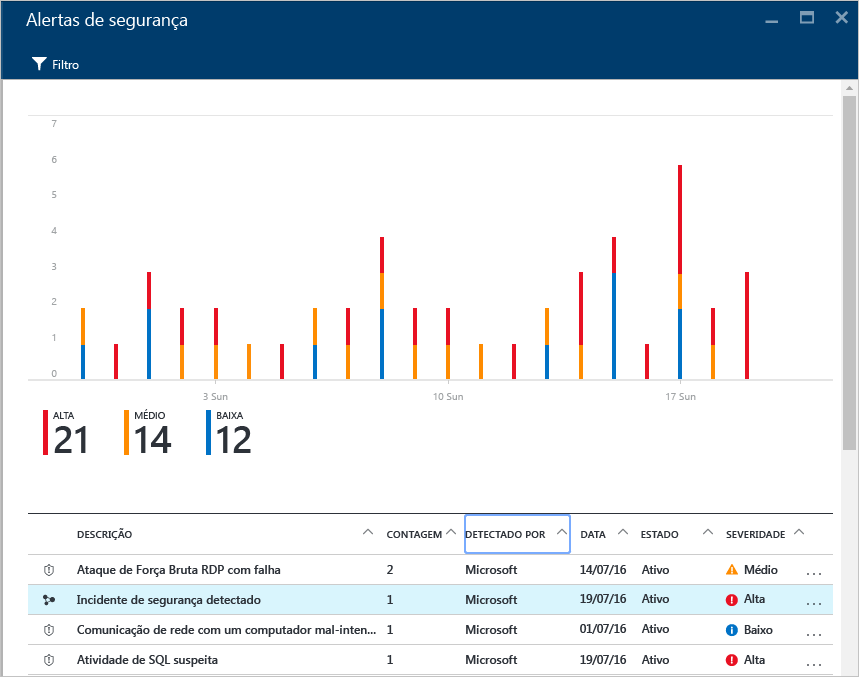
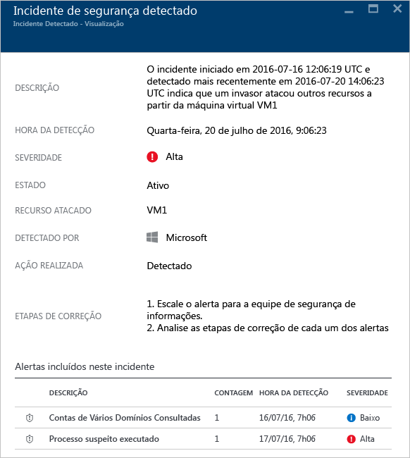
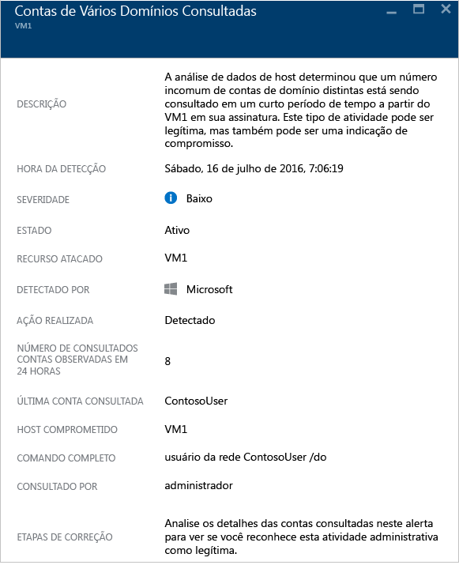

<properties
   pageTitle="Manipulação de incidente de segurança na Central de Segurança do Azure | Microsoft Azure"
   description="Este documento ajuda você a usar os recursos da Central de Segurança do Azure para gerenciar incidentes de segurança."
   services="security-center"
   documentationCenter="na"
   authors="YuriDio"
   manager="swadhwa"
   editor=""/>

<tags
   ms.service="security-center"
   ms.topic="hero-article"
   ms.devlang="na"
   ms.tgt_pltfrm="na"
   ms.workload="na"
   ms.date="08/03/2016"
   ms.author="yurid"/>

# Manipulação de incidente de segurança na Central de Segurança do Azure 
A triagem e investigação de alertas de segurança pode ser uma tarefa demorada até mesmo para os analistas de segurança mais capacitados, e, para muitos, é difícil até mesmo saber por onde começar. Usando [análise](security-center-detection-capabilities.md) para conectar as informações entre diferentes [alertas de segurança](security-center-managing-and-responding-alerts.md), a Central de Segurança pode fornecer uma exibição única de uma campanha de ataque e todos os alertas relacionados, com isso, você pode entender rapidamente quais ações o invasor executou e quais recursos foram afetados.

Este documento discute como usar o recurso de alerta de segurança na Central de Segurança para ajudar a lidar com incidentes de segurança.

## O que é um incidente de segurança?

Na Central de Segurança, um incidente de segurança é uma agregação de todos os alertas de um recurso que se alinham com padrões de [kill chain](https://blogs.technet.microsoft.com/office365security/addressing-your-cxos-top-five-cloud-security-concerns/) (cadeia de desativações). Incidentes aparecem no bloco e folha [Alertas de Segurança](security-center-managing-and-responding-alerts.md). Um Incidente revelará a lista de alertas relacionados, o que permite a obtenção de mais informações sobre cada ocorrência.

## Gerenciamento de incidentes de segurança

Você pode examinar os incidentes atuais de segurança observando o bloco Alertas de segurança. Acesse o Portal do Azure e execute as etapas abaixo para ver mais detalhes sobre cada incidente de segurança:

1. No painel Central de Segurança, você verá o bloco **Alertas de segurança**.

    

2.  Clique neste bloco para expandi-lo e, se um incidente de segurança for detectado, ele será exibido no gráfico de alertas de segurança, conforme mostra a imagem a seguir.

    

3.	Observe que a descrição de incidentes de segurança tem um ícone diferente em comparação com outros alertas. Clique para exibir mais detalhes sobre o incidente.

	

4. 	Na folha **Incidente de segurança detectado**, você verá mais detalhes sobre esse incidente de segurança, incluindo a descrição completa do incidente, a gravidade (que nesse caso é alta), o estado atual do incidente (nesse caso ele ainda está *ativo*), o recurso atacado (neste caso *VM1*), as etapas de correção e, na parte inferior, estão os alertas que foram incluídos neste incidente. Se você quiser obter mais informações sobre cada alerta, basta clicar nele e outra folha será aberta, conforme mostrado abaixo.

	

As informações nessa folha variam de acordo com o alerta. Leia [Gerenciamento e resposta aos alertas de segurança na Central de Segurança do Azure](security-center-managing-and-responding-alerts.md) para saber mais sobre como gerenciar esses alertas. Algumas considerações importantes sobre esse recurso:

- Um novo filtro permite que você personalize para exibir para apenas Incidentes, somente Alertas ou ambos.
- O mesmo alerta pode existir como parte de um Incidente (se aplicável), bem como para ser visível como um alerta autônomo.
- Ignorar um incidente não ignorará os alertas relacionados.

## Consulte também

Neste documento, você aprendeu a usar os recursos de incidente de segurança na Central de Segurança do Azure. Para saber mais sobre a Central de Segurança, confira o seguinte:

- [Gerenciando e respondendo a alertas de segurança na Central de segurança do Azure](security-center-managing-and-responding-alerts.md)
- [Recursos de detecção da Central de Segurança do Azure](security-center-detection-capabilities.md)
- [Guia de planejamento e operações da Central de Segurança do Azure](security-center-planning-and-operations-guide.md)
- [Gerenciando e respondendo a alertas de segurança na Central de segurança do Azure](security-center-managing-and-responding-alerts.md)
- [Perguntas frequentes sobre a Central de Segurança do Azure](security-center-faq.md) – encontre perguntas frequentes sobre como usar o serviço.
- [Blog de segurança do Azure](http://blogs.msdn.com/b/azuresecurity/): encontre postagens no blog sobre a conformidade e a segurança do Azure.

<!---HONumber=AcomDC_0810_2016-->