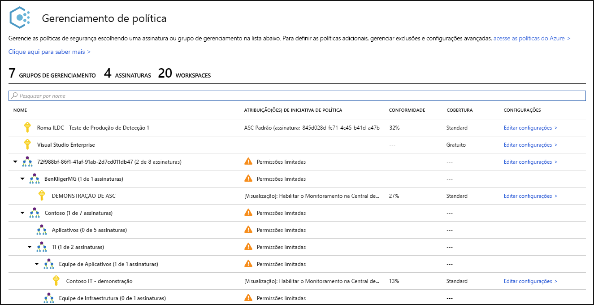
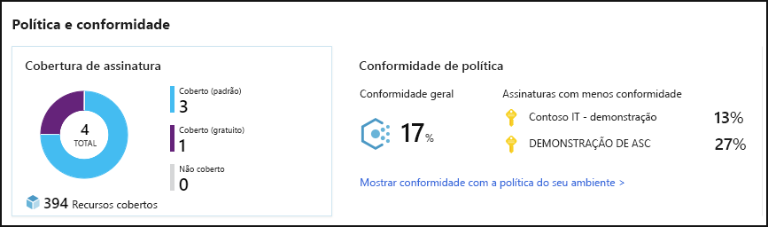
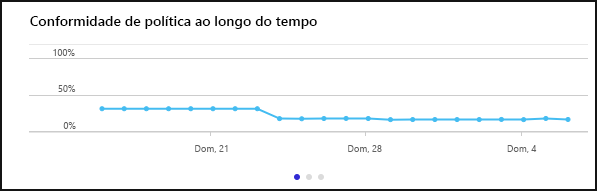
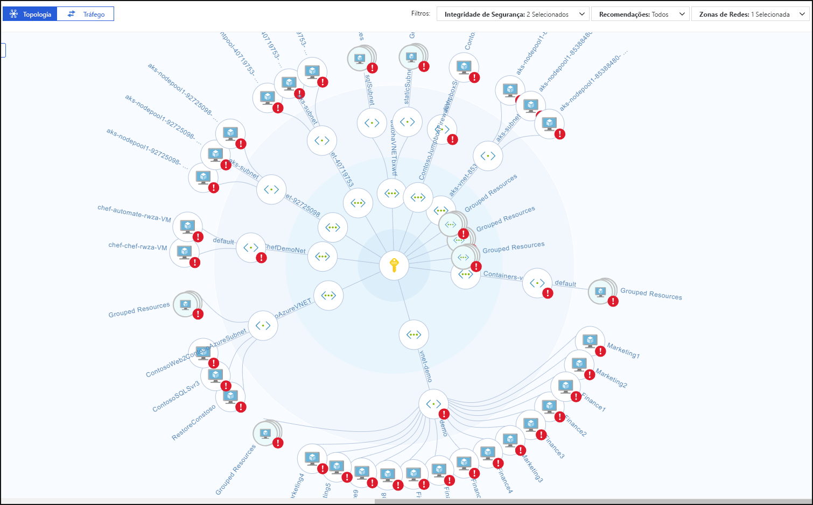
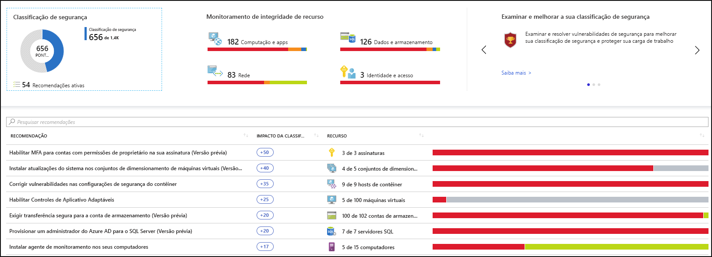
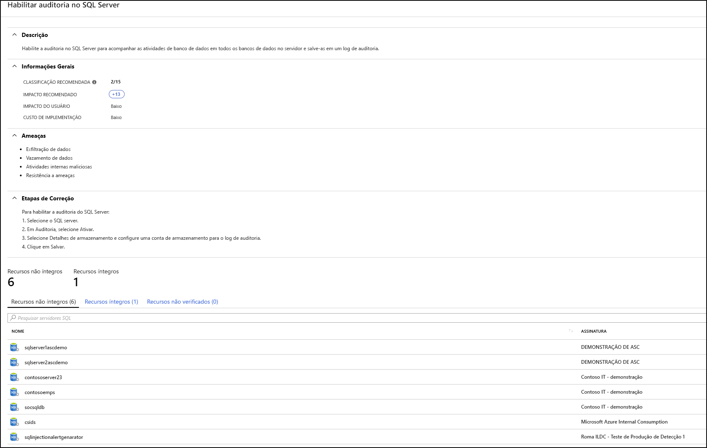
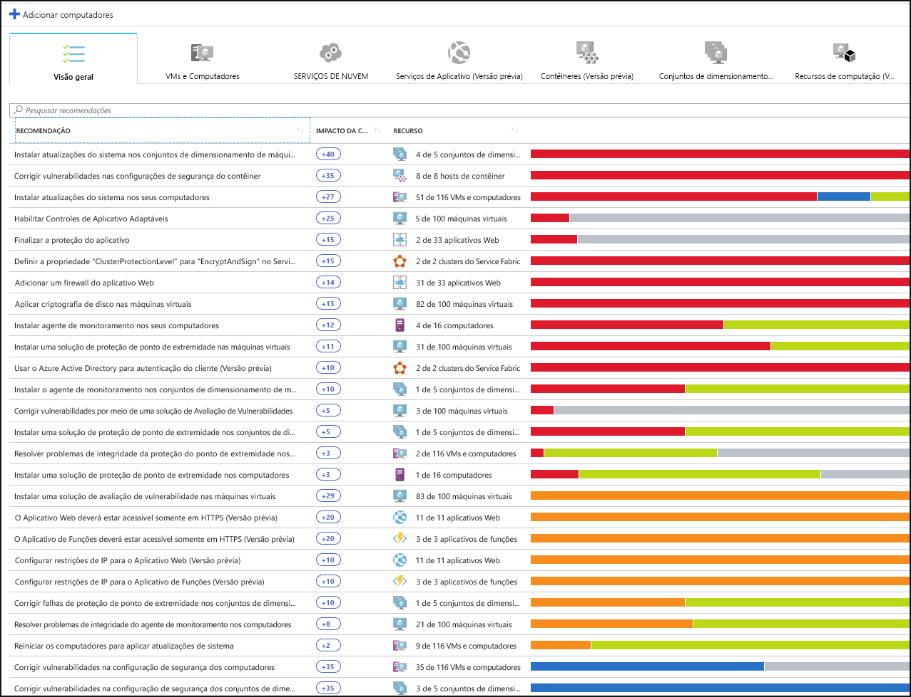
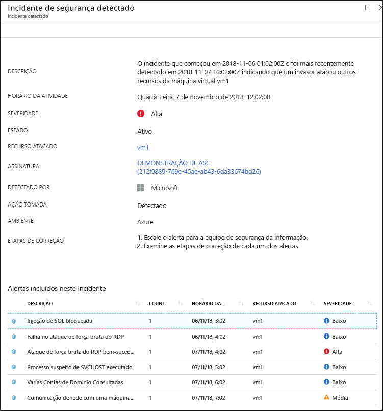

# O que é a Central de Segurança do Azure?

A Central de Segurança do Azure é um sistema de gerenciamento de segurança de infraestrutura unificado que fortalece a postura de segurança de seus data centers e fornece proteção avançada contra ameaças em suas cargas de trabalho híbridas locais e na nuvem, estejam elas no Azure ou não.

Manter seus recursos seguros é um esforço conjunto entre seu provedor de nuvem, o Azure e você, o cliente. Você precisa verificar se suas cargas de trabalho estão seguras ao mudar para a nuvem e, ao mesmo tempo, quando ao ir para IaaS (infraestrutura como serviço), há mais responsabilidade do cliente do que havia em PaaS (plataforma como serviço) e SaaS (software como serviço). A Central de Segurança do Azure fornece as ferramentas necessárias para proteger sua rede, proteger seus serviços e verificar se você está atualizado quanto à sua postura de segurança.

A Central de Segurança do Azure aborda os três desafios de segurança mais urgentes:

-   **Cargas de trabalho que mudam rapidamente** – são tanto um ponto forte quanto um desafio da nuvem. Por um lado, os usuários finais estão capacitados a fazer mais. Por outro, como você garante que os serviços em constante mudança que as pessoas estão usando e criando estejam atualizados com seus padrões de segurança e sigam as melhores práticas de segurança?

-   **Ataques cada vez mais sofisticados**  – onde quer que você execute suas cargas de trabalho, os ataques continuam a ficar cada vez mais sofisticados. Você precisará proteger suas cargas de trabalho de nuvem pública, que são, na verdade, uma carga de trabalho voltada para a Internet que poderão deixá-lo ainda mais vulnerável se você não seguir as melhores práticas de segurança.

-   **Habilidades de segurança são escassas**  – o número de alertas de segurança e sistemas de alertas ultrapassa muito o número de administradores com experiência e preparação necessárias para garantir a proteção dos seus ambientes. Permanecer atualizado quanto aos ataques mais recentes é um desafio constante, tornando impossível permanecer em vigor enquanto o mundo de segurança é um front em constante mudança.

Para ajudá-lo a se proteger contra esses desafios, a Central de Segurança fornece ferramentas para:

-   **Fortalecer a postura de segurança**: A Central de Segurança avalia seu ambiente e permite que você entenda o status de seus recursos, são seguro ou não?

-   **Proteger contra ameaças**: A Central de Segurança avalia a suas cargas de trabalho e gera alertas de detecção de ameaças e recomendações de prevenção de ameaças.

-   **Ficar seguro com mais rapidez**: Na Central de Segurança, tudo é feito na velocidade da nuvem. Por ser integrada nativamente, a implantação da Central de Segurança é fácil, oferecendo provisionamento automático e proteção com os serviços do Azure.

## Arquitetura

Como a Central de Segurança nativamente faz parte do Azure, serviços de PaaS no Azure, incluindo o Service Fabric, bancos de dados SQL e contas de armazenamento, são monitoradas e protegidos pela Central de Segurança sem necessidade de qualquer implantação.

Além disso, a Central de Segurança protege servidores e máquinas virtuais não Azure na nuvem ou localmente para servidores Windows e Linux instalando o Microsoft Monitoring Agent neles. Máquinas virtuais do Azure são provisionadas automaticamente na Central de Segurança.

Os eventos coletados dos agentes e do Azure são correlacionados no mecanismo de análise de segurança para fornecer alertas de detecção de ameaças e recomendações (tarefas de proteção) sob medida que você deve seguir para que suas cargas de trabalho fiquem seguras. Você deve investigar esses alertas assim que possível para verificar se ataques mal-intencionados não estão ocorrendo em suas cargas de trabalho.

Quando você habilita a Central de Segurança, a política de segurança interna da Central de Segurança é refletida no Azure Policy como uma iniciativa interna, na categoria Central de Segurança. A iniciativa interna é atribuída automaticamente a todas as assinaturas registradas da Central de Segurança (camadas Gratuita ou Standard). A iniciativa interna contém somente políticas de Auditoria. Para obter mais informações sobre as políticas da Central de Segurança no Azure Policy, confira [Trabalhando com políticas de segurança](tutorial-security-policy.md).

## Fortalecer a postura de segurança

A Central de Segurança do Azure permite que você fortaleça sua postura de segurança. Isso significa que ajuda você a identificar e executar as tarefas de proteção recomendadas como melhores práticas de segurança e implementá-las em seus aplicativos, serviços de dados e computadores. Isso inclui gerenciar e impor políticas de segurança e verificar se suas máquinas virtuais do Azure, servidores não Azure e serviços PaaS do Azure estão em conformidade. A Central de Segurança fornece as ferramentas de que você precisa para ter um panorama de suas cargas de trabalho, com visibilidade focada no estado de segurança de rede da sua. 

### Gerenciar a conformidade e a política de segurança da organização

É um fundamento de segurança conhecer e verificar se suas cargas de trabalho estão seguras e isso começa com estabelecer políticas de segurança sob medida. Porque todas as políticas na Central de Segurança são criadas sobre controles de política do Azure, você está obtendo a toda a gama e a flexibilidade de uma **solução de política de alto nível**. Na Central de Segurança, você pode definir suas políticas a serem executadas nos grupos de gerenciamento, entre assinaturas e até mesmo para um locatário inteiro.

A Central de Segurança o ajuda a **identificar as assinaturas de TI sombra**. Examinando as assinaturas rotuladas como **não cobertas** no seu painel, você pode saber imediatamente quando há assinaturas criadas recentemente e garantir que elas sejam cobertas pelas suas políticas e protegidas pela Central de Segurança do Azure.

Os recursos avançados de monitoramento na Central de Segurança também permitem que você **acompanhe e gerencie a conformidade e a governança ao longo do tempo**. A **conformidade geral** fornece uma medida de quanto das suas assinaturas estão em conformidade com as políticas associadas à sua carga de trabalho. 

### Avaliações contínuas

A Central de Segurança descobre novos recursos que estão sendo implantados em suas cargas de trabalho e avalia se estão configurados de acordo com as práticas recomendadas de segurança, caso contrário, são sinalizados e você obtém uma lista priorizada de recomendações do que você precisará consertar continuamente para de proteger seus computadores.

Uma das ferramentas mais avançadas que a Central de Segurança oferece para monitoramento contínuo do status de segurança da sua rede é o **Mapa de rede**. O mapa permite que você veja a topologia de suas cargas de trabalho para que você possa ver se cada nó está configurado corretamente. Você pode ver como os nós estão conectados, o que ajuda a bloquear conexões indesejadas que poderiam potencialmente tornar mais fácil para um invasor entrar na sua rede.

A Central de Segurança torna reduzir seus alertas de segurança uma etapa mais fácil ao adicionar **Pontuação de segurança**. As pontuações seguras agora estão associadas a cada recomendação que você recebe para ajudá-lo a entender a importância de cada recomendação para sua postura de segurança geral. Isso é fundamental para permitir que você **priorize seu trabalho de segurança**.

### Otimizar e melhorar a segurança configurando controles recomendados

O cerne do valor da Central de Segurança do Azure está em suas recomendações. As recomendações são personalizadas conforme as preocupações de segurança específicas encontradas em suas cargas de trabalho e a Central de Segurança faz o trabalho de administração de segurança para você, não apenas encontrando suas vulnerabilidades, como fornecendo instruções específicas sobre como eliminá-las.

Dessa forma, a Central de Segurança permite que você não apenas defina políticas de segurança, como aplique padrões de configuração segura em todos os seus recursos.

As recomendações ajudam a reduzir a superfície de ataque em cada um de seus recursos. Isso inclui máquinas virtuais do Azure, servidores não Azure e serviços de PaaS do Azure, como SQL e contas de Armazenamento e mais – em que cada tipo de recurso é avaliado de maneira diferente e tem seus próprios padrões.

## Proteção contra ameaças

A proteção contra ameaças da Central de Segurança permite que você detecte e evite ameaças na camada de IaaS (infraestrutura como serviço), servidores não Azure, bem como para PaaS (Plataforma como Serviço) no Azure.

A proteção contra ameaças da Central de Segurança inclui análise de cadeia de eliminação de fusão, que correlaciona automaticamente alertas em seu ambiente com base na análise de cadeia de eliminação de cibernéticos para ajudá-lo a entender melhor a história completa de uma campanha de ataque, o ponto de partida e que tipo de impacto causou aos seus recursos.

### Proteção avançada contra ameaças

Com a Central de Segurança, você obtém a integração nativa à Proteção Avançada contra Ameaças do Windows Defender pronta para uso. Isso significa que, sem qualquer configuração, seus servidores e máquinas virtuais do Windows são totalmente integrados com avaliações e recomendações da Central de Segurança. Detecção avançada de ameaças também é oferecida pronta para uso para servidores e máquinas virtuais do Linux.

Além disso, a Central de Segurança permite automatizar as políticas de controle de aplicativo em ambientes de servidor. Os controles de aplicativo adaptáveis na Central de Segurança habilitam a lista de permissões do aplicativo de ponta a ponta entre os servidores do Windows. Você não precisa criar as regras e verificar as violações, tudo é feito automaticamente para você.

### Proteger PaaS

A Central de Segurança ajuda a detectar ameaças em todos os serviços de PaaS do Azure. Você pode detectar ameaças que tenham como alvo serviços do Azure, incluindo o Serviço de Aplicativo do Azure, SQL Azure, Conta de Armazenamento do Azure e outros serviços de dados. Você também pode aproveitar a integração nativa com o UEBA (Análise Comportamental de Entidade e Usuário do Microsoft Cloud App Security) para executar a detecção de anomalias em seus logs de atividades do Azure.

### Bloquear ataques de força bruta

A Central de Segurança ajuda a limitar a exposição a ataques de força bruta. Ao reduzir o acesso às portas de máquina virtual, usando o acesso de VM Just-In-Time, você pode proteger sua rede, impedindo acesso desnecessário. Você pode definir políticas de acesso seguro em portas selecionadas somente para usuários autorizados, endereços IP ou intervalos de endereços IP de origem permitida por um tempo limitado.

### Proteger serviços de dados

A Central de Segurança inclui funcionalidades que ajudam você a realizar a classificação automática dos seus dados no SQL Azure. Você também pode obter avaliações de possíveis vulnerabilidades nos serviços de Armazenamento e SQL do Azure e recomendações de como mitigá-las.

## Ficar seguro com mais rapidez

A integração nativa do Azure (incluindo Azure Policy e Azure Monitor logs) combinada com a integração perfeita a outras soluções de segurança da Microsoft, como ao Microsoft Cloud App Security e à Proteção Avançada contra Ameaças do Windows Defender, ajuda a garantir sua solução de segurança seja abrangente e simples de integrar e distribuir.

Além disso, você pode estender a solução completa além do Azure para cargas de trabalho em execução em outras nuvens e data centers locais.

### Descobrir e integrar automaticamente recursos do Azure

A Central de Segurança fornece integração nativa perfeita do Azure com recursos do Azure. Isso significa que você pode efetuar pull de uma história de segurança completa envolvendo o Azure Policy e políticas internas da Central de Segurança em todos os seus recursos do Azure e verificar se tudo isso é aplicado automaticamente para recursos recém-descobertos conforme você os cria no Azure.

Ampla coleta de log – logs do Windows e do Linux são todos aproveitados no mecanismo de análise de segurança e usados para criar recomendações e alertas.

## Próximas etapas

- Para começar a usar a Central de Segurança, você precisa ter uma assinatura do Microsoft Azure. Se você não tiver uma assinatura, você pode se inscrever em uma [avaliação gratuita](https://azure.microsoft.com/free/).
- O tipo de preço Gratuito da Central de Segurança é habilitado com sua assinatura do Azure. Para obter vantagem do gerenciamento de segurança avançado e dos recursos de detecção de ameaças, você deve atualizar para o tipo de preço Standard. A camada Standard pode ser experimentada gratuitamente. Consulte a [página de preços da Central de Segurança](https://azure.microsoft.com/pricing/details/security-center/) para obter mais informações.
- Se você estiver pronto para habilitar a Central de Segurança Standard agora, o [Início Rápido: Integrar sua assinatura do Azure à Central de Segurança Standard](security-center-get-started.md) o orientará pelas etapas.

