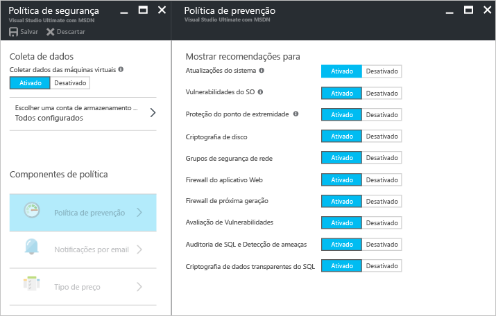
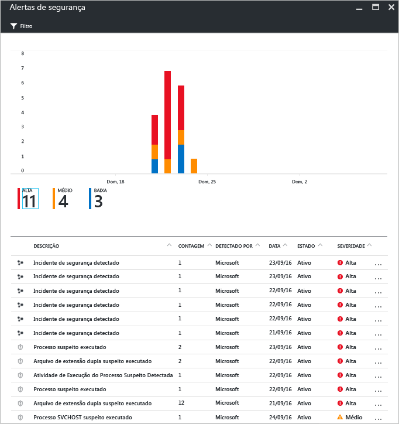
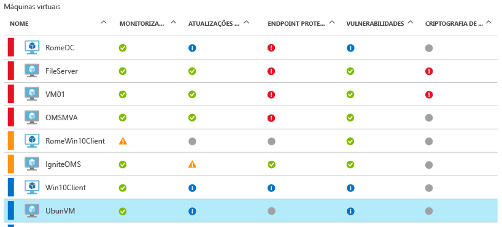
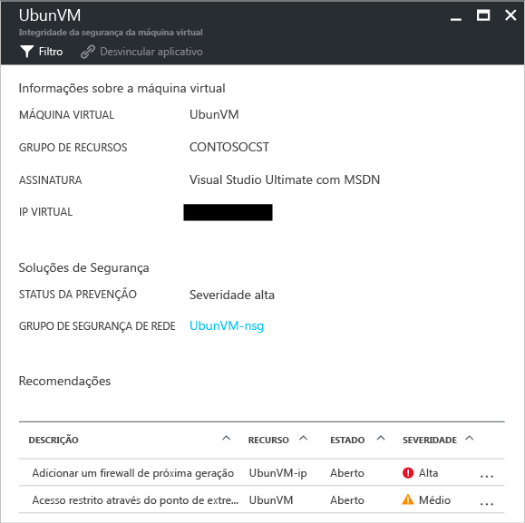

# Central de Segurança do Azure e Máquinas Virtuais do Azure com Linux
A [Central de Segurança do Azure](https://azure.microsoft.com/services/security-center/) ajuda você a evitar, detectar e responder a ameaças. Ela permite o gerenciamento de políticas e o monitoramento da segurança integrada entre suas assinaturas do Azure, ajuda a detectar ameaças que poderiam passar despercebidas e funciona com uma enorme variedade de soluções de segurança.

Este artigo mostra como a Central de Segurança pode ajudá-lo a proteger suas VMs (Máquinas Virtuais) do Azure executando o sistema operacional Linux.

## Por que usar a Central de Segurança?
A Central de Segurança ajuda a proteger os dados de máquinas virtuais no Azure, fornecendo visibilidade para configurações de segurança da máquina virtual e monitoramento de ameaças. A Central de Segurança pode monitorar as máquinas virtuais para: 

* Configurações de segurança do SO (Sistema Operacional) com as regras de configuração recomendadas
* Segurança do sistema e atualizações críticas que estão ausentes
* Recomendações de proteção de ponto de extremidade
* Validação de criptografia de disco
* Ataques baseados em rede (disponível apenas na [versão padrão](https://azure.microsoft.com/pricing/details/security-center/))

Além de ajudar a proteger suas VMs do Azure, a Central de Segurança também fornece monitoramento de segurança e gerenciamento de serviços de nuvem, serviços de aplicativos, redes virtuais e muito mais. 

> [!NOTE]
> Confira [Introdução à Central de Segurança do Azure](security-center-intro.md) para saber mais sobre a Central de Segurança do Azure.
> 
> 

## Pré-requisitos
Para começar a usar a Central de Segurança do Azure, você precisará conhecer e considerar o seguinte:

* Você deve ter uma assinatura do Microsoft Azure. Confira [Preços da Central de Segurança](https://azure.microsoft.com/pricing/details/security-center/) para obter mais informações sobre as camadas gratuitas e padrão da Central de Segurança.
* Planeje a adoção da Central de Segurança. Confira [Guia de planejamento e operações da Central de Segurança do Azure](security-center-planning-and-operations-guide.md) para saber mais sobre as considerações de planejamento e operações.
* Para obter informações sobre suporte do sistema operacional, confira [FAQ (Perguntas Frequentes) sobre a Central de Segurança do Azure](security-center-faq.md). 

## Definir políticas de segurança
A coleta de dados precisa ser habilitada para que a Central de Segurança do Azure possa coletar as informações necessárias para fornecer recomendações e alertas gerados com base na política de segurança que você configurar. Na figura abaixo, você pode ver que a **Coleta de Dados** foi **ativada**.

Uma política de segurança define o conjunto de controles que são recomendados para os recursos na assinatura ou grupo de recursos especificado. Antes de habilitar a política de segurança, você deve habilitar a coleta de dados. A Central de Segurança coleta dados de suas máquinas virtuais para avaliar o estado da segurança, fornecer recomendações de segurança e alertá-lo de ameaças. Na Central de Segurança, você define as políticas para o grupo de recursos ou as assinaturas do Azure de acordo com as necessidades de segurança de sua empresa e os tipos de aplicativos ou a confidencialidade dos dados de cada assinatura. 

> [!NOTE]
> Para saber mais sobre cada **Política de prevenção** disponível, confira o artigo [Definir políticas de segurança](tutorial-security-policy.md).
> 

## Gerenciar recomendações de segurança
A Central de Segurança analisa o estado de segurança de seus recursos do Azure. Quando a Central de Segurança identifica possíveis vulnerabilidades de segurança, cria recomendações. As recomendações o orientam ao longo do processo de configuração dos controles necessários.

Depois de definir uma política de segurança, a Central de Segurança analisa o estado de segurança de seus recursos para identificar possíveis vulnerabilidades. As recomendações são mostradas em um formato de tabela, em que cada linha representa uma recomendação específica. A tabela a seguir fornece alguns exemplos de recomendações para VMs do Azure executando o sistema operacional Linux e o que cada uma delas fará se você a aplicar. Ao selecionar uma recomendação, você receberá informações que mostram como implementar a recomendação na Central de Segurança.

| Recomendações | DESCRIÇÃO |
| --- | --- |
| [Habilitar coleta de dados para assinaturas](security-center-enable-data-collection.md) |Recomenda que você ative a coleta de dados na política de segurança para cada uma de suas assinaturas e todas as VMs (máquinas virtuais) em suas assinaturas. |
| [Corrigir as vulnerabilidades do sistema operacional](security-center-remediate-os-vulnerabilities.md) |Recomenda que você alinhe as configurações do sistema operacional com as regras de configuração recomendadas, por exemplo, não permitir o armazenamento de senhas. |
| [Aplicar atualizações do sistema](security-center-apply-system-updates.md) |Recomenda que você implante a atualizações críticas e de segurança do sistema ausentes para VMs. |
| [Reinicializar após as atualizações do sistema](security-center-apply-system-updates.md#reboot-after-system-updates) |Recomenda que você reinicialize uma VM para concluir o processo de aplicação de atualizações de sistema. |
| [Habilitar o Agente de VM](security-center-enable-vm-agent.md) |Permite que você veja quais máquinas virtuais exigem o Agente de VM. O Agente de VM deve ser instalado em VMs para provisionar verificação de linha de base, verificação de patch e programas antimalware. O agente de VM está instalado por padrão nas VMs implantadas do Azure Marketplace. O artigo [Agente de VM e extensões – parte 2](https://azure.microsoft.com/blog/2014/04/15/vm-agent-and-extensions-part-2/) fornece informações sobre como instalar o Agente de VM. |
| [Aplicar a criptografia de disco](security-center-apply-disk-encryption.md) |Recomenda de que você criptografe os discos de VM usando o Azure Disk Encryption (VMs do Windows e do Linux). A criptografia é recomendada para volumes de dados e do sistema operacional em sua VM. |

> [!NOTE]
> Para saber mais sobre recomendações, confira o artigo [Gerenciar recomendações de segurança](security-center-recommendations.md).
> 

## Monitorar integridade da segurança
Depois de habilitar as [políticas de segurança](tutorial-security-policy.md) para os recursos de uma assinatura, a Central de Segurança analisará a segurança de seus recursos para identificar as possíveis vulnerabilidades.  Você pode exibir o estado de segurança de seus recursos com os problemas na folha **Integridade da segurança do recurso** . Quando você clicar em **Máquinas virtuais** no bloco de integridade **Segurança de recursos**, a folha **Máquinas virtuais** será aberta com recomendações para suas VMs. 

## Gerenciar e responder aos alertas de segurança
A Central de Segurança coleta, analisa e integra automaticamente os dados de registro de seus recursos do Azure, da rede e das soluções de parceiros conectados, como firewall e soluções de proteção de ponto de extremidade, a fim de detectar ameaças reais e reduzir os falsos positivos. Utilizando uma agregação diversificada de [recursos de detecção](security-center-detection-capabilities.md), a Central de Segurança é capaz de gerar alertas de segurança priorizados para ajudá-lo a investigar rapidamente o problema e fornecer recomendações para remediar possíveis ataques.

Selecione um alerta de segurança para saber mais sobre o evento que disparou o alerta e, se houver, as etapas necessárias para corrigir um ataque. Os alertas de segurança são agrupados por [tipo](security-center-alerts-type.md) e data.

## Monitorar integridade da segurança
Depois de habilitar as [políticas de segurança](tutorial-security-policy.md) para os recursos de uma assinatura, a Central de Segurança analisará a segurança de seus recursos para identificar as possíveis vulnerabilidades.  Você pode exibir o estado de segurança de seus recursos com os problemas na folha **Integridade da segurança do recurso** . Quando você clicar em **Máquinas virtuais** no bloco de integridade **Segurança de recursos**, a folha **Máquinas virtuais** será aberta com recomendações para suas VMs. 

Se você clicar nesta recomendação, você verá mais detalhes sobre as ações específicas que devem ser tomadas para resolver esses problemas. Os detalhes serão exibidos na parte inferior da folha, em **Recomendações**. 

## Consulte também
Para saber mais sobre a Central de Segurança, confira o seguinte:

* [Configurando políticas de segurança na Central de Segurança do Azure](tutorial-security-policy.md) : saiba como configurar políticas de segurança para suas assinaturas e grupos de recursos do Azure.
* [Gerenciando e respondendo a alertas de segurança na Central de Segurança do Azure](security-center-managing-and-responding-alerts.md) : aprenda a gerenciar e a responder a alertas de segurança.
* [Perguntas frequentes da Central de Segurança do Azure](security-center-faq.md) : encontre as perguntas frequentes sobre como usar o serviço.

