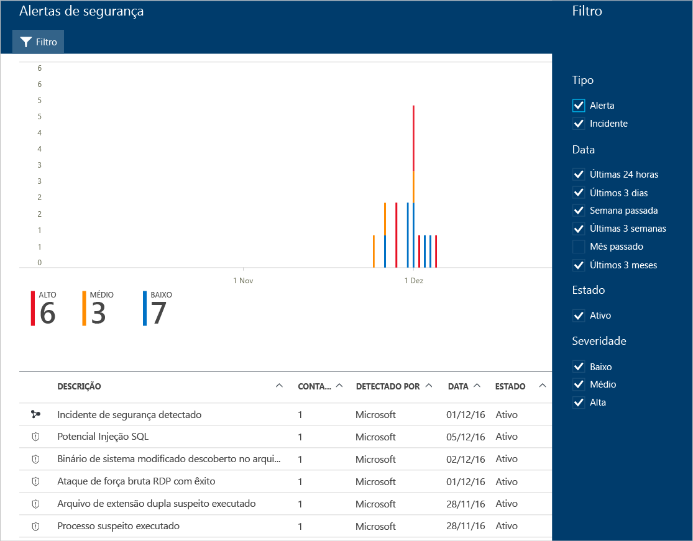

# Gerenciando e respondendo a alertas de segurança na Central de segurança do Azure
Este documento ajuda você a usar a Central de Segurança do Azure para gerenciar e responder a alertas de segurança.

> [!NOTE]
> Para habilitar as detecções avançadas, atualize para o Padrão da Central de Segurança do Azure. Há uma avaliação gratuita de 60 dias disponível. Para atualizar, selecione a Camada de Preços na [Política de Segurança](security-center-policies.md). Consulte [Preços da Central de Segurança do Azure](security-center-pricing.md) para saber mais.
>
>

## O que são alertas de segurança?
A Central de segurança coleta, analisa e integra automaticamente os dados de registro de seus recursos do Azure, da rede e das soluções de parceiros conectados, como firewall e soluções de proteção de ponto de extremidade, a fim de detectar ameaças reais e reduzir os falsos positivos. Uma lista priorizada de alertas de segurança é exibida na Central de Segurança, junto com as informações necessárias para investigar rapidamente o problema, e recomendações sobre como corrigir um ataque.

> [!NOTE]
> Para saber mais sobre como funciona os recursos de detecção da Central de Segurança, leia [Recursos de detecção da Central de Segurança do Azure](security-center-detection-capabilities.md).
>
>

## Configurando alertas de segurança
Você pode examinar os alertas atuais observando o bloco **Alertas de segurança** . Execute as etapas abaixo para ver mais detalhes sobre cada alerta:

1. No painel Central de Segurança, você vê o bloco **Alertas de segurança** .

    

2. Clique no bloco para os **Alertas de segurança** e ver mais detalhes sobre os alertas.

   

Na parte inferior dessa página estão os detalhes de cada alerta. Para classificar, clique na coluna com base na qual você deseja classificar. A definição de cada coluna é mostrada abaixo:

* **Descrição**: uma breve explicação sobre o alerta.
* **Contagem**: uma lista de todos os alertas desse tipo específico que foram detectados em um dia específico.
* **Detectado por**: o serviço responsável por disparar o alerta.
* **Data**: a data na qual o evento ocorreu.
* **Estado**: o estado atual desse alerta. Há dois tipos de estado:
  * **Ativo**: o alerta de segurança foi detectado.
* **Gravidade**: o nível de gravidade, que pode ser alta, média ou baixa.

### Filtragem de alertas
Você pode filtrar com base na data, no estado e na gravidade dos alertas. A filtragem de alertas pode ser útil para cenários em que é necessário restringir o escopo da exibição de alertas de segurança. Por exemplo, convém lidar com os alertas de segurança que ocorreram nas últimas 24 horas, pois você está investigando uma possível falha no sistema.

1. Clique em **Filtrar** em **Alertas de Segurança**. O **Filtro** é aberto e você seleciona os valores de data, estado e gravidade que deseja ver.

    

### Responder a alertas de segurança
Selecione um alerta de segurança para saber mais sobre o evento que disparou o alerta e, se houver, as etapas necessárias para corrigir um ataque. Os alertas de segurança são agrupados por tipo e data. Clicar em um alerta de segurança abre uma página que contém uma lista dos alertas agrupados.

Nesse caso, os alertas disparados referem-se à atividade suspeita do protocolo RDP (Protocolo de Área de Trabalho Remota). A primeira coluna mostra quais recursos foram atacados; a segunda mostra quantas vezes o recurso foi atacado; a terceira mostra o horário do ataque; a quarta mostra o estado do alerta e a quarta mostra gravidade do ataque. Depois de revisar essas informações, clique no recurso que foi atacado.

No campo **Descrição**, você encontrará mais detalhes sobre esse evento. Esses detalhes adicionais oferecem informações sobre o que disparou o alerta de segurança, o recurso de destino e, quando aplicável, o endereço IP de origem e as recomendações sobre como corrigir.  Em alguns casos, o endereço IP de origem ficará vazio (não disponível) porque nem todos os logs de eventos de segurança do Windows incluem o endereço IP.

A correção sugerida pela Central de Segurança varia de acordo com o alerta de segurança. Em alguns casos, talvez seja necessário usar outros recursos do Azure para implementar a correção recomendada. Por exemplo, a correção para esse ataque é colocar o endereço IP que está gerando esse ataque em uma lista de contatos bloqueados usando uma [ACL de rede](../virtual-network/virtual-networks-acl.md) ou uma regra de [grupo de segurança de rede](../virtual-network/virtual-networks-nsg.md). Para saber mais sobre os tipos diferentes de alertas, leia [Alertas de segurança por tipo na Central de segurança do Azure](security-center-alerts-type.md).

> [!NOTE]
> A Central de Segurança foi lançada para visualização limitada de um novo conjunto de detecções que aproveitam os registros de auditoria, uma estrutura de auditoria comum, para detectar comportamentos mal-intencionados em máquinas Linux. Envie-[nos](mailto:ASC_linuxdetections@microsoft.com) um email com suas IDs de assinatura para ingressar na versão prévia.

## Consulte também
Neste documento, você aprendeu a configurar políticas de segurança na Central de Segurança. Para saber mais sobre a Central de Segurança, confira o seguinte:

* [Manipulação de incidente de segurança na Central de Segurança do Azure](security-center-incident.md)
* [Recursos de detecção da Central de Segurança do Azure](security-center-detection-capabilities.md)
* [Guia de planejamento e operações da Central de Segurança do Azure](security-center-planning-and-operations-guide.md)
* [Perguntas frequentes sobre a Central de Segurança do Azure](security-center-faq.md) – encontre as perguntas frequentes sobre como usar o serviço de localização.
* [Blog de Segurança do Azure](http://blogs.msdn.com/b/azuresecurity/) : encontre postagens no blog sobre conformidade e segurança do Azure.
