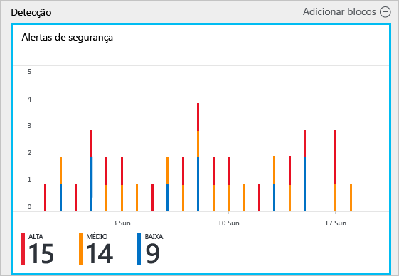
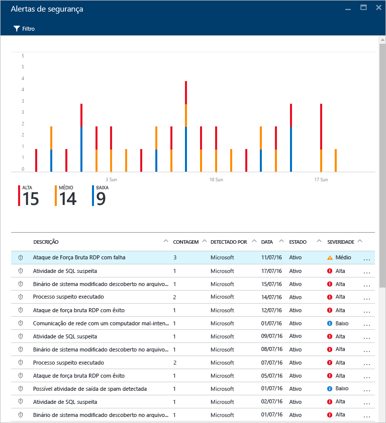
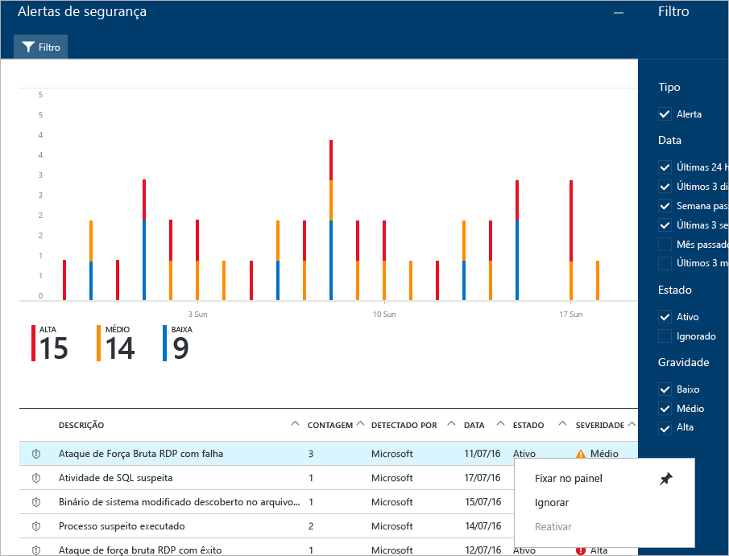
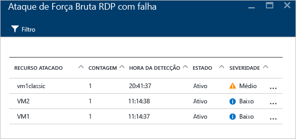
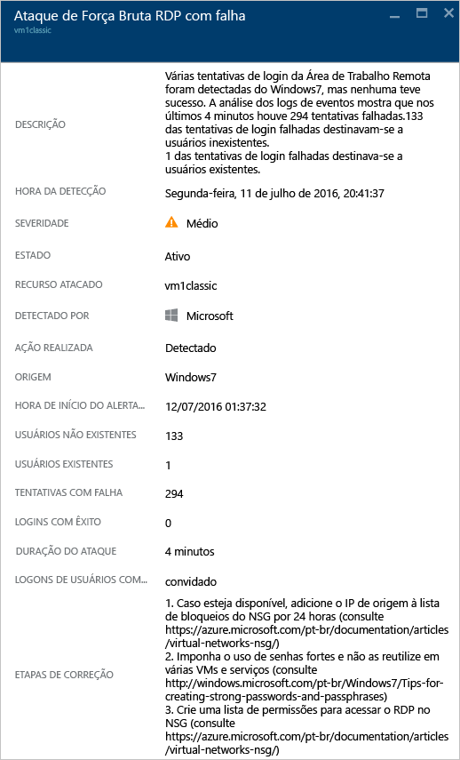
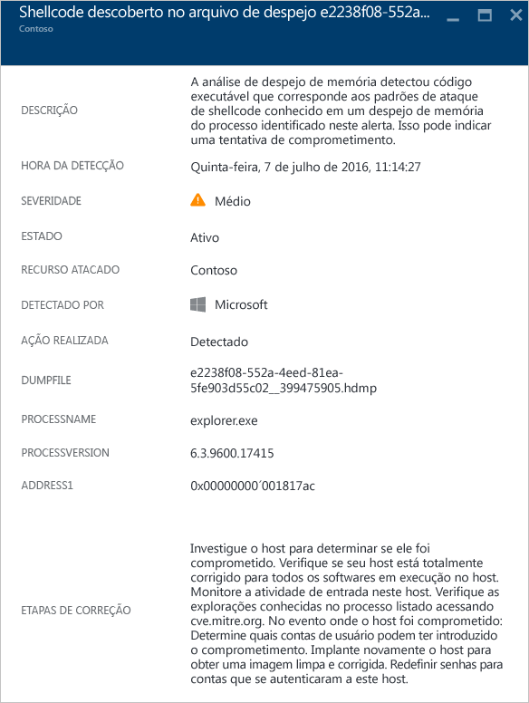
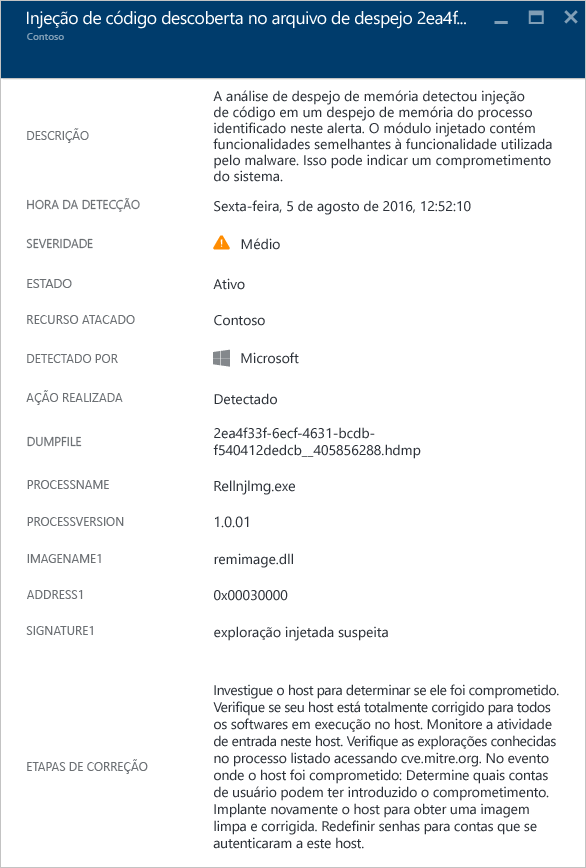
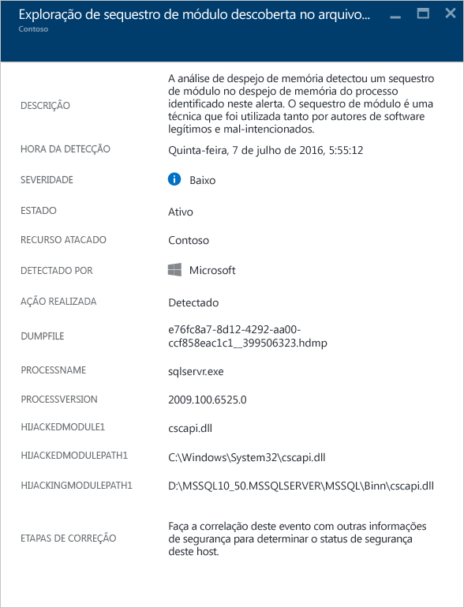
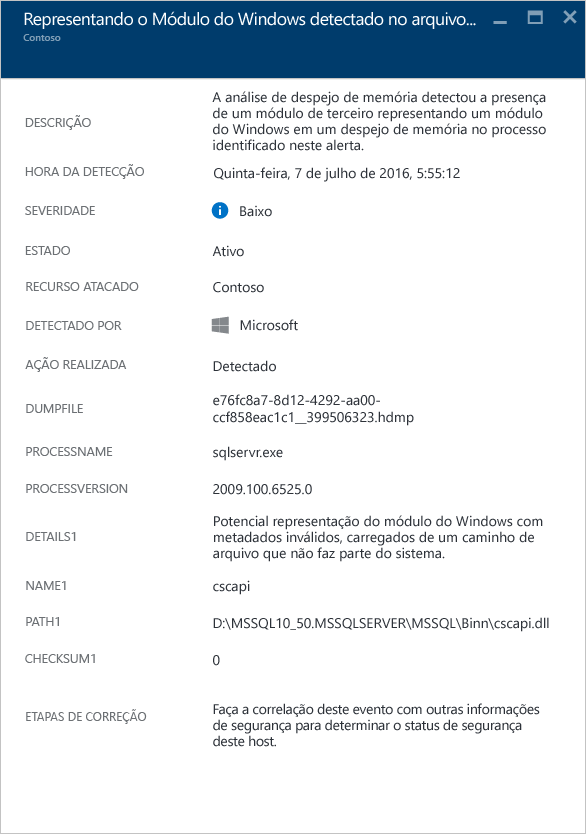
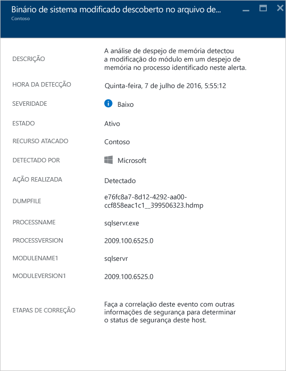

<properties
   pageTitle="Gerenciando e respondendo a alertas de segurança na Central de segurança do Azure | Microsoft Azure"
   description="Este documento ajuda você a usar recursos da Central de segurança do Azure para gerenciar e responder a alertas de segurança."
   services="security-center"
   documentationCenter="na"
   authors="YuriDio"
   manager="swadhwa"
   editor=""/>

<tags
   ms.service="security-center"
   ms.topic="hero-article"
   ms.devlang="na"
   ms.tgt_pltfrm="na"
   ms.workload="na"
   ms.date="08/26/2016"
   ms.author="yurid"/>

# Gerenciando e respondendo a alertas de segurança na Central de segurança do Azure
Este documento ajuda você a usar a Central de Segurança do Azure para gerenciar e responder a alertas de segurança.

> [AZURE.NOTE] Para habilitar as detecções avançadas, atualize para o Padrão da Central de Segurança do Azure. Há uma avaliação gratuita de 90 dias disponível. Para atualizar, selecione a Camada de Preços na [Política de Segurança](security-center-policies.md). Consulte a [página de preços](https://azure.microsoft.com/pricing/details/security-center/) para saber mais.

## O que são alertas de segurança?
A Central de segurança coleta, analisa e integra automaticamente os dados de registro de seus recursos do Azure, da rede e das soluções de parceiros conectados, como firewall e soluções de proteção de ponto de extremidade, a fim de detectar ameaças reais e reduzir os falsos positivos. Uma lista priorizada de alertas de segurança é exibida na Central de Segurança, junto com as informações necessárias para investigar rapidamente o problema, e recomendações sobre como corrigir um ataque. A Central de Segurança do Azure também agrega alertas que se alinham para eliminar os padrões em cadeia como [Incidentes](security-center-incident.md).

> [AZURE.NOTE] Para saber mais sobre como funciona os recursos de detecção da Central de Segurança, leia [Recursos de detecção da Central de Segurança do Azure](security-center-detection-capabilities.md).

## Configurando alertas de segurança

Você pode examinar os alertas atuais observando o bloco **Alertas de segurança**. Abra o Portal do Azure e siga as etapas abaixo para ver mais detalhes sobre cada alerta:

1. No painel Central de Segurança, você verá o bloco **Alertas de segurança**.

    

2.  Clique no bloco para abrir a folha **Alertas de segurança**, que contém mais detalhes sobre os alertas, conforme mostrado abaixo.

    

Na parte inferior dessa folha estão os detalhes de cada alerta. Para classificar, clique na coluna com base na qual você deseja classificar. A definição de cada coluna é mostrada abaixo:

- **Alerta**: uma breve explicação sobre o alerta.
- **Contagem**: uma lista de todos os alertas desse tipo específico que foram detectados em um dia específico.
- **Detectado por**: o serviço responsável por disparar o alerta.
- **Data**: a data na qual o evento ocorreu.
- **Estado**: o estado atual desse alerta. Há dois tipos de estado:
    - **Ativo**: o alerta de segurança foi detectado.
    - **Descartado**: o alerta de segurança foi fechado pelo usuário. Esse status costuma ser usado para alertas que foram investigados, mas que foram atenuados ou considerados como não sendo ataques reais

- **Gravidade**: o nível de gravidade, que pode ser alta, média ou baixa.

### Filtragem de alertas

Você pode filtrar com base na data, no estado e na gravidade dos alertas. A filtragem de alertas pode ser útil para cenários em que é necessário restringir o escopo da exibição de alertas de segurança. Por exemplo, convém lidar com os alertas de segurança que ocorreram nas últimas 24 horas, pois você está investigando uma possível falha no sistema.

1. Clique em **Filtrar** na folha **Alertas de Segurança**. A folha **Filtrar** é aberta e você seleciona os valores de data, estado e gravidade que deseja ver.

	

2. 	Após investigar um alerta de segurança, você pode achar que ele é um falso positivo para seu ambiente ou indica um comportamento esperado para determinado recurso. Seja qual for o caso, se determinar que um alerta de segurança não é aplicável, você poderá ignorá-lo e, em seguida, filtrá-lo da exibição. Há duas maneiras de ignorar um alerta de segurança. Clique com o botão direito do mouse em um alerta e selecione **Ignorar** ou passe o mouse sobre um item, clique nos três pontos que aparecem à direita e selecione **Ignorar**. Você pode exibir os alertas de segurança ignorados clicando em **Filtrar** e selecionando **Ignorados**.

	

### Responder a alertas de segurança

Selecione um alerta de segurança para saber mais sobre o evento que disparou o alerta e, se houver, as etapas necessárias para corrigir um ataque. Os alertas de segurança são agrupados por tipo e data. Um alerta de segurança permite abrir uma folha que contém uma lista dos alertas agrupados.

Nesse caso, os alertas disparados referem-se à atividade suspeita do protocolo RDP (Protocolo de Área de Trabalho Remota). A primeira coluna mostra quais recursos foram atacados; a segunda mostra quantas vezes o recurso foi atacado; a terceira mostra o horário do ataque; a quarta mostra o estado do alerta e a quarta mostra gravidade do ataque. Depois de revisar essas informações, clique no recurso que foi atacado e uma nova folha será aberta.

No campo **Descrição** dessa folha, você encontrará mais detalhes sobre esse evento. Esses detalhes adicionais oferecem informações sobre o que disparou o alerta de segurança, o recurso de destino e, quando aplicável, o endereço IP de origem e as recomendações sobre como corrigir. Em alguns casos, o endereço IP de origem ficará vazio (não disponível) porque nem todos os logs de eventos de segurança do Windows incluem o endereço IP.

> [AZURE.NOTE] A correção sugerida pela Central de Segurança varia de acordo com o alerta de segurança. Em alguns casos, talvez seja necessário usar outros recursos do Azure para implementar a correção recomendada. Por exemplo, a correção para esse ataque é colocar o endereço IP que está gerando esse ataque em uma lista de contatos bloqueados usando uma[ACL de rede](../virtual-network/virtual-networks-acl.md) ou uma regra de [grupo de segurança de rede](../virtual-network/virtual-networks-nsg.md).

## Alertas de segurança por tipo
As mesmas etapas que foram usadas para acessar o alerta de atividade suspeita RDP podem ser usadas para acessar outros tipos de alertas. Veja alguns exemplos de alertas que você pode ver nos alertas da Central de Segurança:

### Potencial injeção de SQL
A injeção de SQL é um ataque em que o código mal-intencionado é inserido em cadeias de caracteres, passadas posteriormente para uma instância do SQL Server para análise e execução. Qualquer procedimento que construa instruções SQL deve ser revisado em busca de vulnerabilidades de injeção, pois o SQL Server executará todas as consultas sintaticamente válidas que receber.

Esse alerta fornece informações que permitem a identificação do recurso atacado, o tempo de detecção, o estado do ataque e também fornece um link para outras etapas de investigação.

### Tráfego de saída suspeito detectado

Os dispositivos de rede podem ser descobertos e analisados da mesma forma que outros tipos de sistemas. Os invasores normalmente começam com verificação de porta/varredura de porta. No exemplo a seguir, há um tráfego suspeito de SSH de uma VM, que pode estar executando um ataque de força bruta SSH ou de varredura de porta contra um recurso externo.

Esse alerta fornece informações que permitem a identificação do recurso usado para iniciar esse ataque, a máquina comprometida, o tempo de detecção, o protocolo e a porta usada. Essa folha também fornece uma lista de etapas de correção que podem ser usadas para atenuar esse problema.

### Comunicação de rede com uma máquina mal-intencionada
 
Aproveitando os feeds de inteligência de ameaças da Microsoft, a Central de Segurança do Azure pode detectar máquinas comprometidas que estão se comunicando com endereços IP mal-intencionados, em muitos casos, um centro de comando e controle. Nesse caso, a Central de Segurança do Azure detectou que a comunicação foi feita usando o malware Pony Loader (também conhecido como [Fareit](https://www.microsoft.com/security/portal/threat/encyclopedia/entry.aspx?Name=PWS:Win32/Fareit.AF)).

Esse alerta fornece informações que permitem a identificação do recurso usado para iniciar esse ataque, o recurso atacado, o IP da vítima, o IP do invasor e o tempo de detecção.

> [AZURE.NOTE] Endereços IP ativos foram removidos nesta captura de tela por fins de privacidade.

### Shellcode descoberto 

Shellcode é a carga executada depois que o malware explorou uma vulnerabilidade do software. Esse alerta indica que a análise do despejo de memória detectou código executável com comportamento normalmente executado por cargas mal-intencionadas. Embora software que não seja mal-intencionado possa executar esse comportamento, não é comum às práticas de desenvolvimento de software normal.

Os campos abaixo são comuns a todos os alertas de despejo de memória:

- DUMPFILE: nome do arquivo de despejo
- PROCESSNAME: nome do processo de falha
- PROCESSVERSION: versão do processo de falha

Esse alerta fornece o seguinte campo adicional:

- ADDRESS: o local do shellcode na memória

Eis um exemplo desse tipo de alerta:

### Injeção de código descoberta

Injeção de código é a inserção de módulos executáveis em processos ou threads em execução. Essa técnica é usada por malware para acessar dados, ocultar ou impedir sua remoção (por exemplo, persistência). O alerta indica que a análise de despejo de memória detectou um módulo injetado com o despejo de memória.
 
Desenvolvedores de software legítimos executam ocasionalmente injeção de código por motivos lícitos, por exemplo, para modificar ou estender um aplicativo ou um componente do sistema operacional existente. Para ajudar a diferenciar entre módulos injetados mal-intencionados e bem-intencionados, a Central de Segurança do Azure verifica se o módulo injetado se encaixa em um perfil de comportamento suspeito. O resultado dessa verificação é indicado pelo campo "ASSINATURA" do alerta e refletido na gravidade, na descrição e nas etapas de solução do alerta.

Além dos campos comuns descritos na seção "Shellcode descoberto" acima, o alerta fornece os seguintes campos adicionais:

- ADDRESS: o local do módulo injetado na memória
- IMAGENAME: o nome do módulo injetado. Observe que isso poderá estar em branco se não for fornecido o nome da imagem dentro da imagem.
- SIGNATURE: indica se o módulo injetado se encaixa em um perfil de comportamento suspeito. A tabela abaixo mostra exemplos de resultados e suas descrições:

| **Valor de assinatura** | **Descrição** |
|--------------------------------------|-------------------------------------------------------------------------------------------------------------------|
| Exploração de carregador reflexivo suspeito | Esse comportamento suspeito geralmente se correlaciona com o carregamento de código injetado independentemente do carregador do sistema operacional |
| Exploração injetada suspeita | Indica uma má intenção que geralmente se correlaciona com a injeção de código na memória |
| Exploração de injeção suspeita | Indica uma má intenção que normalmente se correlaciona com o uso de código injetado na memória |
| Exploração de depurador injetado suspeito | Indica uma má intenção que muitas vezes se correlaciona com a detecção ou o contorno de um depurador |
| Exploração remota injetada suspeita | Indica uma má intenção que normalmente se correlaciona com cenários de controle de comando n (C2) |

Eis um exemplo desse tipo de alerta:

### Descoberta de sequestro de módulo

O Windows se baseia em DLLs (bibliotecas de vínculo dinâmico) para permitir que o software use funcionalidades comuns de sistema do Windows. O sequestro de DLL ocorre quando o malware altera a ordem de carregamento de DLL para carregar cargas maliciosas na memória, onde o código arbitrário pode ser executado. O alerta indica que a análise de despejo de memória detectou um módulo de nome semelhante carregado de dois caminhos diferentes, e que um dos caminhos carregados vem de um local de binários de sistema comum do Windows.

Os desenvolvedores de software legítimos ocasionalmente alteram a ordem de carregamento de DLL por motivos lícitos, por exemplo, para instrumentação, extensão do sistema operacional Windows ou de aplicativos do Windows. Para ajudar a diferenciar as alterações mal-intencionadas das bem-intencionadas na ordem de carregamento de DLL, a Central de Segurança do Azure verifica se um módulo carregado se encaixa em um perfil suspeito. O resultado dessa verificação é indicado pelo campo "ASSINATURA" do alerta e refletido na gravidade, na descrição e nas etapas de solução do alerta. A análise da cópia em disco no módulo de sequestro, como a verificação da assinatura digital dos arquivos ou a execução de uma verificação antivírus, pode fornecer mais informações sobre a natureza legítima ou mal-intencionada desse módulo.

Além dos campos comuns descritos na seção "Código descobertos" acima, esse alerta fornece os seguintes campos:

- SIGNATURE: indica se o módulo de sequestro se encaixa em um perfil de comportamento suspeito
- HIJACKEDMODULE: o nome do módulo do sistema Windows sequestrado
- HIJACKEDMODULEPATH: caminho do módulo do sistema Windows sequestrado
- HIJACKINGMODULEPATH: o caminho do módulo de sequestro

Eis um exemplo desse tipo de alerta:

### Módulo do Windows simulado detectado

Malware pode usar nomes comuns de binários (por exemplo, SVCHOST.EXE) ou módulos (por exemplo, NTDLL. DLL) do sistema Windows para "se misturar" e ocultar a natureza de software mal-intencionado dos administradores de sistema. O alerta indica que a análise de despejo de memória detectou que o arquivo de despejo de memória contém módulos que usam nomes de módulo do sistema Windows, mas não atendem a outros critérios típicos de módulos do Windows. A análise da cópia em disco do módulo simulado pode fornecer mais informações sobre a natureza legítima e mal-intencionada do módulo. A análise pode incluir:

- A confirmação de que o arquivo em questão é enviado como parte de um pacote de software legítimo
- A verificação da assinatura digital do arquivo
- A execução de uma varredura antivírus no arquivo

Além dos campos comuns descritos na seção "Shellcode descoberto" acima, o alerta fornece os seguintes campos adicionais:

- DETAILS: descreve se os metadados dos módulos são válidos e se o módulo foi carregado de um caminho do sistema.
- NAME: o nome do módulo do Windows simulado
- PATH: o caminho do módulo do Windows simulado.

Esse alerta também extrai e exibe determinados campos do cabeçalho do módulo, como "CHECKSUM" e "TIMESTAMP". Esses campos serão exibidos somente se os campos estiverem presentes no módulo. Confira a [Especificação Microsoft PE e COFF](https://msdn.microsoft.com/windows/hardware/gg463119.aspx) para obter detalhes sobre esses campos.

Eis um exemplo desse tipo de alerta:

### Binário do sistema modificado descoberto 

Malware pode modificar os principais binários do sistema para acessar dados secretamente ou persistir furtivamente em um sistema comprometido. O alerta indica que a análise de despejo de memória detectou binários principais do sistema operacional Windows que foram modificados na memória ou no disco.

Os desenvolvedores de software legítimos ocasionalmente modificam módulos do sistema na memória por motivos lícitos, por exemplo, para desvios ou para compatibilidade de aplicativos. Para ajudar a diferenciar módulos bem-intencionadas de mal-intencionados, a Central de Segurança do Azure verifica se um módulo alterado se encaixa em um perfil suspeito. O resultado dessa verificação é indicado pela severidade, pela descrição e pelas etapas de solução do alerta.

Além dos campos comuns descritos na seção "Shellcode descoberto" acima, o alerta fornece os seguintes campos adicionais:

- MODULENAME: nome do binário do sistema modificado
- MODULEVERSION: versão do binário do sistema modificado

Eis um exemplo desse tipo de alerta:

## Consulte também

Neste documento, você aprendeu a configurar políticas de segurança na Central de Segurança. Para saber mais sobre a Central de Segurança, confira o seguinte:

- [Manipulação de incidente de segurança na Central de Segurança do Azure](security-center-incident.md)
- [Recursos de detecção da Central de Segurança do Azure](security-center-detection-capabilities.md)
- [Guia de planejamento e operações da Central de Segurança do Azure](security-center-planning-and-operations-guide.md)
- [Perguntas frequentes sobre a Central de Segurança do Azure](security-center-faq.md) – encontre as perguntas frequentes sobre como usar o serviço de localização.
- [Blog de segurança do Azure](http://blogs.msdn.com/b/azuresecurity/) – encontre postagens no blog sobre conformidade e segurança do Azure.

<!---HONumber=AcomDC_0831_2016-->