# Monitoramento de integridade de segurança na Central de segurança do Azure
Este artigo o ajuda a usar os recursos de monitoramento na Central de segurança do Azure para monitorar a conformidade com as políticas.

## O que é o monitoramento de integridade de segurança?
Costumamos pensar em monitoramento como assistir e esperar até que um evento ocorra para poder reagir à situação. Monitoramento de segurança refere-se a ter uma estratégia proativa que audita seus recursos para identificar sistemas que não atendem aos padrões organizacionais ou práticas recomendadas.

## Monitoramento de integridade da segurança
Depois de habilitar as [políticas de segurança](security-center-policies.md) para os recursos de uma assinatura, a Central de Segurança analisa a segurança de seus recursos para identificar as possíveis vulnerabilidades. Informações sobre a configuração de rede estão disponíveis imediatamente. Pode levar uma hora ou mais para que informações sobre a configuração de máquina virtual, como segurança de atualização de status e configuração do sistema operacional, se tornem disponíveis. Você pode exibir o estado de segurança de seus recursos com os problemas na folha **Integridade da Segurança do Recurso** . Você também pode exibir uma lista desses problemas na folha **Recomendações** .

Para obter mais informações sobre como aplicar recomendações, leia [Implementar as recomendações de segurança na Central de segurança do Azure](security-center-recommendations.md).

No bloco **Integridade da segurança do recurso**, você pode monitorar o estado de segurança de seus recursos. No exemplo a seguir, você pode ver que vários problemas têm severidade média e alta e exigem atenção. As políticas de segurança que são habilitadas terão impacto sobre os tipos de controles que são monitorados.

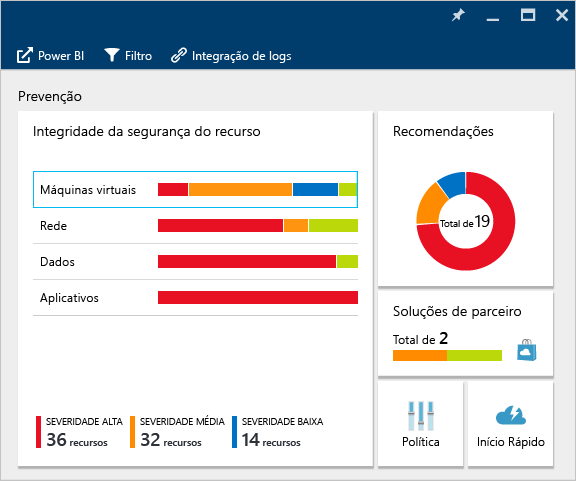

Se a Central de Segurança identificar uma vulnerabilidade que precisa ser resolvida, como uma máquina virtual sem atualizações de segurança ou uma sub-rede sem um [grupo de segurança de rede](../virtual-network/virtual-networks-nsg.md), ela será listada aqui.

### Monitorar máquinas virtuais
Quando você clica em **Máquinas virtuais** no bloco **Integridade da segurança de recursos**, a folha **Máquinas virtuais** é aberta com mais detalhes sobre integração, etapas de prevenção e uma lista de todas as máquinas virtuais que a Central de Segurança monitora, conforme mostrado na captura de tela a seguir.

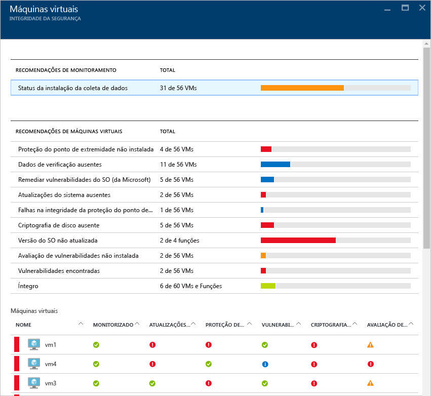

* Etapas para inclusão
* Recomendações de máquina virtual
* Máquinas virtuais

Em cada seção, você pode selecionar uma opção individual para ver mais detalhes sobre as etapas recomendadas para resolver esse problema. As seções a seguir explicarão essas áreas com mais detalhes.

#### Recomendações de monitoramento
Esta seção mostra o número total de máquinas virtuais que foram inicializadas para coleta de dados e seu status atual. Depois que todas as máquinas virtuais tiverem inicializado a coleta de dados, estarão prontas para receber as políticas de segurança da Central de Segurança. Quando você clicar nesta entrada, a folha **Status de instalação de coleta de dados** será aberta e você poderá ver os nomes das máquinas virtuais e o status atual da coleta de dados na coluna **STATUS DA INSTALAÇÃO**, conforme mostrado na captura de tela a seguir.

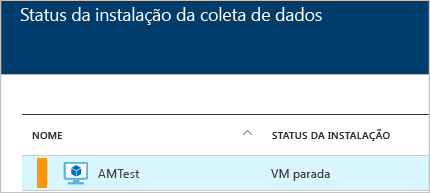

#### Recomendações de máquina virtual
Esta seção tem um conjunto de [recomendações para cada máquina virtual](security-center-virtual-machine-recommendations.md) que a Central de Segurança do Azure monitora. A primeira coluna lista a recomendação. A segunda coluna mostra o número total de máquinas virtuais que são afetadas por essa recomendação. A terceira coluna mostra a severidade do problema, conforme ilustrado na captura de tela a seguir.

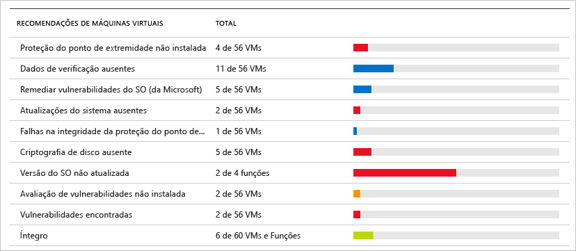

> [!NOTE]
> Somente as máquinas virtuais que têm pelo menos um ponto de extremidade público são mostradas na folha **Integridade de Rede** na lista **Topologia de rede**.
> 
> 

Cada recomendação tem um conjunto de ações que podem ser executadas depois que você clica nela. Por exemplo, se você clicar em **Atualizações de sistema ausentes**, a folha **Atualizações de sistema ausentes** será aberta. Ele lista as máquinas virtuais que estão sem patches e a gravidade da atualização ausente, conforme mostrado na captura de tela a seguir.

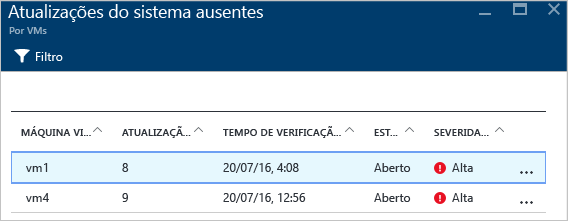

A folha **Atualizações de sistema ausentes** mostra uma tabela com as seguintes informações:

* **MÁQUINA VIRTUAL**: o nome da máquina virtual com atualizações ausentes.
* **ATUALIZAÇÕES DO SISTEMA**: o número de atualizações do sistema que estão ausentes.
* **HORA DA ÚLTIMA VERIFICAÇÃO**: a hora em que a Central de Segurança verificou pela última vez a máquina virtual para detectar atualizações.
* **ESTADO**: o estado atual da recomendação:
  * **Aberta**: a recomendação ainda não foi resolvida.
  * **Em Andamento**: a recomendação está sendo aplicada atualmente aos recursos, e não é necessário que você realize nenhuma ação.
  * **Resolvido**: a recomendação já foi concluída. (Quando o problema foi resolvido, a entrada será esmaecida).
* **GRAVIDADE**: descreve a gravidade dessa recomendação específica:
  * **Alta**: existe uma vulnerabilidade em um recurso significativo (aplicativo, máquina virtual ou grupo de segurança de rede) e ela requer atenção.
  * **Média**: são necessárias etapas adicionais ou não críticas para concluir um processo ou eliminar a vulnerabilidade.
  * **Baixa**: uma vulnerabilidade que deve ser abordada, mas não exige atenção imediata. (Por padrão, não são apresentadas recomendações baixas, mas você pode filtrar as recomendações baixas caso deseje exibi-las.)

Para exibir os detalhes de recomendação, clique no nome da máquina virtual. Uma nova folha para a máquina virtual é aberta com a lista de atualizações, conforme mostrado na captura de tela a seguir.

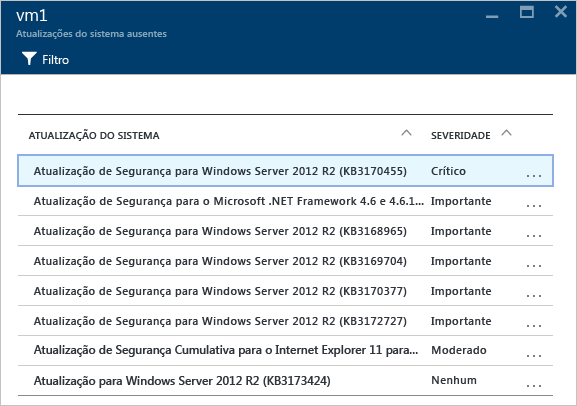

> [!NOTE]
> As recomendações de segurança são as mesmas na folha de **Recomendações**. Confira o artigo [Implementar recomendações de segurança na Central de Segurança do Azure](security-center-recommendations.md) para obter mais informações sobre como resolver as recomendações. Isso é aplicável não apenas a máquinas virtuais, mas também a todos os recursos que estão disponíveis no bloco **Integridade de Recursos**.
> 
> 

#### Seção Máquinas virtuais
A seção de máquinas virtuais fornece uma visão geral de todas as máquinas virtuais e recomendações. Cada coluna representa um conjunto de recomendações, conforme mostrado na seguinte captura de tela:

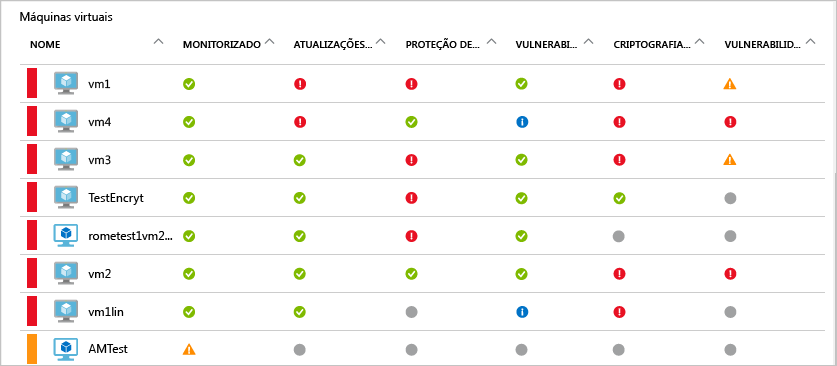

O ícone que aparece em cada recomendação o ajuda a identificar rapidamente as máquinas virtuais que precisam de atenção e o tipo de recomendação.

No exemplo anterior, uma máquina virtual tem uma recomendação crítica relacionada à proteção de ponto de extremidade. Para obter mais informações sobre a máquina virtual, clique nela. Será aberta uma nova folha que representa essa máquina virtual, conforme mostrado na captura de tela a seguir.

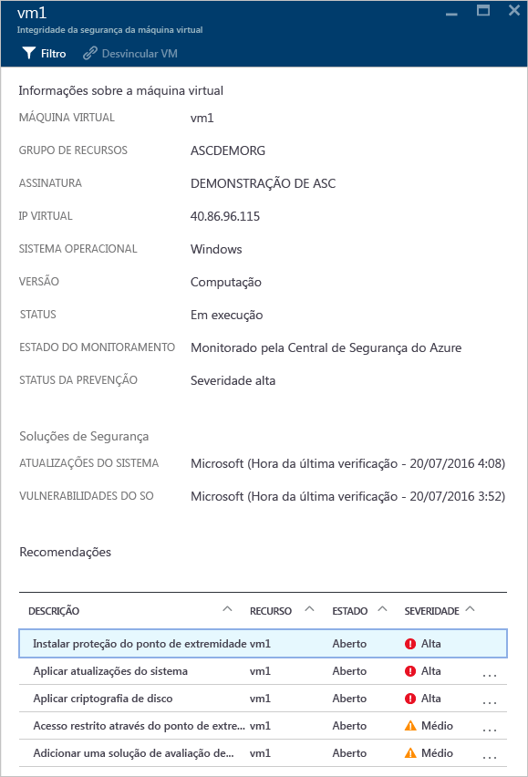

Esta folha tem os detalhes de segurança para a máquina virtual. Na parte inferior dessa folha, você pode ver a ação recomendada e a gravidade de cada problema.

#### Seção Serviços de nuvem (Visualização)
O status de integridade dos serviços de nuvem está incluído no bloco de **Integridade de Segurança** de máquinas virtuais. Uma recomendação é criada quando a versão do sistema operacional está desatualizada, conforme mostrado na seguinte captura de tela:

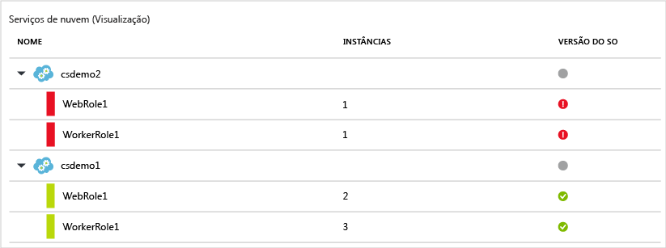

Você precisa seguir as etapas na recomendação para atualizar a versão do sistema operacional. Por exemplo, se você clicar no alerta vermelho nas linhas WebRole1 (executa o Windows Server com seu aplicativo Web automaticamente implantado no IIS) ou WorkerRole1 (executa o Windows Server com seu aplicativo Web automaticamente implantado no IIS), uma nova folha será aberta com mais detalhes sobre essa recomendação, conforme mostrado na seguinte captura de tela:

Para ver uma explicação mais detalhada sobre essa recomendação, clique em **Atualizar versão do sistema operacional** na coluna **DESCRIÇÃO**. A folha **Atualizar versão do sistema operacional (visualização)** é aberta com mais detalhes.

  

### Monitorar redes virtuais
Quando você clica em **Rede** no bloco **Integridade da segurança de recursos**, a folha **Rede** é aberta com mais detalhes, conforme mostrado na seguinte captura de tela:

#### Recomendações de rede
Assim como as informações de integridade de recursos de máquinas virtuais, essa folha fornece uma lista resumida dos problemas na parte superior da folha e uma lista de redes monitoradas na parte inferior.

A seção de divisão de status de rede lista os problemas de segurança potenciais e oferece [recomendações](security-center-network-recommendations.md). Os possíveis problemas podem incluir:

* Firewall da Próxima Geração (NGFW) não instalado
* Grupos de segurança da rede em sub-redes não habilitadas
* Grupos de segurança de rede em máquinas virtuais não habilitadas
* Restringir o acesso externo por meio do ponto de extremidade externo público
* Pontos de extremidade voltados para a Internet íntegra

Quando você clica em uma recomendação, uma nova folha é aberta com mais detalhes sobre a recomendação, conforme mostrado no exemplo a seguir.

Neste exemplo, a folha **Configurar grupos de segurança de rede ausentes para sub-redes** tem uma lista de sub-redes e máquinas virtuais que estão sem proteção do grupo de segurança de rede. Se você clicar na sub-rede à qual deseja aplicar o grupo de segurança de rede, outra folha será aberta.

Na folha **Escolher grupo de segurança da rede**, você pode selecionar o grupo de segurança da rede mais apropriado para a sub-rede ou pode criar um novo grupo de segurança da rede.

#### Seção dos pontos de extremidade voltados para a Internet
Na seção **Pontos de extremidade voltados para a Internet**, você pode ver as máquinas virtuais configuradas no momento com um ponto de extremidade voltado para a Internet e seu status atual.

Esta tabela tem o nome de ponto de extremidade que representa a máquina virtual, o endereço IP público da Internet e o status de severidade atual do grupo de segurança de rede e o NGFW. A tabela é classificada por severidade:

* Vermelho (no topo): alta prioridade e deve ser endereçado imediatamente
* Laranja: prioridade média e deve ser endereçado assim que possível
* Verde (último): estado íntegro

#### Seção de Topologia da rede
A seção **Topologia de rede** tem uma exibição hierárquica dos recursos, como mostrado na seguinte captura de tela:

Essa tabela é classificada (máquinas virtuais e sub-redes) por severidade:

* Vermelho (no topo): alta prioridade e deve ser endereçado imediatamente
* Laranja: prioridade média e deve ser endereçado assim que possível
* Verde (último): estado íntegro

Nessa exibição da topologia, o primeiro nível tem as [redes virtuai](../virtual-network/virtual-networks-overview.md), [gateways da rede virtual](../vpn-gateway/vpn-gateway-site-to-site-create.md) e [rede virtual (clássica)](../virtual-network/virtual-networks-create-vnet-classic-pportal.md). O segundo nível tem sub-redes, e o terceiro nível tem as máquinas virtuais que pertencem a essas sub-redes. A coluna da direita tem o status atual do grupo de segurança da rede para esses recursos, como mostrado neste exemplo:

A parte inferior da folha tem as recomendações para essa máquina virtual, que é semelhante ao que foi descrito anteriormente. Você pode clicar em uma recomendação para obter mais informações ou aplicar a configuração ou controle de segurança necessário.

### Dados de monitoramento
Quando você clica em **Dados** no bloco **Integridade de segurança dos recursos**, a folha **SQL** é aberta com recomendações para problemas como a não habilitação da auditoria e criptografia de dados transparente. Ela também contém [recomendações](security-center-sql-service-recommendations.md) para o estado de integridade geral do banco de dados.

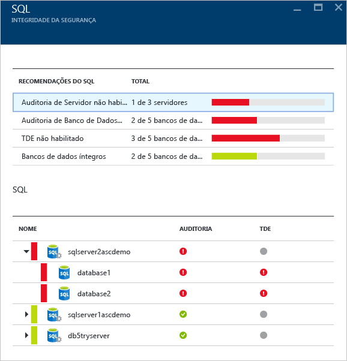

Você pode clicar em qualquer recomendação e obter mais detalhes sobre uma ação adicional para resolver um problema. O exemplo a seguir mostra a expansão da recomendação **Auditoria do Banco de Dados não habilitada** .

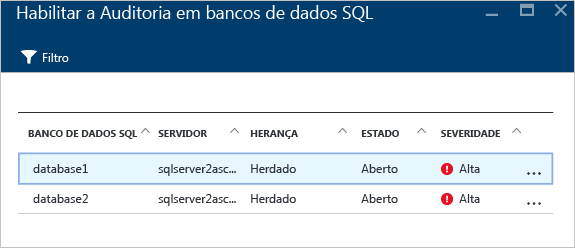

A folha **Habilitar Auditoria nos bancos de dados SQL** contém as seguintes informações:

* Uma lista de bancos de dados SQL
* O servidor no qual eles estão localizados
* Informações indicando se essa configuração foi herdada do servidor ou se é exclusiva do banco de dados
* O estado atual
* A gravidade do problema

Quando você clicar no banco de dados para lidar com essa recomendação, a folha **Auditoria e Detecção de Ameaças** será aberta, conforme mostrado na captura de tela a seguir.

Para habilitar a auditoria, selecione **ATIVADO** na opção **Auditoria**.

### Monitorar aplicativos
Se sua carga de trabalho do Azure tiver aplicativos localizados em [máquinas virtuais (criadas por meio do Azure Resource Manager)](../azure-resource-manager/resource-manager-deployment-model.md) com portas Web expostas (portas TCP 80 e 443), a Central de Segurança poderá monitorá-los para identificar os problemas de segurança em potencial e as etapas recomendáveis de correção. Quando você clicar no bloco **Aplicativos**, a folha **Aplicativos** será aberta com uma série de recomendações na seção **Recomendações do Aplicativo**. Ele também mostra a divisão de aplicativo por IP virtual/host, conforme mostrado na captura de tela a seguir.

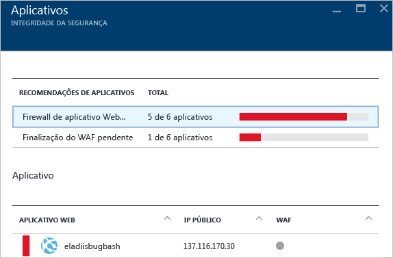

Como fez com as outras recomendações, você pode clicar em uma delas para ver mais detalhes sobre o problema e como corrigi-lo. O exemplo mostrado na figura a seguir é um aplicativo que foi identificado como aplicativo Web não seguro. Quando você selecionar o aplicativo que foi considerado não seguro, outra folha será aberta com a seguinte opção disponível:

Esta folha terá uma lista de todas as recomendações para este aplicativo. Quando você clica na recomendação **Adicionar um firewall de aplicativo Web**, a folha **Adicionar um Firewall de Aplicativo Web** é aberta com opções para instalar um WAF (firewall de aplicativo Web) de um parceiro, conforme mostrado na captura de tela a seguir.

## Consulte também
Neste artigo, você aprendeu como usar os recursos de monitoramento na Central de segurança do Azure. Para saber mais sobre a Central de Segurança do Azure, veja o seguinte:

* [Configurando políticas de segurança na Central de Segurança do Azure](security-center-policies.md): saiba como configurar políticas de segurança na Central de Segurança do Azure.
* [Gerenciando e respondendo aos alertas de segurança na Central de Segurança do Azure](security-center-managing-and-responding-alerts.md): aprenda a gerenciar e responder aos alertas de segurança.
* [Monitorando as soluções de parceiros com a Central de Segurança do Azure](security-center-partner-solutions.md): saiba como monitorar o status de integridade de suas soluções de parceiros.
* [Perguntas frequentes da Central de Segurança do Azure](security-center-faq.md): encontre as perguntas frequentes sobre como usar o serviço.
* [Blog de Segurança do Azure](http://blogs.msdn.com/b/azuresecurity/): encontre postagens no blog sobre conformidade e segurança do Azure.

<!--HONumber=Dec16_HO2-->

