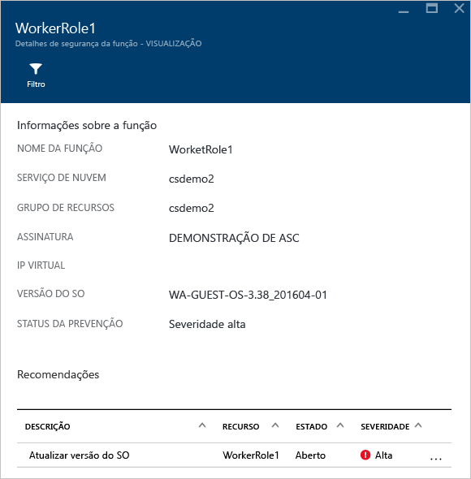
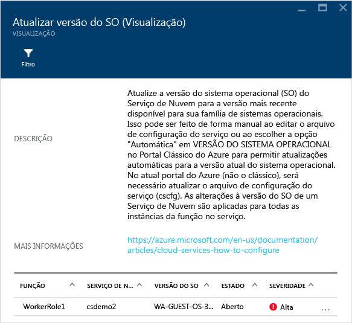
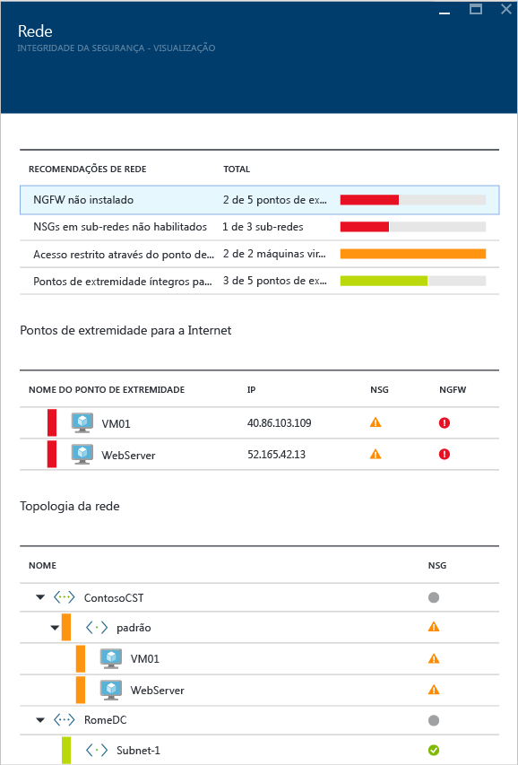
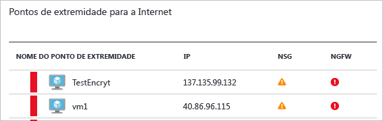
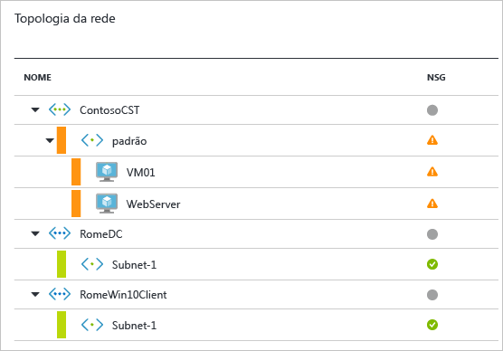
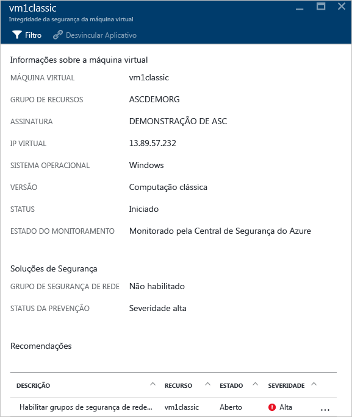
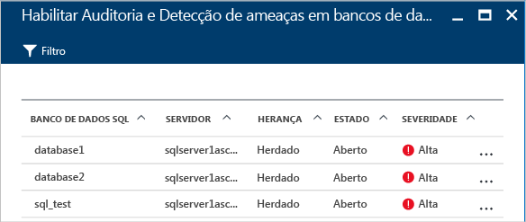
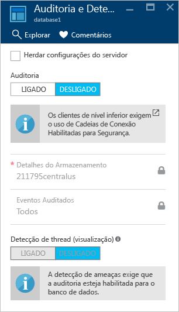
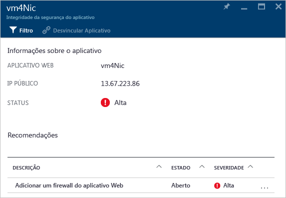
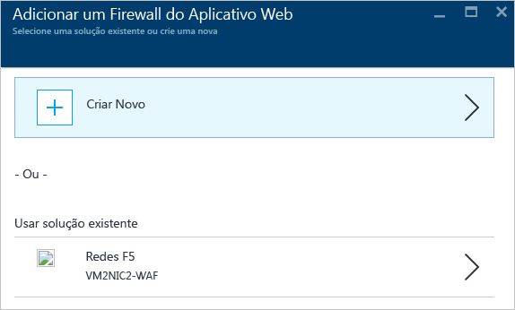

# Monitoramento de integridade de segurança na Central de segurança do Azure
Este artigo o ajuda a usar os recursos de monitoramento na Central de segurança do Azure para monitorar a conformidade com as políticas.

## O que é o monitoramento de integridade de segurança?
Costumamos pensar em monitoramento como assistir e esperar até que um evento ocorra para poder reagir à situação. Monitoramento de segurança refere-se a ter uma estratégia proativa que audita seus recursos para identificar sistemas que não atendem aos padrões organizacionais ou práticas recomendadas.

## Monitoramento de integridade da segurança
Depois de habilitar as [políticas de segurança](security-center-policies.md) para os recursos de uma assinatura, a Central de Segurança analisa a segurança de seus recursos para identificar as possíveis vulnerabilidades. Informações sobre a configuração de rede estão disponíveis imediatamente. Dependendo do número deVMs e computadores que tenham o agente instalado, pode levar uma hora ou mais para que a coleta de informações sobre VMs e configuração do computador, como o status das atualizações de segurança e a configuração do sistema operacional, se torne disponível. Você pode exibir o estado de segurança de seus recursos e quaisquer problemas na seção **Prevenção**. Você também pode exibir uma lista desses problemas no bloco **Recomendações** .

Para obter mais informações sobre como aplicar recomendações, leia [Implementar as recomendações de segurança na Central de segurança do Azure](security-center-recommendations.md).

Na seção **Prevenção**, você pode monitorar o estado de segurança dos seus recursos. No exemplo a seguir, você pode ver que no bloco de cada recurso (Computação, Rede, Armazenamento e dados, e Aplicativo) há o número total de problemas que foram identificados.

### Monitorar a computação
Ao clicar no bloco **Computação**, você verá três guias:

- **Visão Geral**: monitoramento e recomendações.
- **VMs e computadores**: lista de todas as máquinas virtuais, computadores e seu estado de segurança atual.
- **Serviços de Nuvem**: lista todas as funções da Web e de trabalho monitoradas pela Central de Segurança.

Há várias seções em cada guia e, em cada seção, você pode selecionar uma opção individual para ver mais detalhes sobre as etapas recomendadas e resolver esse problema específico.

#### Recomendações de monitoramento
Esta seção mostra o número total de máquinas virtuais e computadores que foram inicializados para provisionamento automático e seus status atuais. Quando você clicar nesta entrada, a seção **Problemas de integridade do agente de monitoramento** é aberta.

VMs e computadores em que a Central de Segurança não pode monitorar com êxito são listados. Selecione uma VM ou um computador para obter informações detalhadas. O **ESTADO DO MONITORAMENTO** define o problema.

#### Recomendações
Esta seção tem um conjunto de [recomendações para cada máquina virtual e computador](security-center-virtual-machine-recommendations.md) que a Central de Segurança do Azure monitora. A primeira coluna lista a recomendação. A segunda coluna mostra o número total de máquinas virtuais e computadores que são afetados por essa recomendação. A terceira coluna mostra a severidade do problema, conforme ilustrado na captura de tela abaixo:

> [!NOTE]
> Somente as máquinas virtuais que têm pelo menos um ponto de extremidade público são mostradas em **Integridade de Rede** na lista **Topologia de rede**.
>

Cada recomendação tem um conjunto de ações que podem ser executadas depois que você clica nela. Por exemplo, se você clicar em **Atualizações de sistema ausentes**, uma lista de máquinas virtuais e computadores com patches ausentes e a gravidade da atualização ausente será exibida, conforme mostrado na seguinte captura de tela:

As **Atualizações de sistema ausentes** têm um resumo de atualizações críticas em formato de grafo, um para Windows e outro para Linux. A segunda parte tem uma tabela com as seguintes informações:

* **NOME**: nome da atualização ausente.
* **NÃO. DE VMs E COMPUTADORES**: número total de máquinas virtuais e computadores que não têm essa atualização.
* **ESTADO**: o estado atual da recomendação:
  * **Aberta**: a recomendação ainda não foi resolvida.
  * **Em Andamento**: a recomendação está sendo aplicada atualmente aos recursos, e não é necessário que você realize nenhuma ação.
  * **Resolvido**: a recomendação já foi concluída. (Quando o problema foi resolvido, a entrada será esmaecida).
* **GRAVIDADE**: descreve a gravidade dessa recomendação específica:
  * **Alta**: existe uma vulnerabilidade em um recurso significativo (aplicativo, máquina virtual ou grupo de segurança de rede) e ela requer atenção.
  * **Média**: são necessárias etapas adicionais ou não críticas para concluir um processo ou eliminar a vulnerabilidade.
  * **Baixa**: uma vulnerabilidade que deve ser abordada, mas não exige atenção imediata. (Por padrão, não são apresentadas recomendações baixas, mas você pode filtrar as recomendações baixas caso deseje exibi-las.)

Para exibir os detalhes de recomendação, clique no nome da atualização ausente na lista.

> [!NOTE]
> As recomendações de segurança são as mesmas na opção de **Recomendações**. Confira o artigo [Implementar recomendações de segurança na Central de Segurança do Azure](security-center-recommendations.md) para obter mais informações sobre como resolver as recomendações. Isso é aplicável não apenas a máquinas virtuais e computadores, mas também a todos os recursos que estão disponíveis no bloco **Integridade de Recursos**.
>

#### Seção VMs e computadores
A seção de máquinas virtuais e computadores fornece uma visão geral de todas as máquinas virtuais e recomendações de computadores. Cada coluna representa um conjunto de recomendações, conforme mostrado na seguinte captura de tela:

Há quatro tipos de ícones representados, conforme explicado nesta lista:

 Computador não Azure.

 VM do Azure Resource Manager.

 VM clássica do Azure.

 VMs identificadas somente pelo espaço de trabalho que faz parte da assinatura exibida. Isso inclui VMs de outras assinaturas que se reportam ao espaço de trabalho nesta assinatura e VMs que foram instaladas com o agente direto SCOM e não têm nenhuma ID de recurso.

O ícone que aparece em cada recomendação o ajuda a identificar rapidamente as máquinas virtuais e computadores que precisam de atenção e o tipo de recomendação. Você também pode usar a opção **Filtrar** para selecionar as opções disponíveis nessa tela.

No exemplo anterior, uma máquina virtual tem uma recomendação crítica relacionada à proteção de ponto de extremidade. Para saber mais sobre a máquina virtual, clique nela:

Aqui, você pode ver os detalhes de segurança da máquina virtual ou do computador. Na parte inferior, você pode ver a ação recomendada e a gravidade de cada problema.

#### Seção Serviços de nuvem
Para os serviços de nuvem, uma recomendação é criada quando a versão do sistema operacional está desatualizada, conforme mostra a captura de tela a seguir:

Em um cenário no qual você há uma recomendação (que não é o caso do exemplo anterior), você precisa seguir as etapas na recomendação para atualizar a versão do sistema operacional. Quando uma atualização estiver disponível, você terá um alerta (vermelho ou laranja - depende da gravidade do problema). Ao clicar nesse alerta vermelho nas linhas WebRole1 (executa o Windows Server com seu aplicativo Web automaticamente implantado no IIS) ou WorkerRole1 (executa o Windows Server com seu aplicativo Web automaticamente implantado no IIS), você verá mais detalhes sobre essa recomendação, conforme mostrado na seguinte captura de tela:

Para ver uma explicação mais detalhada sobre essa recomendação, clique em **Atualizar versão do sistema operacional** na coluna **DESCRIÇÃO**.

  

### Monitorar redes virtuais
Quando você clica no bloco **Rede** a folha **Rede** é aberta com mais detalhes, conforme mostrado na seguinte captura de tela:

#### Recomendações de rede
Assim como as informações de integridade de recursos de máquinas virtuais, aqui você pode ver uma lista resumida dos problemas e uma lista de redes monitoradas na parte inferior.

A seção de divisão de status de rede lista os problemas de segurança potenciais e oferece [recomendações](security-center-network-recommendations.md). Os possíveis problemas podem incluir:

* Firewall da Próxima Geração (NGFW) não instalado
* Grupos de segurança da rede em sub-redes não habilitadas
* Grupos de segurança de rede em máquinas virtuais não habilitadas
* Restringir o acesso externo por meio do ponto de extremidade externo público
* Pontos de extremidade voltados para a Internet íntegra

Quando você clica em uma recomendação, pode ver mais detalhes sobre a recomendação, conforme mostrado no exemplo abaixo:

Neste exemplo, **Configurar grupos de segurança de rede ausentes para sub-redes** tem uma lista de sub-redes e máquinas virtuais que estão sem proteção do grupo de segurança de rede. Se você clicar na sub-rede à qual deseja aplicar o grupo de segurança de rede, verá **Escolher grupo de segurança de rede**. Aqui, você pode selecionar o grupo de segurança de rede mais apropriado para a sub-rede ou criar um novo grupo de segurança de rede.

#### Seção dos pontos de extremidade voltados para a Internet
Na seção **Pontos de extremidade voltados para a Internet**, você pode ver as máquinas virtuais configuradas no momento com um ponto de extremidade voltado para a Internet e seu status atual.

Esta tabela tem o nome de ponto de extremidade que representa a máquina virtual, o endereço IP público da Internet e o status de severidade atual do grupo de segurança de rede e o NGFW. A tabela é classificada por severidade:

* Vermelho (no topo): alta prioridade e deve ser endereçado imediatamente
* Laranja: prioridade média e deve ser endereçado assim que possível
* Verde (último): estado íntegro

#### Seção de Topologia da rede
A seção **Topologia de rede** tem uma exibição hierárquica dos recursos, como mostrado na seguinte captura de tela:

Essa tabela é classificada (máquinas virtuais e sub-redes) por severidade:

* Vermelho (no topo): alta prioridade e deve ser endereçado imediatamente
* Laranja: prioridade média e deve ser endereçado assim que possível
* Verde (último): estado íntegro

Nessa exibição da topologia, o primeiro nível tem as [redes virtuai](../virtual-network/virtual-networks-overview.md), [gateways da rede virtual](/vpn-gateway/vpn-gateway-site-to-site-create.md) e [rede virtual (clássica)](/virtual-network/virtual-networks-create-vnet-classic-pportal.md). O segundo nível tem sub-redes, e o terceiro nível tem as máquinas virtuais que pertencem a essas sub-redes. A coluna da direita tem o status atual do grupo de segurança da rede para esses recursos, como mostrado neste exemplo:

A parte inferior da folha tem as recomendações para essa máquina virtual, que é semelhante ao que foi descrito anteriormente. Você pode clicar em uma recomendação para obter mais informações ou aplicar a configuração ou controle de segurança necessário.

### Monitorar Armazenamento e dados

Quando você clica em **Armazenamento e dados** na seção **Prevenção**, a opção **Recursos de Dados** abre com recomendações para SQL e Armazenamento. Ela também contém [recomendações](security-center-sql-service-recommendations.md) para o estado de integridade geral do banco de dados. Para saber mais sobre criptografia de armazenamento, leia [Habilitar a criptografia para a conta de armazenamento do Azure na Central de Segurança do Azure](security-center-enable-encryption-for-storage-account.md).

Em **Recomendações de SQL**, você pode clicar em qualquer recomendação e obter mais detalhes sobre uma ação adicional para resolver um problema. O exemplo a seguir mostra a expansão da recomendação **Auditoria e Detecção de ameaças do banco de dados em bancos de dados SQL**.

A opção **Habilitar Auditoria e Detecção de ameaças nos bancos de dados SQL** contém as seguintes informações:

* Uma lista de bancos de dados SQL
* O servidor no qual eles estão localizados
* Informações indicando se essa configuração foi herdada do servidor ou se é exclusiva do banco de dados
* O estado atual
* A gravidade do problema

Quando você clicar no banco de dados para lidar com essa recomendação, a opção **Auditoria e Detecção de Ameaças** será aberta, conforme mostrado na tela a seguir.

Para habilitar a auditoria, selecione **ATIVADO** na opção **Auditoria**.

### Monitorar aplicativos

Se sua carga de trabalho do Azure tiver aplicativos localizados em [máquinas virtuais (criadas por meio do Azure Resource Manager)](../azure-resource-manager/resource-manager-deployment-model.md) com portas Web expostas (portas TCP 80 e 443), a Central de Segurança poderá monitorá-los para identificar os problemas de segurança em potencial e as etapas recomendáveis de correção. Quando você clicar no bloco **Aplicativos**, a opção **Aplicativos** será aberta com uma série de recomendações na seção **Recomendações do Aplicativo**. Ele também mostra a análise de aplicativo por host, o IP/domínio e se há uma solução WAF instalada:

Como fez com as outras recomendações, você pode clicar em uma delas para ver mais detalhes sobre o problema e como corrigi-lo. O exemplo mostrado na figura a seguir é um aplicativo que foi identificado como aplicativo Web não seguro. Quando você selecionar o aplicativo que foi considerado não seguro, a seguinte opção ficará disponível:

Aqui, você vê uma lista de todas as recomendações para o aplicativo. Quando você clica na recomendação **Adicionar um firewall de aplicativo Web**, a opção **Adicionar um Firewall de Aplicativo Web** é aberta com opções para instalar um WAF (firewall de aplicativo Web) de um parceiro, conforme mostrado na captura de tela a seguir.

## Consulte também
Neste artigo, você aprendeu como usar os recursos de monitoramento na Central de segurança do Azure. Para saber mais sobre a Central de Segurança do Azure, veja o seguinte:

* [Configurando políticas de segurança na Central de Segurança do Azure](security-center-policies.md): saiba como configurar políticas de segurança na Central de Segurança do Azure.
* [Gerenciando e respondendo aos alertas de segurança na Central de Segurança do Azure](security-center-managing-and-responding-alerts.md): aprenda a gerenciar e responder aos alertas de segurança.
* [Monitorando as soluções de parceiros com a Central de Segurança do Azure](security-center-partner-solutions.md): saiba como monitorar o status de integridade de suas soluções de parceiros.
* [Perguntas frequentes da Central de Segurança do Azure](security-center-faq.md): encontre as perguntas frequentes sobre como usar o serviço.
* [Blog de Segurança do Azure](http://blogs.msdn.com/b/azuresecurity/): encontre postagens no blog sobre conformidade e segurança do Azure.
