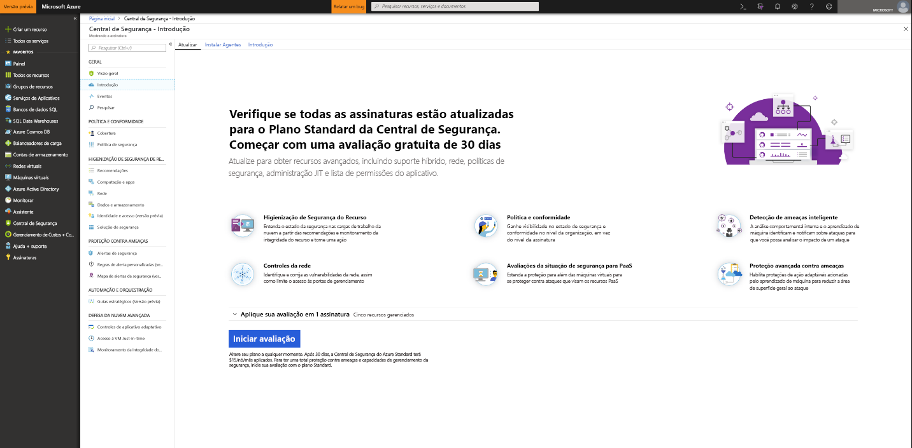
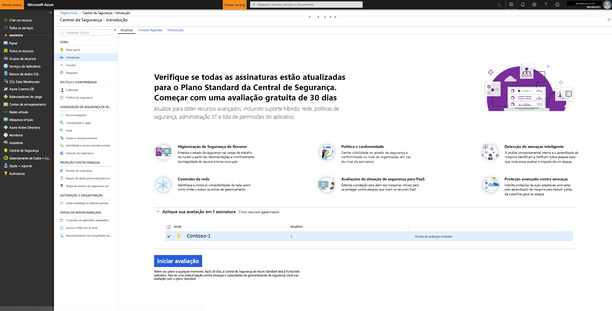

# Integração à Central de Segurança do Azure Standard para uma segurança aprimorada
Atualize para a Central de Segurança Standard para aproveitar o gerenciamento de segurança aprimorado e a proteção contra ameaças para suas cargas de trabalho de nuvem híbrida.  Você pode experimentar o Standard gratuitamente. Para saber mais, confira a [página de preços](https://azure.microsoft.com/pricing/details/security-center/) da Central de Segurança.

A Central de Segurança Standard inclui:

- **Segurança híbrida** – Obtenha uma exibição unificada sobre a segurança em todas as suas cargas de trabalho locais e na nuvem. Aplique políticas de segurança e avalie continuamente a segurança de suas cargas de trabalho de nuvem híbrida a fim de garantir a conformidade com padrões de segurança. Colete, pesquise e analise dados de segurança de uma variedade de fontes, inclusive firewalls e outras soluções de parceiros.
- **Detecção avançada de ameaças** – Use análises avançadas e o Grafo de segurança inteligente da Microsoft para obter uma vantagem sobre ataques cibernéticos em evolução.  Aproveite a análise comportamental interna e o aprendizado de máquina para identificar ataques e explorações de dia zero. Monitore redes, computadores e serviços de nuvem contra ataques recebidos e atividade pós-violação. Simplifique a investigação com ferramentas interativas e inteligência contextual contra ameaças.
- **Controles de acesso e de aplicativo** – Bloqueie malwares e outros aplicativos indesejados aplicando recomendações de lista de permissões adaptada para suas cargas de trabalho específicas e baseada em aprendizado de máquina. Reduza a superfície de ataque da rede com acesso controlado Just-In-Time às portas de gerenciamento em VMs do Azure, reduzindo drasticamente a exposição à ataques de força bruta e outros ataques de rede.

## Detectando recursos desprotegidos     
A Central de Segurança detecta automaticamente as assinaturas ou workspaces do Azure não habilitados para a Central de Segurança Standard. Isso inclui assinaturas do Azure usando a Central de Segurança Gratuita e workspaces que não têm a solução da Segurança habilitada.

Você pode atualizar uma assinatura inteira do Azure para a camada Standard, que é herdada por todos os recursos com suporte dentro da assinatura. Aplicando o padrão de camada a um espaço de trabalho se aplica a todos os recursos de emissão de relatórios no espaço de trabalho.

> [!NOTE]
> Talvez você queira gerenciar os custos e limitar a quantidade de dados coletados de uma solução limitando-a a determinado conjunto de agentes. O [direcionamento de solução](../operations-management-suite/operations-management-suite-solution-targeting.md) permite que você aplique um escopo à solução e direcione a um subconjunto de computadores no workspace.  Se você estiver usando o direcionamento de solução, a Central de Segurança listará o workspace como não tendo uma solução.
>
>

## Atualizar uma assinatura ou workspace do Azure
Para atualizar uma assinatura ou um workspace para Standard:
1. No menu principal da Central de Segurança, selecione **Introdução**.
  
2. Em **Atualização**, a Central de Segurança lista as assinaturas e os workspaces qualificados para a integração. 
   - Você pode clicar em **Aplicar sua avaliação** expansível para ver uma lista de todas as assinaturas e workspaces com seu status de qualificação de avaliação.
   -    Você pode atualizar as assinaturas e os workspaces que não são qualificados para avaliação.
   -    Você pode selecionar workspaces e assinaturas qualificados para iniciar sua avaliação.
3.  Clique em **Iniciar avaliação** para iniciar sua avaliação das assinaturas selecionadas.
  

   > [!NOTE]
   > Recursos gratuitos da Central de segurança são aplicados apenas para VMs do Azure e VMSS. Os recursos Gratuitos não serão aplicados aos computadores não Azure. Se você selecionar Standard, os recursos padrão serão aplicados a todas as VMs do Azure, conjuntos de dimensionamento de VMs e computadores não Azure relatando para o espaço de trabalho. É recomendável que você aplique a Standard para proporcionar segurança avançada tanto para seus recursos do Azure quanto para os não Azure.
   >
   >

## Integrar computadores não Azure
A Central de Segurança pode monitorar a postura de segurança dos computadores não Azure, mas, antes, é necessário que você integre esses recursos. Você pode adicionar computadores não Azure por meio da folha **Introdução** ou da folha **Computação**. Vamos demonstrar os dois métodos.

### Adicionar novos computadores não Azure por meio da **Introdução**

1. Retorne à **Introdução**.   
2. Selecione a guia **Introdução**.

   

3. Clique em **Configurar** sob **Adicionar novos computadores não Azure**. É mostrada uma lista dos workspaces do Log Analytics. A lista inclui, se aplicável, o workspace padrão criado para você pela Central de Segurança quando o provisionamento automático foi habilitado. Selecione esse workspace ou outro que você queira usar.

   ![Adicionar computador não Azure][7]

Se você tiver workspaces existentes, eles serão listados em **Adicionar novos computadores não Azure**. Você pode adicionar computadores a um workspace existente ou criar um novo workspace. Para criar um novo workspace, selecione o link **adicionar um novo workspace**.

### Adicionar novos computadores não Azure por meio da **Computação**

**Criar um novo workspace e adicionar computador**

1. Em **Adicionar novos computadores não Azure**, selecione **adicionar um novo workspace**.

   ![Adicionar um novo workspace][4]

2. Em **Segurança e Auditoria**, selecione **Workspace OMS** para criar um novo workspace.
   > [!NOTE]
   > Os workspaces do OMS agora são chamados de workspaces do Log Analytics.
3. Em **Workspace OMS**, insira as informações do seu workspace.
4. Em **Workspace OMS**, selecione **OK**.  Depois de selecionar OK, você receberá um link para baixar um agente do Windows ou do Linux e as chaves da sua ID do workspace para ser usada na configuração do agente.
5. Em **Segurança e Auditoria**, selecione **OK**.

**Selecionar um workspace existente e adicionar computador**

Você pode adicionar um computador, seguindo o fluxo de trabalho de **Integração**, conforme mostrado acima. Você também pode adicionar um computador, seguindo o fluxo de trabalho de **Computação**. Neste exemplo, usamos **Computação**.

1. Retorne ao menu principal da Central de Segurança e ao painel **Visão geral**.

   ![Visão geral][5]

2. Selecione **Computação e aplicativos**.
3. Em **Computação e aplicativos**, selecione **Adicionar computadores**.

   ![Folha Computação][6]

4. Em **Adicionar novos computadores não Azure**, selecione um workspace ao qual conectar seu computador e clique em **Adicionar computadores**.

   ![Adicionar computadores][7]

   A folha **Agente Direto** fornece um link para baixar um agente do Windows ou do Linux, bem como a ID do workspace e as chaves a usar na configuração do agente.   

## Próximas etapas
Neste artigo, você aprendeu como integrar recursos Azure e não Azure para se beneficiar da segurança avançada da Central de Segurança.  Para fazer mais com os recursos integrados, veja

- [Habilitar coleta de dados](security-center-enable-data-collection.md)
- [Relatório de inteligência de ameaças](security-center-threat-report.md)
- [Acesso Just-In-Time à VM](security-center-just-in-time.md)

<!--Image references-->
[1]: ./media/security-center-onboarding/onboard.png
[2]: ./media/security-center-onboarding/onboard-subscription.png
[3]: ./media/security-center-onboarding/get-started.png
[4]: ./media/security-center-onboarding/create-workspace.png
[5]: ./media/security-center-onboarding/overview.png
[6]: ./media/security-center-onboarding/compute-blade.png
[7]: ./media/security-center-onboarding/add-computer.png
[8]: ./media/security-center-onboarding/onboard-workspace.png
