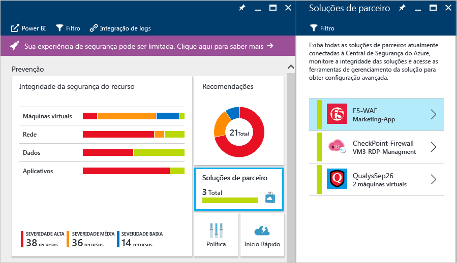

# Integração com Parceiros na Central de Segurança do Azure
Este documento explica como a Central de segurança do Azure se integra com parceiros para aprimorar a segurança geral e fornecer uma experiência integrada no Azure, ao mesmo tempo que aproveita o Azure Marketplace para cobrança e certificação de parceiros.

## Por que implantar soluções de parceiro da Central de Segurança?

Os quatro principais motivos para utilizar a integração de parceiros na Central de Segurança são:

- **Facilidade de implantação**: implantar uma solução de parceiro seguindo a recomendação da Central de Segurança é muito mais fácil. O processo de implantação pode ser completamente automatizado usando uma topologia de rede e configuração padrão ou os clientes podem escolher uma opção semiautomatizada para permitir mais flexibilidade e personalização da configuração.
- **Detecções Integradas**: eventos de segurança das soluções de parceiro são automaticamente coletados, agregados e exibidos como parte dos incidentes e alertas da Central de Segurança. Esses eventos também são combinados com detecções de outras fontes para fornecer funcionalidades de detecção avançada de ameaças.
- **Unificação de gerenciamento e monitoramento de integridade**: eventos de integridade integrados permitem aos clientes monitorar todas as soluções de parceiro em um relance. Gerenciamento básico está disponível com acesso fácil à configuração avançada usando a solução de parceiro.
- **Exportar para o SIEM**: os clientes agora podem exportar todos os alertas de parceiros e da Central de Segurança em formato CEF para sistemas SIEM locais usando a Integração de Log do Microsoft Azure (visualização)

## Quais os parceiros estão integrados à Central de Segurança?
A Central de Segurança no momento se integra com os seguintes parceiros:

- Endpoint Protection (Trend Micro), 
- Firewall do aplicativo Web (Barracuda, F5, Imperva e em breve Microsoft WAF e Fortinet), 
- Soluções de firewall de próxima geração (ponto de verificação, Barracuda e em breve Fortinet e Cisco). 
- Soluções de avaliação de vulnerabilidade (Qualys – visualização). 

Ao longo do tempo, a Central de Segurança expandirá o número de parceiros dentro dessas categorias existentes e adicionará novas categorias. 

## Como implantar uma solução de parceiro?

Com base na configuração de seu ambiente do Azure e na política de segurança que você definiu, a Central de Segurança pode recomendar a implantação de uma solução de parceiro. A recomendação orientará você pelo processo de seleção e instalação de uma solução de parceiro. A experiência geral de implantação, a partir desse ponto, pode variar de acordo com a solução e o parceiro. Consulte os links abaixo para obter mais informações:

- [Adicione um firewall do aplicativo Web](security-center-add-web-application-firewall.md)
- [Adicionar um Firewall de Última Geração](security-center-add-next-generation-firewall.md)
- [Instalar proteção do ponto de extremidade](security-center-install-endpoint-protection.md)
- [Avaliação de vulnerabilidade não instalada](security-center-vulnerability-assessment-recommendations.md)

## Como gerenciar soluções de parceiros?

Após a implantação de uma solução de parceiro, você pode exibir informações sobre a integridade da solução e executar tarefas básicas de gerenciamento no bloco Solução de parceiro no painel principal da Central de Segurança. Para obter mais informações sobre o gerenciamento de soluções de parceiros na Central de Segurança, leia [Monitoramento de soluções de parceiro com a Central de Segurança do Azure](security-center-partner-solutions.md).

## Consulte também
Neste documento, você aprendeu como integrar a solução de parceiro à Central de Segurança do Azure. Para saber mais sobre a Central de Segurança, confira o seguinte:

* [Guia de planejamento e operações da Central de Segurança do Azure](security-center-planning-and-operations-guide.md)
* [Gerenciando e respondendo a alertas de segurança na Central de segurança do Azure](security-center-managing-and-responding-alerts.md)
* [Alertas de Segurança por Tipo na Central de Segurança do Azure](security-center-alerts-type.md)
* [Monitoramento da integridade de segurança na Central de Segurança do Azure](security-center-monitoring.md) – saiba como monitorar a integridade dos recursos do Azure.
* [Monitorando as soluções de parceiros com a Central de Segurança do Azure](security-center-partner-solutions.md) – saiba como monitorar o status de integridade de suas soluções de parceiros.
* [Perguntas frequentes da Central de Segurança do Azure](security-center-faq.md) : encontre as perguntas frequentes sobre como usar o serviço.
* [Blog de Segurança do Azure](http://blogs.msdn.com/b/azuresecurity/) : encontre postagens no blog sobre conformidade e segurança do Azure.

<!--HONumber=Dec16_HO1-->

