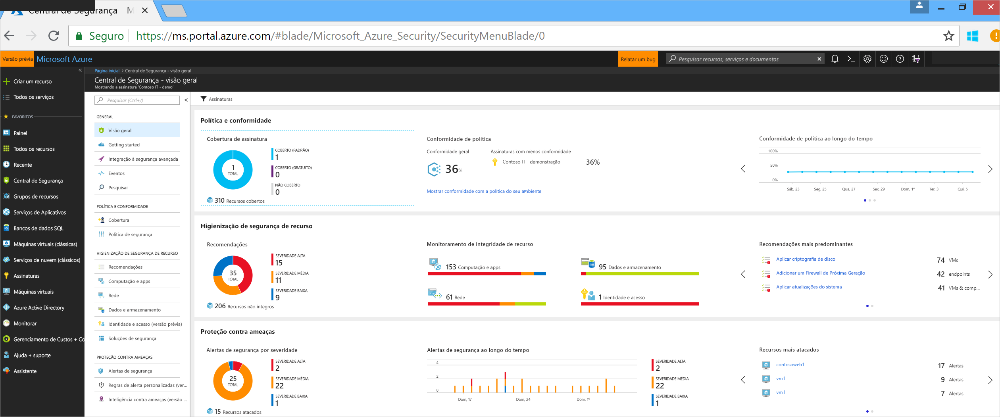
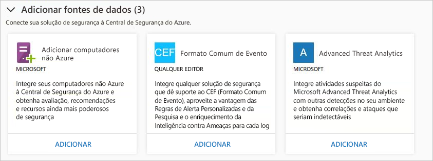
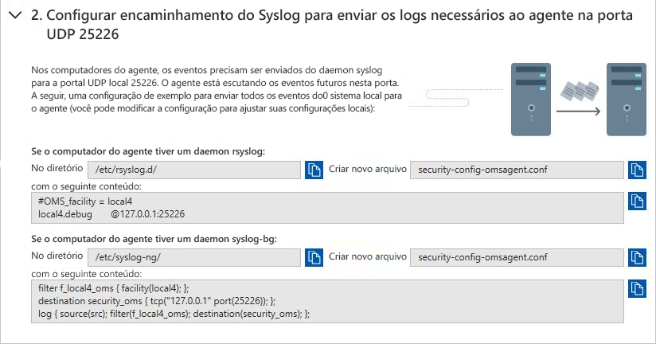
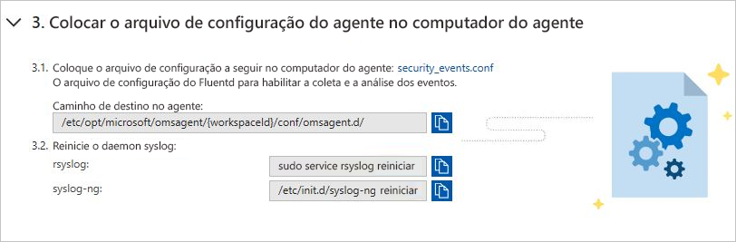
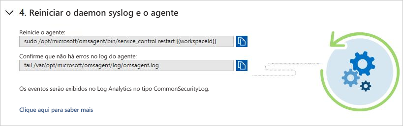
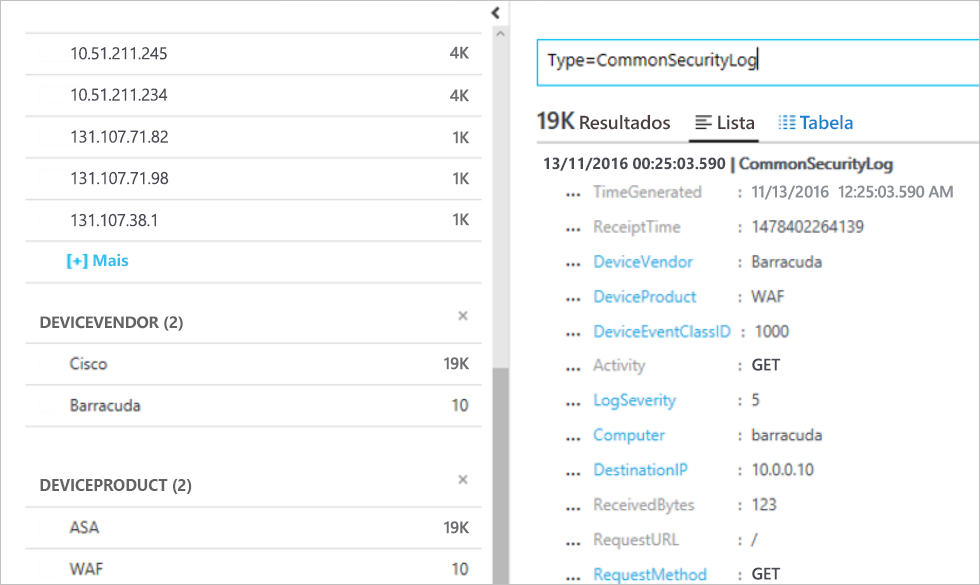

# Integrar soluções de segurança na Central de Segurança do Azure
Este documento ajuda você a gerenciar soluções de segurança já conectadas à Central de Segurança do Azure e a adicionar novas.

## Soluções de segurança integradas do Azure
A Central de Segurança facilita a criação de soluções de segurança integradas no Azure. Os benefícios incluem:

- **Implantação simplificada**: A Central de Segurança oferece provisionamento simplificado das soluções integradas de parceiros. Para as soluções como antimalware e avaliação de vulnerabilidades, a Central de Segurança pode provisionar o agente necessário em suas máquinas virtuais e para dispositivos de firewall, a Central de Segurança pode cuidar de grande parte da configuração de rede necessária.
- **Detecções integradas**: Os eventos de segurança das soluções de parceiro são automaticamente coletados, agregados e exibidos como parte dos incidentes e alertas da Central de Segurança. Esses eventos também são combinados com detecções de outras fontes para fornecer funcionalidades de detecção avançada de ameaças.
- **Monitoramento e gerenciamento de integridade unificados**: Os clientes podem usar eventos de integridade integrados para monitorar todas as soluções de parceiros em um relance. O gerenciamento básico está disponível com acesso fácil à configuração avançada usando a solução de parceiro.

Atualmente, as soluções de segurança integradas incluem:

- Firewall de aplicativo Web ([Barracuda](https://www.barracuda.com/products/webapplicationfirewall), [F5](https://support.f5.com/kb/en-us/products/big-ip_asm/manuals/product/bigip-ve-web-application-firewall-microsoft-azure-12-0-0.html), [Imperva](https://www.imperva.com/Products/WebApplicationFirewall-WAF), [Fortinet](https://www.fortinet.com/products.html), [Gateway de Aplicativo do Azure](https://azure.microsoft.com/blog/azure-web-application-firewall-waf-generally-available/))
- Firewall de próxima geração ([Check Point](https://www.checkpoint.com/products/vsec-microsoft-azure/), [Barracuda](https://campus.barracuda.com/product/nextgenfirewallf/article/NGF/AzureDeployment/), [Fortinet](https://docs.fortinet.com/d/fortigate-fortios-handbook-the-complete-guide-to-fortios-5.2), [Cisco](https://www.cisco.com/c/en/us/td/docs/security/firepower/quick_start/azure/ftdv-azure-qsg.html) e [Palo Alto Networks](https://www.paloaltonetworks.com/products))
- Avaliação de vulnerabilidade ([Qualys](https://www.qualys.com/public-clouds/microsoft-azure/) e [Rapid7](https://www.rapid7.com/products/insightvm/))

> [!NOTE]
> A Central de Segurança não instala o Microsoft Monitoring Agent em soluções de virtualização de parceiro porque a maioria dos fornecedores de segurança proíbe agentes externos em execução em suas soluções.
>
>

## Como as soluções de segurança são integradas
As soluções de segurança do Azure implantadas da Central de Segurança serão conectadas automaticamente. Você também pode se conectar a outras fontes de dados de segurança, incluindo:

- Azure AD Identity Protection
- Computadores que executam no local ou em outras nuvens
- Solução de segurança que dá suporte ao CEF (Formato de Evento Comum)
- Microsoft Advanced Threat Analytics

## Gerenciar soluções de segurança integrada do Azure e outras fontes de dados

1. Entre no [Portal do Azure](https://azure.microsoft.com/features/azure-portal/).

2. No menu **Microsoft Azure**, selecione **Central de Segurança**. **Central de Segurança - Visão geral** é aberto.

3. No menu da Central de Segurança, selecione **Soluções de segurança**.

   

Em **Soluções de segurança**, você pode exibir informações sobre a integridade da solução integrada de segurança do Azure e executar tarefas básicas de gerenciamento. Você também pode conectar a outros tipos de fontes de dados de segurança, como logs de firewall e alertas do Azure Active Directory Identity Protection no CEF (Formato de Evento Comum).

### Soluções conectadas

A seção **Soluções conectadas** inclui soluções de segurança atualmente conectadas à Central de Segurança e informações sobre o status de integridade de cada solução.  

O status de uma solução de parceiro pode ser:

* Íntegro (verde) - não há qualquer problema de integridade.
* Não íntegro (vermelho) - há um problema de integridade que requer atenção imediata
* Problemas de integridade (laranja) - a solução interrompeu o envio de relatórios sobre sua integridade.
* Não relatado (cinza) - a solução não relatou nada ainda. O status da solução pode não ser relatado se ela tiver sido conectada recentemente e se ainda estiver sendo implantada, ou se não houver nenhum dado de integridade disponível.

> [!NOTE]
> Se os dados de status de integridade não estiverem disponíveis, a Central de Segurança mostrará a data e a hora do último evento recebido para indicar se a solução está reportando ou não. Se não houver dados de integridade disponíveis e se nenhum alerta for tiver sido recebido nos últimos 14 dias, a Central de Segurança indica que a solução não está íntegra ou não está reportando.
>
>

1. Selecione **EXIBIR** para obter informações e opções adicionais, o que inclui:

   - **Console da solução**. Abre a experiência de gerenciamento para esta solução.
   - **Vincular VM**. Abre a folha Vincular Aplicativos. Nela, você pode conectar recursos à solução de parceiro.
   - **Excluir solução**.
   - **Configurar**.

   

### Soluções descobertas

A Central de Segurança detecta automaticamente as soluções de segurança em execução no Azure, mas não conectadas à Central de Segurança, e exibe as soluções na seção **Soluções descobertas**. Isso inclui soluções do Azure, como o [Azure AD Identity Protection](https://docs.microsoft.com/azure/active-directory/active-directory-identityprotection), bem como soluções de parceiros.

> [!NOTE]
> A camada Padrão da Central de Segurança é necessária no nível de assinatura para o recurso de descoberta de soluções. Confira os [Preços](security-center-pricing.md) para saber mais sobre os tipos de preço de Segurança.
>
>

Selecione **CONNECT** em uma solução para integrá-la à Central de Segurança e ser notificado sobre alertas de segurança.

A Central de Segurança também detecta soluções implantadas na assinatura que podem encaminhar logs em CEF (formato de eventos comuns). Saiba como [conectar a uma solução de segurança](quick-security-solutions.md) que usa os logs em CEF à Central de Segurança.

### Adicionar fontes de dados

A seção **Adicionar fontes de dados** inclui outras fontes de dados disponíveis que podem ser conectadas. Para obter instruções sobre como adicionar dados de qualquer uma dessas fontes, clique em **ADICIONAR**.

### Conectar a soluções externas

Além de coletar dados de segurança de seus computadores, você pode integrar dados de segurança de uma variedade de outras soluções de segurança, incluindo as que dão suporte ao CEF (Formato Comum de Evento). O CEF é um formato padrão da indústria, além das mensagens Syslog, usado por muitos fornecedores de segurança para permitir a integração de eventos entre diferentes plataformas.

Este guia de início rápido mostra como:
- Conectar uma solução de segurança à Central de Segurança usando os logs do CEF
- Validar a conexão com a solução de segurança

#### Pré-requisitos
Para começar a usar a Central de Segurança, você deve ter uma assinatura do Microsoft Azure. Se você não tiver uma assinatura, pode se inscrever em uma [conta gratuita](https://azure.microsoft.com/free/).

Para percorrer este guia de início rápido, você deverá estar no tipo de preço Standard da Central de Segurança. Você pode experimentar a Central de Segurança Standard sem nenhum custo. O início rápido [Integração da sua assinatura do Azure à Central de Segurança Standard](security-center-get-started.md) orienta você sobre como fazer upgrade para Standard. Para saber mais, consulte a [página de preços](https://azure.microsoft.com/pricing/details/security-center/).

Você também precisa de um [computador Linux](https://docs.microsoft.com/azure/log-analytics/log-analytics-agent-linux) com o serviço Syslog que já esteja conectado à Central de Segurança.

#### Conectar a solução usando CEF

1. Faça logon no [Portal do Azure](https://azure.microsoft.com/features/azure-portal/).
2. No menu **Microsoft Azure**, selecione **Central de Segurança**. **Central de Segurança - Visão geral** é aberto.

      

3. No menu principal da Central de Segurança, selecione **Soluções de Segurança**.
4. Na página Soluções de Segurança, em **Adicionar fontes de dados (3)**, clique em **Adicionar** em **Formato Comum de Evento**.

    

5. Na página Logs do Formato Comum de Evento, expanda a segunda etapa, **Configurar o encaminhamento do Syslog para enviar os logs necessários para o agente na porta 25226 UDP** e siga as instruções abaixo no seu computador Linux:

    

6. Expanda a terceira etapa, **Posicione o arquivo de configuração do agente no computador do agente**e siga as instruções abaixo no seu computador Linux:

    

7. Expanda a quarta etapa, **Reiniciar o daemon e o agente do syslog**e siga as instruções abaixo no seu computador Linux:

    

#### Validar a conexão

Antes de prosseguir com as etapas abaixo, você precisa esperar até que o syslog inicie a geração de relatórios para a Central de Segurança. Isso pode levar algum tempo, e vai variar de acordo com o tamanho do ambiente.

1.  No painel esquerdo do painel da Central de Segurança, clique em **Pesquisar**.
2.  Selecione o workspace ao qual o Syslog (computador Linux) está conectado.
3.  Digite *CommonSecurityLog* e clique no botão **Pesquisar**.

O exemplo a seguir mostra o resultado destas etapas: 

#### Limpar recursos
Outros guias de início rápido e tutoriais da coleção aproveitam esse guia de início rápido. Se você planeja continuar a trabalhar com os tutoriais e os guias de início rápido subsequentes, continue executando a camada Standard e mantenha o provisionamento automático habilitado. Se você não planejar continuar ou quiser retornar para a camada Gratuita:

1. Retorne ao menu principal da Central de Segurança e selecione a **Política de segurança**.
2. Selecione a assinatura ou a política que você deseja retornar para Gratuita. A **Política de segurança** abre.
3. Em **COMPONENTES DE POLÍTICA**, selecione **Tipo de preços**.
4. Selecione **Gratuita** para alterar a assinatura da camada Standard para a camada Gratuita.
5. Clique em **Salvar**.

Se quiser desabilitar o provisionamento automático:

1. Retorne ao menu principal da Central de Segurança e selecione **Política de segurança**.
2. Selecione a assinatura em que você deseja desabilitar o provisionamento automático.
3. Em **Política de segurança – Coleta de dados**, selecione **Desativar** em **Integração** para desabilitar o provisionamento automático.
4. Clique em **Salvar**.

>[!NOTE]
> Desabilitar o provisionamento automático não remove o Microsoft Monitoring Agent das VMs do Azure em que o agente tenha sido provisionado. Desabilitar o provisionamento automático limita o monitoramento de segurança dos seus recursos.
>

## Exportar dados para um SIEM

Eventos processados produzidos pela Central de Segurança do Azure são publicados no [log de atividades](../monitoring-and-diagnostics/monitoring-overview-activity-logs.md) do Azure, um log de tipos disponíveis por meio do Azure Monitor. O Azure Monitor oferece um pipeline consolidado para qualquer um dos seus dados de monitoramentos de roteamento para uma ferramenta do SIEM. Isso é feito transmitindo dados para um Hub de eventos onde ele pode então ser extraído para uma ferramenta de parceiro.

Este pipe usa o [monitoramento do Azure único pipeline](../azure-monitor/platform/stream-monitoring-data-event-hubs.md) para obter acesso aos dados de monitoramento de seu ambiente do Azure. Isso permite que você configure facilmente SIEMs e ferramentas de monitoramento para consumir os dados.

As seções a seguir descrevem como você pode configurar os dados para serem transmitidos para um hub de eventos. As etapas pressupõem que você já tem a Central de Segurança do Azure configurado na sua assinatura do Azure.

Visão geral de alto nível

### Quais são os dados de segurança do Azure expostos para SIEM?

Nesta versão, expomos os [alertas de segurança.](../security-center/security-center-managing-and-responding-alerts.md) Em versões futuras, enriqueceremos o conjunto de dados com as recomendações de segurança.

### Como configurar o pipeline

#### Criar um Hub de Evento

Antes de começar, você precisa [criar um namespace dos Hubs de Eventos](../event-hubs/event-hubs-create.md). Esse namespace e Hub de Eventos é o destino para todos os seus dados de monitoramento.

#### Transmissão do Log de Atividades do Azure para os Hubs de Eventos

Consulte o seguinte artigo [log de atividades de fluxo para Hubs de Eventos](../azure-monitor/platform/activity-logs-stream-event-hubs.md)

#### Instalar um conector do SIEM parceiro 

Rotear dados de monitoramento para um Hub de Eventos com o Azure Monitor permite fácil integração com as ferramentas de monitoramento e o SIEM de parceiro.

Consulte o link a seguir para ver a lista de [SIEMs de suporte](../azure-monitor/platform/stream-monitoring-data-event-hubs.md#what-can-i-do-with-the-monitoring-data-being-sent-to-my-event-hub)

### Exemplo de consulta de dados 

Eis algumas consultas Splunk que você pode usar para extrair dados de alerta:

| **Descrição da consulta:** | **Consulta** |
|----|----|
| Todos os Alertas| index=main Microsoft.Security/locations/alerts|
| Resumir contagem de operações por seu nome| index=main sourcetype="amal:security" \| tabela operationName \| estatísticas contam por operationName|
| Obter informações de alertas: Hora, Nome, Estado, ID e Assinatura | index=main Microsoft.Security/locations/alerts \| table \_time, properties.eventName, State, properties.operationId, am_subscriptionId |

## Próximas etapas

Neste artigo, você aprendeu a integrar as soluções de parceiro à Central de Segurança. Para saber mais sobre a Central de Segurança, confira estes artigos:

* [Monitoramento da integridade de segurança na Central de Segurança](security-center-monitoring.md). Saiba como monitorar a integridade dos recursos do Azure.
* [Monitoramento das soluções de parceiros na Central de Segurança](security-center-partner-solutions.md). Saiba como monitorar o status da integridade das soluções dos parceiros.
* [Perguntas frequentes sobre a Central de Segurança do Azure](security-center-faq.md). Obtenha respostas para perguntas frequentes sobre como usar a Central de Segurança.
* [Blog de Segurança do Azure](https://blogs.msdn.com/b/azuresecurity/). Encontre postagens no blog sobre a conformidade e segurança do Azure.
