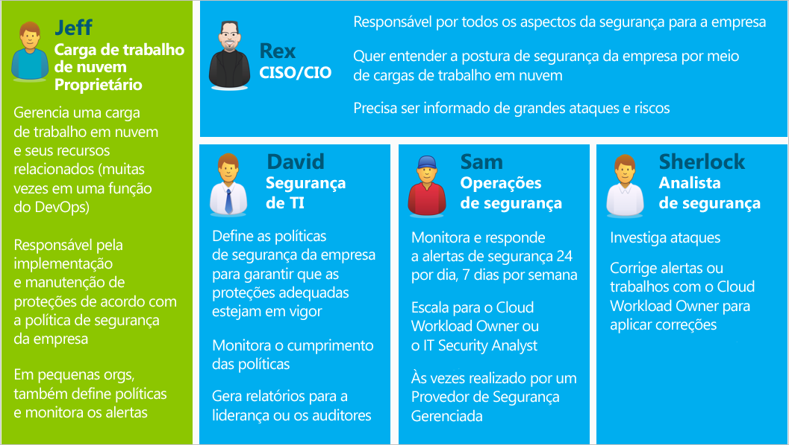

<properties
   pageTitle="Guia de planejamento e operações da Central de Segurança | Microsoft Azure"
   description="Este documento ajuda você a planejar antes de adotar a Central de Segurança do Azure e fornece considerações sobre as operações diárias."
   services="security-center"
   documentationCenter="na"
   authors="YuriDio"
   manager="swadhwa"
   editor=""/>

<tags
   ms.service="security-center"
   ms.topic="hero-article"
   ms.devlang="na"
   ms.tgt_pltfrm="na"
   ms.workload="na"
   ms.date="07/21/2016"
   ms.author="yurid"/>

# Guia de planejamento e operações da Central de Segurança do Azure
Este guia destina-se a profissionais de TI (tecnologia da informação), arquitetos de TI, analistas de segurança da informação e administradores de nuvem cujas organizações planejam usar a Central de Segurança do Azure.

## Guia de planejamento
Este guia aborda um conjunto de etapas e tarefas que você pode seguir para otimizar seu uso da Central de Segurança com base no modelo de gerenciamento de nuvem e nos requisitos de segurança de sua organização. Para tirar total proveito da Central de Segurança, é importante entender como as pessoas ou equipes diferentes em sua organização usarão o serviço para atender às necessidades de desenvolvimento e operações seguras, monitoramento, administração resposta a incidentes. As principais áreas a serem consideradas ao planejar o uso da Central de Segurança são:

- Funções de segurança e controles de acesso
- Políticas de segurança e recomendações
- Coleta de dados e armazenamento
- Monitoramento contínuo de segurança
- Resposta a incidentes

Na próxima seção, você aprenderá a planejar para cada uma dessas áreas e a aplicar essas recomendações de acordo com suas necessidades.

> [AZURE.NOTE] Leia as [Perguntas frequentes (FAQ) da Central de Segurança do Azure](security-center-faq.md) para obter uma lista das perguntas comuns que também podem ser úteis durante as fases de design e planejamento.

## Funções de segurança e controles de acesso
Dependendo do tamanho e da estrutura de sua organização, vários indivíduos e equipes podem usar a Central de Segurança para executar tarefas variadas relacionadas à segurança. Veja abaixo um exemplo de personas fictícias e suas respectivas funções e responsabilidades de segurança:

A Central de Segurança permite que essas pessoas atendam a várias responsabilidades. Por exemplo:

**Jeff (proprietário de carga de trabalho de nuvem)**

- Exibe e completa recomendações da Central de Segurança no Portal do Azure
- Também Pode Usar um Sistema de Tíquetes para Controlar as Alterações (preenche as recomendações usando a [API](https://msdn.microsoft.com/library/mt704034.aspx))

**Rex (CISO/CIO)**

- Exibe relatórios da Central de Segurança no Power BI ou Excel

**David (segurança de TI)**

- Define a política de segurança e exibe a integridade da segurança no Portal do Azure
- Analisa os dados e gera relatórios no Power BI

**Sam (operações de segurança)**

- Exibe e realiza triagens de alertas da Central de Segurança no Portal do Azure
- Pode Usar um Painel Existente (preenche os alertas usando a [API](https://msdn.microsoft.com/library/mt704034.aspx))

**Sherlock (analista de segurança)**

- Exibe alertas da Central de Segurança no Portal do Azure
- Pode Usar um Painel Existente (preenche os alertas usando a [API](https://msdn.microsoft.com/library/mt704034.aspx))
- Analisa as tendências de alertas no Power BI
- Analisa os logs de eventos do armazenamento

A Central de Segurança usa o [RBAC (Controle de Acesso Baseado em Função)](../active-directory/role-based-access-control-configure.md) que fornece [funções internas](../active-directory/role-based-access-built-in-roles.md) que podem ser atribuídas a usuários, grupos e serviços no Azure. Quando um usuário abre a Central de Segurança, ele vê apenas as informações relacionadas aos recursos aos quais tem acesso, ou seja, o usuário recebe a função de Proprietário, Colaborador ou Leitor para a assinatura ou grupo de recursos ao qual um recurso pertence. Usando os personas acima, a seguinte RBAC seria necessária:

**Jeff (proprietário de carga de trabalho de nuvem)**

- Proprietário/Colaborador do grupo de recursos

**David (segurança de TI)**

- Proprietário/Colaborador da assinatura

**Sam (operações de segurança)**

- Leitor de assinatura para exibição de alertas
- Proprietário/Colaborador da assinatura necessário para dispensar alertas

**Sherlock (analista de segurança)**

- Leitor de assinatura para exibição de alertas
- Proprietário/Colaborador da assinatura necessário para corrigir ou dispensar alertas
- O acesso ao armazenamento pode ser necessário

Algumas informações importantes a serem consideradas:

- Somente os colaboradores e proprietários de assinatura podem editar uma política de segurança
- Somente proprietários e colaboradores da assinatura e do grupo de recursos podem aplicar as recomendações de segurança de um recurso

Ao planejar o controle de acesso usando o RBAC para a Central de Segurança, compreenda quem em sua organização usará a Central de Segurança e quais tipos de tarefas a pessoa executará. Em seguida, configure a RBAC adequadamente.

> [AZURE.NOTE] Recomendamos que você atribua a função menos permissiva necessária para os usuários realizarem suas tarefas. Por exemplo, os usuários que precisarem apenas exibir informações sobre o estado de segurança dos recursos, mas não precisarem executar ações, por exemplo, aplicar recomendações ou editar políticas, deverão receber a função de Leitor.

## Políticas de segurança e recomendações
Uma política de segurança define o conjunto de controles que são recomendados para os recursos na assinatura ou grupo de recursos especificado. Na Central de Segurança, você define as políticas de acordo com os requisitos de segurança de sua empresa e com o tipo de aplicativo ou confidencialidade dos dados.

Políticas habilitadas no nível da assinatura serão propagadas automaticamente para todos os grupos de recursos dentro da assinatura, conforme mostra o diagrama a seguir:

Conforme mostra a figura acima, as políticas de segurança para grupos de recursos podem ser herdadas do nível da assinatura.

Em alguns cenários nos quais você pode ter recursos em um grupo de recursos que exigem um conjunto diferente de políticas, você pode desabilitar a herança e aplicar políticas personalizadas a um Grupo de Recursos específico.

Se você precisar de políticas personalizadas em grupos de recursos específicos, você deve desabilitar a herança no grupo de recursos e alterar as políticas de segurança. Por exemplo, se você tiver algumas cargas de trabalho que não exigem a política de Transparent Data Encryption do SQL, desative a política no nível da assinatura e habilite-a somente nos grupos de recursos nos quais o TDE do SQL é necessário.

Ao começar a criar políticas personalizadas para grupos de recursos diferentes, você deve planejar a implantação de sua política sabendo que, no caso de um conflito de políticas (assinatura versus grupo de recursos), a política do grupo de recursos prevalecerá.

> [AZURE.NOTE] Se você precisar revisar quais políticas foram alteradas, poderá usar os [Logs de Auditoria do Azure](https://blogs.msdn.microsoft.com/cloud_solution_architect/2015/03/10/audit-logs-for-azure-events/). As alterações na política são sempre registradas nos Logs de auditoria do Azure.

### Recomendações de segurança

Antes de configurar as políticas de segurança, examine cada uma das [recomendações de segurança](security-center-recommendations.md) e determine se são apropriadas às suas várias assinaturas e grupos de recursos. Também é importante entender qual ação será executada para resolver as Recomendações de segurança.

**Proteção do Ponto de Extremidade**: se uma máquina virtual não tiver uma solução de proteção do ponto de extremidade habilitada, a Central de Segurança recomendará a instalação de uma. Se você tiver uma solução de proteção de ponto de extremidade preferida já adotada localmente, será necessário decidir se você usará o mesmo antimalware para suas VMs do Azure. A Central de Segurança do Azure fornece várias opções de proteção de ponto de extremidade. Você pode usar o Microsoft Antimalware gratuito ou escolher entre uma lista de soluções de proteção de ponto de extremidade de parceiros integrados. Para saber mais sobre como implantar o antimalware usando a Central de Segurança do Azure, leia [Instalar Proteção do Ponto de Extremidade na Central de Segurança do Azure](security-center-install-endpoint-protection.md).

**Atualizações do Sistema**: a Central de Segurança do Azure identificará as máquinas virtuais sem segurança ou as atualizações críticas do sistema operacional para o IaaS e os Serviços de Nuvem (PaaS). Considere quem será responsável pela aplicação das atualizações quando necessário e como elas serão aplicadas. Muitas organizações usam o WSUS, Windows Update ou outra ferramenta.

**Configurações da Linha de Base**: se as configurações do sistema operacional da máquina virtual não corresponderem às linhas de base recomendadas, uma recomendação será exibida. Você deve examinar o conjunto de linhas de base [aqui](https://gallery.technet.microsoft.com/Azure-Security-Center-a789e335) e considerar como as configurações do sistema operacional serão aplicadas.

**Criptografia de Disco**: se você tiver discos da máquina virtual que não estão criptografados, a Central de Segurança do Azure recomendará a aplicação do Azure Disk Encryption, que aproveita o BitLocker para Windows e o DM-Crypt para Linux para fornecer a criptografia de volume para o SO e os discos de dados. Essa recomendação redirecionará você para um [guia passo a passo](security-center-disk-encryption.md) contendo instruções sobre como executar essa criptografia.

Lembre-se de que há diversos cenários de criptografia que você precisa solucionar. Será necessário planejar os requisitos exclusivos para cada um desses cenários:

- Criptografia de novas máquinas virtuais do Azure de VHDs que você criptografou usando suas próprias chaves de criptografia
- Criptografia de novas máquinas virtuais do Azure que foram criadas da Galeria do Azure
- Criptografia de máquinas de virtuais do Azure que já estão em execução no Azure

O planejamento dos requisitos será diferente para cada um desses cenários. Veja o [documento do Azure Disk Encryption](https://gallery.technet.microsoft.com/Azure-Disk-Encryption-for-a0018eb0) para obter detalhes sobre cada um desses cenários.

**Firewall do Aplicativo Web**: a Central de Segurança do Azure identificará as máquinas virtuais que executam aplicativos Web e recomendará a instalação de um WAF (Firewall do Aplicativo Web). Avalie as soluções de parceiros disponíveis para determinar qual é a melhor opção para sua organização e determinar como a solução será licenciada (os parceiros podem oferecer suporte a modelos Traga sua própria licença e/ou pré-pago). Para saber mais sobre como implantar um firewall do aplicativo Web em suas VMs do Azure usando a Central de Segurança do Azure, leia [Adicionar um firewall do aplicativo Web na Central de Segurança do Azure](security-center-add-web-application-firewall.md).

O **Firewall de Próxima Geração**: permite o provisionamento de um dispositivo virtual dos principais fornecedores, incluindo o Check Point e logo depois Cisco e Fortinet. Isso estende as proteções da rede para além dos Grupos de Segurança da Rede, que são internos no Azure. A Central de Segurança descobrirá as implantações para as quais o Firewall da Próxima Geração é recomendado e irá habilitá-lo para fornecer um dispositivo virtual.

**Rede Virtual**: a Central de Segurança do Azure avaliará a infraestrutura e a configuração de sua [Rede Virtual do Azure](https://azure.microsoft.com/documentation/services/virtual-network/) para verificar se o [Grupo de Segurança da Rede](../virtual-network/virtual-networks-nsg.md) foi aplicado e configurado corretamente com as regras do tráfego de entrada. Você deve considerar quais regras de tráfego devem ser definidas e comunicar isso às pessoas que aplicarão as recomendações relacionadas à segurança.

A Central de Segurança recomendará que você forneça os detalhes de contato da segurança para sua assinatura do Azure. Essas informações serão usadas pela Microsoft para contatá-lo se o MSRC (Microsoft Security Response Center) descobrir que os dados do cliente têm sido acessados por uma pessoa não autorizada ou ilegal. Leia [Fornecer detalhes de contato da segurança na Central de Segurança do Azure](security-center-provide-security-contact-details.md) para saber mais sobre como habilitar essa recomendação.

## Coleta de dados e armazenamento

Recomendamos que você ative a coleta de dados para cada uma das suas assinaturas porque isso garantirá que o monitoramento de segurança esteja disponível para todas as suas VMs. A coleta de dados é habilitada por meio do Agente de Monitoramento do Azure (ASMAgentLauncher.exe) e da extensão de Monitoramento de Segurança do Azure (ASMMonitoringAgent.exe).

A extensão de Monitoramento de Segurança do Azure verifica a existência de várias configurações de segurança relevantes e coleta os logs de segurança da máquina virtual. Esses dados são enviados para uma conta de armazenamento especificada por você. O gerenciador de verificação (ASMSoftwareScanner.exe) também será instalado na máquina virtual e será usado como um verificador de patch.

Após a habilitação da coleta de dados na política de segurança, o agente e as extensões de monitoramento serão instaladas automaticamente em todas as máquinas virtuais existentes e qualquer outra nova com suporte que sejam provisionadas no Azure. O processo do agente não é invasivo e não afeta o desempenho da VM.

> [AZURE.NOTE] Para solucionar os problemas relacionados ao Agente de Monitoramento de Segurança do Azure, leia [Guia de Solução de Problemas da Central de Segurança do Azure](security-center-troubleshooting-guide.md).

Se em algum momento você quiser desabilitar a Coleta de dados, desative-a na política de segurança. Para excluir os agentes de monitoramento implantados anteriormente, selecione a opção de menu Excluir Agentes.

> [AZURE.NOTE] Para obter uma lista de VMs com suporte, leia as [Perguntas frequentes (FAQ) da Central de Segurança do Azure](security-center-faq.md).

Para cada região em que você tiver máquinas virtuais em execução, você deverá escolher a conta de armazenamento na qual os dados coletados dessas máquinas virtuais serão armazenados. Se você não escolher uma conta de armazenamento para cada região, ela será criada para você. Você pode escolher o local do armazenamento por região ou armazenar todas as informações em um local central. Enquanto as políticas de segurança podem ser definidas no nível de assinatura do Azure e no nível do grupo de recursos, a região de sua conta de armazenamento pode ser selecionada apenas no nível da assinatura.

Se você estiver usando uma conta de armazenamento compartilhada entre diferentes recursos do Azure, leia o artigo [Metas de Desempenho e Escalabilidade do Armazenamento do Azure](../storage/storage-scalability-targets.md) para saber mais sobre os limites e as restrições do tamanho. Sua assinatura também tem limites da conta de armazenamento, então, examine a [Assinatura do Azure e limites, cotas e restrições do serviço](../azure-subscription-service-limits.md) para entender melhor esses limites.

> [AZURE.NOTE] Os custos associados a esse armazenamento não estão incluídos no preço do serviço da Central de Segurança do Azure e serão cobrados separadamente de acordo com as [taxas de armazenamento do Azure](https://azure.microsoft.com/pricing/details/storage/).

As considerações de desempenho e escalabilidade também devem ser planejadas de acordo com o tamanho do ambiente do Azure e com os recursos que estão consumindo a sua conta de armazenamento. Examine a [Lista de Verificação de Escalabilidade e Desempenho do Armazenamento do Microsoft Azure](../storage/storage-performance-checklist.md) para saber mais.

## Monitoramento contínuo de segurança

Após a configuração inicial e a aplicação das recomendações da Central de Segurança, a próxima etapa será considerar os processos operacionais da Central de Segurança.

Para acessar a Central de Segurança no Portal do Azure, clique em **Procurar** e digite **Central de Segurança** no campo **Filtro**. Os modos de exibição obtidos pelo usuário estão de acordo com esses filtros aplicados.

A Central de Segurança do Azure não interferirá com seus procedimentos normais de operação, ela monitorará passivamente as implantações e fornecerá recomendações com base nas políticas de segurança habilitadas.

O painel da Central de Segurança do Azure é dividido em duas partes principais:

- Prevenção
- Detecção

Ao habilitar a coleta de dados pela primeira vez na Central de Segurança do Azure para seu ambiente atual do Azure, revise todas as recomendações, o que pode ser feito na folha **Recomendações** ou de acordo com o recurso (**Máquina Virtual**, **Rede**, **SQL** e **Aplicativo**).

Depois de endereçar todas as recomendações, a seção **Prevenção** deverá ficar verde para todos os recursos endereçados. Nesse ponto, o monitoramento contínuo fica mais fácil, pois você só executará ações com base nas alterações nos blocos de integridade e de recomendações de segurança do recurso.

A seção **Detecção** é mais reativa, pois são alertas sobre os problemas que estão acontecendo agora ou que ocorreram no passado e foram detectados pelos controles da Central de Segurança do Azure e pelos sistemas de terceiros. O bloco Alertas de Segurança mostra gráficos de barras que representam o número de alertas de detecção de ameaças encontrados em cada dia, e sua distribuição entre as várias categorias de gravidade (baixa, média, alta). Para saber mais sobre os Alertas de Segurança, leia [Gerenciamento e resposta aos alertas de segurança na Central de Segurança do Azure](security-center-managing-and-responding-alerts.md).

> [AZURE.NOTE] Você também pode aproveitar o Microsoft Power BI para visualizar os dados da Central de Segurança do Azure. Leia [Obter informações dos dados da Central de Segurança do Azure com o Power BI](security-center-powerbi.md).

### Monitoramento de recursos novos ou alterados

A maioria dos ambientes do Azure são dinâmicos, com novos recursos gerados e excluídos regularmente, com configurações ou alterações etc. A Central de Segurança do Azure ajuda a garantir que você tenha visibilidade sobre o estado de segurança desses novos recursos.

Quando você adiciona novos recursos (VMs, Bancos de Dados SQL) ao seu Ambiente do Azure, a Central de Segurança descobre automaticamente esses recursos e começa a monitorar a segurança. Isso também inclui as funções Web do PaaS e as funções de trabalho. Se a Coleta de Dados estiver habilitada na [Política de Segurança](security-center-policies.md), os recursos de monitoramento adicionais serão habilitados automaticamente para as máquinas virtuais.

1.	Para máquinas virtuais, acesse o bloco **Integridade de segurança dos recursos** e clique em **Máquinas Virtuais**. Quaisquer problemas com a habilitação da coleta de dados ou recomendações relacionadas ocorrerão na seção **Recomendações de Monitoramento**.
2.	Veja as **Recomendações** e saiba quais riscos de segurança, se houver algum, foram identificados para o novo recurso.
3.	É muito comum que, quando novas VMs são adicionadas ao seu ambiente, apenas o sistema operacional seja instalado inicialmente. Talvez o proprietário do recurso precise de algum tempo para implantar outros aplicativos que serão usados por essas VMs. É ideal que você saiba o objetivo final dessa carga de trabalho. Ele será um Servidor de Aplicativos? Com base no que essa nova carga de trabalho será, você pode habilitar a **Política de Segurança** apropriada, o que é a terceira etapa neste fluxo de trabalho.
4.	À medida que novos recursos são adicionados ao seu ambiente do Azure, é possível que novos alertas sejam exibidos no bloco **Alertas de Segurança**. Sempre verifique se há novos alertas nesse bloco e tome ações de acordo com as recomendações da Central de Segurança.

Convém também monitorar regularmente o estado dos recursos existentes para identificar as alterações de configuração que criaram riscos de segurança, desvios das linhas de base recomendadas e alertas de segurança. Inicie no painel da Central de Segurança. A partir daí, há três áreas principais a serem analisadas de forma consistente.

1.	O painel **Integridade da segurança dos recursos** fornece um acesso rápido aos seus principais recursos. Use esta opção para monitorar suas Máquinas Virtuais, Redes, SQL e Aplicativos.
2.	O painel **Recomendações** permite que você examine as recomendações da Central de Segurança. Durante o monitoramento contínuo, você pode achar que não há recomendações diárias, o que é normal, pois endereçou todas as recomendações na configuração inicial da Central de Segurança. Por esse motivo, talvez você não tenha novas informações nesta seção diariamente e precisará acessá-la apenas de acordo com a necessidade.
3.	O painel **Detecção** pode ser alterado de forma muito frequente ou pouco frequente. Sempre examine os alertas de segurança e tome ações com base nas recomendações da Central de Segurança.

## Resposta a incidentes

A Central de Segurança detecta e alerta você sobre as ameaças à medida que elas ocorrem. As organizações devem monitorar novos alertas de segurança e tomar as medidas necessárias para investigar com mais profundidade ou corrigir o ataque. Para saber mais sobre como funciona a detecção de ameaças da Central de Segurança, leia [Recursos de detecção da Central de Segurança do Azure](security-center-detection-capabilities.md).

Embora este artigo não tenha a intenção de ajudá-lo a criar seu próprio plano de Resposta a Incidentes, usaremos a Resposta de Segurança do Microsoft Azure no ciclo de vida da Nuvem como a base para os estágios de resposta a incidentes. Os estágios são mostrados no diagrama a seguir:

> [AZURE.NOTE] Você pode usar o [Guia de Tratamento de Incidentes de Segurança do Computador](http://nvlpubs.nist.gov/nistpubs/SpecialPublications/NIST.SP.800-61r2.pdf) do NIST (Instituto Nacional de Padrões e Tecnologia) como uma referência para ajudar a criar seu próprio plano.

Você pode usar os Alertas da Central de Segurança durante os estágios a seguir:

- **Detectar**: identifica uma atividade suspeita em um ou mais recursos.
- **Avaliar**: realiza a avaliação inicial para saber mais sobre a atividade suspeita.
- **Diagnosticar**: usa as etapas de correção para realizar o procedimento técnico para resolver o problema.

Cada Alerta de segurança fornece informações que podem ser usadas para entender melhor a natureza do ataque e sugerir possíveis atenuações. Alguns alertas também fornecem links para mais informações ou para outras fontes de informações no Azure. Você pode usar as informações fornecidas para pesquisar ainda mais e começar a atenuação.

O exemplo a seguir mostra uma atividade de RDP suspeita ocorrendo:

Como você pode ver, essa folha mostra detalhes sobre o horário do ataque, o nome do host de origem, a VM de destino e também fornece etapas de recomendação. Em algumas circunstâncias, as informações de origem do ataque podem estar vazias. Leia [Faltam Informações de Origem nos Alertas da Central de Segurança do Azure](https://blogs.msdn.microsoft.com/azuresecurity/2016/03/25/missing-source-information-in-azure-security-center-alerts/) para saber mais sobre esse tipo de comportamento.

## Consulte também
Neste documento, você aprendeu a planejar a adoção da Central de Segurança. Para saber mais sobre a Central de Segurança, confira o seguinte:

- [Gerenciando e respondendo a alertas de segurança na Central de segurança do Azure](security-center-managing-and-responding-alerts.md)
- [Monitoramento da integridade de segurança na Central de Segurança do Azure](security-center-monitoring.md) – saiba como monitorar a integridade dos recursos do Azure.
- [Monitorando as soluções de parceiros com a Central de Segurança do Azure](security-center-partner-solutions.md) – saiba como monitorar o status de integridade de suas soluções de parceiros.
- [Perguntas Frequentes sobre a Central de Segurança do Azure](security-center-faq.md) – encontre as perguntas frequentes sobre como usar o serviço.
- [Blog de Segurança do Azure](http://blogs.msdn.com/b/azuresecurity/) – encontre postagens no blog sobre conformidade e segurança do Azure.

<!---HONumber=AcomDC_0803_2016-->