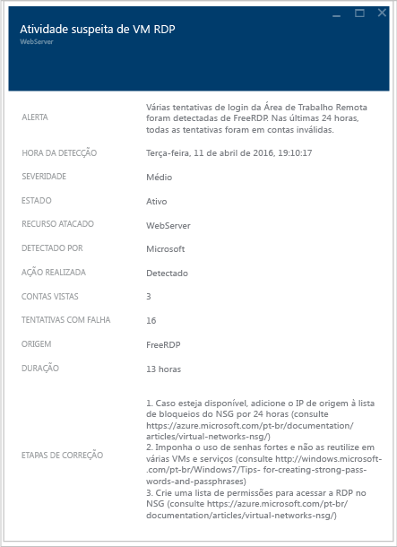

# Guia de planejamento e operações da Central de Segurança do Azure
Este guia destina-se a profissionais de TI (tecnologia da informação), arquitetos de TI, analistas de segurança da informação e administradores de nuvem cujas organizações planejam usar a Central de Segurança do Azure.

## Guia de planejamento
Este guia aborda um conjunto de etapas e tarefas que você pode seguir para otimizar seu uso da Central de Segurança com base no modelo de gerenciamento de nuvem e nos requisitos de segurança de sua organização. Para tirar total proveito da Central de Segurança, é importante entender como as pessoas ou equipes diferentes em sua organização usam o serviço para atender às necessidades de desenvolvimento e operações seguras, monitoramento, administração resposta a incidentes. As principais áreas a serem consideradas ao planejar o uso da Central de Segurança são:

* Funções de segurança e controles de acesso
* Políticas de segurança e recomendações 
* Coleta de dados e armazenamento
* Recursos não Azure em andamento
* Monitoramento contínuo de segurança
* Resposta a incidentes

Na próxima seção, você aprenderá a planejar cada uma dessas áreas e aplicar essas recomendações de acordo com suas necessidades.

> [!NOTE]
> Leia as [Perguntas frequentes (FAQ) da Central de Segurança do Azure](security-center-faq.md) para obter uma lista das perguntas comuns que também podem ser úteis durante as fases de design e planejamento.
>

## Funções de segurança e controles de acesso
Dependendo do tamanho e da estrutura de sua organização, vários indivíduos e equipes podem usar a Central de Segurança para executar tarefas variadas relacionadas à segurança. No diagrama a seguir, você tem um exemplo de pessoas fictícias e suas respectivas funções e responsabilidades de segurança:

A Central de Segurança permite que essas pessoas atendam a várias responsabilidades. Por exemplo: 

**Matheus (proprietário da carga de trabalho)**

* Gerenciar uma carga de trabalho de nuvem e seus recursos relacionados
* Responsáveis pela implementação e manutenção das proteções de acordo com a política de segurança da empresa

**Ellen (CISO/CIO)**

* Responsável por todos os aspectos de segurança da empresa
* Deseja entender a postura de segurança da empresa nas cargas de trabalho de nuvem
* Precisa ser informado dos riscos e principais ataques

**David (segurança de TI)**

* Define as políticas de segurança da empresa para garantir as devidas proteções no local
* Monitora a conformidade com as políticas
* Gera relatórios de liderança ou auditores

**Judy (Operações de Segurança)**

* Monitora e responde a alertas de segurança 24/7
* Escala para o Proprietário da Carga de Trabalho de Nuvem ou Analista de Segurança de TI

**Sam (Analista de Segurança)**

* Investiga os ataques
* Trabalhar com o Proprietário da Carga de Trabalho de Nuvem para aplicar a correção

A Central de Segurança usa o [RBAC (Controle de Acesso Baseado em Função)](../role-based-access-control/role-assignments-portal.md) que fornece [funções internas](../role-based-access-control/built-in-roles.md) que podem ser atribuídas a usuários, grupos e serviços no Azure. Quando um usuário abre a Central de Segurança, ele vê apenas as informações relacionadas aos recursos aos quais tem acesso. Isso significa que o usuário recebe a função de Leitor, Colaborador ou Proprietário para a assinatura ou grupo de recursos ao qual o recurso pertence. Além dessas funções, há duas funções específicas da Central de Segurança:

- **Leitor de segurança**: um usuário com esta essa função consegue ver somente as configurações da Central de Segurança, que inclui recomendações, alertas, política e integridade, mas não consegue fazer alterações.
- **Administrador de segurança**: o mesmo que o leitor de segurança, mas ele também pode atualizar a política de segurança, ignorar as recomendações e alertas.

As funções da Central de Segurança descritas acima não têm acesso a outras áreas de serviço do Azure como Armazenamento, Web e Móveis ou Internet das Coisas.  

Usando as pessoas explicadas no diagrama anterior, o seguinte RBAC seria necessário:

**Matheus (proprietário da carga de trabalho)**

* Proprietário/Colaborador do grupo de recursos

**David (segurança de TI)**

* Proprietário da assinatura/Colaborador ou o administrador de segurança

**Judy (Operações de Segurança)**

* Leitor de assinatura ou o Leitor de segurança para exibir alertas
* Proprietário/Colaborador ou Administrador de Segurança da assinatura necessário para descartar os alertas

**Sam (Analista de Segurança)**

* Leitor de assinatura para exibir alertas
* Proprietário/Colaborador da Assinatura necessário para descartar os alertas
* O acesso ao workspace poderá ser exigido

Algumas informações importantes a serem consideradas:

* Somente os Proprietários/Colaboradores da assinatura e Administradores de segurança podem editar uma política de segurança.
* Somente os Proprietários e os Colaboradores da assinatura e do grupo de recursos podem aplicar recomendações de segurança para um recurso.

Ao planejar o controle de acesso usando o RBAC para a Central de Segurança, compreenda quem em sua organização usará a Central de Segurança. Além disso, quais tipos de tarefas irão executar, em seguida, configurar o RBAC de acordo.

> [!NOTE]
> Recomendamos que você atribua a função menos permissiva necessária para os usuários realizarem suas tarefas. Por exemplo, os usuários que precisarem apenas exibir informações sobre o estado de segurança dos recursos, mas não precisarem executar ações, por exemplo, aplicar recomendações ou editar políticas, deverão receber a função de Leitor.
>
>

## Políticas de segurança e recomendações 
Uma política de segurança define a configuração desejada de suas cargas de trabalho e ajuda a garantir a conformidade com requisitos de regulamentação de segurança ou da empresa. Na Central de Segurança, você pode definir políticas para suas assinaturas do Azure, que podem ser adaptadas para o tipo de carga de trabalho ou a confidencialidade dos dados.

As políticas de Central de Segurança contêm os seguintes componentes:
- [Coleta de dados](https://docs.microsoft.com/azure/security-center/security-center-enable-data-collection): configurações de provisionamento de agente e de coleta de dados.
- [Política de segurança](https://docs.microsoft.com/azure/security-center/security-center-policies): uma [Azure Policy](../governance/policy/overview.md) que determina quais controles são monitorados e recomendados pela Central de Segurança ou usa a Azure Policy para criar novas definições, definir políticas adicionais e atribuir políticas a grupos de gerenciamento.
- [Notificações por email](https://docs.microsoft.com/azure/security-center/security-center-provide-security-contact-details): configurações de contatos de segurança e de notificação.
- [Tipo de preço](https://docs.microsoft.com/azure/security-center/security-center-pricing): seleção de preços Gratuito ou Standard, que determina quais recursos da Central de Segurança estão disponíveis para os recursos no escopo (pode ser especificado para assinaturas, grupos de recursos e workspaces).

> [!NOTE]
> A especificação de um contato de segurança faz com que o Azure possa falar com a pessoa certa na sua organização em caso de incidente de segurança. Leia [Fornecer detalhes de contato da segurança na Central de Segurança do Azure](https://docs.microsoft.com/azure/security-center/security-center-provide-security-contact-details) para obter mais informações sobre como habilitar essa recomendação.

### Recomendações e definições de políticas de segurança
A Central de Segurança cria automaticamente uma política de segurança padrão para cada uma de suas assinaturas do Azure. Você pode editar a política na Central de Segurança ou usar a Política do Azure para criar novas definições, definir políticas adicionais e atribuir políticas entre Grupos de Gerenciamento (que pode representar toda a organização, uma unidade de negócios nela, etc.) e monitorar a conformidade com essas políticas nesses escopos.

Antes de configurar as políticas de segurança, examine cada uma das [recomendações de segurança](https://docs.microsoft.com/azure/security-center/security-center-recommendations)e determine se essas políticas são apropriadas para suas várias assinaturas e grupos de recursos. Também é importante entender que ação deve ser realizada para lidar com as recomendações de segurança e quem na sua organização será responsável por monitorar novas recomendações e tomar as medidas necessárias.

## Coleta de dados e armazenamento
Central de segurança do Azure usa o Microsoft Monitoring Agent – este é o mesmo agente usado pelo serviço do Azure Monitor – para coletar dados de segurança de suas máquinas virtuais. Os [dados coletados](https://docs.microsoft.com/azure/security-center/security-center-enable-data-collection) por esse agente são armazenados nos seus workspaces do Log Analytics.

### Agente

Quando o provisionamento automático é habilitado na política de segurança, o Microsoft Monitoring Agent (para [Windows](https://docs.microsoft.com/azure/log-analytics/log-analytics-windows-agents) ou [Linux](https://docs.microsoft.com/azure/log-analytics/log-analytics-linux-agents)) é instalado em todas as VMs do Azure e nas que vierem a ser criadas. Se a VM ou o computador já possui o Microsoft Monitoring Agent instalado, a Central de Segurança do Azure otimizará o agente instalado atual. O processo do agente foi projetado para não ser invasivo e ter um impacto muito pequeno sobre o desempenho da VM.

O Microsoft Monitoring Agent para Windows exige o uso da porta TCP 443. Confira o [artigo de solução de problemas](security-center-troubleshooting-guide.md) para obter mais detalhes.

Se em algum momento você quiser desabilitar a Coleta de dados, desative-a na política de segurança. No entanto, como o Microsoft Monitoring Agent pode ser usado por outro serviço de gerenciamento e monitoramento do Azure, o agente não será desinstalado automaticamente quando você desligar a coleta de dados na Central de Segurança. Você pode desinstalar o agente manualmente, se necessário.

> [!NOTE]
> Para obter uma lista das VMs com suporte, leia as [Perguntas frequentes (FAQ) da Central de Segurança do Azure](security-center-faq.md).
>

### Workspace

Um workspace é um recurso do Azure que funciona como um contêiner para os dados. Você ou outros membros de sua organização podem usar vários workspaces para gerenciar diferentes conjuntos de dados que são coletados de todos ou de partes da sua infraestrutura de TI.

Os dados coletados do Microsoft Monitoring Agent (em nome da Central de Segurança do Azure) são armazenados em um espaço de trabalho do Log Analytics existente associado à sua assinatura do Azure ou em um novo espaço de trabalho, levando em conta a área geográfica da VM.

No portal do Azure, você pode navegar para ver uma lista de workspaces do Log Analytics, incluindo aqueles criados pela Central de Segurança do Azure. Um grupo de recursos relacionados será criado para novos workspaces. Ambos seguirão esta convenção de nomenclatura:

* Workspace: *DefaultWorkspace-[subscription-ID]-[geo]*
* Grupo de recursos: *DefaultResourceGroup-[geo]*

No caso de workspaces criados pela Central de Segurança do Azure, os dados serão retidos por 30 dias. No caso dos workspaces existentes, a retenção ocorre com base no tipo de preço do workspace. Se desejar, você também pode usar um workspace existente.

> [!NOTE]
> A Microsoft está comprometida com a proteção da privacidade e da segurança dos dados. A Microsoft obedece às diretrizes rígidas de conformidade e segurança — da codificação à operação de um serviço. Para saber mais sobre manipulação de dados e privacidade, leia [Segurança de dados da Central de Segurança do Azure](security-center-data-security.md).
>

## Integração de recursos não Azure

A Central de Segurança pode monitorar a postura de segurança dos computadores não Azure, mas, antes, é necessário que você integre esses recursos. Leia [Integração com a Central de Segurança do Azure Standard para aumentar a segurança](https://docs.microsoft.com/azure/security-center/security-center-onboarding#onboard-non-azure-computers) para saber mais sobre como integrar recursos não Azure.

## Monitoramento contínuo de segurança
Após a configuração inicial e a aplicação das recomendações da Central de Segurança, a próxima etapa será considerar os processos operacionais da Central de Segurança.

A Visão geral da Central de Segurança fornece um panorama unificado de segurança em todos os seus recursos do Azure e recursos não Azure conectados. O exemplo a seguir mostra um ambiente com muitos problemas a serem resolvidos:

> [!NOTE]
> A Central de Segurança não interferirá nos seus procedimentos normais de operação. Ela vai monitorar passivamente as implantações e fornecerá recomendações com base nas políticas de segurança habilitadas.

Ao aceitar usar a Central de Segurança em seu ambiente atual do Azure pela primeira vez, revise todas as recomendações, o que pode ser feito no bloco **Recomendações** ou de acordo com o recurso (**Computação**, **Rede**, **Armazenamento e Dados** e **Aplicativo**).

Depois de endereçar todas as recomendações, a seção **Prevenção** deverá ficar verde para todos os recursos endereçados. Nesse ponto, o monitoramento contínuo fica mais fácil, pois você só executará ações com base nas alterações nos blocos de integridade e de recomendações de segurança do recurso.

A seção **Detecção** é mais reativa, pois são alertas sobre os problemas que estão acontecendo agora ou que ocorreram no passado e foram detectados pelos controles da Central de Segurança e sistemas de terceiros. O bloco Alertas de Segurança mostra grafos de barras que representam o número de alertas de detecção de ameaças encontrados em cada dia, e sua distribuição entre as várias categorias de gravidade (baixa, média, alta). Para obter mais informações sobre os Alertas de Segurança, leia [Gerenciando e respondendo aos alertas de segurança na Central de Segurança do Azure](security-center-managing-and-responding-alerts.md).

Planeje acessar a opção [Inteligência contra ameaças](https://docs.microsoft.com/azure/security-center/security-center-threat-intel) como parte de suas operações diárias de segurança. Lá, você pode identificar ameaças à segurança do ambiente, como identificar se determinado computador faz parte de um botnet.

### Monitoramento de recursos novos ou alterados
A maioria dos ambientes do Azure são dinâmicos, com novos recursos gerados e excluídos regularmente, com configurações ou alterações etc. A Central de Segurança ajuda a garantir que você tenha visibilidade sobre o estado de segurança desses novos recursos.

Quando você adiciona novos recursos (VMs, Bancos de Dados SQL) ao seu Ambiente do Azure, a Central de Segurança descobre automaticamente esses recursos e começa a monitorar a segurança. Isso também inclui as funções Web do PaaS e as funções de trabalho. Se a Coleta de Dados estiver habilitada na [Política de Segurança](tutorial-security-policy.md), os recursos de monitoramento adicionais serão habilitados automaticamente para as máquinas virtuais.

1. Nas máquinas virtuais, clique em **Computação**, na seção **Prevenção**. Os possíveis problemas com a habilitação dos dados ou recomendações relacionadas ocorrerão na guia **Visão geral** e na seção **Recomendações de monitoramento**.
2. Veja as **Recomendações** para ver quais riscos de segurança, se houver, foram identificados para o novo recurso.
3. É muito comum que, quando novas VMs são adicionadas ao seu ambiente, apenas o sistema operacional seja instalado inicialmente. Talvez o proprietário do recurso precise de algum tempo para implantar outros aplicativos que serão usados por essas VMs.  É ideal que você saiba o objetivo final dessa carga de trabalho. Ele será um Servidor de Aplicativos? Com base no que essa nova carga de trabalho será, você pode habilitar a **Política de Segurança**apropriada, que é a terceira etapa neste fluxo de trabalho.
4. À medida que novos recursos são adicionados ao seu ambiente do Azure, é possível que novos alertas apareçam no bloco **Alertas de Segurança** . Sempre verifique se há novos alertas nesse bloco e tome ações de acordo com as recomendações da Central de Segurança.

Convém também monitorar regularmente o estado dos recursos existentes para identificar as alterações de configuração que criaram riscos de segurança, desvios das linhas de base recomendadas e alertas de segurança. Inicie no painel da Central de Segurança. A partir daí, há três áreas principais a serem analisadas de forma consistente.

1. O painel da seção **Prevenção** fornece acesso rápido aos recursos chave. Use esta opção para monitorar Computação, Rede, Armazenamento e dados e Aplicativos.
2. O painel **Recomendações** permite que você examine as recomendações da Central de Segurança. Durante o monitoramento contínuo, você pode achar que não há recomendações diárias, o que é normal, pois endereçou todas as recomendações na configuração inicial da Central de Segurança. Por esse motivo, talvez você não tenha novas informações nesta seção diariamente e precisará acessá-la apenas de acordo com a necessidade.
3. A seção **Detecção** pode ser alterada de forma muito ou pouco frequente. Sempre examine os alertas de segurança e tome ações com base nas recomendações da Central de Segurança.

### Proteção de acesso e aplicativos

Como parte de suas operações de segurança, você também deve adotar medidas preventivas para restringir o acesso às VMs e controlar os aplicativos que estão em execução nas VMs. Ao bloquear o tráfego de entrada para suas VMs do Azure, você estará reduzindo a exposição a ataques e, ao mesmo tempo, fornecendo acesso fácil para conexão com as VMs quando necessário. Use o recurso de acesso [VMs just in time](https://docs.microsoft.com/azure/security-center/security-center-just-in-time) para proteger o acesso a suas VMs.

Você pode usar [Controles de Aplicativo Adaptáveis](https://docs.microsoft.com/azure/security-center/security-center-adaptive-application) para controlar quais aplicativos podem ser executados em suas VMs localizadas no Azure, o que ajuda a proteger suas VMs de malware, dentre outros benefícios. A Central de Segurança usa o aprendizado de máquina para analisar os processos em execução na VM e ajuda a aplicar regras de lista de permissões usando essa inteligência.

## Resposta a incidentes
A Central de Segurança detecta e alerta você sobre as ameaças à medida que elas ocorrem. As organizações devem monitorar novos alertas de segurança e tomar as medidas necessárias para investigar com mais profundidade ou corrigir o ataque. Para obter mais informações sobre como funciona a detecção de ameaças da Central de Segurança, leia [Recursos de detecção da Central de Segurança do Azure](security-center-detection-capabilities.md).

Embora este artigo não tenha a intenção de ajudá-lo a criar seu próprio plano de Resposta a Incidentes, usaremos a Resposta de Segurança do Microsoft Azure no ciclo de vida da Nuvem como a base para os estágios de resposta a incidentes. Os estágios são mostrados no diagrama a seguir:

> [!NOTE]
> Você pode usar o [Guia de Tratamento de Incidentes de Segurança do Computador](https://nvlpubs.nist.gov/nistpubs/SpecialPublications/NIST.SP.800-61r2.pdf) do NIST (Instituto Nacional de Padrões e Tecnologia) como uma referência para ajudar a criar seu próprio plano.
>

Você pode usar os Alertas da Central de Segurança durante os estágios a seguir:

* **Detectar**: identifica uma atividade suspeita em um ou mais recursos.
* **Avaliar**: realiza a avaliação inicial para obter mais informações sobre a atividade suspeita.
* **Diagnosticar**: usa as etapas de correção para realizar o procedimento técnico para endereçar o problema.

Cada Alerta de segurança fornece informações que podem ser usadas para entender melhor a natureza do ataque e sugerir possíveis atenuações. Alguns alertas também fornecem links para mais informações ou para outras fontes de informações no Azure. Você pode usar as informações fornecidas para pesquisa e para começar o processo de atenuação, e também pode pesquisar dados relacionados à segurança que fiquem armazenados no workspace.

O exemplo a seguir mostra uma atividade de RDP suspeita ocorrendo:

Essa página mostra os detalhes sobre o horário do ataque, o nome do host de origem, a VM de destino e também fornece etapas de recomendação. Em algumas circunstâncias, as informações de origem do ataque podem estar vazias. Leia [Informações de Origem Ausentes nos Alertas da Central de Segurança do Azure](https://blogs.msdn.microsoft.com/azuresecurity/2016/03/25/missing-source-information-in-azure-security-center-alerts/) para obter mais informações sobre esse tipo de comportamento.

Nessa página, você também pode iniciar uma [investigação](https://docs.microsoft.com/azure/security-center/security-center-investigation) para entender melhor a linha do tempo do ataque, como o ataque ocorreu, quais sistemas foram possivelmente comprometidos, as credenciais que foram usadas, além de ver uma representação gráfica de toda a cadeia de ataque.

Depois de identificar o sistema comprometido, você pode executar [guias estratégicos](https://docs.microsoft.com/azure/security-center/security-center-playbooks) de segurança que foram criados anteriormente. Guia estratégico de segurança é uma coleção de procedimentos que podem ser executados na Central de Segurança depois que determinado guia estratégico é disparado pelo alerta selecionado.

No vídeo [Como Utilizar a Central de Segurança do Azure e o Microsoft Operations Management Suite para obter uma Resposta a Incidentes](https://channel9.msdn.com/Blogs/Taste-of-Premier/ToP1703), você pode ver algumas demonstrações que podem ajudar a entender como a Central de Segurança pode ser usada em cada um desses estágios.

> [!NOTE]
> Leia [Aproveitando a Central de Segurança do Azure para a Resposta a Incidentes](security-center-incident-response.md) para saber mais sobre como usar os recursos da Central de Segurança como auxílio durante o processo de Resposta a incidentes.
>
>

## Próximas etapas
Neste documento, você aprendeu a planejar a adoção da Central de Segurança. Para saber mais sobre a Central de Segurança, confira o seguinte:

* [Gerenciando e respondendo a alertas de segurança na Central de segurança do Azure](security-center-managing-and-responding-alerts.md)
* [Monitoramento da integridade de segurança na Central de Segurança do Azure](security-center-monitoring.md) – saiba como monitorar a integridade dos recursos do Azure.
* [Monitorando as soluções de parceiros com a Central de Segurança do Azure](security-center-partner-solutions.md) – saiba como monitorar o status de integridade de suas soluções de parceiros.
* [Perguntas frequentes da Central de Segurança do Azure](security-center-faq.md) : encontre as perguntas frequentes sobre como usar o serviço.
* [Blog de Segurança do Azure](https://blogs.msdn.com/b/azuresecurity/) : encontre postagens no blog sobre conformidade e segurança do Azure.
