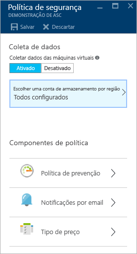
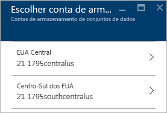
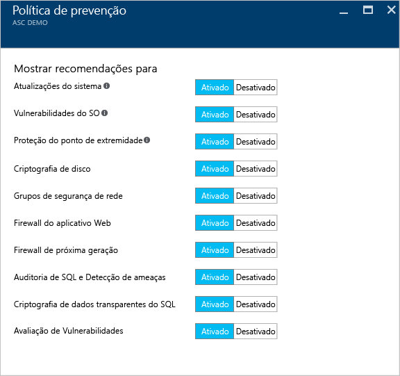
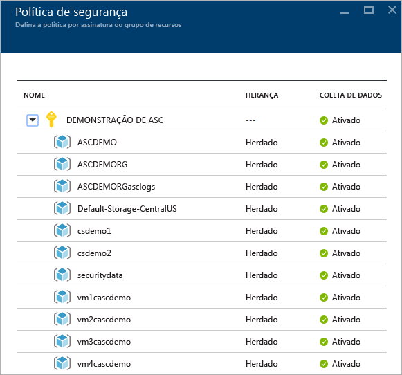
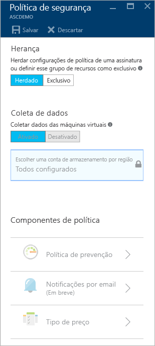

# Configurar políticas de segurança na Central de Segurança do Azure
Este documento ajuda a configurar as políticas de segurança na Central de Segurança, guiando você nas etapas necessárias para executar essa tarefa.

## Quais são políticas de segurança?
Uma política de segurança define o conjunto de controles que são recomendados para os recursos na assinatura ou grupo de recursos especificado. Na Central de Segurança, você define as políticas para o grupo de recursos ou as assinaturas do Azure de acordo com as necessidades de segurança de sua empresa e os tipos de aplicativos ou a confidencialidade dos dados de cada assinatura.

Por exemplo, os recursos usados para o desenvolvimento ou teste podem ter requisitos de segurança diferentes daqueles usados para os aplicativos de produção. Da mesma forma, os aplicativos com dados regulamentados, como as informações de identificação pessoal, podem requerer um nível mais alto de segurança. As políticas de segurança habilitadas na Central de Segurança do Azure determinam as recomendações de segurança e o monitoramento para ajudar a identificar as potenciais vulnerabilidades e atenuar as ameaças. Leia o [Guia de Planejamento e Operações da Central de Segurança do Azure](security-center-planning-and-operations-guide.md) para obter mais informações sobre como determinar a opção adequada para você.

## Definir políticas de segurança para as assinaturas
É possível configurar políticas de segurança para cada assinatura ou grupo de recursos. Para modificar uma política de segurança, você deve ser um proprietário ou colaborador dessa assinatura. Acesse o portal do Azure e siga as etapas abaixo para configurar as políticas de segurança na Central de Segurança:

1. Clique no bloco **Política** no painel Central de Segurança.
2. Na folha **Política de Segurança - Definir política por assinatura ou grupo de recursos** que é aberta, selecione a assinatura na qual você deseja habilitar a política de segurança. Se você preferir habilitar a política de segurança para um grupo de recursos em vez da assinatura inteira, role para baixo até a próxima seção que informa sobre como configurar políticas de segurança para os grupos de recursos.
   
    
3. A folha **Política de segurança** da assinatura selecionada é aberta com um conjunto de opções semelhantes à seguinte captura de tela:
   
    
   
    As opções disponíveis nesta folha são:
   
   * **Política prevenção**: use essa opção para configurar as políticas por assinatura ou grupo de recursos.  
   * **Notificação por email**: use essa opção para configurar uma notificação por email que é enviada na primeira ocorrência diária de um alerta e para os alertas de alta gravidade. As preferências do email podem ser configuradas apenas para as políticas da assinatura. Leia [Fornecer detalhes de contato da segurança na Central de Segurança do Azure](security-center-provide-security-contact-details.md) para obter mais informações sobre como configurar uma notificação por email.
   * **Camada de preços**: use essa opção para atualizar a seleção do tipo de preços. Consulte a [página da Central de Segurança](https://azure.microsoft.com/pricing/details/security-center/) para saber mais sobre as opções de preços.
4. Verifique se a opção **Coletar dados das máquinas virtuais** está **Ativada**. Essa opção habilita a coleta de log automático para recursos novos e existentes.
   
   > [!NOTE]
   > É recomendável que você ative a coleta de dados para cada uma de suas assinaturas para assegurar que o monitoramento de segurança esteja disponível para todas as VMs novas e existentes. Habilitar a coleta de dados instala o agente de monitoramento. Se você não quiser ativar a coleta de dados agora nesse local, poderá fazer isso posteriormente nas exibições **Integridade** e **Recomendações**. Você também pode habilitar a coleta de dados para somente a assinatura ou selecionar as VMs. Consulte as [Perguntas frequentes sobre o Centro de segurança do Azure](security-center-faq.md) para saber mais sobre as VMs com suporte.
   > 
   > 
5. Se sua conta de armazenamento ainda não foi configurada, você poderá ver um aviso como este na tela a seguir quando abrir a **Política de Segurança**. Se você não escolher uma conta de armazenamento para cada região, ela será criada para você.
   
    
6. Se você vir esse aviso, clique nesta opção e selecione a região, como mostrado na seguinte tela:
   
    
7. Para cada região em que você tem máquinas virtuais em execução, escolha a conta de armazenamento na qual os dados coletados dessas máquinas virtuais estão armazenados. Isso facilita manter os dados na mesma área geográfica para fins de privacidade e soberania dos dados. Após decidir a região que você usará, selecione-a, em seguida, selecione a conta de armazenamento.
8. Na folha **Escolher contas de armazenamento**, clique em **OK**.
   
   > [!NOTE]
   > Se preferir, você pode agregar os dados em uma conta de armazenamento central para as máquinas virtuais em várias regiões. Consulte as [Perguntas frequentes sobre a Central de Segurança do Azure](security-center-faq.md) para obter mais informações.
   > 
   > 
9. Na folha **Política de Segurança**, clique em **Ativar** para habilitar as recomendações de segurança que você deseja usar nesta assinatura. Clique em **Política de prevenção** para ver opções como as mostradas na seguinte captura de tela:
   
    

Use a tabela a seguir como referência para entender cada opção:

| Política | Quando o estado está ativado |
| --- | --- |
| Atualizações do sistema |Recupera uma lista diária das atualizações de segurança e críticas do Windows Update ou dos Serviços de Atualização do Windows Server. A lista recuperada depende do serviço configurado para a máquina virtual e recomenda que as atualizações que faltam sejam aplicadas. Para os sistemas Linux, a política usa o sistema de gerenciamento de pacotes fornecido pela distribuição para determinar os pacotes com atualizações disponíveis. Também verifica as atualizações de segurança e críticas das máquinas virtuais dos [Serviços de Nuvem do Azure](../cloud-services/cloud-services-how-to-configure.md). |
| Vulnerabilidades do SO |Analisa as configurações do sistema operacional diariamente para determinar os problemas que podem tornar a máquina virtual vulnerável a ataques. A política também recomenda alterações de configuração para tratar essas vulnerabilidades. Consulte a [lista de linhas de base recomendadas](https://gallery.technet.microsoft.com/Azure-Security-Center-a789e335) para obter mais informações sobre as configurações específicas que estão sendo monitoradas. |
| Proteção do ponto de extremidade |Recomenda que seja fornecida uma proteção do ponto de extremidade para todas as máquinas virtuais do Windows para ajudar a identificar e remover vírus, spyware e outros softwares mal-intencionados. |
| Criptografia do disco |Recomenda-se habilitar a criptografia de disco em todas as máquinas virtuais para aprimorar a proteção de dados em repouso. |
| Grupos de segurança de rede |Recomenda que os [grupos de segurança da rede](../virtual-network/virtual-networks-nsg.md) sejam configurados para controlar os tráfegos de entrada e saída para as VMs com pontos de extremidade públicos. Os grupos de segurança da rede configurados para uma sub-rede serão herdados por todas as interfaces de rede da máquina virtual, a menos que o contrário seja especificado. Além de verificar se um grupo de segurança da rede foi configurado, essa política avalia as regras de segurança de entrada para identificar as regras que permitem o tráfego de entrada. |
| Firewall do aplicativo Web |Recomenda que um firewall do aplicativo Web seja provisionado nas máquinas virtuais quando uma das seguintes opções é verdadeira:  [IP público em nível de instância](../virtual-network/virtual-networks-instance-level-public-ip.md) (ILPIP) é usado e as regras de segurança de entrada para o grupo de segurança de rede associado são configuradas para permitir o acesso à porta 80/443.  O IP de balanceamento de carga é usado e o balanceamento de carga associado e as regras NAT (conversão do endereço de rede de entrada) são configurados para permitir o acesso à porta 80/443. (Para obter mais informações, consulte [Suporte do Azure Resource Manager para o Balanceador de Carga](../load-balancer/load-balancer-arm.md). |
| Firewall da próxima geração |Estende as proteções da rede para além dos grupos de segurança da rede, que são internos no Azure. A Central de Segurança descobrirá as implantações para as quais um firewall da próxima geração é recomendado e permitirá que você forneça um dispositivo virtual. |
| Auditoria e detecção de ameaças do SQL |Recomenda que a auditoria de acesso ao Banco de Dados do Azure esteja habilitada para conformidade, e também para detecção de ameaça avançada, para fins de investigação. |
| Transparent data encryption do SQL |Recomenda que a criptografia em repouso seja habilitada para o Banco de Dados SQL, backups associados e arquivos do log de transação. Mesmo se seus dados sejam violados, eles não poderão ser lidos. |
| Avaliação de vulnerabilidade |Recomenda que você instale uma solução de avaliação de vulnerabilidade na VM. |

Depois de configurar todas as opções, clique em **OK** na folha **Política de Segurança** com as recomendações e clique em **Salvar** na folha **Política de Segurança** com as configurações iniciais.

## Definir políticas de segurança para os grupos de recursos
Se você preferir configurar as políticas de segurança por grupo de recursos, as etapas serão semelhantes às usadas para configurar as políticas de segurança para as assinaturas. A principal diferença é que você precisará expandir o nome da assinatura e selecionar o grupo de recursos para o qual deseja configurar a política de segurança exclusiva:

Após selecionar o grupo de recursos, a folha **Política de segurança** é aberta. Por padrão, a opção **Herança** é habilitada. Isto significa que todas as políticas de segurança para esse grupo de recursos são herdadas do nível da assinatura. Você pode alterar essa configuração caso queira uma política de segurança personalizada por um grupo de recursos. Nesse caso, você precisa selecionar **Exclusiva** e fazer alterações na opção **Política de prevenção**.

> [!NOTE]
> No caso de um conflito entre a política no nível da assinatura e a política no nível do grupo de recursos, a política no nível do grupo de recursos terá precedência.
> 
> 

## Confira também
Neste documento, você aprendeu como configurar políticas de segurança na Central de segurança do Azure. Para saber mais sobre a Central de Segurança do Azure, veja o seguinte:

* [Guia de planejamento e operações da Central de Segurança do Azure](security-center-planning-and-operations-guide.md). Saiba como planejar e entender as considerações de design para adotar a Central de Segurança do Azure.
* [Monitoramento da integridade de segurança na Central de Segurança do Azure](security-center-monitoring.md). Saiba como monitorar a integridade dos recursos do Azure.
* [Gerenciando e respondendo aos alertas de segurança na Central de Segurança do Azure](security-center-managing-and-responding-alerts.md). Saiba como gerenciar e responder aos alertas de segurança.
* [Monitoramento das soluções de parceiros na Central de Segurança do Azure](security-center-partner-solutions.md). Saiba como monitorar o status da integridade das soluções dos parceiros.
* [Perguntas Frequentes sobre a Central de Segurança do Azure](security-center-faq.md). Encontre as perguntas frequentes sobre como usar o serviço.
* [Blog de Segurança do Azure](http://blogs.msdn.com/b/azuresecurity/). Encontre postagens no blog sobre a conformidade e segurança do Azure.

<!--HONumber=Jan17_HO2-->

