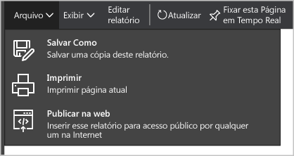

<properties
   pageTitle="Obter percepções de dados da Central de Segurança do Azure com o Power BI | Microsoft Azure"
   description="O pacote de conteúdo do Power BI da Central de Segurança do Azure facilita a localização de alertas de segurança, recomendações, recursos atacados e tendências, com base em um conjunto de dados que foi criado para o relatório."
   services="security-center"
   documentationCenter="na"
   authors="YuriDio"
   manager="swadhwa"
   editor=""/>

<tags
   ms.service="security-center"
   ms.devlang="na"
   ms.topic="hero-article"
   ms.tgt_pltfrm="na"
   ms.workload="na"
   ms.date="06/03/2016"
   ms.author="yurid"/>

# Obtenha percepções de dados da Central de Segurança do Azure com o Power BI
O [Painel do Power BI](http://aka.ms/azure-security-center-power-bi) para a Central de Segurança do Azure o habilita a visualizar, analisar e filtrar recomendações e alertas de segurança de qualquer lugar, incluindo seu dispositivo móvel. Use o painel do Power BI para revelar tendências e padrões, exibir alertas de segurança por recurso ou endereço IP de origem e riscos de segurança não tratados por recurso ou idade. Você pode também combinar as recomendações da Central de Segurança e alertas de segurança com outros dados de maneiras interessantes, por exemplo, com os [Logs de Auditoria do Azure](https://powerbi.microsoft.com/blog/monitor-azure-audit-logs-with-power-bi/) e a [Auditoria do Banco de Dados SQL do Azure](https://powerbi.microsoft.com/blog/monitor-your-azure-sql-database-auditing-activity-with-power-bi/), que oferecem painéis do Power BI, ou pode exportar esses dados para o Excel para facilmente produzir relatórios sobre o estado de segurança de seus recursos da nuvem.

> [AZURE.NOTE] As informações neste documento se aplicam à versão de visualização da Central de Segurança do Azure.

##Como usar o painel da Central de Segurança do Azure para acessar o Power BI
Você também pode usar o painel da Central de Segurança do Azure para acessar relatórios do Power BI. Siga as etapas abaixo para executar essa tarefa:

1. No painel **Central de Segurança do Azure**, clique no botão **Explorar no Power BI**.

	

2. A folha **Explorar no Power BI** será aberta no lado direito, conforme mostrado abaixo:

	

3. Se você estiver criando o painel do Power BI pela primeira vez, poderá escolher uma das opções abaixo na folha Explorar no Power BI:

	- **Painel de informações da segurança**: escolha essa opção se você quiser criar um painel que inclua o status de segurança, threads e detecções. Essa é uma opção mais comum para a função DevOps responsável pela análise de seu status de proteção e alertas detectados nas assinaturas.
	- **Painel de gerenciamento da política**: escolha essa opção se você quiser explorar o gerenciamento e a imposição da política. Essa é uma opção mais comum para a Central de TI, que está mais focada na governança. Ela pode usar esse painel para ganhar visibilidade e ter ideias sobre a conformidade da política de segurança em toda a organização.
	- Se você já tiver um painel do Power BI, clique em **Ir para o painel do Power BI atual**.

4. Neste exemplo, clique em **Painel de informações de segurança** e a janela abaixo será exibida:

	

5. Verifique se o **Método de autenticação** é **oAuth2** e clique em **Entrar**.
6. A janela **Power BI** será aberta e você verá um relatório com uma estrutura semelhante, conforme mostrado abaixo:
	
	

> [AZURE.NOTE] Uma atualização do relatório é agendada para ocorrer diariamente. Se houver uma falha dessa atualização, leia [Possíveis Problemas de Atualização com o Power BI da Central de Segurança do Azure](https://blogs.msdn.microsoft.com/azuresecurity/2016/04/07/azure-security-center-power-bi-refresh-fails/) para saber mais sobre como solucionar problemas.

Aqui, você pode ver o número de alertas de segurança e recomendações, além do número de VMs, bancos de dados SQL do Azure e recursos da rede que estão sendo monitorados pela Central de Segurança do Azure.

Um link para a Central de Segurança do Azure o redirecionará para o portal do Azure. Os gráficos facilitam a visualização de informações sobre recomendações de segurança e alertas, incluindo:

- Integridade da Segurança de Recursos
- Recomendações Pendentes Gerais
- Recomendações de VM
- Alertas ao Longo do Tempo
- Recursos Atacados
- IPs Atacados

Por trás de cada gráfico, há percepções adicionais. Selecione um bloco para obter mais informações. Por exemplo, o bloco Integridade de Segurança do Recurso mostra detalhes adicionais sobre as recomendações pendentes pelos recursos, conforme mostrado abaixo:

Se você clicar em qualquer linha do gráfico, as outras ficarão acinzentadas e você focará apenas na selecionada. Para retornar ao painel, clique em **Central de Segurança do Azure** na opção **Painéis** no painel esquerdo dessa página.

> [AZURE.NOTE] Se você quiser personalizar seus relatórios adicionando campos extras ou alterando os visuais existentes, poderá editar o relatório. Leia [Interagir com um relatório no Modo de Edição no Power BI](https://powerbi.microsoft.com/documentation/powerbi-service-interact-with-a-report-in-editing-view/) para saber mais.

Os blocos **Alertas ao Longo do Tempo, Recursos Atacados** e **IPs do Invasor** terão resultados semelhante ao clicar em cada um deles. Isso ocorre porque o relatório agrega informações sobre essas três variáveis e chama-as de **Recursos sob Ataque**, conforme mostrado abaixo:

Nesse ponto, você pode também salvar uma cópia do relatório, imprimi-lo ou publicá-lo na Web usando as opções disponíveis no menu **Arquivo**.

## Como explorar seus dados da Central de Segurança do Azure com serviços do Power BI

Conecte os [Serviços do Pacote de Conteúdo do Power BI](https://msit.powerbi.com/groups/me/getdata/services) no Power BI e siga as etapas abaixo:

1. Na janela **Pacote de Conteúdo do Power BI**, você verá duas opções, conforme mostrado abaixo.

	

2. Para este exemplo, clique em **Obter** no bloco **Gerenciamento de Política do Centro de Segurança do Azure**.

3. Na janela **Conectar Gerenciamento de Política do Centro de Segurança do Azure**, selecione **oAuth2** no menu suspenso **Método de Autenticação**, como mostrado abaixo e clique no botão **Entrar**.

	

4. Você será redirecionado para uma página de autenticação, na qual deverá digitar as credenciais que está usando para conectar a Central de Segurança do Azure. Após o processo de autenticação ser concluído, o Power BI iniciará a importação dos dados para criar seus relatórios. Durante esse período, você verá a seguinte mensagem no canto direito do navegador:

	

	>[AZURE.NOTE] Quando o painel está sendo criado pela primeira vez, pode levar mais tempo, principalmente para os cenários nos quais você tem várias assinaturas.

5. Com o processo concluído, o painel Power BI da Central de Segurança do Azure carregará o relatório **Gerenciamento de Política**.

## Próximas etapas
Neste documento, você aprendeu a usar o Power BI na Central de Segurança do Azure. Para saber mais sobre a Central de Segurança do Azure, veja o seguinte:

- [Guia de Operações e Planejamento da Central de Segurança do Azure](security-center-planning-and-operations-guide.md) - saiba como planejar a adoção da Central de Segurança do Azure.
- [Configurando políticas de segurança na Central de Segurança do Azure](security-center-policies.md) – saiba como configurar políticas de segurança na Central de Segurança do Azure
- [Gerenciando e respondendo a alertas de segurança na Central de Segurança do Azure](security-center-managing-and-responding-alerts.md) – aprenda a gerenciar e a responder a alertas de segurança
- [Perguntas frequentes sobre a Central de Segurança do Azure](security-center-faq.md) – encontre perguntas frequentes sobre como usar o serviço
- [Blog de segurança do Azure](http://blogs.msdn.com/b/azuresecurity/) – encontre postagens no blog sobre conformidade e segurança do Azure

<!---HONumber=AcomDC_0608_2016-->