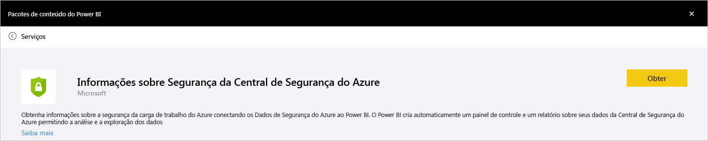
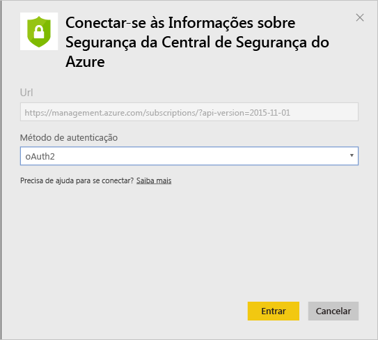
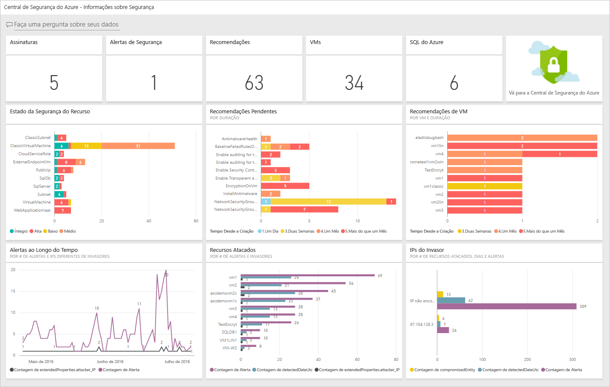
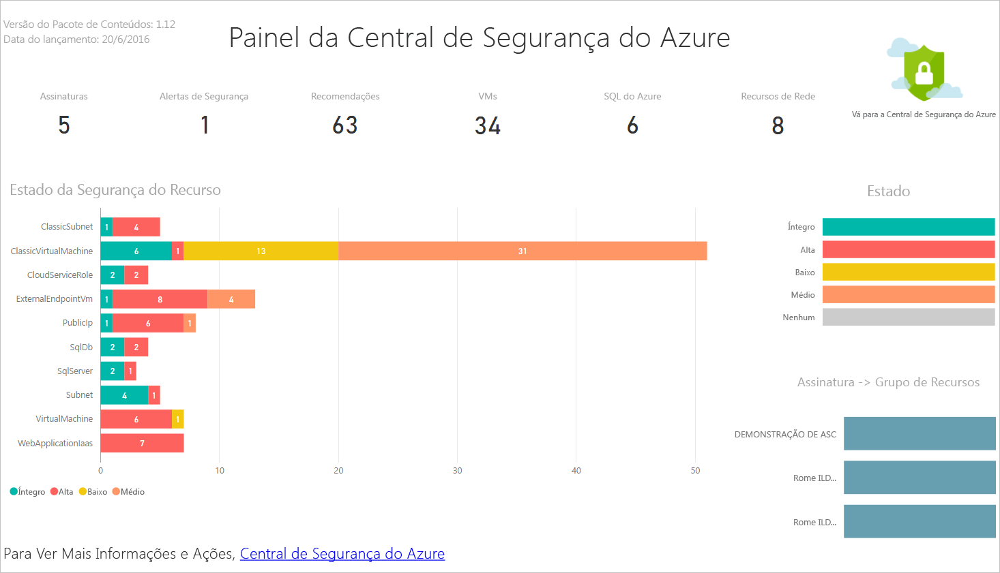
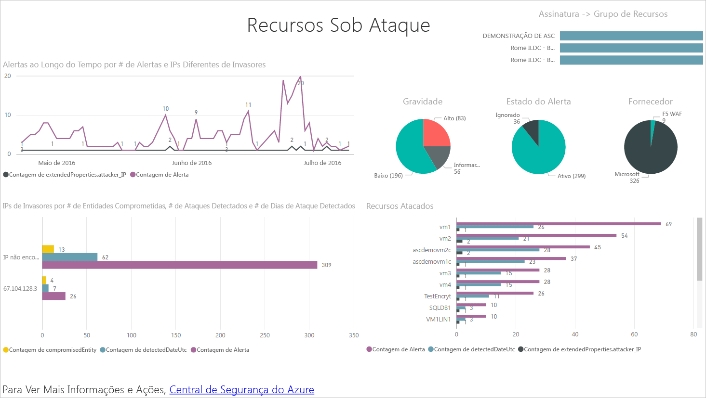
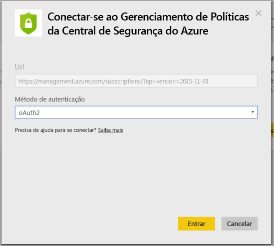
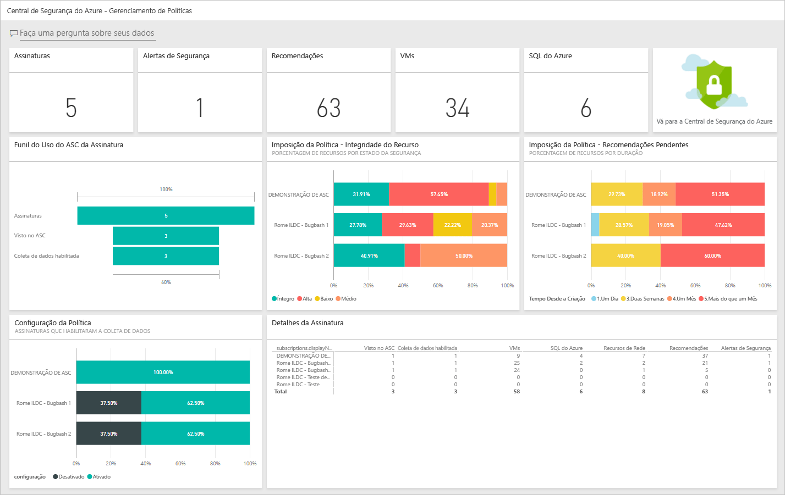

# Obtenha percepções de dados da Central de Segurança do Azure com o Power BI
O [Painel do Power BI](http://aka.ms/azure-security-center-power-bi) para a Central de Segurança do Azure o habilita a visualizar, analisar e filtrar recomendações e alertas de segurança de qualquer lugar, incluindo seu dispositivo móvel. Use o painel do Power BI para revelar tendências e padrões, exibir alertas de segurança por recurso ou endereço IP de origem e riscos de segurança não tratados por recurso ou idade.

Você também pode combinar recomendações e alertas de segurança do Security Center com outros dados de maneiras interessantes, por exemplo, usando dados dos [Logs de auditoria do Azure](https://powerbi.microsoft.com/blog/monitor-azure-audit-logs-with-power-bi/) e da [Auditoria do Banco de Dados SQL do Azure](https://powerbi.microsoft.com/blog/monitor-your-azure-sql-database-auditing-activity-with-power-bi/). Ambos oferecem Painéis do Power BI, e você também pode exportar esses dados para o Excel para produzir relatórios facilmente sobre o estado de segurança de seus recursos de nuvem.

## Como usar o painel da Central de Segurança do Azure para acessar o Power BI
Você também pode usar o painel da Central de Segurança do Azure para acessar relatórios do Power BI. Siga as etapas abaixo para executar esta tarefa:

1. No painel **Central de Segurança do Azure**, clique no botão **Power BI**.

    
2. A folha **Power BI** será aberta no lado direito, como mostrado na tela a seguir:

    
3. Se você estiver criando o painel do Power BI pela primeira vez, poderá escolher uma das seguintes opções na folha **Explorar no Power BI** :

   * **Painel de informações da segurança**: escolha essa opção se você quiser criar um painel que inclua o status de segurança, threads e detecções. Esta opção é a mais comum para a função DevOps responsável pela análise de seu status de proteção e alertas detectados nas assinaturas.
   * **Painel de gerenciamento da política**: escolha essa opção se você quiser explorar o gerenciamento e a imposição da política.  Esta opção é a mais comum para a TI Central, que está mais focada na governança. Ela pode usar esse painel para ganhar visibilidade e ter ideias sobre a conformidade da política de segurança em toda a organização.
   * Se você já tiver um painel do Power BI, clique em **Ir para o painel do Power BI atual**.
4. Neste exemplo, clique na opção **Painel de informações de segurança** . Se esta for a primeira vez que você estiver criando um painel do Power BI para a Central de Segurança, será solicitada a instalação do pacote de conteúdo. Clique no botão **Obter** na janela **Pacotes de conteúdo do Power BI** como mostrado abaixo:

    
5. A janela **Conectar ao Azure Security Center Security Insights** é exibida. Verifique se o Método de **autenticação** é **oAuth2**, como mostrado abaixo, e clique no botão **Entrar**.

    
6. Você pode ser solicitado a autenticar novamente com suas credenciais do Azure. Depois de autenticar, seu painel será criado. Depois de criar o painel, você verá um relatório com uma estrutura semelhante à mostrada na tela a seguir:

    

> [!NOTE]
> Uma atualização do relatório é agendada para ocorrer diariamente. Se houver uma falha dessa atualização, leia [Possíveis problemas de atualização com o Power BI da Central de Segurança do Azure](https://blogs.msdn.microsoft.com/azuresecurity/2016/04/07/azure-security-center-power-bi-refresh-fails/)para saber mais sobre como solucionar problemas.
>
>

Aqui, você pode ver o número de alertas de segurança e recomendações, além do número de VMs, bancos de dados SQL do Azure e recursos da rede que estão sendo monitorados pela Central de Segurança do Azure.

Um link para a Central de Segurança do Azure o redirecionará para o portal do Azure. Os gráficos facilitam a visualização de informações sobre recomendações de segurança e alertas, incluindo:

* Estado da Segurança de Recursos
* Recomendações Pendentes
* Recomendações de VM
* Alertas ao Longo do Tempo
* Recursos Atacados
* IPs Atacados

Por trás de cada gráfico, há percepções adicionais. Selecione um bloco para obter mais informações. Por exemplo, o bloco **Estado de Segurança do Recurso** mostra detalhes adicionais sobre as recomendações pendentes pelos recursos, como mostrado na tela a seguir:

Se você clicar em qualquer linha do gráfico, as outras ficarão acinzentadas e você focará apenas na selecionada. Para retornar ao painel, clique em **Central de Segurança do Azure** na opção **Painéis** no painel esquerdo dessa página.

> [!NOTE]
> Se você quiser personalizar seus relatórios adicionando campos extras ou alterando os visuais existentes, poderá editar o relatório. Leia [Interagir com um relatório no Modo de Edição no Power BI](https://powerbi.microsoft.com/documentation/powerbi-service-interact-with-a-report-in-editing-view/) para saber mais.
>
>

Os blocos **Alertas ao Longo do Tempo, Recursos Atacados** e **IPs do Invasor** terão resultados semelhante ao clicar em cada um deles. Isso ocorre porque o relatório agrega informações sobre essas três variáveis e chama-as de **Recursos sob Ataque** , como mostrado na tela abaixo:

Nesse ponto, você pode também salvar uma cópia do relatório, imprimi-lo ou publicá-lo na Web usando as opções disponíveis no menu **Arquivo** .

## Como explorar seus dados da Central de Segurança do Azure com serviços do Power BI
Conecte os [Serviços do Pacote de Conteúdo do Power BI](https://msit.powerbi.com/groups/me/getdata/services) no Power BI e siga as etapas abaixo:

1. Na janela **Pacote de Conteúdo do Power BI** , você verá duas opções, conforme mostrado abaixo.

    

   > [!NOTE]
   > Se já executou a primeira parte deste artigo, você verá somente uma opção, o que é Gerenciamento de Política da Central de Segurança do Azure.
   >
   >
2. Para este exemplo, clique em **Obter** no bloco **Gerenciamento de Política da Central de Segurança do Azure**.
3. Na janela **Conectar Gerenciamento de Política da Central de Segurança do Azure**, selecione **oAuth2** no menu suspenso **Método de Autenticação**, como mostrado abaixo e clique no botão **Entrar**.

    
4. Você será redirecionado para uma página de autenticação, na qual deverá digitar as credenciais que está usando para conectar a Central de Segurança do Azure. Após o processo de autenticação ser concluído, o Power BI iniciará a importação dos dados para criar seus relatórios. Durante esse período, você verá a seguinte mensagem no canto direito do navegador:

    

   > [!NOTE]
   > Quando o painel estiver sendo criado pela primeira vez, isso poderá demorar um pouco mais, principalmente para os cenários nos quais você tem várias assinaturas.
   >
   >
5. Com o processo concluído, o painel Power BI da Central de Segurança do Azure carregará o relatório **Gerenciamento de Política** semelhante ao mostrado abaixo:

    

## Confira também
Neste documento, você aprendeu a usar o Power BI na Central de Segurança do Azure. Para saber mais sobre a Central de Segurança do Azure, veja o seguinte:

* [Guia de Operações e Planejamento da Central de Segurança do Azure](security-center-planning-and-operations-guide.md) : saiba como planejar a adoção da Central de Segurança do Azure.
* [Configurando políticas de segurança na Central de Segurança do Azure](security-center-policies.md) : saiba como configurar políticas de segurança na Central de Segurança do Azure
* [Gerenciando e respondendo aos alertas de segurança na Central de Segurança do Azure](security-center-managing-and-responding-alerts.md) : aprenda a gerenciar e responder aos alertas de segurança
* [Perguntas frequentes da Central de Segurança do Azure](security-center-faq.md) : encontre as perguntas frequentes sobre como usar o serviço
* [Blog de Segurança do Azure](http://blogs.msdn.com/b/azuresecurity/) – encontre postagens no blog sobre conformidade e segurança do Azure

