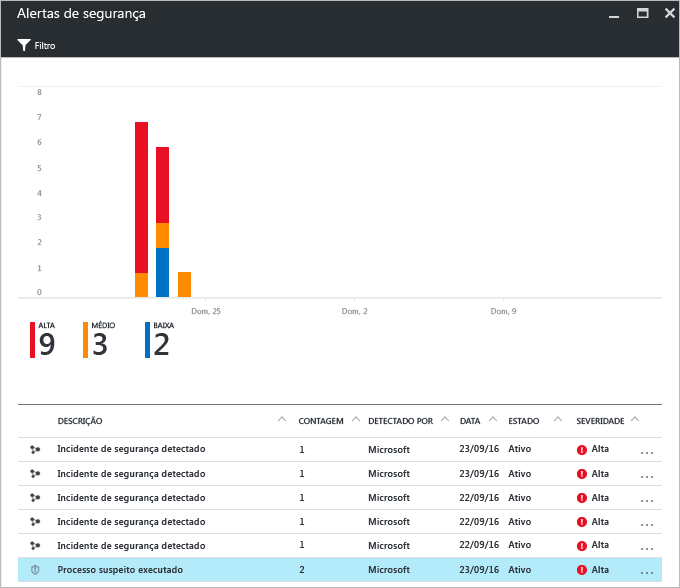
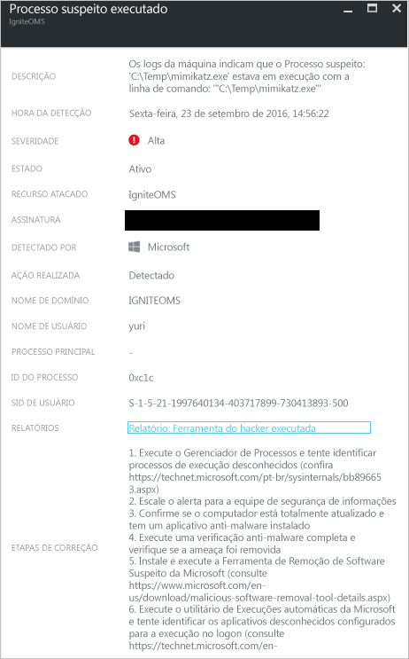

# Relatório de Inteligência de Ameaças da Central de Segurança do Azure
Este documento explica como os Relatórios Inteligentes de Ameças da Central de Segurança do Azure podem ajudá-lo a saber mais sobre uma ameaça que gerou um alerta de segurança.

## O que é um relatório de inteligência de ameaças?
A detecção de ameaças da Central de Segurança funciona monitorando informações de segurança de seus recursos do Azure, de rede e de soluções de parceiros conectados automaticamente. Ele analisa essas informações geralmente correlacionando informações de várias fontes para identificar ameaças. Esse processo faz parte dos [recursos de detecção](security-center-detection-capabilities.md) da Central de Segurança.

Quando a Central de Segurança identifica uma ameaça, ele dispara um [alerta de segurança](security-center-managing-and-responding-alerts.md), que contém informações sobre um evento específico, incluindo sugestões de correção detalhadas. Para ajudar as equipes de resposta a incidentes a investigar e a corrigir ameaças, a Central de Segurança inclui um relatório de inteligência de ameaças que contém informações sobre a ameaça detectada, incluindo informações como:

* Identidade ou associações do invasor (se essas informações estiverem disponíveis)
* Objetivos dos invasores
* Campanhas de ataque atuais e históricas (se essas informações estiverem disponíveis)
* Táticas, ferramentas e procedimentos dos invasores
* Indicadores associados de comprometimento (IoC), como URLs e hashes de arquivo
* Vitimologia, que é a prevalência do setor e geográfica para auxiliar você na determinação se seus recursos do Azure estão em risco
* Informações de atenuação e correção

> [!NOTE]
> A quantidade de informações em qualquer relatório específico varia; o nível de detalhes baseia-se na atividade e na prevalência do malware.
>
>

A Central de Segurança tem três tipos de relatórios de ameaça, que podem variar de acordo com o ataque. Os relatórios disponíveis são:

* **Relatório de Grupo de Atividades**: fornece análises avançadas sobre os invasores, seus objetivos e táticas.
* **Relatório de Campanha**: concentra-se nos detalhes de campanhas de ataque específicas.
* **Relatório de Resumo de Ameaças**: abrange todos os itens dos dois relatórios anteriores.

Esse tipo de informação é muito útil durante o processo de [resposta a incidentes](security-center-incident-response.md), em que há uma investigação em andamento para compreender a origem do ataque, as motivações do invasor e o que fazer para atenuar esse problema no futuro.

## Como acessar o relatório de inteligência de ameaças?
Você pode examinar os alertas atuais observando o bloco **Alertas de segurança** . Abra o portal do Azure e siga as etapas abaixo para ver mais detalhes sobre cada alerta:

1. No painel Central de Segurança, você verá o bloco **Alertas de segurança** .
2. Clique no bloco para abrir a folha **Alertas de segurança** que contém mais detalhes sobre os alertas e clique no alerta de segurança sobre o qual você deseja obter mais informações.

    
3. Nesse caso, a folha **Processo suspeito executado** mostra os detalhes sobre o alerta, conforme mostrado na figura a seguir:

    
4. A quantidade de informações disponíveis para cada alerta de segurança varia de acordo com o tipo de alerta. No campo **RELATÓRIOS**, você tem um link para o relatório de inteligência de ameaça. Clique nele e outra janela do navegador será exibida com o arquivo PDF.

   

Aqui você pode baixar o PDF para esse relatório e ler mais sobre o problema de segurança detectado e executar ações com base nas informações fornecidas.

## Consulte também
Neste documento, você aprendeu como os Relatórios de Inteligência de Ameaças da Central de Segurança do Azure podem ajudar durante uma investigação sobre alertas de segurança. Para saber mais sobre a Central de Segurança do Azure, veja o seguinte:

* [Perguntas Frequentes sobre a Central de Segurança do Azure](security-center-faq.md). Encontre as perguntas frequentes sobre como usar o serviço.
* [Aproveitando a Central de Segurança do Azure para a resposta a incidentes](security-center-incident-response.md)
* [Recursos de detecção da Central de Segurança do Azure](security-center-detection-capabilities.md)
* [Guia de planejamento e operações da Central de Segurança do Azure](security-center-planning-and-operations-guide.md). Saiba como planejar e entender as considerações de design para adotar a Central de Segurança do Azure.
* [Gerenciando e respondendo aos alertas de segurança na Central de Segurança do Azure](security-center-managing-and-responding-alerts.md). Saiba como gerenciar e responder aos alertas de segurança.
* [Manipulação de incidente de segurança na Central de Segurança do Azure](security-center-incident.md)
* [Blog de Segurança do Azure](https://blogs.msdn.com/b/azuresecurity/). Encontre postagens no blog sobre a conformidade e segurança do Azure.
