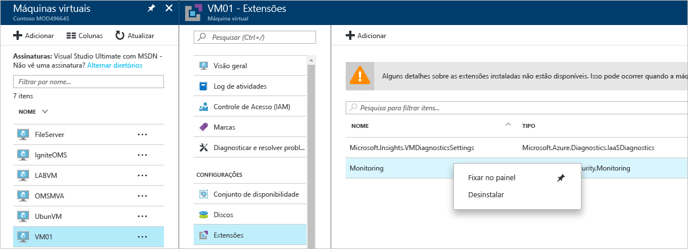

# Guia de solução de problemas da Central de Segurança do Azure
Este guia é para os profissionais de TI (tecnologia da informação), analistas de segurança de informações e administradores de nuvem cujas organizações estão usando a Central de Segurança do Azure e precisam solucionar os problemas relacionados a Central de Segurança.

## Guia de Solução de Problemas
Este guia explica como solucionar os problemas relacionados à Central de Segurança. A maioria das soluções de problemas feitas na Central de Segurança ocorrerá examinando primeiro os registros do [Log de Auditoria](https://azure.microsoft.com/updates/audit-logs-in-azure-preview-portal/) em busca do componente com falha. Com os logs de auditoria, você pode determinar:

* Quais operações ocorreram
* Quem iniciou a operação
* Quando a operação ocorreu
* O status da operação
* Os valores de outras propriedades que podem ajudar você a pesquisar a operação

O log de auditoria contém todas as operações de gravação (PUT, POST, DELETE) realizadas em seus recursos, mas não inclui operações de leitura (GET).

## Solucionando problemas de instalação do agente de monitoramento no Windows
A Central de Segurança do agente de monitoramento é usada para executar a coleta de dados. Após a coleta de dados estar habilitada e o agente estar instalado corretamente no computador de destino, os seguintes processos deverão estar em execução:

* ASMAgentLauncher.exe - Agente de Monitoramento do Azure 
* ASMMonitoringAgent.exe - extensão de Monitoramento de Segurança do Azure
* ASMSoftwareScanner.exe – Gerenciador de Verificação do Azure

A extensão de Monitoramento de Segurança do Azure verifica a existência de várias configurações de segurança relevantes e coleta os logs de segurança da máquina virtual. O gerenciador de verificação será usado como um scanner de patch.

Se a instalação for executada com êxito, você verá uma entrada semelhante à seguinte nos Logs de Auditoria para a VM de destino:

Você também pode obter mais informações sobre o processo de instalação lendo os logs de agente localizados em *%systemdrive%\windowsazure\logs* (exemplo: C:\WindowsAzure\Logs).

> [!NOTE]
> Se o agente da Central de Segurança do Azure estiver se comportando mal, você precisará reiniciar a VM de destino porque não há nenhum comando para parar e iniciar o agente.

Se você ainda tiver problemas com a coleta de dados, desinstale o agente seguindo as etapas abaixo:

1. Do **Portal do Azure**, selecione a máquina virtual que é experiência problemas de coleta de dados e clique em **extensões**.
2. Clique com o botão direito em **Microsoft.Azure.Security.Monitoring** e clique em selecionar **desinstalar**.

A extensão de monitoramento de segurança do Azure deve reinstalar automaticamente em si em alguns minutos.

## Solucionando problemas da instalação do agente de monitoramento no Linux
Ao solucionar problemas de instalação do agente de VM em um sistema Linux, você deverá fazer com que a extensão seja baixada em /var/lib/waagent/. Você pode executar o comando abaixo para verificar se ele foi instalado:

`cat /var/log/waagent.log` 

Outros arquivos de log que você pode examinar para fins de solução de problemas são: 

* /var/log/mdsd.err
* /var/log/azure/

Em um sistema em funcionamento, você deve ver uma conexão com o processo de mdsd TCP 29130. Esse é o syslog se comunicando com o processo de mdsd. Você pode validar esse comportamento executando o comando abaixo:

`netstat -plantu | grep 29130`

## Solução de problemas do Endpoint Protection que não está funcionando corretamente

O agente convidado é o processo pai de tudo o que a extensão [Antimalware da Microsoft](../security/azure-security-antimalware.md) faz. Quando o processo do agente convidado falha, o Antimalware da Microsoft, que é executado como um processo filho do agente convidado, também pode falhar.  Em cenários como esse é recomendável verificar as seguintes opções:

- Se a VM de destino é uma imagem personalizada e o criador da VM nunca instalou o agente convidado.
- Se o destino for uma VM do Linux em vez de uma VM do Windows, instalar a versão do Windows da extensão antimalware em uma VM do Linux falhará. O agente convidado do Linux tem requisitos específicos em termos de versão do sistema operacional e pacotes necessários e, se esses requisitos não forem atendidos, o agente de VM também não funcionará lá. 
- Se a VM foi criada com uma versão antiga do agente convidado. Se foi, esteja ciente de que alguns agentes antigos podem não realizar a própria atualização automática para a versão mais recente e isso pode causar esse problema. Sempre use a versão mais recente do agente convidado se estiver criando suas próprias imagens.
- Alguns softwares de administração de terceiros podem desabilitar o agente convidado ou bloquear o acesso a determinados locais de arquivo. Se você tiver software de terceiros instalado em sua VM, verifique se o agente está na lista de exclusões.
- Determinadas configurações de firewall ou o NSG (Grupo de Segurança de Rede) podem bloquear o tráfego de rede de/para o agente convidado.
- Algumas ACLs (listas de controle de acesso) podem impedir o acesso ao disco.
- Falta de espaço em disco pode impedir que o agente convidado funcione corretamente. 

Por padrão, a Interface do Usuário do Antimalware da Microsoft está desabilitada. Leia [Habilitando a Interface de Usuário do Antimalware da Microsoft em VMs do Azure Resource Manager após a implantação](https://blogs.msdn.microsoft.com/azuresecurity/2016/03/09/enabling-microsoft-antimalware-user-interface-post-deployment/) para obter mais informações sobre como habilitá-la, se você precisar.

## Problemas ao carregar o painel de solução de problemas

Se você enfrentar problemas ao carregar o painel central de segurança, certifique-se de que o usuário que registra a inscrição para a Central de segurança (ou seja, o primeiro usuário de um que abrir a Central de segurança com a assinatura) e o usuário que deseja ativar a coleta de dados deve ser *proprietário* ou *Colaborador* na assinatura. A partir desse momento também usuários com *leitor* na assinatura, pode ver a painel de controle/alertas/recomendação/política.

## Entrando em contato com o Suporte da Microsoft
Alguns problemas podem ser identificados usando as diretrizes fornecidas neste artigo. Outros, você também pode encontrar documentados no [Fórum](https://social.msdn.microsoft.com/Forums/en-US/home?forum=AzureSecurityCenter) público da Central de Segurança. No entanto, se você precisa de mais solução de problemas, pode abrir uma nova solicitação de suporte usando o **Portal do Azure**, conforme mostrado abaixo: 

## Consulte também
Neste documento, você aprendeu como configurar políticas de segurança na Central de segurança do Azure. Para saber mais sobre a Central de Segurança do Azure, veja o seguinte:

* [Guia de Operações e Planejamento da Central de Segurança do Azure](security-center-planning-and-operations-guide.md) - saiba como planejar e entender as considerações de design para adotar a Central de Segurança do Azure.
* [Monitoramento da integridade de segurança na Central de Segurança do Azure](security-center-monitoring.md) – saiba como monitorar a integridade dos recursos do Azure
* [Gerenciando e respondendo aos alertas de segurança na Central de Segurança do Azure](security-center-managing-and-responding-alerts.md) – aprenda a gerenciar e responder aos alertas de segurança
* [Monitorando as soluções de parceiros com a Central de Segurança do Azure](security-center-partner-solutions.md) – saiba como monitorar o status de integridade de suas soluções de parceiros.
* [Perguntas Frequentes sobre a Central de Segurança do Azure](security-center-faq.md) – encontre as perguntas frequentes sobre como usar o serviço
* [Blog de Segurança do Azure](http://blogs.msdn.com/b/azuresecurity/) – encontre postagens no blog sobre conformidade e segurança do Azure

