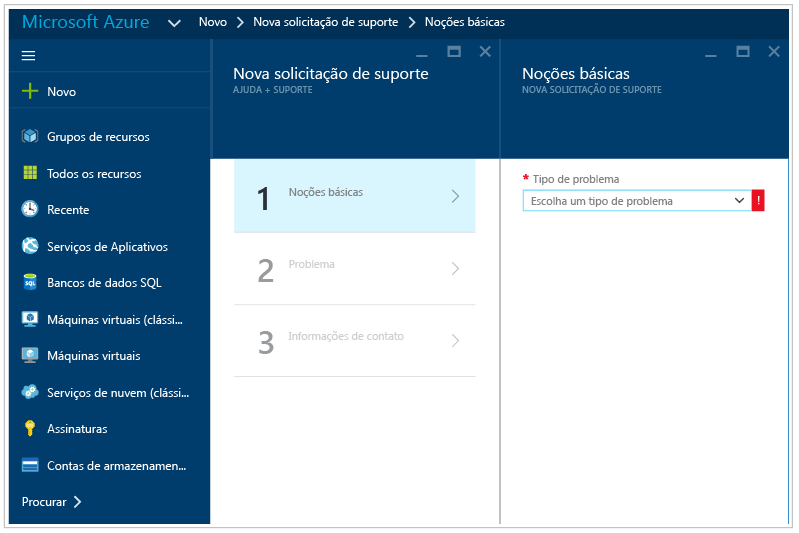

# Guia de solução de problemas da Central de Segurança do Azure
Este guia é para os profissionais de TI (tecnologia da informação), analistas de segurança de informações e administradores de nuvem cujas organizações estão usando a Central de Segurança do Azure e precisam solucionar os problemas relacionados a Central de Segurança.

>[!NOTE]
>Desde o início de junho de 2017, a Central de Segurança usa o Microsoft Monitoring Agent para coletar e armazenar dados. Veja [Migração da Plataforma Central de Segurança do Azure](security-center-platform-migration.md) para saber mais. As informações deste artigo representam a funcionalidade da Central de Segurança após a transição para o Microsoft Monitoring Agent.
>

## Guia de Solução de Problemas
Este guia explica como solucionar os problemas relacionados à Central de Segurança. A maioria das soluções de problemas na Central de Segurança ocorre por meio do exame inicial dos registros do [Log de Auditoria](../azure-monitor/platform/activity-logs-overview.md) em busca do componente com falha. Com os logs de auditoria, você pode determinar:

* Quais operações ocorreram
* Quem iniciou a operação
* Quando a operação ocorreu
* O status da operação
* Os valores de outras propriedades que podem ajudar você a pesquisar a operação

O log de auditoria contém todas as operações de gravação (PUT, POST, DELETE) realizadas em seus recursos, mas não inclui operações de leitura (GET).

## Microsoft Monitoring Agent
Central de segurança usa o Microsoft Monitoring Agent – este é o mesmo agente usado pelo serviço do Azure Monitor – para coletar dados de segurança de suas máquinas virtuais do Azure. Após a coleta de dados estar habilitada e o agente estar instalado corretamente no computador de destino, os processos abaixo deverão estar em execução:

* HealthService.exe

Se você abrir o console de gerenciamento de serviços (services.msc), também verá o serviço Microsoft Monitoring Agent em execução como mostrado abaixo:

Para ver qual versão do agente que você tem, abra **Gerenciador de Tarefas**, na guia **Processos**, localize o **serviço Microsoft Monitoring Agent**, clique com o botão direito do mouse nele e clique em **Propriedades**. Na guia **Detalhes**, procure a versão do arquivo como mostrado abaixo:

## Cenários de instalação do Microsoft Monitoring Agent
Há dois cenários de instalação que podem produzir resultados diferentes ao instalar o Microsoft Monitoring Agent em seu computador. Os cenários compatíveis são:

* **Agente instalado automaticamente pela Central de Segurança**: neste cenário você poderá exibir os alertas em Locais, na Central de Segurança e na Pesquisa de Logs. Você receberá notificações por email para o endereço de email configurado na política de segurança para a assinatura à qual o recurso pertence.
.
* **Agente instalado manualmente em uma máquina virtual localizada no Azure**: nesse cenário, se você estiver usando agentes baixados e instalados manualmente antes de fevereiro de 2017, será capaz de exibir os alertas no portal da Central de Segurança somente se filtrar na assinatura à qual o workspace pertence. No caso de você filtrar a assinatura à qual o recurso pertence, não será possível ver todos os alertas. Você receberá notificações por email para o endereço de email configurado na política de segurança para a assinatura à qual o workspace pertence.

>[!NOTE]
> Para evitar o comportamento explicado no segundo cenário, baixe a versão mais recente do agente.
>

## Problemas de integridade do agente de monitoramento 
O **estado de monitoramento** define o motivo pelo qual a Central de Segurança não consegue monitorar as VMs e os computadores inicializados para o provisionamento automático. A tabela a seguir mostra os valores do **estado de monitoramento**, descrições e as etapas de resolução.

| Estado do monitoramento | DESCRIÇÃO | Etapas de resolução |
|---|---|---|
| Instalação do agente pendente | A instalação do Microsoft Monitoring Agent ainda está em execução.  A instalação pode demorar algumas horas. | Aguarde até que a instalação automática seja concluída. |
| Estado de energia desativado | A máquina virtual está parada.  O Microsoft Monitoring Agent só pode ser instalado em uma VM em execução. | Reinicie a VM. |
| Agente de VM do Azure ausente ou inválido | O Microsoft Monitoring Agent ainda não está instalado.  Para a Central de Segurança instalar a extensão, é necessário um agente válido da VM do Azure. | Instale, reinstale ou atualize o agente de VM do Azure na máquina virtual. |
| O estado da máquina virtual não está pronto para instalação  | O Microsoft Monitoring Agent ainda não está instalado porque a VM não está pronta para a instalação. A máquina virtual não está pronta para a instalação devido a um problema com o agente de VM ou o provisionamento de VM. | Verifique o status da máquina virtual. Volte para as **máquinas virtuais** no portal e selecione a máquina virtual para ver as informações de status. |
|Falha na instalação - erro geral | O Microsoft Monitoring Agent foi instalado, mas falhou devido a um erro. | [Instale manualmente a extensão](../azure-monitor/learn/quick-collect-azurevm.md#enable-the-log-analytics-vm-extension) ou desinstale a extensão para que a Central de Segurança tente instalar novamente. |
| A instalação falhou - o agente local já está instalado | Falha ao instalar o Microsoft Monitoring Agent. Central de segurança identificou um agente local (Log Analytics ou System Center Operations Manager) já está instalado na VM. Para evitar a configuração de hospedagem múltipla, quando a máquina virtual envia relatórios a dois workspaces diferentes, a instalação do Microsoft Monitoring Agent parou. | Há duas maneiras de resolver: [instalar manualmente a extensão](../azure-monitor/learn/quick-collect-azurevm.md#enable-the-log-analytics-vm-extension) e conectá-la ao workspace desejado. Outra opção é definir o workspace desejado como o workspace padrão e habilitar o provisionamento automático do agente.  Veja [habilitar o provisionamento automático](security-center-enable-data-collection.md). |
| O agente não consegue se conectar ao workspace | O Microsoft Monitoring Agent foi instalado, mas falhou devido à conectividade de rede.  Verifique se há acesso à Internet ou se um proxy HTTP válido foi configurado para o agente. | Confira Monitoramento de requisitos de rede do agente. |
| Agente conectado a um workspace ausente ou desconhecido | A Central de Segurança identificou que o Microsoft Monitoring Agent instalado na máquina virtual está conectado a um workspace ao qual não tem acesso. | Isso pode acontecer em dois casos. O workspace foi excluído e não existe mais. Reinstale o agente com o workspace correto ou desinstale o agente e permita que a Central de Segurança conclua a instalação do provisionamento automático. O segundo caso acontece quando o workspace faz parte de uma assinatura à qual a Central de Segurança não tem permissões. A Central de Segurança requer assinaturas para permitir que o Microsoft Security Resource Provider os acesse. Para habilitar, registre a assinatura no Microsoft Security Resource Provider. Isso pode ser feito pela API, PowerShell, portal ou simplesmente filtrando-se a assinatura no painel **Visão geral** da Central de Segurança. Para saber mais, veja [Provedores e tipos de recursos](../azure-resource-manager/resource-manager-supported-services.md#azure-portal). |
| O agente não responde ou sua ID está ausente | A Central de Segurança não consegue recuperar os dados de segurança obtidos da máquina virtual, mesmo com o agente instalado. | O agente não está relatando dado algum, incluindo a pulsação. O agente pode estar danificado ou algo está bloqueando o tráfego. Também pode ser que o agente esteja fazendo relatórios de dados, mas não tenha uma ID de recurso do Azure. Portanto, é impossível corresponder os dados à VM do Azure. Para solucionar problemas do Linux, consulte [Guia de Solução de Problemas para o Agente do Log Analytics para Linux](https://github.com/Microsoft/OMS-Agent-for-Linux/blob/master/docs/Troubleshooting.md#im-not-seeing-any-linux-data-in-the-oms-portal). Para solucionar problemas do Windows, consulte [Solucionar problemas de Máquinas Virtuais do Windows](https://github.com/MicrosoftDocs/azure-docs/blob/8c53ac4371d482eda3d85819a4fb8dac09996a89/articles/log-analytics/log-analytics-azure-vm-extension.md#troubleshooting-windows-virtual-machines). |
| Agente não instalado | A coleta de dados está desabilitada. | Ative a coleta de dados na política de segurança ou instale manualmente o Microsoft Monitoring Agent. |

## Solução de problemas dos requisitos de rede do agente de monitoramento 
Para que os agentes se conectem e se registrem na Central de Segurança, eles deverão ter acesso aos recursos de rede, incluindo os números de porta e as URLs de domínio.

- Para servidores proxy, você precisa garantir que os recursos do servidor proxy apropriados estejam configurados nas configurações do agente. Leia este artigo para saber mais sobre [como alterar as configurações de proxy](https://docs.microsoft.com/azure/log-analytics/log-analytics-windows-agents).
- Para os firewalls que restringem o acesso à Internet, será necessário configurar o firewall para permitir o acesso ao Log Analytics. Nenhuma ação é necessária nas configurações do agente.

A tabela a seguir mostra os recursos necessários para comunicação.

| Recurso de agente | Portas | Ignorar a inspeção de HTTPS |
|---|---|---|
| *.ods.opinsights.azure.com | 443 | Sim |
| *.oms.opinsights.azure.com | 443 | Sim |
| *.blob.core.windows.net | 443 | Sim |
| *.azure-automation.net | 443 | Sim |

Se você encontrar problemas de integração com o agente, leia o artigo [Como solucionar problemas de integração do Operations Management Suite](https://support.microsoft.com/en-us/help/3126513/how-to-troubleshoot-operations-management-suite-onboarding-issues).

## Solução de problemas do Endpoint Protection que não está funcionando corretamente

O agente convidado é o processo pai de tudo o que a extensão [Antimalware da Microsoft](../security/azure-security-antimalware.md) faz. Quando o processo do agente convidado falha, o Antimalware da Microsoft, que é executado como um processo filho do agente convidado, também pode falhar.  Em cenários como esse é recomendável verificar as seguintes opções:

- Se a VM de destino é uma imagem personalizada e o criador da VM nunca instalou o agente convidado.
- Se o destino for uma VM do Linux em vez de uma VM do Windows, instalar a versão do Windows da extensão antimalware em uma VM do Linux falhará. O agente convidado do Linux tem requisitos específicos em termos de versão do sistema operacional e pacotes necessários e, se esses requisitos não forem atendidos, o agente de VM também não funcionará lá.
- Se a VM foi criada com uma versão antiga do agente convidado. Se foi, esteja ciente de que alguns agentes antigos podem não realizar a própria atualização automática para a versão mais recente e isso pode causar esse problema. Sempre use a versão mais recente do agente convidado se estiver criando suas próprias imagens.
- Alguns softwares de administração de terceiros podem desabilitar o agente convidado ou bloquear o acesso a determinados locais de arquivo. Se você tiver software de terceiros instalado em sua VM, verifique se o agente está na lista de exclusões.
- Determinadas configurações de firewall ou o NSG (Grupo de Segurança de Rede) podem bloquear o tráfego de rede de/para o agente convidado.
- Algumas ACLs (listas de controle de acesso) podem impedir o acesso ao disco.
- Falta de espaço em disco pode impedir que o agente convidado funcione corretamente.

Por padrão, a Interface do Usuário do Antimalware da Microsoft está desabilitada. Leia [Habilitando a Interface de Usuário do Antimalware da Microsoft em VMs do Azure Resource Manager após a implantação](https://blogs.msdn.microsoft.com/azuresecurity/2016/03/09/enabling-microsoft-antimalware-user-interface-post-deployment/) para obter mais informações sobre como habilitá-la, se você precisar.

## Problemas ao carregar o painel de solução de problemas

Se você enfrentar problemas ao carregar o painel central de segurança, certifique-se de que o usuário que registra a inscrição para a Central de segurança (ou seja, o primeiro usuário de um que abrir a Central de segurança com a assinatura) e o usuário que deseja ativar a coleta de dados deve ser *proprietário* ou *Colaborador* na assinatura. A partir desse momento também usuários com *leitor* na assinatura, pode ver a painel de controle/alertas/recomendação/política.

## Entrando em contato com o Suporte da Microsoft
Alguns problemas podem ser identificados usando as diretrizes fornecidas neste artigo. Outros, você também pode encontrar documentados no [Fórum](https://social.msdn.microsoft.com/Forums/en-US/home?forum=AzureSecurityCenter) público da Central de Segurança. No entanto, se você precisar de mais solução de problemas, poderá abrir uma nova solicitação de suporte usando o **portal do Azure**, conforme mostrado abaixo:

## Consulte também
Neste documento, você aprendeu como configurar políticas de segurança na Central de segurança do Azure. Para saber mais sobre a Central de Segurança do Azure, veja o seguinte:

* [Guia de Operações e Planejamento da Central de Segurança do Azure](security-center-planning-and-operations-guide.md) - saiba como planejar e entender as considerações de design para adotar a Central de Segurança do Azure.
* [Monitoramento da integridade de segurança na Central de Segurança do Azure](security-center-monitoring.md) – saiba como monitorar a integridade dos recursos do Azure
* [Gerenciando e respondendo aos alertas de segurança na Central de Segurança do Azure](security-center-managing-and-responding-alerts.md) – aprenda a gerenciar e responder aos alertas de segurança
* [Monitorando as soluções de parceiros com a Central de Segurança do Azure](security-center-partner-solutions.md) – saiba como monitorar o status de integridade de suas soluções de parceiros.
* [Perguntas Frequentes sobre a Central de Segurança do Azure](security-center-faq.md) – encontre as perguntas frequentes sobre como usar o serviço
* [Blog de Segurança do Azure](https://blogs.msdn.com/b/azuresecurity/) – encontre postagens no blog sobre conformidade e segurança do Azure
