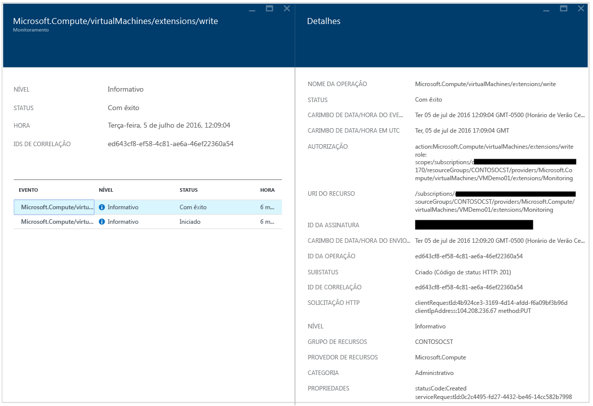

<properties
   pageTitle="Guia de solução da Central de Segurança do Azure | Microsoft Azure"
   description="Este documento ajuda a solucionar problemas na Central de Segurança do Azure."
   services="security-center"
   documentationCenter="na"
   authors="YuriDio"
   manager="swadhwa"
   editor=""/>

<tags
   ms.service="security-center"
   ms.devlang="na"
   ms.topic="hero-article"
   ms.tgt_pltfrm="na"
   ms.workload="na"
   ms.date="07/20/2016"
   ms.author="yurid"/>

# Guia de solução de problemas da Central de Segurança do Azure
Este guia é para os profissionais de TI (tecnologia da informação), analistas de segurança de informações e administradores de nuvem cujas organizações estão usando a Central de Segurança do Azure e precisam solucionar os problemas relacionados a Central de Segurança.

> [AZURE.NOTE] As informações neste documento se aplicam à versão de visualização da Central de Segurança do Azure.

## Guia de Solução de Problemas
Este guia explica como solucionar os problemas relacionados à Central de Segurança. A maioria das soluções de problemas feitas na Central de Segurança ocorrerá examinando primeiro os registros do [Log de Auditoria](https://azure.microsoft.com/updates/audit-logs-in-azure-preview-portal/) em busca do componente com falha. Com os logs de auditoria, você pode determinar:

- Quais operações ocorreram
- Quem iniciou a operação
- Quando a operação ocorreu
- O status da operação
- Os valores de outras propriedades que podem ajudar você a pesquisar a operação

O log de auditoria contém todas as operações de gravação (PUT, POST, DELETE) realizadas em seus recursos, mas não inclui operações de leitura (GET).

## Solucionando problemas de instalação do agente de monitoramento no Windows

A Central de Segurança do agente de monitoramento é usada para executar a coleta de dados. Após a coleta de dados estar habilitada e o agente estar instalado corretamente no computador de destino, os seguintes processos deverão estar em execução:

- ASMAgentLauncher.exe - Agente de Monitoramento do Azure
- ASMMonitoringAgent.exe - extensão de Monitoramento de Segurança do Azure
- ASMSoftwareScanner.exe – Gerenciador de Verificação do Azure

A extensão de Monitoramento de Segurança do Azure verifica a existência de várias configurações de segurança relevantes e coleta os logs de segurança da máquina virtual. O gerenciador de verificação será usado como um scanner de patch.

Se a instalação for executada com êxito, você verá uma entrada semelhante à seguinte nos Logs de Auditoria para a VM de destino:

Você também pode obter mais informações sobre o processo de instalação lendo os logs de agente localizados em *%systemdrive%\\windowsazure\\logs* (exemplo: C:\\WindowsAzure\\Logs).

> [AZURE.NOTE] Se o agente da Central de Segurança do Azure estiver se comportando mal, você precisará reiniciar a VM de destino porque não há nenhum comando para parar e iniciar o agente.

## Solucionando problemas da instalação do agente de monitoramento no Linux
Ao solucionar problemas de instalação do agente de VM em um sistema Linux, você deverá fazer com que a extensão seja baixada em /var/lib/waagent/. Você pode executar o comando abaixo para verificar se ele foi instalado:

`cat /var/log/waagent.log`

Outros arquivos de log que você pode examinar para fins de solução de problemas são:

- /var/log/mdsd.err
- /var/log/azure/

Em um sistema em funcionamento, você deve ver uma conexão com o processo de mdsd TCP 29130. Esse é o syslog se comunicando com o processo de mdsd. Você pode validar esse comportamento executando o comando abaixo:

`netstat -plantu | grep 29130`

## Entrando em contato com o Suporte da Microsoft

Alguns problemas podem ser identificados usando as diretrizes fornecidas neste artigo. Outros, você também pode encontrar documentados no [Fórum](https://social.msdn.microsoft.com/Forums/pt-BR/home?forum=AzureSecurityCenter) público da Central de Segurança. No entanto, se você precisa de mais solução de problemas, pode abrir uma nova solicitação de suporte usando o Portal do Azure, conforme mostrado abaixo:

## Consulte também

Neste documento, você aprendeu como configurar políticas de segurança na Central de segurança do Azure. Para saber mais sobre a Central de Segurança do Azure, veja o seguinte:

- [Guia de Operações e Planejamento da Central de Segurança do Azure](security-center-planning-and-operations-guide.md) - Saiba como planejar e entender as considerações de design para adotar a Central de Segurança do Azure.
- [Monitoramento de integridade de segurança na Central de Segurança do Azure](security-center-monitoring.md) – saiba como monitorar a integridade dos recursos do Azure
- [Gerenciando e respondendo a alertas de segurança na Central de Segurança do Azure](security-center-managing-and-responding-alerts.md) – aprenda a gerenciar e a responder a alertas de segurança
- [Monitorar as soluções de parceiros com a Central de Segurança do Azure](security-center-partner-solutions.md): saiba como monitorar o status de integridade de suas soluções de parceiros.
- [Perguntas frequentes sobre a Central de Segurança do Azure](security-center-faq.md) – encontre as perguntas frequentes sobre como usar o serviço de localização
- [Blog de segurança do Azure](http://blogs.msdn.com/b/azuresecurity/) – encontre postagens no blog sobre conformidade e segurança do Azure

<!---HONumber=AcomDC_0720_2016-->