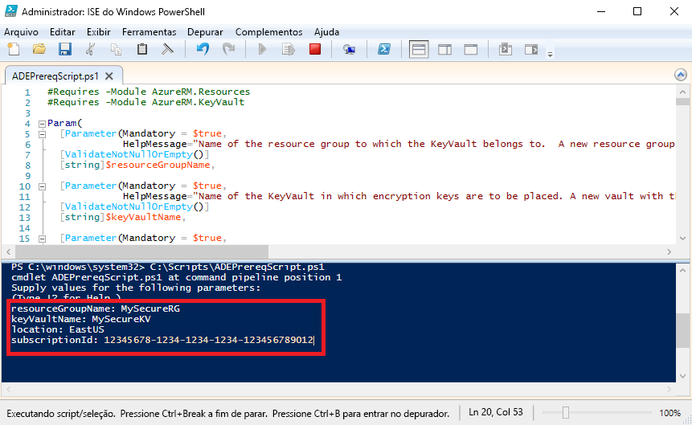

# <a name="quickstart-encrypt-a-windows-iaas-vm-with-azure-powershell"></a>Início Rápido: Criptografar uma VM de IaaS do Windows com o Azure PowerShell

O Azure Disk Encryption ajuda você a criptografar seus discos de máquina virtual IaaS Windows e Linux. A solução é integrada ao Azure Key Vault para ajudar a controlar e gerenciar os segredos e as chaves de criptografia de disco. Usando o Azure Disk Encryption, você pode fazer com que suas VMs fiquem protegidas em repouso usando tecnologia de criptografia padrão do setor. Neste início rápido, você criará uma VM do Windows Server 2016 e criptografará o disco do sistema operacional.

Se você não tiver uma assinatura do Azure, crie uma [conta gratuita](https://azure.microsoft.com/free/?WT.mc_id=A261C142F) antes de começar.

## <a name="prerequisites"></a>Pré-requisitos

- Windows PowerShell ISE
- Instalar ou atualizar para a [última versão do módulo AzureRM do PowerShell](/powershell/azure/azurerm/install-azurerm-ps?view=azurermps-6.13.0)
    - A versão do módulo AzureRM precisa ser 6.0.0 ou superior. `Get-Module AzureRM -ListAvailable | Select-Object -Property Name,Version,Path`
- Uma cópia do [script de pré-requisitos do Azure Disk Encryption](https://raw.githubusercontent.com/Azure/azure-powershell/master/src/Compute/Compute/Extension/AzureDiskEncryption/Scripts/AzureDiskEncryptionPreRequisiteSetup.ps1).
    - Se você já tem esse script, baixe uma nova cópia, pois ele foi alterado recentemente. 
    - Use **CTRL-A** para selecionar todo o texto e use **CTRL-C** para copiar todo o texto no Bloco de Notas.
    - Salve o arquivo como **ADEPrereqScript.ps1**


## <a name="sign-in-to-azure"></a>Entrar no Azure

1. Clique com o botão direito do mouse em **ISE do Windows PowerShell** e clique em **Executar como administrador**.
1. Na janela **Administrador: ISE do Windows PowerShell**, clique em **Exibir** e clique em **Mostrar Painel de Script**.
1. No painel de script, digite o seguinte cmdlet: 

     ```azurepowershell
      Connect-AzureRMAccount
     ```

1. Clique na seta verde para **Executar Script** ou use F5. 
2. Use a entrada interativa para concluir a conexão com sua conta do Azure.
3. Copie a **ID da assinatura** retornada para uso na execução do script do PowerShell seguinte. 

## <a name="bkmk_PrereqScript"></a> Executar o script de pré-requisitos do Azure Disk Encryption
 **ADEPrereqScript.ps1** criará um grupo de recursos e um cofre de chaves e definirá a política de acesso do cofre de chaves. O script também criará um bloqueio de recurso no cofre de chaves para ajudar a protegê-lo contra exclusão acidental.  

1. Na janela **Administrador: ISE do Windows PowerShell**, clique em **Arquivo** e, em seguida, em **Abrir**. Navegue até o arquivo **ADEPrereqScript.ps1** e clique duas vezes nele. O script será aberto no painel de script.
2. Clique na seta verde para **Executar Script** ou use F5 para executar o script. 
3. Digite nomes para um novo **grupo de recursos** e um novo **cofre de chaves**. Não use um grupo de recursos ou um cofre de chaves existente neste início rápido, pois iremos excluir o grupo de recursos mais tarde. 
4. Digite o local onde você deseja criar os recursos, tais como **EastUS**. Obtenha uma lista de locais com `Get-AzureRMLocation`.
5. Coloque a **ID da assinatura**. Obtenha sua ID de assinatura com `Get-AzureRMSubscription`.  
6. Clique na seta verde para **Executar Script**. 
7. Copiar os valores **DiskEncryptionKeyVaultUrl** e **DiskEncryptionKeyVaultId** retornados para usá-los posteriormente.




## <a name="create-a-virtual-machine"></a>Criar uma máquina virtual 
Agora você precisa criar uma máquina virtual para poder criptografar o disco. O script que você usará cria uma VM do Windows Server 2016 com 8 GB de RAM e um disco de sistema operacional de 30 GB. 

1. Copie o script para o painel de script **Administrador: ISE do Windows PowerShell** e altere as três primeiras variáveis. O grupo de recursos e o local precisam ser os mesmos usados para o [script de pré-requisitos](#bkmk_PrereqScript).  

   ```azurepowershell
    # Variables for common values
    $resourceGroup = "MySecureRG"
    $location = "EastUS"
    $vmName = "MySecureVM"
    
    # Create user object
    $cred = Get-Credential -Message "Enter a username and password for the virtual machine."
    
    # Create a resource group
    #New-AzureRmResourceGroup -Name $resourceGroup -Location $location
    
    # Create a subnet configuration
    $subnetConfig = New-AzureRmVirtualNetworkSubnetConfig -Name mySubnet -AddressPrefix 192.168.1.0/24
    
    # Create a virtual network
    $vnet = New-AzureRmVirtualNetwork -ResourceGroupName $resourceGroup -Location $location `
      -Name MYvNET -AddressPrefix 192.168.0.0/16 -Subnet $subnetConfig
    
    # Create a public IP address and specify a DNS name
    $pip = New-AzureRmPublicIpAddress -ResourceGroupName $resourceGroup -Location $location `
      -Name "mypublicdns$(Get-Random)" -AllocationMethod Static -IdleTimeoutInMinutes 4
    
    # Create an inbound network security group rule for port 3389
    $nsgRuleRDP = New-AzureRmNetworkSecurityRuleConfig -Name myNetworkSecurityGroupRuleRDP  -Protocol Tcp `
      -Direction Inbound -Priority 1000 -SourceAddressPrefix * -SourcePortRange * -DestinationAddressPrefix * `
      -DestinationPortRange 3389 -Access Allow
    
    # Create a network security group
    $nsg = New-AzureRmNetworkSecurityGroup -ResourceGroupName $resourceGroup -Location $location `
      -Name myNetworkSecurityGroup -SecurityRules $nsgRuleRDP
    
    # Create a virtual network card and associate with public IP address and NSG
    $nic = New-AzureRmNetworkInterface -Name myNic -ResourceGroupName $resourceGroup -Location $location `
      -SubnetId $vnet.Subnets[0].Id -PublicIpAddressId $pip.Id -NetworkSecurityGroupId $nsg.Id
    
    # Create a virtual machine configuration
    $vmConfig = New-AzureRmVMConfig -VMName $vmName -VMSize Standard_D2_v3 | `
    Set-AzureRmVMOperatingSystem -Windows -ComputerName $vmName -Credential $cred | `
    Set-AzureRmVMSourceImage -PublisherName MicrosoftWindowsServer -Offer WindowsServer -Skus 2016-Datacenter-smalldisk -Version latest | `
    Add-AzureRmVMNetworkInterface -Id $nic.Id
    
    # Create a virtual machine
    New-AzureRmVM -ResourceGroupName $resourceGroup -Location $location -VM $vmConfig
   ```

2. Clique na seta verde para **Executar Script** e criar a máquina virtual.  


## <a name="encrypt-the-disk-of-the-vm"></a>Criptografar o disco da VM
Agora que você criou e configurou um cofre de chaves e uma VM, pode criptografar o disco com o cmdlet **Set-AzureRmVmDiskEncryptionExtension**. 
 
1. Execute o seguinte cmdlet para criptografar o disco da VM:

    ```azurepowershell
     Set-AzureRmVmDiskEncryptionExtension -ResourceGroupName "MySecureRG" -VMName "MySecureVM" `
     -DiskEncryptionKeyVaultId "<Returned by the prerequisites script>" -DiskEncryptionKeyVaultUrl "<Returned by the prerequisites script>"
     ```


1. Quando a criptografia for concluída, você poderá verificar se o disco está criptografado com o seguinte cmdlet: 

     ```azurepowershell
     Get-AzureRmVmDiskEncryptionStatus -ResourceGroupName "MySecureRG" -VMName "MySecureVM"
     ```
    
    
## <a name="clean-up-resources"></a>Limpar recursos
 **ADEPrereqScript.ps1** cria um bloqueio de recurso no cofre de chaves. Para limpar os recursos neste início rápido, você precisa remover o bloqueio de recurso pela primeira vez e, em seguida, excluir o grupo de recursos. 

1. Remover o bloqueio de recurso do cofre de chaves

     ```azurepowershell
     $LockId =(Get-AzureRMResourceLock -ResourceGroupName "MySecureRG" -ResourceName "MySecureVault" -ResourceType "Microsoft.KeyVault/vaults").LockID 
     Remove-AzureRmResourceLock -LockID $LockId
      ```
    
2. Remova o grupo de recursos. Isso também excluirá todos os recursos no grupo. 
     ```azurepowershell
      Remove-AzureRmResourceGroup -Name "MySecureRG"
      ```

## <a name="next-steps"></a>Próximas etapas
Avance para o próximo artigo a fim de saber mais sobre os pré-requisitos do Azure Disk Encryption para VMs IaaS.

> [!div class="nextstepaction"]
> [Pré-requisitos do Azure Disk Encryption](azure-security-disk-encryption-prerequisites.md)