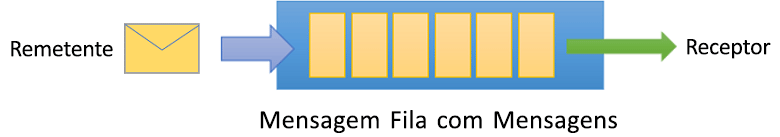
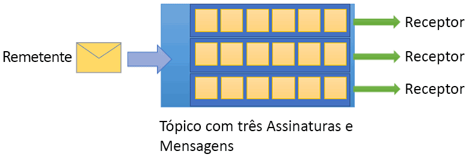

# O que é o Barramento de Serviço do Azure?

O Barramento de Serviço do Microsoft Azure é um agente de mensagens de integração empresarial totalmente gerenciado. O Barramento de Serviço é mais comumente usado para desacoplar aplicativos e serviços uns dos outros e é uma plataforma confiável e segura para dados assíncronos e transferência de estado. Os dados são transferidos entre diferentes aplicativos e serviços usando *mensagens*. Uma mensagem é em formato binário que pode conter JSON, XML ou apenas texto. 

Alguns cenários de sistema de mensagens comuns são:

* Mensagens: transferir dados comerciais, como vendas ou pedidos de compra, diários ou movimentos de estoque.
* Desacoplar aplicativos: melhorar a confiabilidade e a escalabilidade de aplicativos e serviços (cliente e serviço não precisam estar online ao mesmo tempo).
* Tópicos e assinaturas: habilitar 1:*n* relacionamentos entre publicadores e assinantes.
* Sessões de mensagens: implementar fluxos de trabalho que exijam ordenação de mensagens ou adiamento de mensagens.

## Namespaces

Um namespace é um contêiner de escopo para todos os componentes de mensagem. Várias filas e tópicos podem residir em um único namespace e os namespaces geralmente servem como contêineres de aplicativos.

## Filas

As mensagens são enviadas e recebidas a partir de *filas*. As filas permitem que você armazene mensagens até que o aplicativo de recebimento esteja disponível para recebê-las e processá-las.

As mensagens em filas são ordenadas e recebem carimbo de data/hora na chegada. Quando aceita, a mensagem é mantida protegida em armazenamento com redundância. As mensagens são entregues em modo  *pull*, que entrega mensagens mediante solicitação.

## Tópicos

Também é possível usar *tópicos* para enviar e receber mensagens. Enquanto uma fila é frequentemente usada para comunicação ponto a ponto, os tópicos são úteis em cenários de publicação/assinatura.

Os tópicos podem ter várias assinaturas independentes. Um assinante de um tópico pode receber uma cópia de cada mensagem enviada para esse tópico. As assinaturas são entidades nomeadas criadas de forma durável, mas podem, opcionalmente, expirar ou excluir automaticamente.

Em alguns cenários, talvez você não queira que assinaturas individuais recebam todas as mensagens enviadas para um tópico. Nesse caso, é possível usar [regras e filtros](topic-filters.md) para definir condições que disparam [ações](topic-filters.md#actions) opcionais, filtram mensagens especificadas e definem ou modificam propriedades de mensagens.

## Recursos avançados

O Barramento de Serviço também possui recursos avançados que permitem resolver problemas de mensagens mais complexos. As seções a seguir descrevem esses principais recursos:

### Sessões de mensagem

Para realizar uma garantia PEPS (primeiro a entrar, primeiro a sair) no Barramento de Serviço, use as sessões. As [Sessões de mensagens](message-sessions.md) permitem manipulação ordenada e conjunta de sequências não associadas de mensagens relacionadas. 

### Encaminhamento automático

O recurso [encaminhamento automático](service-bus-auto-forwarding.md) permite encadear uma fila ou assinatura a outra fila ou outro tópico que faça parte do mesmo namespace. Quando o encaminhamento automático está habilitado, o Barramento de Serviço remove automaticamente as mensagens colocadas na primeira fila ou assinatura (origem) e as coloca na segunda fila ou no segundo tópico (destino).

### Mensagens mortas

O Barramento de Serviço dá suporte a uma [DLQ](service-bus-dead-letter-queues.md) (fila de mensagens mortas) para manter mensagens que não podem ser entregues a nenhum receptor ou mensagens que não podem ser processadas. Portanto, é possível remover mensagens da DLQ e inspecioná-las.

### Entrega agendada

É possível enviar mensagens a uma fila ou tópico [para processamento atrasado](message-sequencing.md#scheduled-messages), por exemplo, para agendar a disponibilidade de um trabalho para processamento por um sistema em um determinado momento.

### Adiamento de mensagens

Quando um cliente de assinatura ou fila recebe uma mensagem que está disposto a processar, mas cujo processamento não é possível devido a circunstâncias especiais no aplicativo, a entidade tem a opção de [adiar a recuperação da mensagem](message-deferral.md) para um ponto posterior. A mensagem permanece na fila ou assinatura, mas é reservada.

### Envio em lote

O [Envio em lote do lado do cliente](service-bus-performance-improvements.md#client-side-batching) permite que um cliente de tópico ou fila adie o envio de uma mensagem por um determinado período de tempo. Se o cliente enviar mensagens adicionais durante esse período, ele transmitirá as mensagens em um único lote. 

### Transações

Uma [transação](service-bus-transactions.md) agrupa duas ou mais operações em um escopo de execução. O Barramento de Serviço dá suporte a operações de agrupamento em uma única entidade de mensagens (fila, tópico e assinatura) no escopo de uma transação.

### Filtragem e ações

Os assinantes podem definir quais mensagens desejam receber de um tópico. Essas mensagens são especificadas na forma de uma ou mais [regras de assinatura nomeadas](topic-filters.md). Para cada condição de regra com correspondência, a assinatura produz uma cópia da mensagem, que pode ser anotada de forma diferente para cada regra com correspondência.

### Exclusão automática em tempo ocioso

A [exclusão automática em tempo ocioso](/dotnet/api/microsoft.servicebus.messaging.queuedescription.autodeleteonidle) permite que você especifique um intervalo de tempo ocioso, após o qual a fila será excluída automaticamente. A duração mínima é de 5 minutos.

### Detecção de duplicidade

Se ocorrer um erro em que o cliente tenha alguma dúvida sobre o resultado de uma operação de envio, a [detecção de duplicidades](duplicate-detection.md) eliminará a dúvida dessas situações, permitindo que o remetente envie novamente a mesma mensagem e que a fila ou o tópico descarte as cópias duplicadas.

### Identidades gerenciadas, SAS e RBAC para recursos do Azure

O Barramento de Serviço dá suporte a protocolos de segurança, como [Assinaturas de Acesso Compartilhado](service-bus-sas.md) (SAS), [Controle de Acesso Baseado em Função](service-bus-role-based-access-control.md) (RBAC) e [Identidades Gerenciadas para recursos do Azure](service-bus-managed-service-identity.md).

### Recuperação de desastre geográfico

Quando os datacenters ou regiões do Azure passam por um tempo de inatividade, a [recuperação de desastre geográfico](service-bus-geo-dr.md) permite que o processamento de dados continue operando em um datacenter ou região diferente.

### Segurança

O Barramento de Serviço dá suporte aos protocolos padrão [AMQP 1.0](service-bus-amqp-overview.md) e [HTTP/REST](/rest/api/servicebus/).

## Bibliotecas de cliente

O Barramento de Serviço dá suporte a bibliotecas de clientes para [.NET](https://github.com/Azure/azure-service-bus-dotnet/tree/master), [Java](https://github.com/Azure/azure-service-bus-java/tree/master), [JMS](https://github.com/Azure/azure-service-bus/tree/master/samples/Java/qpid-jms-client).

## Integração

O Barramento de Serviço integra-se totalmente aos serviços do Azure a seguir:

- [Grade de Eventos](https://azure.microsoft.com/services/event-grid/) 
- [Aplicativos Lógicos](https://azure.microsoft.com/services/logic-apps/) 
- [Funções](https://azure.microsoft.com/services/functions/) 
- [Dynamics 365](https://dynamics.microsoft.com)
- [Stream Analytics](https://azure.microsoft.com/services/stream-analytics/)
 
## Próximas etapas

Para começar a usar o sistema de mensagens do Barramento de Serviço, consulte os artigos a seguir:

* [Comparar os serviços de mensagens do Azure](../event-grid/compare-messaging-services.md?toc=%2fazure%2fservice-bus-messaging%2ftoc.json&bc=%2fazure%2fservice-bus-messaging%2fbreadcrumb%2ftoc.json)
* Saiba mais sobre as camadas [Standard e Premium](https://azure.microsoft.com/pricing/details/service-bus/) do Barramento de Serviço do Azure e o respectivo preço
* [Desempenho e latência da camada Premium do Barramento de Serviço do Azure](https://blogs.msdn.microsoft.com/servicebus/2016/07/18/premium-messaging-how-fast-is-it/)
* Experimente os inícios rápidos em [.NET](service-bus-quickstart-powershell.md), [Java](service-bus-quickstart-powershell.md) ou [JMS](service-bus-quickstart-powershell.md)
