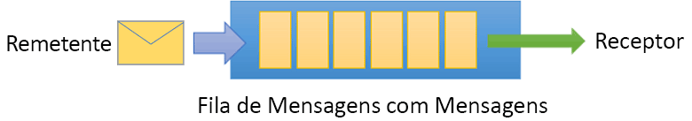
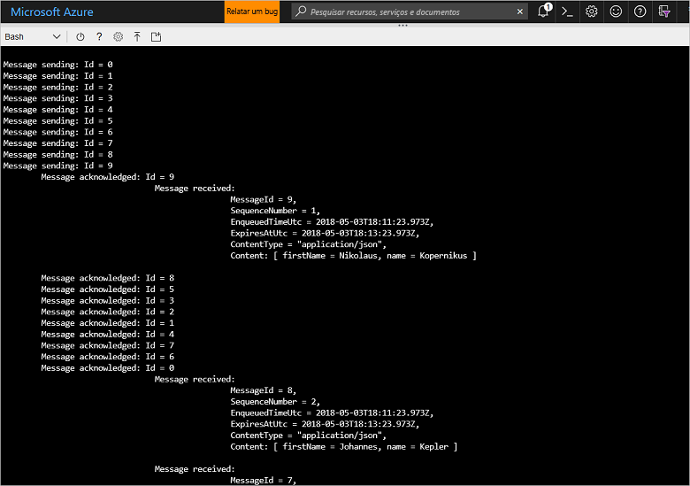

# <a name="quickstart-send-and-receive-messages-using-azure-cli-and-java"></a>Início Rápido: Enviar e receber mensagens usando a CLI do Azure e o Java

O Barramento de Serviço do Microsoft Azure é um agente de mensagem de integração empresarial que fornece mensagens seguras e confiabilidade. Um cenário típico de Barramento de Serviço geralmente envolve o desacoplamento de dois ou mais aplicativos, serviços ou processos (aplicativos não precisam estar online ao mesmo tempo), transferindo alterações de dados ou estado e enviando mensagens entre os aplicativos. 

Por exemplo, uma empresa de varejo pode enviar os dados do ponto de vendas a um back office ou centro de distribuição regional para atualizações de estoque e reabastecimento. Nesse caso, o aplicativo cliente envia e recebe mensagens de uma fila do Barramento de Serviço:



Este início rápido descreve como enviar e receber mensagens com o Barramento de Serviço, usando a CLI do Azure e a biblioteca Java do Barramento de Serviço. Por fim, se você estiver interessado em mais detalhes técnicos poderá [ler uma explicação](#understand-the-sample-code) dos principais elementos do código de exemplo.

Se você não tiver uma assinatura do Azure, poderá criar uma [conta gratuita][] antes de começar.

[!INCLUDE [cloud-shell-try-it.md](../../includes/cloud-shell-try-it.md)]

## <a name="log-in-to-azure"></a>Fazer logon no Azure

Clique no botão do Cloud Shell no menu, no canto superior direito do portal do Azure e, no menu suspenso **Selecionar ambiente**, selecione **Bash**. 

## <a name="use-cli-to-create-resources"></a>Use CLI para criar recursos

No Cloud Shell, no prompt Bash, emita os comandos a seguir para provisionar os recursos do Barramento de Serviço. Certifique-se de substituir todos os espaços reservados pelos valores apropriados:

```azurecli-interactive
# Create a resource group
az group create --name myResourceGroup --location eastus

# Create a Service Bus messaging namespace with a unique name
namespaceName=myNameSpace$RANDOM
az servicebus namespace create \
   --resource-group myResourceGroup \
   --name $namespaceName \
   --location eastus

# Create a Service Bus queue
az servicebus queue create --resource-group myResourceGroup \
   --namespace-name $namespaceName \
   --name myQueue

# Get the connection string for the namespace
connectionString=$(az servicebus namespace authorization-rule keys list \
   --resource-group myResourceGroup \
   --namespace-name $namespaceName \
   --name RootManageSharedAccessKey \
   --query primaryConnectionString --output tsv)
```

Depois que o último comando executar, copie e cole a cadeia de conexão e o nome da fila selecionados em um local temporário, como no Bloco de Notas. Isso será necessário na próxima etapa.

## <a name="send-and-receive-messages"></a>Enviar e receber mensagens

Depois de criar o namespace e a fila, e você tiver as credenciais necessárias, estará pronto para enviar e receber mensagens. É possível examinar o código [nesta pasta de exemplo do GitHub](https://github.com/Azure/azure-service-bus/tree/master/samples/Java/azure-servicebus/TopicFilters).

1. Verifique se o Cloud Shell está aberto e exibindo o prompt de Bash.

2. Clone o [repositório GitHub do Barramento de Serviço](https://github.com/Azure/azure-service-bus/), emitindo o comando a seguir:

   ```bash
   git clone https://github.com/Azure/azure-service-bus.git
   ```

2. Altere o diretório atual para a pasta de exemplo, usando barras como separadores de caminho:

   ```bash
   cd azure-service-bus/samples/Java/quickstarts-and-tutorials/quickstart-java 
   ```

3. Emita o comando a seguir para compilar o aplicativo:
   
   ```bash
   mvn clean package -DskipTests
   ```

4. Para executar o programa, emita o comando a seguir. Contanto que o shell de bash não seja reiniciado, a variável contendo o valor da cadeia de conexão será automaticamente substituída:

   ```bash
   java -jar ./target/samples.quickstart-1.0.0-jar-with-dependencies.jar -c $connectionString -q myQueue
   ```

6. Observe 10 mensagens sendo enviadas para a fila. Observe que a ordenação de mensagens não é garantida, mas é possível ver as mensagens enviadas e, em seguida, reconhecidas e recebidas, juntamente com os dados de carga:

   

## <a name="clean-up-resources"></a>Limpar recursos

Execute o comando a seguir para remover o grupo de recursos, o namespace e todos os recursos relacionados:

```azurecli-interactive
az group delete --resource-group myResourceGroup
```

## <a name="understand-the-sample-code"></a>Entender o código de exemplo

Esta seção contém mais detalhes sobre as principais seções do código de exemplo. É possível navegar pelo código localizado no repositório GitHub [aqui](https://github.com/Azure/azure-service-bus/tree/master/samples/Java/azure-servicebus/TopicFilters).

### <a name="get-connection-string-and-queue"></a>Obter cadeia de conexão e fila

Primeiro, o código declara duas variáveis de cadeia de caracteres que são passadas para o programa como argumentos na linha de comando:

```java
String ConnectionString = null;
String QueueName = null;
```

Esses valores são adicionados por meio de parâmetros e alocados no método `runApp()`:

```java
public static void main(String[] args) {
    SendAndReceiveMessages app = new SendAndReceiveMessages();
    try {
        app.runApp(args);
        app.run();
    } catch (Exception e) {
        System.out.printf("%s", e.toString());
    }
    System.exit(0);
}

public void runApp(String[] args) {
    try {
        // parse connection string from command line             
        Options options = new Options();
        options.addOption(new Option("c", true, "Connection string"));
        options.addOption(new Option("q", true, "Queue Name"));
        CommandLineParser clp = new DefaultParser();
        CommandLine cl = clp.parse(options, args);
        if (cl.getOptionValue("c") != null && cl.getOptionValue("q") != null) {
            ConnectionString = cl.getOptionValue("c");
            QueueName =  cl.getOptionValue("q");
        }
        else
        {
            HelpFormatter formatter = new HelpFormatter();
            formatter.printHelp("run jar with", "", options, "", true);
        }

    } catch (Exception e) {
        System.out.printf("%s", e.toString());
    }
}
```

### <a name="create-queue-clients-to-send-and-receive"></a>Criar clientes de fila para enviar e receber

Para enviar e receber mensagens, o método `run()` cria instâncias do cliente de fila que são construídas a partir da cadeia de conexão e do nome da fila. Esse código cria dois clientes de fila, cada um para envio e recebimento:

```java
public void run() throws Exception {
// Create a QueueClient instance for receiving using the connection string builder
// We set the receive mode to "PeekLock", meaning the message is delivered
// under a lock and must be acknowledged ("completed") to be removed from the queue
QueueClient receiveClient = new QueueClient(new ConnectionStringBuilder(ConnectionString, QueueName), ReceiveMode.PEEKLOCK);
this.registerReceiver(receiveClient);

// Create a QueueClient instance for sending and then asynchronously send messages.
QueueClient sendClient = new QueueClient(new ConnectionStringBuilder(ConnectionString, QueueName), ReceiveMode.PEEKLOCK);
```

O método `run()` também inicia a operação de envio de mensagem assíncrona e fecha o remetente após a conclusão da operação de envio:

```java
this.sendMessagesAsync(sendClient).thenRunAsync(() -> sendClient.closeAsync());
``` 

### <a name="construct-and-send-messages"></a>Construir e enviar mensagens

O método `sendMessagesAsync()` cria um conjunto de 10 mensagens e as envia de maneira assíncrona usando o cliente de fila:

```java
CompletableFuture<Void> sendMessagesAsync(QueueClient sendClient) {
List<HashMap<String, String>> data =
        GSON.fromJson(
                "[" +
                        "{'name' = 'Einstein', 'firstName' = 'Albert'}," +
                        "{'name' = 'Heisenberg', 'firstName' = 'Werner'}," +
                        "{'name' = 'Curie', 'firstName' = 'Marie'}," +
                        "{'name' = 'Hawking', 'firstName' = 'Steven'}," +
                        "{'name' = 'Newton', 'firstName' = 'Isaac'}," +
                        "{'name' = 'Bohr', 'firstName' = 'Niels'}," +
                        "{'name' = 'Faraday', 'firstName' = 'Michael'}," +
                        "{'name' = 'Galilei', 'firstName' = 'Galileo'}," +
                        "{'name' = 'Kepler', 'firstName' = 'Johannes'}," +
                        "{'name' = 'Kopernikus', 'firstName' = 'Nikolaus'}" +
                        "]",
                new TypeToken<List<HashMap<String, String>>>() {}.getType());

List<CompletableFuture> tasks = new ArrayList<>();
for (int i = 0; i < data.size(); i++) {
    final String messageId = Integer.toString(i);
    Message message = new Message(GSON.toJson(data.get(i), Map.class).getBytes(UTF_8));
    message.setContentType("application/json");
    message.setLabel("Scientist");
    message.setMessageId(messageId);
    message.setTimeToLive(Duration.ofMinutes(2));
    System.out.printf("\nMessage sending: Id = %s", message.getMessageId());
    tasks.add(
            sendClient.sendAsync(message).thenRunAsync(() -> {
                System.out.printf("\n\tMessage acknowledged: Id = %s", message.getMessageId());
            }));
}
return CompletableFuture.allOf(tasks.toArray(new CompletableFuture<?>[tasks.size()]));
```

### <a name="receive-messages"></a>Receber mensagens

O método `registerReceiver()` registra o retorno de chamada `RegisterMessageHandler` e também define algumas opções do manipulador de mensagens:

```java
void registerReceiver(QueueClient queueClient) throws Exception {
    // register the RegisterMessageHandler callback
    queueClient.registerMessageHandler(new IMessageHandler() {
                           // callback invoked when the message handler loop has obtained a message
                           public CompletableFuture<Void> onMessageAsync(IMessage message) {
                               // receives message is passed to callback
                               if (message.getLabel() != null &&
                                       message.getContentType() != null &&
                                       message.getLabel().contentEquals("Scientist") &&
                                       message.getContentType().contentEquals("application/json")) {
                                    byte[] body = message.getBody();
                                   Map scientist = GSON.fromJson(new String(body, UTF_8), Map.class);

                                   System.out.printf(
                                           "\n\t\t\t\tMessage received: \n\t\t\t\t\t\tMessageId = %s, \n\t\t\t\t\t\tSequenceNumber = %s, \n\t\t\t\t\t\tEnqueuedTimeUtc = %s," +
                                                   "\n\t\t\t\t\t\tExpiresAtUtc = %s, \n\t\t\t\t\t\tContentType = \"%s\",  \n\t\t\t\t\t\tContent: [ firstName = %s, name = %s ]\n",
                                           message.getMessageId(),
                                           message.getSequenceNumber(),
                                           message.getEnqueuedTimeUtc(),
                                           message.getExpiresAtUtc(),
                                           message.getContentType(),
                                           scientist != null ? scientist.get("firstName") : "",
                                           scientist != null ? scientist.get("name") : "");
                               }
                               return CompletableFuture.completedFuture(null);
                           }

                           // callback invoked when the message handler has an exception to report
                           public void notifyException(Throwable throwable, ExceptionPhase exceptionPhase) {
                               System.out.printf(exceptionPhase + "-" + throwable.getMessage());
                           }
                       },
    // 1 concurrent call, messages are auto-completed, auto-renew duration
    new MessageHandlerOptions(1, true, Duration.ofMinutes(1)));

}
```

## <a name="next-steps"></a>Próximas etapas

Neste artigo, você criou um namespace de Barramento de Serviço e outros recursos necessários para enviar e receber mensagens de uma fila. Para saber mais sobre como gravar código para enviar e receber mensagens, continue no tutorial para Barramento de Serviço a seguir:

> [!div class="nextstepaction"]
> [Atualizar inventário usando CLI e Java](./service-bus-tutorial-topics-subscriptions-cli.md)

[conta gratuita]: https://azure.microsoft.com/free/?ref=microsoft.com&utm_source=microsoft.com&utm_medium=docs&utm_campaign=visualstudio
[fully qualified domain name]: https://wikipedia.org/wiki/Fully_qualified_domain_name
[Install the Azure CLI]: /cli/azure/install-azure-cli
[az group create]: /cli/azure/group#az_group_create
