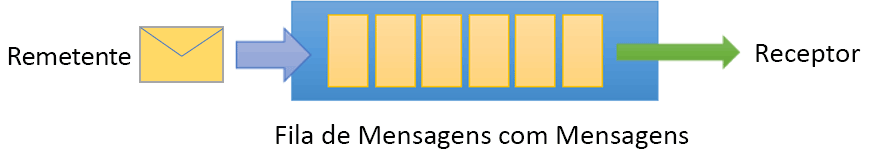
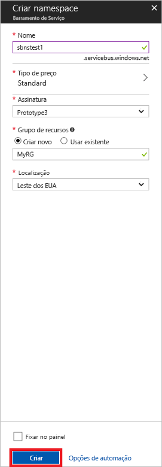

# <a name="quickstart-send-and-receive-messages-using-the-azure-portal-and-net"></a>Início rápido: Enviar e receber mensagens usando o portal do Azure e .NET

O Barramento de Serviço do Microsoft Azure é um agente de mensagem de integração empresarial que fornece mensagens seguras e confiabilidade absoluta. Um cenário típico de Barramento de Serviço geralmente envolve o desacoplamento de dois ou mais aplicativos, serviços ou processos e a transferência de alterações de dados ou estado. Esses cenários podem envolver agendamento de vários trabalhos em lotes em outro aplicativo ou serviços, ou cumprimento da ordem de disparo. Por exemplo, uma empresa de varejo pode enviar os dados do ponto de vendas a um back office ou centro de distribuição regional para atualizações de estoque e reabastecimento. Nesse cenário, o aplicativo cliente envia e recebe mensagens de uma fila do Barramento de Serviço.  



Este início rápido descreve como enviar e receber mensagens de e para uma fila do Barramento de Serviço, usando o [portal do Azure][Azure portal] para criar uma fila e um namespace de mensagens nesse namespace e obter as credenciais de autorização nesse namespace. O procedimento mostra como enviar e receber mensagens dessa fila usando a [	Biblioteca do .NET Standard](https://www.nuget.org/packages/Microsoft.Azure.ServiceBus).

Se você não tiver uma assinatura do Azure, poderá criar uma [conta gratuita][] antes de começar.

## <a name="prerequisites"></a>Pré-requisitos

Para concluir este tutorial, verifique se você tem o seguinte instalado:

- [Atualização 3 do Visual Studio 2017 (versão 15.3, 26730.01)](https://www.visualstudio.com/vs) ou posterior.
- [NET Core SDK](https://www.microsoft.com/net/download/windows), versão 2.0 ou posterior.

## <a name="log-on-to-the-azure-portal"></a>Fazer logon no Portal do Azure

Primeiro, acesse o [portal do Azure][Azure portal] e faça logon usando a assinatura do Azure. A primeira etapa é criar um namespace de Barramento de Serviço do tipo **Mensagens**.

## <a name="create-a-service-bus-namespace"></a>Criar um namespace do Barramento de Serviço

Um namespace de mensagens do Barramento de Serviço fornece um contêiner de escopo exclusivo, referenciado pelo [nome de domínio totalmente qualificado][], em que você cria uma ou mais filas, tópicos e assinaturas. O exemplo a seguir cria um namespace de mensagens do Barramento de Serviço em um [grupo de recursos](/azure/azure-resource-manager/resource-group-portal):

1. No painel de navegação esquerdo do portal, clique em **+ Criar um recurso**, depois em **Integração Corporativa** e em **Barramento de Serviço**.
2. Na caixa de diálogo **Criar um namespace** , digite um nome de namespace. O sistema imediatamente verifica para ver se o nome está disponível.
3. Após verificar se o nome do namespace está disponível, escolha o tipo de preço (Standard ou Premium).
4. No campo **Assinatura** , escolha uma assinatura do Azure na qual criar o namespace.
5. No campo **Grupo de Recursos** , escolha um grupo de recursos existente no qual o namespace residirá, ou então crie um novo.      
6. Em **Localização**, escolha o país ou região no qual o namespace deve ser hospedado.
7. Clique em **Criar**. Agora, o sistema cria o seu namespace e o habilita. Talvez você precise aguardar vários minutos, conforme o sistema fornece recursos para sua conta.



### <a name="obtain-the-management-credentials"></a>Obter as credenciais de gerenciamento

A criação de um novo namespace gera automaticamente uma regra de SAS (assinatura de acesso compartilhado) inicial com um par de chaves primárias e secundárias associado que concede, cada um, controle total sobre todos os aspectos do namespace. Para copiar a regra inicial, siga estas etapas: 

1.  Clique em **Todos os recursos** e depois clique no nome do namespace recém-criado.
2. Na janela namespace, clique em **Políticas de acesso compartilhado**.
3. Na tela **Políticas de acesso compartilhado**, clique em **RootManageSharedAccessKey**.
4. Na janela **Política: RootManageSharedAccessKey**, clique no botão **Copiar** próximo à **Cadeia de Conexão Primária**, para copiar a cadeia de conexão na área de transferência para uso posterior. Cole esse valor no Bloco de notas ou em outro local temporário. 

    ![connection-string][connection-string]
5. Repita a etapa anterior, copiando e colando o valor de **chave primária** para um local temporário para uso posterior.

## <a name="create-a-queue"></a>Criar uma fila

Para criar uma fila do Barramento de Serviço, especifique o namespace sob o qual você deseja criar. O exemplo a seguir mostra como criar uma fila no portal:

1. No painel de navegação à esquerda do portal, clique em **Barramento de Serviço** (se a opção **Barramento de Serviço** não estiver visível, clique em **Mais serviços**).
2. Clique no namespace no qual você gostaria de criar a fila.
3. Na janela do namespace, clique em **Filas**, e na janela **Filas**, clique em **+ Fila**.
4. Insira o **Nome** da fila e deixe os outros valores com os padrões.
5. Na parte inferior da janela, clique em **Criar**.
6. Anote o nome da fila.

## <a name="send-and-receive-messages"></a>Enviar e receber mensagens

Depois que o namespace e a fila forem provisionados e você tiver as credenciais necessárias, estará pronto para enviar e receber mensagens. É possível examinar o código [nesta pasta de exemplo do GitHub](https://github.com/Azure/azure-service-bus/tree/master/samples/Java/quickstarts-and-tutorials/quickstart-jms).

Para executar o código, faça o seguinte:

1. Clone o [repositório GitHub do Barramento de Serviço](https://github.com/Azure/azure-service-bus/), emitindo o comando a seguir:

   ```shell
   git clone https://github.com/Azure/azure-service-bus.git
   ```

3. Navegue até a pasta de exemplo `azure-service-bus\samples\DotNet\GettingStarted\BasicSendReceiveQuickStart\BasicSendReceiveQuickStart`.

4. Copie a cadeia de conexão e o nome da fila obtidos na seção [Obter as credenciais de gerenciamento](#obtain-the-management-credentials).

5.  Em um prompt de comando, digite o comando a seguir:

   ```shell
   dotnet build
   ```

6.  Navegue até a pasta `bin\Debug\netcoreapp2.0`.

7.  Digite o comando a seguir para executar o programa. Verifique se você substituiu `myConnectionString` pelo valor obtido anteriormente e `myQueueName` pelo nome da fila que você criou:

   ```shell
   dotnet BasicSendReceiveQuickStart.dll -ConnectionString "myConnectionString" -QueueName "myQueueName"
   ``` 

8. Observe 10 mensagens sendo enviadas para a fila e, subsequentemente, recebidas da fila:

   

## <a name="clean-up-resources"></a>Limpar recursos

É possível usar o portal para remover o grupo de recursos, o namespace e a fila.

## <a name="understand-the-sample-code"></a>Entender o código de exemplo

Esta seção contém mais detalhes sobre o que o código de exemplo faz. 

### <a name="get-connection-string-and-queue"></a>Obter cadeia de conexão e fila

A cadeia de conexão e o nome da fila são transmitidos para o método `Main()` como argumentos de linha de comando. `Main()` declara duas variáveis de cadeia de caracteres para manter esses valores:

```csharp
static void Main(string[] args)
{
    string ServiceBusConnectionString = "";
    string QueueName = "";

    for (int i = 0; i < args.Length; i++)
    {
        var p = new Program();
        if (args[i] == "-ConnectionString")
        {
            Console.WriteLine($"ConnectionString: {args[i+1]}");
            ServiceBusConnectionString = args[i + 1]; 
        }
        else if(args[i] == "-QueueName")
        {
            Console.WriteLine($"QueueName: {args[i+1]}");
            QueueName = args[i + 1];
        }                
    }

    if (ServiceBusConnectionString != "" && QueueName != "")
        MainAsync(ServiceBusConnectionString, QueueName).GetAwaiter().GetResult();
    else
    {
        Console.WriteLine("Specify -Connectionstring and -QueueName to execute the example.");
        Console.ReadKey();
    }                            
}
```
 
Em seguida, o método `Main()` inicia o loop de mensagem assíncrona, `MainAsync()`.

### <a name="message-loop"></a>Loop de mensagem

O método MainAsync () cria um cliente de fila com os argumentos de linha de comando, chama um manipulador de mensagens de recebimento nomeado `RegisterOnMessageHandlerAndReceiveMessages()` e envia o conjunto de mensagens:

```csharp
static async Task MainAsync(string ServiceBusConnectionString, string QueueName)
{
    const int numberOfMessages = 10;
    queueClient = new QueueClient(ServiceBusConnectionString, QueueName);

    Console.WriteLine("======================================================");
    Console.WriteLine("Press any key to exit after receiving all the messages.");
    Console.WriteLine("======================================================");

    // Register QueueClient's MessageHandler and receive messages in a loop
    RegisterOnMessageHandlerAndReceiveMessages();

    // Send Messages
    await SendMessagesAsync(numberOfMessages);

    Console.ReadKey();

    await queueClient.CloseAsync();
}
```

O método `RegisterOnMessageHandlerAndReceiveMessages()` simplesmente define algumas opções de manipulador de mensagens e, em seguida, chama o métodos `RegisterMessageHandler()` do cliente de fila, que inicia o recebimento:

```csharp
static void RegisterOnMessageHandlerAndReceiveMessages()
{
    // Configure the MessageHandler Options in terms of exception handling, number of concurrent messages to deliver etc.
    var messageHandlerOptions = new MessageHandlerOptions(ExceptionReceivedHandler)
    {
        // Maximum number of Concurrent calls to the callback `ProcessMessagesAsync`, set to 1 for simplicity.
        // Set it according to how many messages the application wants to process in parallel.
        MaxConcurrentCalls = 1,

        // Indicates whether MessagePump should automatically complete the messages after returning from User Callback.
        // False below indicates the Complete will be handled by the User Callback as in `ProcessMessagesAsync` below.
        AutoComplete = false
    };

    // Register the function that will process messages
    queueClient.RegisterMessageHandler(ProcessMessagesAsync, messageHandlerOptions);
} 
```

### <a name="send-messages"></a>Enviar mensagens

As operações de criação e envio de mensagens ocorrem no método `SendMessagesAsync()`:

```csharp
static async Task SendMessagesAsync(int numberOfMessagesToSend)
{
    try
    {
        for (var i = 0; i < numberOfMessagesToSend; i++)
        {
            // Create a new message to send to the queue
            string messageBody = $"Message {i}";
            var message = new Message(Encoding.UTF8.GetBytes(messageBody));

            // Write the body of the message to the console
            Console.WriteLine($"Sending message: {messageBody}");

            // Send the message to the queue
            await queueClient.SendAsync(message);
        }
    }
    catch (Exception exception)
    {
        Console.WriteLine($"{DateTime.Now} :: Exception: {exception.Message}");
    }
}
```

### <a name="process-messages"></a>Processar mensagens

O método `ProcessMessagesAsync()` reconhece, processa e conclui o recebimento das mensagens:

```csharp
static async Task ProcessMessagesAsync(Message message, CancellationToken token)
{
    // Process the message
    Console.WriteLine($"Received message: SequenceNumber:{message.SystemProperties.SequenceNumber} Body:{Encoding.UTF8.GetString(message.Body)}");

    // Complete the message so that it is not received again.
    await queueClient.CompleteAsync(message.SystemProperties.LockToken);
}
```

## <a name="next-steps"></a>Próximas etapas

Neste artigo, você criou um namespace de Barramento de Serviço e outros recursos necessários para enviar e receber mensagens de uma fila. Para saber mais sobre como gravar código para enviar e receber mensagens, continue no tutorial para Barramento de Serviço a seguir:

> [!div class="nextstepaction"]
> [Atualizar inventário usando o portal do Azure](./service-bus-tutorial-topics-subscriptions-portal.md)


[conta gratuita]: https://azure.microsoft.com/free/?ref=microsoft.com&utm_source=microsoft.com&utm_medium=docs&utm_campaign=visualstudio
[nome de domínio totalmente qualificado]: https://wikipedia.org/wiki/Fully_qualified_domain_name
[Azure portal]: https://portal.azure.com/

[connection-string]: ./media/service-bus-quickstart-portal/connection-string.png
[service-bus-flow]: ./media/service-bus-quickstart-portal/service-bus-flow.png
