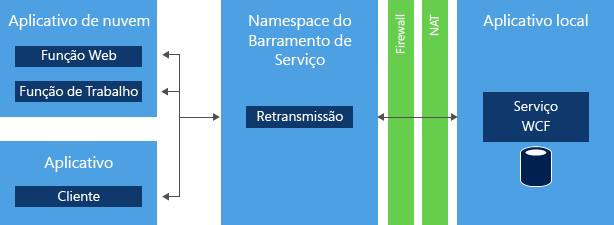
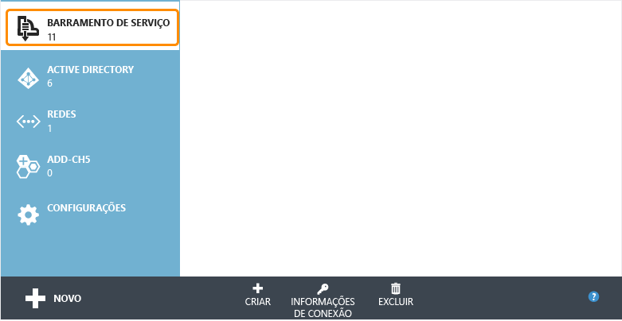
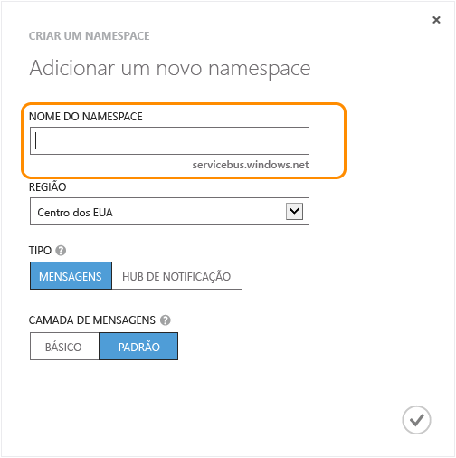
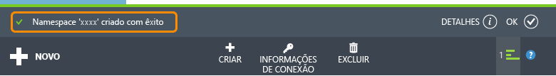
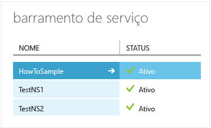
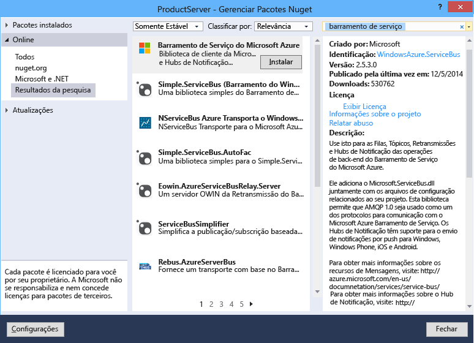

<properties 
	pageTitle="Como usar a Retransmissão do Barramento de Serviço (.NET) - Azure" 
	description="Saiba como usar o serviço de Retransmissão do Barramento de Serviço do Azure para conectar dois aplicativos hospedados em locais diferentes." 
	services="service-bus" 
	documentationCenter=".net" 
	authors="sethmanheim" 
	manager="timlt" 
	editor=""/>

<tags 
	ms.service="service-bus" 
	ms.workload="tbd" 
	ms.tgt_pltfrm="na" 
	ms.devlang="dotnet" 
	ms.topic="article" 
	ms.date="07/02/2015" 
	ms.author="sethm"/>

# Como usar o serviço de retransmissão do Barramento de Serviço

Este guia descreve como usar o serviço de Retransmissão do Barramento de Serviço. Os exemplos são escritos em C# e usam a API da Windows Communication Foundation (WCF) com extensões contidas no assembly do Barramento de Serviço que fazem parte do SDK do .NET do Microsoft Azure. Para saber mais sobre a retransmissão do Barramento de Serviço, confira a seção [Próximas etapas](#Next-steps).

[AZURE.INCLUDE [create-account-note](../../includes/create-account-note.md)]

## O que é a Retransmissão de Service Bus?

O serviço de *retransmissão* do Barramento de Serviço permite a compilação de aplicativos híbridos que executem tanto no datacenter do Azure quanto em seu próprio ambiente corporativo local. A retransmissão do Barramento de Serviço facilita isso permitindo que você exiba com segurança os serviços da Windows Communication Foundation (WCF) que residem em uma rede corporativa para a nuvem pública, sem precisar abrir uma conexão de firewall ou exigir mudanças intrusivas em uma infraestrutura de rede corporativa.

A retransmissão do Barramento de serviço permite que você hospede serviços WCF em seu ambiente corporativo existente. Você pode delegar a escuta de sessões e solicitações de entrada para esses serviços WCF ao serviço do Barramento de serviço em execução no Azure. Isso permite que você exponha esses serviços para o código do aplicativo em execução no Azure ou para usuários móveis ou ambientes de parceiros na extranet. O Barramento de Serviço permite que você controle com segurança quem pode acessar esses serviços em um nível granular refinado. Ele fornece uma maneira poderosa e segura de exibir a funcionalidade do aplicativo e os dados de suas soluções corporativas existentes e tira proveito disso na nuvem.

Este guia demonstra como usar a retransmissão de Barramento de serviço para criar um serviço Web do WCF exibido usando uma associação de canal TCP, que implementa uma conversa segura entre duas partes.

## Criar um namespace de serviço

Para começar a usar a retransmissão de Barramento de serviço do Azure, você deve primeiro criar um namespace do serviço. Um namespace fornece um contêiner de escopo para endereçar recursos do barramento de serviço dentro de seu aplicativo.

Para criar um namespace de serviço:

1.  Faça logon no [Portal de Gerenciamento do Azure][].

2.  No painel de navegação esquerdo do Portal de Gerenciamento, clique em**Service Bus**.

3.  No painel inferior do Portal de Gerenciamento, clique em **Criar**.

	

4.  No diálogo **Adicionar um novo namespace**, digite um nome de namespace. O sistema imediatamente verifica para ver se o nome está disponível.

	

5.  Depois de verificar se o nome do namespace está disponível, escolha o país ou a região em que o namespace deve ser hospedado (certifique-se de usar o mesmo país/região em que você está implantando seus recursos de computação).

	IMPORTANTE: selecione a **mesma região** que você pretende escolher para implantar seu aplicativo. Isso lhe dará o melhor desempenho.

6.	Deixe os outros campos na caixa de diálogo com seus valores padrão (**Mensagens** e **Camada padrão**), em seguida, clique na marca de seleção. Agora, o sistema cria o seu namespace e o habilita. Talvez você precise aguardar vários minutos, enquanto o sistema provisiona recursos para sua conta.

	

	O namespace que você criou aparece no Portal de Gerenciamento e demora algum tempo para ser ativado. Aguarde até que o status seja **Ativo** para continuar.

## Obter as credenciais de gerenciamento padrão do namespace

Para realizar operações de gerenciamento, como a criação de uma conexão de retransmissão no novo namespace, você deve configurar a regra de autorização de Assinatura de acesso compartilhado (SAS) para o namespace. Para saber mais sobre SAS, confira [Autenticação de assinatura de acesso compartilhado com o Barramento de serviço][].

1.  No painel de navegação esquerdo, clique no nó **Barramento de Serviço** para exibir a lista de namespaces disponíveis: 

2.  Clique duas vezes no nome do namespace que você acabou de criar na lista abaixo: 

3.  Clique na guia **Configurar** na parte superior da página.
 
4.  Quando um namespace do Barramento de Serviço é provisionado, uma **SharedAccessAuthorizationRule** com **KeyName** definida como **RootManageSharedAccessKey** é criada por padrão. Esta página exibe essa chave, bem como as chaves primárias e secundárias para a regra padrão.

## Obtenha o pacote do NuGet do Barramento de Serviço

O pacote **NuGet** do Barramento de Serviço é a maneira mais fácil de obter a API do Barramento de Serviço e configurar seu aplicativo com todas as dependências do Barramento de Serviço. A extensão do Visual Studio do NuGet facilita a instalação e a atualização de bibliotecas e ferramentas no Visual Studio e no Visual Studio Express. O pacote NuGet de Barramento de serviço é a maneira mais fácil de obter a API do Barramento de serviço e configurar seu aplicativo com todas as dependências de Barramento de serviço.

Para instalar o pacote do NuGet em seu aplicativo, proceda da seguinte maneira:

1.  No Gerenciador de Soluções, clique com o botão direito do mouse em **Referências** e clique em **Gerenciar Pacotes NuGet**.
2.  Pesquise "Barramento de Serviço" e selecione o item **Barramento de Serviço do Microsoft Azure**. Clique em **Instalar** para concluir a instalação e, em seguida, feche essa caixa de diálogo.

	
  

## Como usar o Barramento de Serviço para expor e consumir um serviço Web SOAP com TCP

Para expor um serviço Web SOAP WCF existente para consumo externo, você deve alterar as associações e endereços do serviço. Isso pode exigir alterações em seu arquivo de configuração ou exigir alterações de código, dependendo de como você instalou e configurou seus serviços WCF. Observe que o WCF permite ter vários pontos de extremidade de rede sobre o mesmo serviço, portanto, você pode manter os pontos de extremidade internos existentes ao adicionar pontos de extremidade do Barramento de serviço para acesso externo ao mesmo tempo.

Nesta tarefa, você criará um serviço WCF simples e adicionará um ouvinte do Barramento de serviço a ele. Este exercício pressupõe alguma familiaridade com o Visual Studio e, portanto, não percorre todos os detalhes da criação de um projeto. Em vez disso, ele se concentra no código.

Antes de iniciar as etapas a seguir, conclua o seguinte procedimento para configurar seu ambiente:

1.  No Visual Studio, crie um aplicativo de console que contenha dois projetos: “Cliente” e “Serviço” na solução.
2.  Adicione o pacote NuGet do **Barramento de Serviço do Microsoft Azure** aos dois projetos. Isso adiciona todas as referências ao assembly necessárias para seus projetos.

### Como criar o serviço

Primeiro, crie o serviço em si. Qualquer serviço WCF consiste em pelo menos três partes distintas:

-   Definição de um contrato que descreve quais mensagens são trocadas e quais operações devem ser chamadas. 
-   Implementação do contrato mencionado.
-   Host que hospeda o serviço WCF e exibe vários pontos de extremidade.

Os exemplos de código desta seção abordam cada um desses componentes.

O contrato define uma única operação, `AddNumbers`, que adiciona dois números e retorna o resultado. A interface `IProblemSolverChannel` permite que o cliente gerencie mais facilmente o ciclo de vida do proxy. A criação dessa interface é considerada uma prática recomendada. É uma boa ideia colocar essa definição de contrato em um arquivo separado para que você possa fazer referência a ele nos dois projetos, "Cliente" e "Serviço", mas você também pode copiar o código nos dois projetos:

        using System.ServiceModel;
     
        [ServiceContract(Namespace = "urn:ps")]
        interface IProblemSolver
        {
            [OperationContract]
            int AddNumbers(int a, int b);
        }
     
        interface IProblemSolverChannel : IProblemSolver, IClientChannel {}

Com o contrato estabelecido, a implementação é trivial:

        class ProblemSolver : IProblemSolver
        {
            public int AddNumbers(int a, int b)
            {
                return a + b;
            }
        }

### Como configurar um host de serviço de forma programática

Com o contrato e a implementação estabelecidos, você agora pode hospedar o serviço. A hospedagem ocorre dentro de um objeto [System.ServiceModel.ServiceHost](https://msdn.microsoft.com/library/azure/system.servicemodel.servicehost.aspx), que cuida do gerenciamento de instâncias do serviço e hospeda os pontos de extremidade que detectam as mensagens. O código a seguir configura o serviço com um ponto de extremidade local normal e um ponto de extremidade do Barramento de Serviço para ilustrar a aparência, lado a lado, dos pontos de extremidade internos e externos. Substitua a cadeia de caracteres *namespace* pelo nome do namespace e *yourKey* pela chave SAS obtida na etapa de configuração anterior.

    ServiceHost sh = new ServiceHost(typeof(ProblemSolver));

    sh.AddServiceEndpoint(
       typeof (IProblemSolver), new NetTcpBinding(), 
       "net.tcp://localhost:9358/solver");

    sh.AddServiceEndpoint(
       typeof(IProblemSolver), new NetTcpRelayBinding(), 
       ServiceBusEnvironment.CreateServiceUri("sb", "namespace", "solver"))
        .Behaviors.Add(new TransportClientEndpointBehavior {
              TokenProvider = TokenProvider.CreateSharedAccessSignatureTokenProvider("RootManageSharedAccessKey", "yourKey")});

    sh.Open();

    Console.WriteLine("Press ENTER to close");
    Console.ReadLine();

    sh.Close();

No exemplo, você cria dois pontos de extremidade que estão na mesma implementação de contrato. Um é local e o outro é projetado por meio do Barramento de Serviço. As principais diferenças entre eles são as associações; [`NetTcpBinding`](https://msdn.microsoft.com/library/azure/system.servicemodel.nettcpbinding.aspx) para o local e [NetTcpRelayBinding](https://msdn.microsoft.com/library/azure/microsoft.servicebus.nettcprelaybinding.aspx) para o ponto de extremidade e os endereços do Barramento de Serviço. O ponto de extremidade local tem um endereço de rede local com uma porta distinta. O ponto de extremidade do Barramento de Serviço tem um endereço de ponto de extremidade composto da cadeia de caracteres “sb”, o nome do seu namespace e o caminho “solver”. Isso resulta no URI "sb://[serviceNamespace].servicebus.windows.net/solver", identificando o ponto de extremidade de serviço como um ponto de extremidade TCP do Barramento de Serviço com um nome DNS externo totalmente qualificado. Se você colocar o código substituindo os espaços reservados, conforme explicado acima, na função `Main` do aplicativo "Serviço", você terá um serviço funcional. Se desejar que o serviço detecte exclusivamente o Barramento de serviço, remova a declaração de ponto de extremidade local.

### Como configurar um host de serviço no arquivo App.config

Você também pode configurar o host usando o arquivo App.config. O código de hospedagem do serviço nesse caso é o seguinte:

    ServiceHost sh = new ServiceHost(typeof(ProblemSolver));
    sh.Open();
    Console.WriteLine("Press ENTER to close");
    Console.ReadLine();
    sh.Close();

As definições de ponto de extremidade são movidas para o arquivo App.config. Observe que o pacote **NuGet** já adicionou uma série de definições ao arquivo App.config que são as extensões de configuração necessárias para o Barramento de Serviço. O seguinte trecho de código, que é o equivalente exato do trecho de código anterior, deve aparecer diretamente sob o elemento **system.serviceModel**. Esse trecho pressupõe que o namespace do projeto C# é chamado de "Serviço". Substitua os espaços reservados com seu namespace do Barramento de Serviço e a chave SAS.

    <services>
        <service name="Service.ProblemSolver">
            <endpoint contract="Service.IProblemSolver"
                      binding="netTcpBinding"
                      address="net.tcp://localhost:9358/solver"/>
            <endpoint contract="Service.IProblemSolver"
                      binding="netTcpRelayBinding"
                      address="sb://namespace.servicebus.windows.net/solver"
                      behaviorConfiguration="sbTokenProvider"/>
        </service>
    </services>
    <behaviors>
        <endpointBehaviors>
            <behavior name="sbTokenProvider">
                <transportClientEndpointBehavior>
                    <tokenProvider>
                        <sharedAccessSignature keyName="RootManageSharedAccessKey" key="yourKey" />
                    </tokenProvider>
                </transportClientEndpointBehavior>
            </behavior>
        </endpointBehaviors>
    </behaviors>

Depois de fazer essas alterações, o serviço é iniciado como antes, mas com dois pontos de extremidade ativos: um local e um escutando na nuvem.

### Como criar o cliente

#### Como configurar um cliente de forma programática

Para consumir o serviço, você pode construir um cliente WCF usando um objeto [`ChannelFactory`](https://msdn.microsoft.com/library/system.servicemodel.channelfactory.aspx). O Barramento de Serviço usa um modelo de segurança baseado em token implementado com a SAS. A classe **TokenProvider** representa um provedor de token de segurança com métodos de fábrica internos que retornam alguns provedores de token conhecidos. O exemplo a seguir usa o método [`CreateSharedAccessSignatureTokenProvider`](https://msdn.microsoft.com/library/azure/microsoft.servicebus.tokenprovider.createsharedaccesssignaturetokenprovider.aspx) para lidar com a aquisição do token SAS apropriado. O nome e a chave são os obtidos no portal, conforme descrito na seção anterior.

Primeiro, faça referência ou copie o código do contrato `IProblemSolver` do serviço para o projeto cliente.

Em seguida, substitua o código do método `Main` do cliente, substituindo novamente o texto do espaço reservado pelo namespace e a chave SAS do Barramento de Serviço:

    var cf = new ChannelFactory<IProblemSolverChannel>(
        new NetTcpRelayBinding(), 
        new EndpointAddress(ServiceBusEnvironment.CreateServiceUri("sb", "namespace", "solver")));

    cf.Endpoint.Behaviors.Add(new TransportClientEndpointBehavior
                { TokenProvider = TokenProvider.CreateSharedAccessSignatureTokenProvider("RootManageSharedAccessKey","yourKey") });
     
    using (var ch = cf.CreateChannel())
    {
        Console.WriteLine(ch.AddNumbers(4, 5));
    }

Agora, você pode compilar o cliente e o serviço, executá-los (execute o serviço primeiro) e o cliente chamará o serviço e imprimirá "**9**". Você pode executar o cliente e o servidor em máquinas diferentes, até entre redes, e a comunicação ainda funcionará. O código do cliente também pode ser executado na nuvem ou localmente.

#### Como configurar um cliente no arquivo App.config

Você também pode configurar o cliente usando o arquivo App.config. Veja abaixo o código de cliente para esse procedimento:

    var cf = new ChannelFactory<IProblemSolverChannel>("solver");
    using (var ch = cf.CreateChannel())
    {
        Console.WriteLine(ch.AddNumbers(4, 5));
    }

As definições de ponto de extremidade são movidas para o arquivo App.config. O trecho de código a seguir, que é o mesmo código listado acima, deve aparecer diretamente sob o elemento **system.serviceModel**. Aqui, como antes, você deve substituir os espaços reservados pelo namespace do Barramento de Serviço e a chave SAS.

    <client>
        <endpoint name="solver" contract="Service.IProblemSolver"
                  binding="netTcpRelayBinding"
                  address="sb://namespace.servicebus.windows.net/solver"
                  behaviorConfiguration="sbTokenProvider"/>
    </client>
    <behaviors>
        <endpointBehaviors>
            <behavior name="sbTokenProvider">
                <transportClientEndpointBehavior>
                    <tokenProvider>
                        <sharedAccessSignature keyName="RootManageSharedAccessKey" key="yourKey" />
                    </tokenProvider>
                </transportClientEndpointBehavior>
            </behavior>
        </endpointBehaviors>
    </behaviors>

## Próximas etapas

Agora que você já aprendeu os conceitos básicos do serviço de **retransmissão** do Barramento de Serviço, siga estes links para saber mais.

-   Compilando um serviço: [Compilando um serviço para o Barramento de Serviço][].
-   Compilando o cliente: [Compilando um aplicativo cliente do Barramento de Serviço][].
-   Exemplos de Barramento de Serviço: baixe em [Exemplos do Azure][] ou confira a visão geral no [MSDN][].

  [Create a Service Namespace]: #create_namespace
  [Obtain the Default Management Credentials for the Namespace]: #obtain_credentials
  [Get the Service Bus NuGet Package]: #get_nuget_package
  [How to: Use Service Bus to Expose and Consume a SOAP Web Service  with TCP]: #how_soap
  [Portal de Gerenciamento do Azure]: http://manage.windowsazure.com
  [Autenticação de assinatura de acesso compartilhado com o Barramento de serviço]: http://msdn.microsoft.com/library/azure/dn170477.aspx
  [Compilando um serviço para o Barramento de Serviço]: http://msdn.microsoft.com/library/azure/ee173564.aspx
  [Compilando um aplicativo cliente do Barramento de Serviço]: http://msdn.microsoft.com/library/azure/ee173543.aspx
  [Exemplos do Azure]: https://code.msdn.microsoft.com/windowsazure/site/search?query=service%20bus&f%5B0%5D.Value=service%20bus&f%5B0%5D.Type=SearchText&ac=2
  [MSDN]: https://msdn.microsoft.com/pt-br/library/azure/dn194201.aspx
 

<!---HONumber=July15_HO2-->