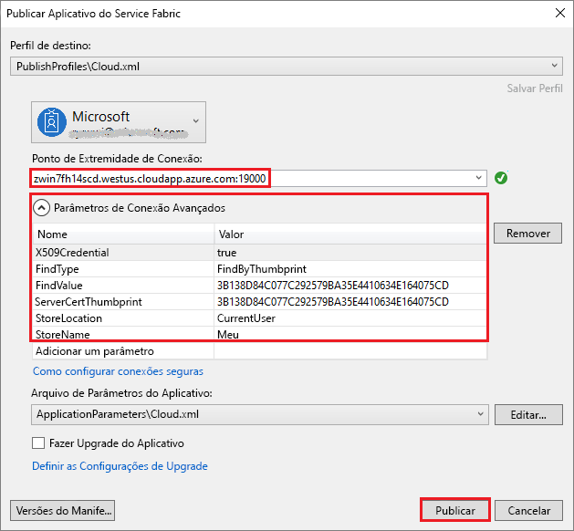

# <a name="deploy-a-service-fabric-windows-container-application-on-azure"></a>Implantar um aplicativo de contêiner Windows do Service Fabric
O Azure Service Fabric é uma plataforma de sistemas distribuídos para implantação e gerenciamento de contêineres e microsserviços escalonáveis e confiáveis. 

Executar um aplicativo existente em um contêiner do Windows em um cluster do Service Fabric não requer alterações no seu aplicativo. Este guia de início rápido mostra como implantar uma imagem de contêiner do Docker predefinida em um aplicativo do Service Fabric. Quando você terminar, terá um contêiner do Windows Server 2016 Nano Server e o IIS em execução. Este guia de início rápido descreve a implantação de um contêiner do Windows; leia [este guia de início rápido](service-fabric-quickstart-containers-linux.md) para implantar um contêiner do Linux.

![Página de Web do IIS padrão][iis-default]

Usando este guia de início rápido, você aprende a:
> [!div class="checklist"]
> * Empacotar um contêiner de imagem do Docker
> * Configurar a comunicação
> * Compilar e empacotar o aplicativo do Service Fabric
> * Implantar o aplicativo de contêiner no Azure

## <a name="prerequisites"></a>Pré-requisitos
* Uma assinatura do Azure (você pode criar um [conta gratuita](https://azure.microsoft.com/free/?WT.mc_id=A261C142F)).
* Um computador de desenvolvimento executando:
  * Visual Studio 2015 ou Visual Studio 2017.
  * [Ferramentas e SDK do Service Fabric](service-fabric-get-started.md).

## <a name="package-a-docker-image-container-with-visual-studio"></a>Empacotar um recipiente de imagem do Docker com o Visual Studio
As ferramentas e o SDK do Service Fabric oferecem um modelo de serviço para ajudar você a implantar um contêiner em um cluster do Service Fabric.

Inicie o Visual Studio como “Administrador”.  Selecione **Arquivo** > **Novo** > **Projeto**.

Selecione **Aplicativo do Service Fabric**, nomeie-o como "MyFirstContainer" e clique em **OK**.

Selecione **Contêiner** na lista de **modelos de serviço**.

Em **Nome da Imagem**, digite "nanoserver iis", a [imagem de base do Windows Server 2016 Nano Server e IIS](https://hub.docker.com/r/nanoserver/iis/). 

Chame o serviço de "MyContainerService" e clique em **OK**.

## <a name="configure-communication-and-container-port-to-host-port-mapping"></a>Configurar o mapeamento de porta para porta do host de comunicação e do contêiner
O serviço precisa de um ponto de extremidade para comunicação.  Agora, você pode adicionar o protocolo, a porta e o tipo a um `Endpoint` no arquivo ServiceManifest.xml. Neste Guia de Início Rápido, o serviço em contêineres escuta na porta 80: 

```xml
<Endpoint Name="MyContainerServiceTypeEndpoint" UriScheme="http" Port="80" Protocol="http"/>
```
Ao fornecer `UriScheme`, o ponto de extremidade do contêiner é registrado automaticamente no serviço de Nomenclatura do Service Fabric para capacidade de descoberta. Um arquivo de exemplo servicemanifest. XML completo é fornecido no final deste artigo. 

Configure o mapeamento de porta, da porta para o host, do contêiner especificando uma política `PortBinding` no `ContainerHostPolicies` do arquivo ApplicationManifest.xml.  Para este guia de início rápido, `ContainerPort` é 80 e `EndpointRef` é "MyContainerServiceTypeEndpoint" (o ponto de extremidade definido no manifesto do serviço).  As solicitações de entrada para o serviço na porta 80 são mapeadas para a porta 80 no contêiner.  

```xml
<ServiceManifestImport>
...
  <Policies>
    <ContainerHostPolicies CodePackageRef="Code">
      <PortBinding ContainerPort="80" EndpointRef="MyContainerServiceTypeEndpoint"/>
    </ContainerHostPolicies>
  </Policies>
</ServiceManifestImport>
```

Um arquivo de exemplo ApplicationManifest. XML completo é fornecido no final deste artigo.

## <a name="create-a-cluster"></a>Criar um cluster
Para implantar o aplicativo em um cluster do Azure, você pode optar por criar seu próprio cluster ou usar um cluster de entidade.

Os clusters Party são clusters gratuitos de duração limitada do Service Fabric, hospedados no Azure e executados pela equipe do Service Fabric, nos quais qualquer pessoa pode implantar aplicativos e aprender mais sobre a plataforma. Para obter acesso a um cluster de entidade, [siga as instruções](http://aka.ms/tryservicefabric).  

Para obter informações sobre como criar seu próprio cluster, consulte [Criar seu primeiro cluster do Service Fabric no Azure](service-fabric-get-started-azure-cluster.md).

Observe o ponto de extremidade de conexão, que você usará na etapa a seguir.  

## <a name="deploy-the-application-to-azure-using-visual-studio"></a>Implantar o aplicativo no Azure usando o Visual Studio
Agora que o aplicativo está pronto, você poderá implantá-lo no cluster diretamente por meio do Visual Studio.

Clique com botão direito do mouse em **MyFirstContainer** no Gerenciador de Soluções e escolha **Publicar**. A caixa de diálogo Publicar será exibida.



Digite o Ponto de Extremidade de Conexão do cluster no campo **Ponto de Extremidade de Conexão** e clique em **Publicar**. Ao se inscrever no cluster de entidade, o Ponto de Extremidade de Conexão será fornecido no navegador, por exemplo, `winh1x87d1d.westus.cloudapp.azure.com:19000`.

Abra um navegador e navegue até http://winh1x87d1d.westus.cloudapp.azure.com:80. Você deve ver a página da Web do IIS padrão: ![Página da Web do IIS padrão][iis-default]

## <a name="complete-example-service-fabric-application-and-service-manifests"></a>Exemplo completo de manifestos de serviço e aplicativo do Service Fabric
Aqui estão os manifestos de aplicativo e serviço completos usados neste guia rápido.

### <a name="servicemanifestxml"></a>ServiceManifest.xml
```xml
<?xml version="1.0" encoding="utf-8"?>
<ServiceManifest Name="MyContainerServicePkg"
                 Version="1.0.0"
                 xmlns="http://schemas.microsoft.com/2011/01/fabric"
                 xmlns:xsd="http://www.w3.org/2001/XMLSchema"
                 xmlns:xsi="http://www.w3.org/2001/XMLSchema-instance">
  <ServiceTypes>
    <!-- This is the name of your ServiceType.
         The UseImplicitHost attribute indicates this is a guest service. -->
    <StatelessServiceType ServiceTypeName="MyContainerServiceType" UseImplicitHost="true" />
  </ServiceTypes>

  <!-- Code package is your service executable. -->
  <CodePackage Name="Code" Version="1.0.0">
    <EntryPoint>
      <!-- Follow this link for more information about deploying Windows containers to Service Fabric: https://aka.ms/sfguestcontainers -->
      <ContainerHost>
        <ImageName>nanoserver/iis</ImageName>
      </ContainerHost>
    </EntryPoint>
    <!-- Pass environment variables to your container: -->
    <!--
    <EnvironmentVariables>
      <EnvironmentVariable Name="VariableName" Value="VariableValue"/>
    </EnvironmentVariables>
    -->
  </CodePackage>

  <!-- Config package is the contents of the Config directoy under PackageRoot that contains an 
       independently-updateable and versioned set of custom configuration settings for your service. -->
  <ConfigPackage Name="Config" Version="1.0.0" />

  <Resources>
    <Endpoints>
      <!-- This endpoint is used by the communication listener to obtain the port on which to 
           listen. Please note that if your service is partitioned, this port is shared with 
           replicas of different partitions that are placed in your code. -->
      <Endpoint Name="MyContainerServiceTypeEndpoint" UriScheme="http" Port="80" Protocol="http"/>
    </Endpoints>
  </Resources>
</ServiceManifest>
```
### <a name="applicationmanifestxml"></a>ApplicationManifest.xml
```xml
<?xml version="1.0" encoding="utf-8"?>
<ApplicationManifest ApplicationTypeName="MyFirstContainerType"
                     ApplicationTypeVersion="1.0.0"
                     xmlns="http://schemas.microsoft.com/2011/01/fabric"
                     xmlns:xsd="http://www.w3.org/2001/XMLSchema"
                     xmlns:xsi="http://www.w3.org/2001/XMLSchema-instance">
  <Parameters>
    <Parameter Name="MyContainerService_InstanceCount" DefaultValue="-1" />
  </Parameters>
  <!-- Import the ServiceManifest from the ServicePackage. The ServiceManifestName and ServiceManifestVersion 
       should match the Name and Version attributes of the ServiceManifest element defined in the 
       ServiceManifest.xml file. -->
  <ServiceManifestImport>
    <ServiceManifestRef ServiceManifestName="MyContainerServicePkg" ServiceManifestVersion="1.0.0" />
    <ConfigOverrides />
    <Policies>
      <ContainerHostPolicies CodePackageRef="Code">
        <PortBinding ContainerPort="80" EndpointRef="MyContainerServiceTypeEndpoint"/>
      </ContainerHostPolicies>
    </Policies>
  </ServiceManifestImport>
  <DefaultServices>
    <!-- The section below creates instances of service types, when an instance of this 
         application type is created. You can also create one or more instances of service type using the 
         ServiceFabric PowerShell module.
         
         The attribute ServiceTypeName below must match the name defined in the imported ServiceManifest.xml file. -->
    <Service Name="MyContainerService" ServicePackageActivationMode="ExclusiveProcess">
      <StatelessService ServiceTypeName="MyContainerServiceType" InstanceCount="[MyContainerService_InstanceCount]">
        <SingletonPartition />
      </StatelessService>
    </Service>
  </DefaultServices>
</ApplicationManifest>
```

## <a name="next-steps"></a>Próximas etapas
Neste guia de início rápido, você aprendeu a:
> [!div class="checklist"]
> * Empacotar um contêiner de imagem do Docker
> * Configurar a comunicação
> * Compilar e empacotar o aplicativo do Service Fabric
> * Implantar o aplicativo de contêiner no Azure

* Saiba mais sobre como executar [contêineres no Service Fabric](service-fabric-containers-overview.md).
* Leia o tutorial [Como implantar um aplicativo .NET em um contêiner](service-fabric-host-app-in-a-container.md).
* Leia mais sobre o [ciclo de vida do aplicativo](service-fabric-application-lifecycle.md) do Service Fabric.
* Confira os [exemplos de código do Service Fabric](https://github.com/Azure-Samples/service-fabric-dotnet-containers) no GitHub.

[iis-default]: ./media/service-fabric-quickstart-containers/iis-default.png
[publish-dialog]: ./media/service-fabric-quickstart-containers/publish-dialog.png

