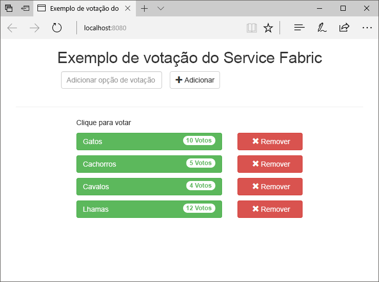
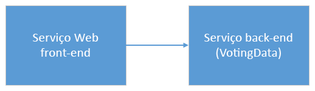
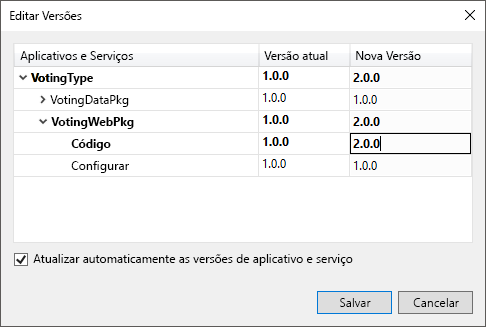
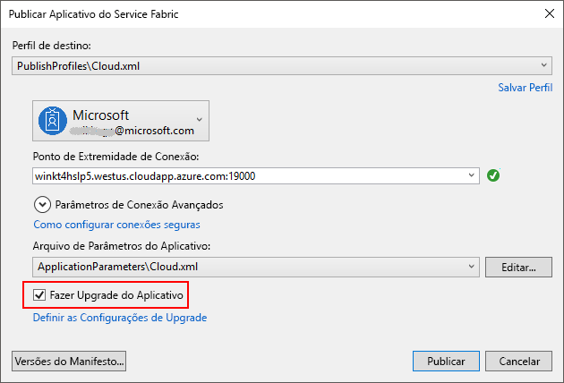
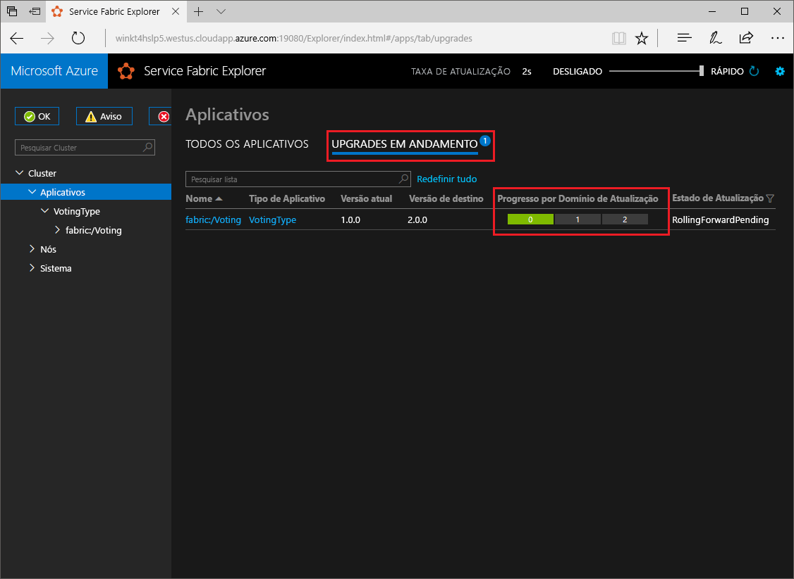

# <a name="quickstart-deploy-a-net-reliable-services-application-to-service-fabric"></a>Início rápido: Implantar um aplicativo Reliable Services em .NET no Service Fabric

O Azure Service Fabric é uma plataforma de sistemas distribuídos para implantação e gerenciamento de contêineres e microsserviços escalonáveis e confiáveis.

Este guia de início rápido mostra como implantar seu primeiro aplicativo .NET no Service Fabric. Quando terminar, você terá um aplicativo de votação com um front-end da Web do ASP.NET Core que salva os resultados da votação em um serviço de back-end com estado do cluster.



Com esse aplicativo, você aprenderá a:

* Criar um aplicativo usando o .NET e o Service Fabric
* Usar o ASP.NET Core como um front-end da Web
* Armazenar dados de aplicativo em um serviço com estado
* Depurar o aplicativo localmente
* Expandir o aplicativo para vários nós
* Executar um upgrade sem interrupção do aplicativo

## <a name="prerequisites"></a>Pré-requisitos

Para concluir este guia de início rápido:

1. [Instale o Visual Studio 2017](https://www.visualstudio.com/) com as cargas de trabalho de **desenvolvimento do Azure** e de **desenvolvimento para a Web e ASP.NET**.
2. [Instalar o Git](https://git-scm.com/)
3. [Instalar o SDK do Microsoft Azure Service Fabric](https://www.microsoft.com/web/handlers/webpi.ashx?command=getinstallerredirect&appid=MicrosoftAzure-ServiceFabric-CoreSDK)
4. Execute o seguinte comando para habilitar o Visual Studio a implantar no cluster local do Service Fabric:
    ```powershell
    Set-ExecutionPolicy -ExecutionPolicy Unrestricted -Force -Scope CurrentUser
    ```
    
## <a name="build-a-cluster"></a>Criar um cluster

Depois de instalar o tempo de execução, os SDKs, as ferramentas do Visual Studio, Docker e estar com o Docker funcionando, crie um cluster de desenvolvimento local de cinco nós.

> [!Note]
> O motivo para ter o Docker em execução quando você cria o cluster é para que o cluster seja criado com recursos de contêiner habilitados. Se o Docker não estiver em execução, você terá que recriar o cluster para habilitar recursos de contêiner.
> Embora desnecessário para este guia de início rápido específico, a instrução de ter o Docker em execução ao criar o cluster é incluída como uma prática recomendada.
> Teste se o Docker está em execução abrindo uma janela de terminal e executando `docker ps` para ver se ocorre um erro. Se a resposta não indicar um erro, o Docker está em execução e você está pronto para compilar um cluster.

1. Abra uma janela nova, com privilégios elevados do PowerShell como administrador.
2. Digite o seguinte comando do PowerShell para criar um cluster de desenvolvimento:

    ```powershell
    . "C:\Program Files\Microsoft SDKs\Service Fabric\ClusterSetup\DevClusterSetup.ps1"
    ```
3. Execute o seguinte comando para iniciar a ferramenta do gerenciador de cluster local:

    ```powershell
    . "C:\Program Files\Microsoft SDKs\Service Fabric\Tools\ServiceFabricLocalClusterManager\ServiceFabricLocalClusterManager.exe"
    ```

>[!NOTE]
> O aplicativo de exemplo neste guia de início rápido usa recursos que não estão disponíveis no Windows 7.
>

## <a name="download-the-sample"></a>Baixar o exemplo

Em uma janela de comando, execute o comando a seguir para clonar o repositório de aplicativos de exemplo no computador local.

```git
git clone https://github.com/Azure-Samples/service-fabric-dotnet-quickstart
```

## <a name="run-the-application-locally"></a>Executar o aplicativo localmente

Clique com o botão direito do mouse no ícone do Visual Studio no Menu Iniciar e escolha **Executar como administrador**. Para anexar o depurador aos serviços, você precisa executar o Visual Studio como administrador.

Abra a solução **Voting.sln** do Visual Studio no repositório clonado.

Por padrão, o aplicativo de Votação escuta na porta 8080.  A porta do aplicativo é definida no arquivo */VotingWeb/PackageRoot/ServiceManifest.xml*.  Você pode alterar a porta do aplicativo, atualizando o atributo **port** do elemento **Endpoint**.  Para implantar e executar o aplicativo localmente, a porta do aplicativo deve estar aberta e disponível no seu computador.  Se você alterar a porta do aplicativo, substitua "8080" pelo novo valor da porta do aplicativo durante a leitura deste artigo.

Para implantar o aplicativo, pressione **F5**.

> [!NOTE]
> Na janela de saída do Visual Studio, você verá a mensagem "A URL do aplicativo não está definida ou não é uma URL HTTP/HTTPS, então o navegador não será aberto para o aplicativo."  Esta mensagem não indica um erro, mas diz que um navegador não iniciará automaticamente.

Quando a implantação for concluída, inicie um navegador e abra `http://localhost:8080` para exibir o front-end Web do aplicativo.


Agora, você pode adicionar um conjunto de opções de votação e começar a votar. O aplicativo é executado e armazena todos os dados no cluster do Service Fabric, sem a necessidade de um banco de dados separado.

## <a name="walk-through-the-voting-sample-application"></a>Percorrer o aplicativo de exemplo de votação

O aplicativo de votação consiste em dois serviços:

* Serviço de front-end da Web (VotaçãoWeb) – Um serviço de front-end da Web do ASP.NET Core, que fornece a página da Web e expõe APIs Web para se comunicar com o serviço de back-end.
* Serviço de back-end (DadosVotação) – Um serviço Web do ASP.NET Core, que expõe uma API para armazenar os resultados da votação em um dicionário confiável persistido em disco.



Quando você vota no aplicativo, os seguintes eventos ocorrem:

1. Um JavaScript envia a solicitação de votação para a API Web no serviço de front-end da Web como uma solicitação HTTP PUT.

2. O serviço de front-end da Web usa um proxy para localizar e encaminhar uma solicitação HTTP PUT para o serviço de back-end.

3. O serviço de back-end recebe a solicitação de entrada e armazena o resultado atualizado em um dicionário confiável, que é replicado em vários nós no cluster e persistido em disco. Todos os dados do aplicativo são armazenados no cluster e, portanto, nenhum banco de dados é necessário.

## <a name="debug-in-visual-studio"></a>Depuração no Visual Studio

O aplicativo deve executar sem problemas, mas você pode usar o depurador para ver como as principais partes dele funcionam. Ao depurar o aplicativo no Visual Studio, você está usando um cluster de desenvolvimento local do Service Fabric. Você tem a opção de ajustar sua experiência de depuração para seu cenário. Neste aplicativo, os dados são armazenados no serviço de back-end usando um dicionário confiável. O Visual Studio remove o aplicativo por padrão quando você interrompe o depurador. A remoção do aplicativo faz com que os dados no serviço de back-end também sejam removidos. Para persistir os dados entre as sessões de depuração, altere o **Modo de Depuração de Aplicativo** como uma propriedade no projeto **Votação** do Visual Studio.

Para ver o que acontece no código, conclua as seguintes etapas:

1. Abra o arquivo **/VotingWeb/Controllers/VotesController.cs** e defina um ponto de interrupção no método **Put** da API Web (linha 69) – É possível pesquisar o arquivo no Gerenciador de Soluções no Visual Studio.

2. Abra o arquivo **/VotingData/Controllers/VoteDataController.cs** e defina um ponto de interrupção no método **Put** nesta API Web (linha 54).

3. Volte para o navegador e clique em uma opção de votação ou adicione uma nova opção de votação. Você chegou ao primeiro ponto de interrupção no controlador de API do front-end da Web.
    * Esse é o local em que o JavaScript no navegador envia uma solicitação para o controlador da API Web no serviço de front-end.

    

    * Primeiro, construa a URL para o ReverseProxy para nosso serviço de back-end **(1)**.
    * Em seguida, envie a solicitação PUT HTTP para o ReverseProxy **(2)**.
    * Por fim, retorne a resposta do serviço de back-end para o cliente **(3)**.

4. Pressione **F5** para continuar
    - Se solicitado pelo navegador, conceda ao grupo ServiceFabricAllowedUsers permissões de leitura e execução para o modo de depuração.
    - Agora você está no ponto de interrupção no serviço de back-end.

    

    * Na primeira linha no método **(1)**, o `StateManager` obtém ou adiciona um dicionário confiável chamado `counts`.
    * Todas as interações com valores em um dicionário confiável exigem uma transação e, portanto, o uso da instrução **(2)** cria essa transação.
    * Na transação, atualize o valor da chave relevante para a opção de votação e confirme a operação **(3)**. Depois que o método de confirmação for retornado, os dados serão atualizados no dicionário e replicados em outros nós no cluster. Os dados agora estão armazenados com segurança no cluster e o serviço de back-end pode fazer failover para outros nós, ainda tendo os dados disponíveis.
5. Pressione **F5** para continuar

Para interromper a sessão de depuração, pressione **Shift + F5**.

## <a name="perform-a-rolling-application-upgrade"></a>Executar um upgrade sem interrupção do aplicativo

Ao implantar novas atualizações no aplicativo, o Service Fabric distribui a atualização com segurança. As atualizações sem interrupção fornecem tempo de inatividade zero durante a atualização, bem como a reversão automática no caso de erros.

Para fazer upgrade do aplicativo, faça o seguinte:

1. Abra o arquivo **/VotingWeb/Views/Home/Index.cshtml** no Visual Studio.
2. Altere o cabeçalho na página adicionando ou atualizando o texto. Por exemplo, altere o cabeçalho para "Exemplo de votação do Service Fabric v2".
3. Salve o arquivo.
4. Clique com o botão direito do mouse em **Votação** no Gerenciador de Soluções e escolha **Publicar**. A caixa de diálogo Publicar será exibida.
5. Clique no botão **Versão do Manifesto** para alterar a versão do serviço e do aplicativo.
6. Altere a versão do elemento **Código** sob **VotingWebPkg** para “2.0.0”, por exemplo, e clique em **Salvar**.

    
7. Na caixa de diálogo **Publicar Aplicativo do Service Fabric**, marque a caixa de seleção **Atualizar o Aplicativo**.
8.  Altere **Perfil de destino** para **PublishProfiles\Local.5Node.xml** e verifique se o **Ponto de Extremidade de Conexão** está definido como **Cluster Local**. 
9. Em seguida, **Atualizar o Aplicativo**.

    

10. Clique em **Publicar**.

    Enquanto o upgrade está em execução, você ainda poderá usar o aplicativo. Como você tem duas instâncias do serviço em execução no cluster, algumas das solicitações poderão obter uma versão atualizada do aplicativo, enquanto outras ainda poderão obter a versão antiga.

11. Abra o navegador e navegue para o endereço do cluster na porta 19080. Por exemplo, `http://localhost:19080/`.
12. Clique no nó **Aplicativos** do modo de exibição de árvore e, em seguida, em **Upgrades em Andamento** no painel à direita. Você verá como o upgrade é distribuído pelos domínios de upgrade no cluster, garantindo que cada domínio está íntegro antes de continuar com o próximo. Um domínio de atualização na barra de progresso aparecerá verde quando a integridade do domínio tiver sido verificada.
    

    O Service Fabric faz upgrades com segurança, aguardando dois minutos após o upgrade do serviço em cada nó no cluster. Espere que toda a atualização leve aproximadamente oito minutos.

## <a name="next-steps"></a>Próximas etapas

Neste guia de início rápido, você aprendeu a:

* Criar um aplicativo usando o .NET e o Service Fabric
* Usar o ASP.NET Core como um front-end da Web
* Armazenar dados de aplicativo em um serviço com estado
* Depurar o aplicativo localmente
* Expandir o aplicativo para vários nós
* Executar um upgrade sem interrupção do aplicativo

Para saber mais sobre o Service Fabric e o .NET, confira este tutorial:
> [!div class="nextstepaction"]
> [Aplicativo .NET no Service Fabric](service-fabric-tutorial-create-dotnet-app.md)
