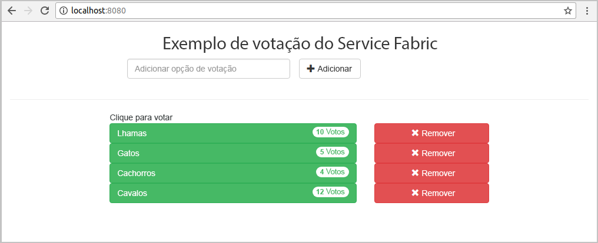
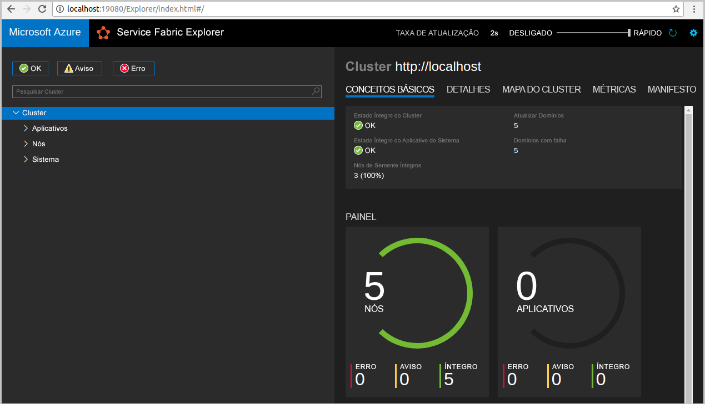
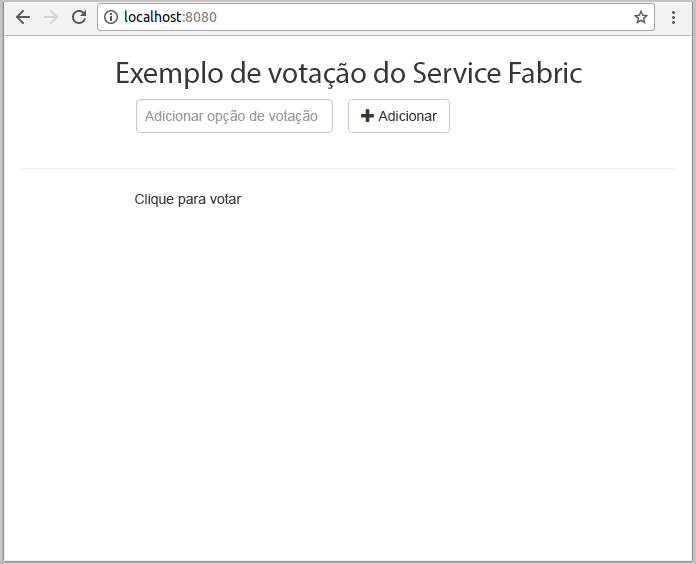
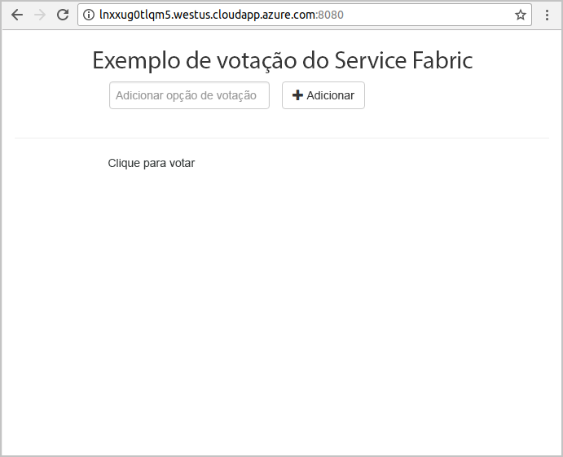
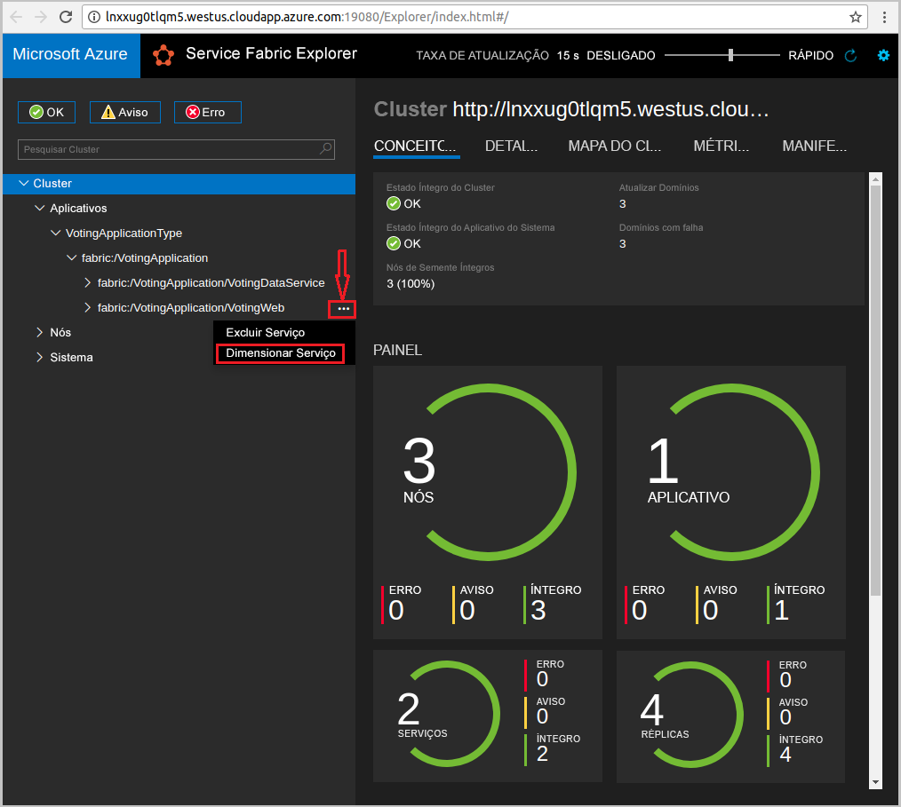
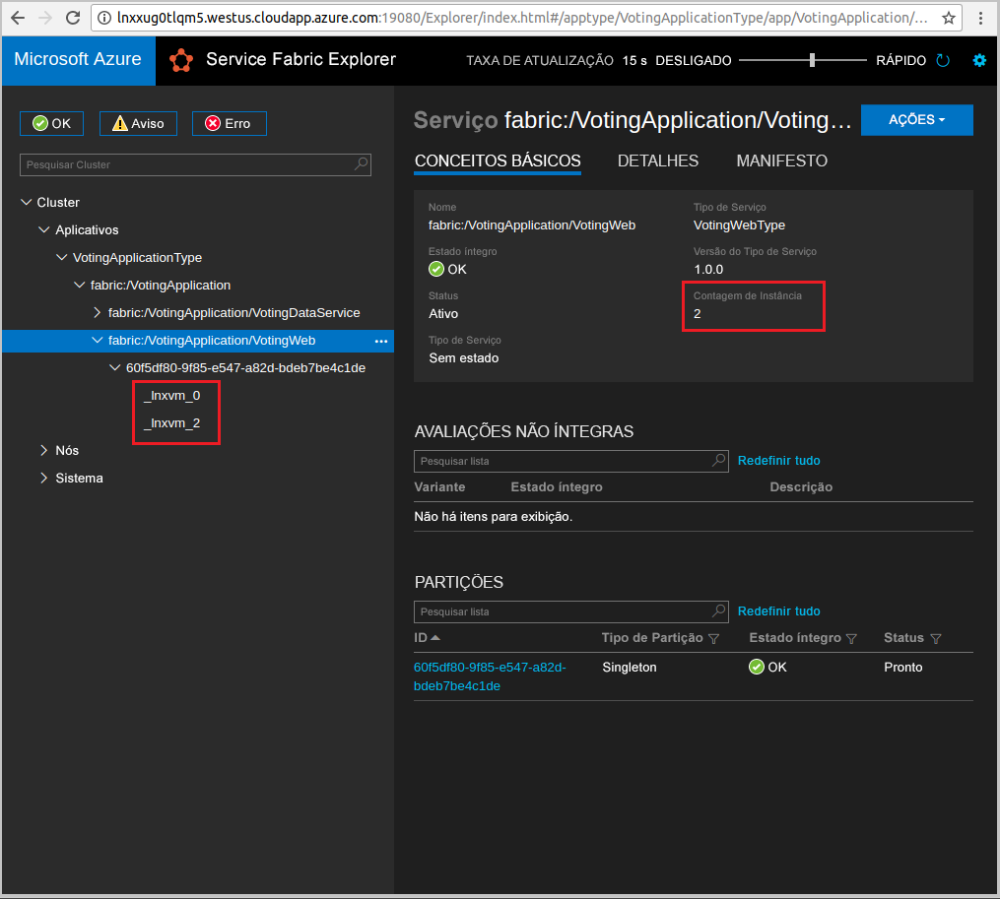

# <a name="create-a-java-application"></a>Criar um aplicativo Java
O Azure Service Fabric é uma plataforma de sistemas distribuídos para implantação e gerenciamento de contêineres e microsserviços. 

Este guia de início rápido mostra como implantar seu primeiro aplicativo Java para o Service Fabric usando o IDE do Eclipse em um computador de desenvolvedor Linux. Ao terminar, você terá um aplicativo de votação com um front-end da Web em Java que salva os resultados da votação em um serviço de back-end com estado do cluster.



Neste guia de início rápido, você aprende a:

> [!div class="checklist"]
> * Usar o Eclipse como uma ferramenta para seus aplicativos Java do Service Fabric
> * Implantar o aplicativo no cluster local 
> * Implantar o aplicativo em um cluster no Azure
> * Expandir o aplicativo para vários nós

## <a name="prerequisites"></a>Pré-requisitos
Para concluir este guia de início rápido:
1. [Instalar o SDK do Service Fabric e a CLI (interface de linha de comando) do Service Fabric (CLI)](https://docs.microsoft.com/en-us/azure/service-fabric/service-fabric-get-started-linux#installation-methods)
2. [Instalar o Git](https://git-scm.com/)
3. [Instalar o Eclipse](https://www.eclipse.org/downloads/)
4. [Configurar o Ambiente Java](https://docs.microsoft.com/en-us/azure/service-fabric/service-fabric-get-started-linux#set-up-java-development), seguindo as etapas opcionais para instalar o plug-in do Eclipse 

## <a name="download-the-sample"></a>Baixar o exemplo
Em uma janela de comando, execute o comando a seguir para clonar o repositório de aplicativos de exemplo no computador local.
```
git clone https://github.com/Azure-Samples/service-fabric-java-quickstart.git
```

## <a name="run-the-application-locally"></a>Executar o aplicativo localmente
1. Inicie seu cluster local executando o seguinte comando:

    ```bash
    sudo /opt/microsoft/sdk/servicefabric/common/clustersetup/devclustersetup.sh
    ```
    A inicialização do cluster local leva algum tempo. Para confirmar que o cluster está totalmente funcional, acesse o Service Fabric Explorer em **http://localhost:19080**. Os cinco nós íntegros indicam que o cluster local está em execução. 
    
    

2. Abra o Eclipse.
3. Clique em Arquivo -> Abrir Projetos do Sistema de Arquivos… 
4. Clique em Diretório e escolha o diretório `Voting` na pasta `service-fabric-java-quickstart` clonada do Github. Clique em Concluir. 

    
    
5. Agora você tem o projeto `Voting` no Explorador de Pacote para o Eclipse. 
6. Clique com o botão direito do mouse no projeto e selecione **Publicar Aplicativo…** na lista suspensa **Service Fabric**. Escolha **PublishProfiles/Local.json** como o perfil de destino e clique em Publicar. 

    
    
7. Abra seu navegador da Web favorito e acessar o aplicativo acessando **http://localhost:8080**. 

    
    
Agora, você pode adicionar um conjunto de opções de votação e começar a votar. O aplicativo é executado e armazena todos os dados no cluster do Service Fabric, sem a necessidade de um banco de dados separado.

## <a name="deploy-the-application-to-azure"></a>Implantar o aplicativo no Azure

### <a name="set-up-your-azure-service-fabric-cluster"></a>Configurar o cluster do Azure Service Fabric
Para implantar o aplicativo em um cluster no Azure, use seu próprio cluster ou use um Cluster de Entidade.

Clusters de entidade são clusters do Service Fabric gratuitos e com tempo limitado hospedados no Azure. Eles são executados pela equipe do Service Fabric, em que qualquer pessoa pode implantar aplicativos e conhecer a plataforma. Para obter acesso a um Cluster de Terceiros, [siga as instruções](http://aka.ms/tryservicefabric). 

Para obter informações sobre como criar seu próprio cluster, consulte [Criar um cluster do Service Fabric no Azure](service-fabric-tutorial-create-vnet-and-linux-cluster.md).

> [!Note]
> O serviço de front-end da Web está configurado para escutar o tráfego de entrada na porta 8080. Verifique se a porta está aberta no cluster. Se você estiver usando o Cluster de Entidade, essa porta estará aberta.
>

### <a name="deploy-the-application-using-eclipse"></a>Implantar o aplicativo usando o Eclipse
Agora que o aplicativo e o cluster estão prontos, você pode implantá-los no cluster diretamente do Eclipse.

1. Abra o arquivo **Cloud.json** no diretório **PublishProfiles** e preencha os campos `ConnectionIPOrURL` e `ConnectionPort` adequadamente. É apresentado um exemplo: 

    ```bash
    {
         "ClusterConnectionParameters": 
         {
            "ConnectionIPOrURL": "lnxxug0tlqm5.westus.cloudapp.azure.com",
            "ConnectionPort": "19080",
            "ClientKey": "",
            "ClientCert": ""
         }
    }
    ```

2. Clique com o botão direito do mouse no projeto e selecione **Publicar Aplicativo…** na lista suspensa **Service Fabric**. Escolha **PublishProfiles/Cloud.json** como o perfil de destino e clique em Publicar. 

    

3. Abra seu navegador da Web favorito e acessar o aplicativo acessando **http://\<ConnectionIPOrURL>:8080**. 

    
    
## <a name="scale-applications-and-services-in-a-cluster"></a>Dimensionar aplicativos e serviços em um cluster
Os serviços do Service Fabric podem ser facilmente colocados em escala em um cluster para acomodar uma alteração na carga dos serviços. Dimensione um serviço alterando o número de instâncias em execução no cluster. Existem várias maneiras de colocar seus serviços em escala usando scripts ou comandos da CLI do Service Fabric (sfctl). Neste exemplo, estamos usando o Service Fabric Explorer.

O Service Fabric Explorer é executado em todos os clusters do Service Fabric e pode ser acessado em um navegador, navegando para a porta de gerenciamento HTTP dos de clusters (19080), por exemplo, `http://lnxxug0tlqm5.westus.cloudapp.azure.com:19080`.

Para dimensionar o serviço de front-end da Web, realize as seguintes etapas:

1. Abra o Service Fabric Explorer no cluster – por exemplo, `http://lnxxug0tlqm5.westus.cloudapp.azure.com:19080`.
2. Clique nas reticências (três pontos) ao lado do nó **fabric:/Voting/VotingWeb** no modo de exibição de árvore e escolha **Dimensionar Serviço**.

    

    Agora, você pode optar por dimensionar o número de instâncias do serviço de front-end da Web.

3. Altere o número para **2** e clique em **Dimensionar Serviço**.
4. Clique no nó **fabric:/Voting/VotingWeb** do modo de exibição de árvore e expanda o nó de partição (representado por um GUID).

    

    Agora, você pode ver que o serviço tem duas instâncias e no modo de exibição de árvore, você vê em quais nós as instâncias são executadas.

Com essa tarefa de gerenciamento simples, dobramos o número de recursos disponíveis para nosso serviço de front-end para processar a carga do usuário. É importante entender que você não precisa de várias instâncias de um serviço para que ele seja executado de forma confiável. Se um serviço falhar, o Service Fabric garantirá que uma nova instância de serviço seja executada no cluster.

## <a name="next-steps"></a>Próximas etapas
Neste guia de início rápido, você aprendeu a:

> [!div class="checklist"]
> * Usar o Eclipse como uma ferramenta para seus aplicativos Java do Service Fabric
> * Implantar aplicativos Java no cluster local 
> * Implantar aplicativos Java em um cluster no Azure
> * Expandir o aplicativo para vários nós

* Saiba mais sobre [depuração de serviços em Java usando o Eclipse](service-fabric-debugging-your-application-java.md)
* Saiba mais sobre [configurar sua integração e implantação contínuas usando Jenkins](service-fabric-cicd-your-linux-applications-with-jenkins.md)
* Confira outros [Exemplos de Java](https://github.com/Azure-Samples/service-fabric-java-getting-started)