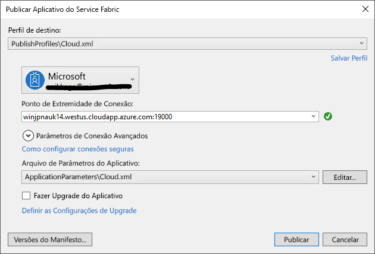

# Implantar um aplicativo em um Cluster Party no Azure
Este tutorial é a segunda parte de uma série e mostra como implantar um aplicativo do Azure Service Fabric em um Cluster Party no Azure.

A segunda parte da série de tutoriais, você aprenderá a:
> [!div class="checklist"]
> * Implantar um aplicativo em um cluster remoto usando o Visual Studio
> * Remover um aplicativo de um cluster usando o Service Fabric Explorer

Nesta série de tutoriais, você aprenderá a:
> [!div class="checklist"]
> * [Criar um aplicativo .NET do Service Fabric](service-fabric-tutorial-create-dotnet-app.md)
> * Implantar o aplicativo em um cluster remoto
> * [Configurar CI/CD usando o Visual Studio Team Services](service-fabric-tutorial-deploy-app-with-cicd-vsts.md)

## Pré-requisitos
Antes de começar este tutorial:
- Se você não tem uma assinatura do Azure, crie uma [conta gratuita](https://azure.microsoft.com/free/?WT.mc_id=A261C142F)
- [Instale o Visual Studio 2017](https://www.visualstudio.com/) e instale as cargas de trabalho de **desenvolvimento do Azure** e de **desenvolvimento para a Web e ASP.NET**.
- [Instalar o SDK do Service Fabric](service-fabric-get-started.md)

## Configurar um Cluster Party
Os clusters Party são clusters gratuitos de duração limitada do Service Fabric, hospedados no Azure e executados pela equipe do Service Fabric, nos quais qualquer pessoa pode implantar aplicativos e aprender mais sobre a plataforma. Gratuitamente!

Para obter acesso a um Cluster Party, navegue até este site: http://aka.ms/tryservicefabric e siga as instruções para obter acesso a um cluster. Você precisa de uma conta do Facebook ou GitHub para obter acesso a um Cluster Party.

> [!NOTE]
> Os clusters Party não são protegidos, portanto seus aplicativos e os dados que você colocar neles poderão ficar visíveis para outras pessoas. Não implante nada que você não queira que outras pessoas vejam. Certifique-se de ler nossos Termos de Uso para conhecer todos os detalhes.

## Preparar seu aplicativo para a implantação
Como o nosso serviço de API Web do ASP.NET Core atua como o front-end para este aplicativo e aceita o tráfego externo, queremos associar esse serviço a uma porta fixa e bem conhecida. A especificação da porta é feita nos arquivo de serviços **ServiceManifest.xml**.

1. No Gerenciador de Soluções, abra **WebAPIFrontEnd->PackageRoot->ServiceManifest.xml**.
2. Altere o atributo **Porta** do elemento de **Ponto de extremidade** existente para **80** e salve suas alterações.

## Implantar o aplicativo no Azure
Agora que o aplicativo está pronto, você pode implantá-lo no Cluster Party diretamente do Visual Studio.

1. Clique com botão direito do mouse em **MyApplication** no Gerenciador de Soluções e escolha **Publicar**.

    

2. Digite o ponto de extremidade de conexão do Cluster Party no campo **Ponto de Extremidade de Conexão** e clique em **Publicar**.

    Depois que a publicação for concluída, você poderá enviar uma solicitação ao aplicativo por meio de um navegador.

3. Abra o navegador de sua preferência e digite o endereço do cluster (o ponto de extremidade de conexão sem as informações de porta – por exemplo, win1kw5649s.westus.cloudapp.azure.com) e adicione `/api/values` à URL.

    Agora você verá o mesmo resultado que viu ao executar o aplicativo localmente.

    

## Remover o aplicativo de um cluster usando o Service Fabric Explorer
O Service Fabric Explorer é uma interface gráfica do usuário para explorar e gerenciar aplicativos em um cluster do Service Fabric.

Para remover o aplicativo que implantamos no Cluster Party:

1. Navegue até o Service Fabric Explorer usando o link fornecido pela página de entrada do Cluster Party. Por exemplo, http://win1kw5649s.westus.cloudapp.azure.com:19080/Explorer/index.html.

2. No Service Fabric Explorer, navegue até o nó **fabric://MyApplication** no modo de exibição em árvore à esquerda.

3. Clique no botão **Ação** à direita do painel **Essentials** e escolha **Excluir Aplicativo**. Confirme a exclusão da instância do aplicativo, que removerá a instância do nosso aplicativo que estava em execução no cluster.

Os aplicativos são implantados como tipos de aplicativos em um cluster do Service Fabric, o que permite que você tenha várias instâncias e versões do aplicativo em execução no cluster. Depois de ter removido a instância em execução do nosso aplicativo, também podemos remover o tipo, para concluir a limpeza da implantação.

Para obter mais informações sobre o modelo de aplicativo no Service Fabric, consulte [Modelar um aplicativo no Service Fabric](service-fabric-application-model.md).

1. Navegue até o nó **MyApplicationType** no modo de exibição de árvore.

2. Clique no botão **Ação** à direita do painel **Essentials** e escolha **Desprovisionar o Tipo**. Confirme o desprovisionamento do tipo do aplicativo.

Isso conclui o tutorial.

## Próximas etapas
Neste tutorial, você aprendeu como:

> [!div class="checklist"]
> * Implantar um aplicativo em um cluster remoto usando o Visual Studio
> * Remover um aplicativo de um cluster usando o Service Fabric Explorer

Prosseguir para o próximo tutorial:
> [!div class="nextstepaction"]
> [Configurar a integração contínua usando o Visual Studio Team Services](service-fabric-tutorial-deploy-app-with-cicd-vsts.md)
