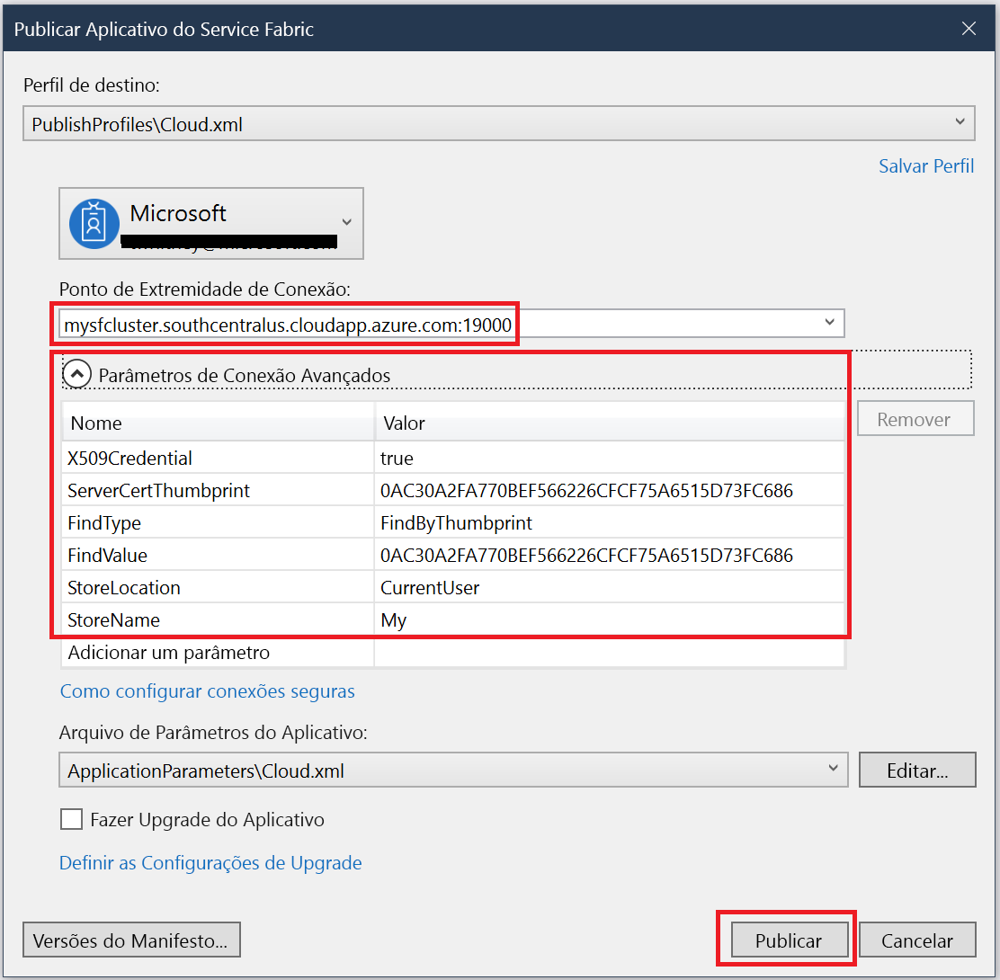

# <a name="deploy-an-application-to-a-party-cluster-in-azure"></a>Implantar um aplicativo em um Cluster Party no Azure
Este tutorial é a segunda parte de uma série e mostra como implantar um aplicativo do Azure Service Fabric em um Cluster Party no Azure.

A segunda parte da série de tutoriais, você aprenderá a:
> [!div class="checklist"]
> * [Criar um aplicativo .NET do Service Fabric](service-fabric-tutorial-create-dotnet-app.md)
> * Implantar o aplicativo em um cluster remoto
> * [Configurar CI/CD usando o Visual Studio Team Services](service-fabric-tutorial-deploy-app-with-cicd-vsts.md)
> * [Configurar monitoramento e diagnóstico para o aplicativo](service-fabric-tutorial-monitoring-aspnet.md)

Nesta série de tutoriais, você aprenderá a:
> [!div class="checklist"]
> * Implantar um aplicativo em um cluster remoto usando o Visual Studio
> * Remover um aplicativo de um cluster usando o Service Fabric Explorer

## <a name="prerequisites"></a>pré-requisitos
Antes de começar este tutorial:
- Se você não tem uma assinatura do Azure, crie uma [conta gratuita](https://azure.microsoft.com/free/?WT.mc_id=A261C142F)
- [Instale o Visual Studio 2017](https://www.visualstudio.com/) e instale as cargas de trabalho de **desenvolvimento do Azure** e de **desenvolvimento para a Web e ASP.NET**.
- [Instalar o SDK do Service Fabric](service-fabric-get-started.md)

## <a name="download-the-voting-sample-application"></a>Baixar o aplicativo de exemplo Votação
Se você não tiver criado o aplicativo de exemplo Votação na [parte um esta série de tutoriais](service-fabric-tutorial-create-dotnet-app.md), poderá baixá-lo. Em uma janela de comando, execute o comando a seguir para clonar o repositório de aplicativos de exemplo no computador local.

```
git clone https://github.com/Azure-Samples/service-fabric-dotnet-quickstart
```

## <a name="set-up-a-party-cluster"></a>Configurar um Cluster Party
Os clusters Party são clusters gratuitos de duração limitada do Service Fabric, hospedados no Azure e executados pela equipe do Service Fabric, nos quais qualquer pessoa pode implantar aplicativos e aprender mais sobre a plataforma. Gratuitamente!

Para obter acesso a um Cluster Party, navegue até este site: http://aka.ms/tryservicefabric e siga as instruções para obter acesso a um cluster. Você precisa de uma conta do Facebook ou GitHub para obter acesso a um Cluster Party.

Você pode usar seu próprio cluster em vez do Cluster Party, se desejar.  O front-end web ASP.NET core usa o proxy reverso para se comunicar com o back-end do serviço com estado.  Clusters Party e o cluster de desenvolvimento local têm proxy reverso habilitado por padrão.  Se você implantar o aplicativo de exemplo Votação em seu próprio cluster, você deverá [habilitar o proxy reverso no cluster](service-fabric-reverseproxy.md#setup-and-configuration).

> [!NOTE]
> Os clusters Party não são protegidos, portanto seus aplicativos e os dados que você colocar neles poderão ficar visíveis para outras pessoas. Não implante nada que você não queira que outras pessoas vejam. Certifique-se de ler nossos Termos de Uso para conhecer todos os detalhes.

Entre e [ingresse em um cluster do Windows](http://aka.ms/tryservicefabric). Baixe o certificado PFX em seu computador clicando no link **PFX**. Os valores de certificado e de **Ponto de extremidade de conexão** são utilizados nas etapas a seguir.


Em um computador com Windows, instale o PFX no repositório de certificados *CurrentUser\My*.

```powershell
PS C:\mycertificates> Import-PfxCertificate -FilePath .\party-cluster-873689604-client-cert.pfx -CertStoreLocation Cert:
\CurrentUser\My


  PSParentPath: Microsoft.PowerShell.Security\Certificate::CurrentUser\My

Thumbprint                                Subject
----------                                -------
3B138D84C077C292579BA35E4410634E164075CD  CN=zwin7fh14scd.westus.cloudapp.azure.com
```


## <a name="deploy-the-app-to-the-azure"></a>Implantar o aplicativo no Azure
Agora que o aplicativo está pronto, você pode implantá-lo no Cluster Party diretamente do Visual Studio.

1. Clique com o botão direito do mouse em **Votação** no Gerenciador de Soluções e escolha **Publicar**. 

    

2. Copie o **Ponto de Extremidade de Conexão** da página do cluster Party no campo **Ponto de Extremidade de Conexão**. Por exemplo, `zwin7fh14scd.westus.cloudapp.azure.com:19000`. Clique em **Parâmetros Avançados de Conexão** e preencha as informações a seguir.  Os valores de *FindValue* e *ServerCertThumbprint* devem coincidir com a impressão digital do certificado instalado na etapa anterior. Clique em **Publicar**. 

    Depois que a publicação for concluída, você poderá enviar uma solicitação ao aplicativo por meio de um navegador.

3. Abra o navegador de sua preferência e digite o endereço do cluster (o ponto de extremidade de conexão sem as informações de porta – por exemplo, win1kw5649s.westus.cloudapp.azure.com).

    Agora você verá o mesmo resultado que viu ao executar o aplicativo localmente.

    

## <a name="remove-the-application-from-a-cluster-using-service-fabric-explorer"></a>Remover o aplicativo de um cluster usando o Service Fabric Explorer
O Service Fabric Explorer é uma interface gráfica do usuário para explorar e gerenciar aplicativos em um cluster do Service Fabric.

Para remover o aplicativo Cluster de Terceiros:

1. Navegue até o Service Fabric Explorer usando o link fornecido pela página de entrada do Cluster Party. Por exemplo, https://win1kw5649s.westus.cloudapp.azure.com:19080/Explorer/index.html.

2. No Service Fabric Explorer, navegue até o nó **fabric://Voting** no modo de exibição em árvore à esquerda.

3. Clique no botão **Ação** à direita do painel **Essentials** e escolha **Excluir Aplicativo**. Confirme a exclusão da instância do aplicativo, que removerá a instância do nosso aplicativo que estava em execução no cluster.


## <a name="remove-the-application-type-from-a-cluster-using-service-fabric-explorer"></a>Remover o tipo de aplicativo de um cluster usando o Service Fabric Explorer
Os aplicativos são implantados como tipos de aplicativos em um cluster do Service Fabric, o que permite que você tenha várias instâncias e versões do aplicativo em execução no cluster. Depois de ter removido a instância em execução do nosso aplicativo, também podemos remover o tipo, para concluir a limpeza da implantação.

Para obter mais informações sobre o modelo de aplicativo no Service Fabric, consulte [Modelar um aplicativo no Service Fabric](service-fabric-application-model.md).

1. Navegue até o nó **VotingType** no modo de exibição de árvore.

2. Clique no botão **Ação** à direita do painel **Essentials** e escolha **Desprovisionar o Tipo**. Confirme o desprovisionamento do tipo do aplicativo.


Isso conclui o tutorial.

## <a name="next-steps"></a>Próximas etapas
Neste tutorial, você aprendeu como:

> [!div class="checklist"]
> * Implantar um aplicativo em um cluster remoto usando o Visual Studio
> * Remover um aplicativo de um cluster usando o Service Fabric Explorer

Prosseguir para o próximo tutorial:
> [!div class="nextstepaction"]
> [Configurar a integração contínua usando o Visual Studio Team Services](service-fabric-tutorial-deploy-app-with-cicd-vsts.md)
