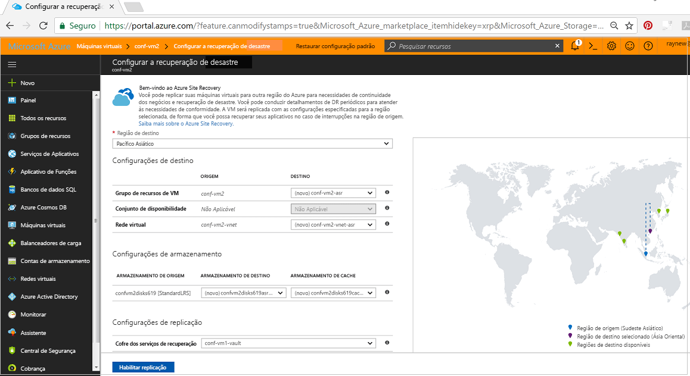
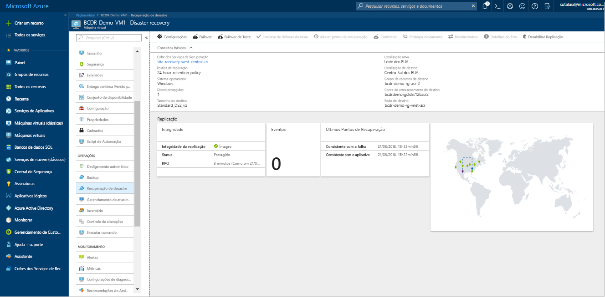
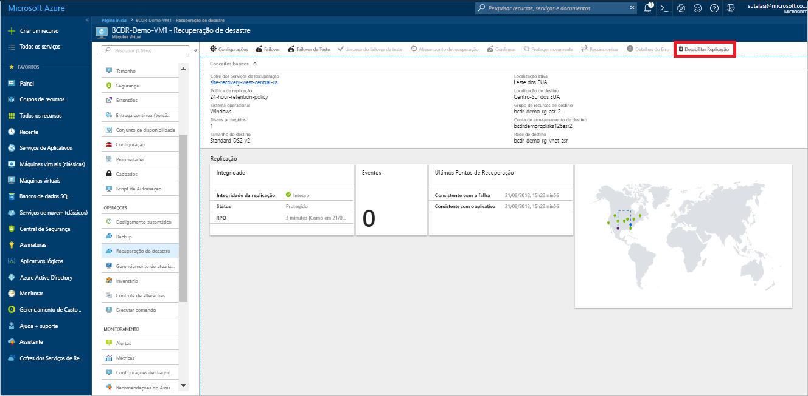

# Replicar uma VM do Azure para outra região do Azure (versão prévia)

O serviço [Azure Site Recovery](site-recovery-overview.md) contribui para sua estratégia de BCDR (continuidade de negócios e recuperação de desastre) por manter seus aplicativos de negócios em execução e disponíveis durante interrupções planejadas e não planejadas. O Site Recovery gerencia e orquestra a recuperação de desastre de máquinas locais e de VMs (máquinas virtuais) do Azure, incluindo replicação, failover e recuperação.

Este guia de início rápido descreve como replicar uma VM do Azure para uma região do Azure diferente.

Se você não tiver uma assinatura do Azure, crie uma [conta gratuita](https://azure.microsoft.com/free/?WT.mc_id=A261C142F) antes de começar.

## Fazer logon no Azure

Faça logon no Portal do Azure em http://portal.azure.com.

## Habilitar a replicação para a VM do Azure

1. No Portal do Azure, clique em **Máquinas virtuais** e selecione a VM que você deseja replicar.

2. Em **Configurações**, clique em **Recuperação de desastre (versão prévia)**.
3. Em **Configurar a recuperação de desastre** > **Região de destino**, selecione a região de destino para a qual você replicará.
4. Para este guia de início rápido, aceite as outras configurações padrão.
5. Clique em **Habilitar a replicação**. Isso inicia um trabalho para habilitar a replicação para a VM.

    

## Verificar as configurações

Após o trabalho de replicação, você poderá verificar o status de replicação, modificar as configurações de replicação e testar a implantação.

1. No menu da VM, clique em **Recuperação de desastre (versão prévia)**.
2. Você pode verificar a integridade da replicação, os pontos de recuperação que foram criados e as regiões de origem e destino no mapa.

   

## Limpar recursos

A VM na região primária deixa de replicar quando você desabilita a replicação para ela:

- As configurações de replicação de origem são limpas automaticamente.
- A cobrança do Site Recovery para a VM também é interrompida.

Interrompa a replicação da seguinte maneira:

1. Selecione a VM.
2. Em **Recuperação de desastre (versão prévia)**, clique em **Mais**.
3. Clique em **Desabilitar a Replicação**.

   

## Próximas etapas

Neste guia de início rápido, você replicou uma única VM para uma região secundária.

> [!div class="nextstepaction"]
> [Configurar a recuperação de desastre para VMs do Azure](azure-to-azure-tutorial-enable-replication.md)
