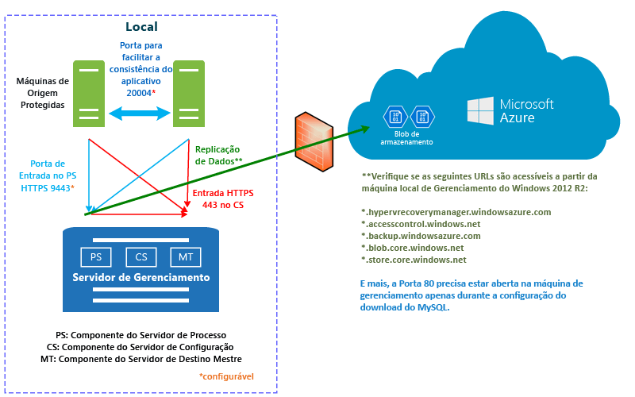
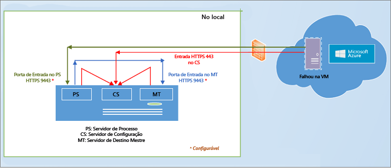

# Como funciona o Azure Site Recovery?

Este artigo descreve a arquitetura subjacente do serviço [Azure Site Recovery](site-recovery-overview.md) e os componentes que permitem seu funcionamento.

Poste comentários na parte inferior deste artigo ou no [Fórum de Serviços de Recuperação do Azure](https://social.msdn.microsoft.com/forums/azure/home?forum=hypervrecovmgr).

## Replicar no Azure

Replique o seguinte no Azure:

- **VMware**: VMS VMware locais em execução em um [host com suporte](site-recovery-support-matrix-to-azure.md#support-for-datacenter-management-servers). Replique VMs VMware executando [sistemas operacionais com suporte](site-recovery-support-matrix-to-azure.md#support-for-replicated-machine-os-versions)
- **Hyper-V**: VMs Hyper-V locais em execução em [hosts com suporte](site-recovery-support-matrix-to-azure.md#support-for-datacenter-management-servers).
- **Máquinas físicas**: servidores físicos locais executando Windows ou Linux em [sistemas operacionais com suporte](site-recovery-support-matrix-to-azure.md#support-for-replicated-machine-os-versions). Replique VMs Hyper-V executando qualquer sistema operacional convidado [com suporte do Hyper-V e do Azure](https://technet.microsoft.com/en-us/windows-server-docs/compute/hyper-v/supported-windows-guest-operating-systems-for-hyper-v-on-windows).

## VMware no Azure

Veja o que você precisa para replicar VMs VMware no Azure.

Área | Componente | Detalhes
--- | --- | ---
**As tabelas** | No Azure, você precisa de uma conta do Azure, uma conta de armazenamento do Azure e uma rede do Azure. | O armazenamento e a rede podem ser contas do Gerenciador de Recursos ou contas clássicas.    Os dados replicados são armazenados na conta de armazenamento, e VMs do Azure são criadas com os dados replicados quando ocorre failover do site local. As VMs do Azure se conectam à rede virtual do Azure quando são criadas.
**Servidor de configuração** | Um único servidor de gerenciamento (VM VMWare) executa todos os locais - servidor de configuração, servidor de processo, servidor de destino mestre | O servidor de configuração coordena a comunicação entre o ambiente local e o Azure e gerencia a replicação de dados.
 **Servidor de processo**:  | Instalado por padrão no servidor de configuração. | Atua como um gateway de replicação. Recebe dados de replicação, otimiza-os com caching, compactação e criptografia e os envia para o Armazenamento do Azure.   O servidor de processo também manipula a instalação por push do Serviço de mobilidade em computadores protegidos e executa a descoberta automática de máquinas virtuais VMware.   À medida que a implantação cresce, você pode adicionar outros servidores de processo dedicados separados para lidar com o aumento do volume de tráfego de replicação.
 **Servidor de destino mestre** | Instalado por padrão no servidor de configuração local. | Lida com os dados de replicação durante o failback do Azure.   Se os volumes de tráfego de failback forem altos, você poderá implantar um servidor de destino mestre separado para failback.
**Servidores VMware** | VMs VMware são hospedadas em servidores ESXi vSphere, e recomendamos que um servidor vCenter gerencie os hosts. | Adicione servidores VMware ao seu cofre dos Serviços de Recuperação.   I
**Computadores replicados** | O serviço de Mobilidade será instalado em cada VM VMware que você deseja replicar. Ele pode ser instalado manualmente em cada computador ou com uma instalação por push do servidor de processo.

**Figura 1: VMware para componentes do Azure**

### Processo de replicação

1. Configure a implantação, incluindo os componentes do Azure e um cofre dos Serviços de Recuperação. No cofre, você especifica a origem da replicação e o destino, configura o servidor de configuração, adiciona servidores VMware, cria uma política de replicação, implanta o serviço de mobilidade, habilita a replicação e executa um teste de failover.
2.  As máquinas iniciam a replicação de acordo com a política de replicação, e uma cópia inicial dos dados é replicada para o armazenamento do Azure.
4. A replicação de alterações delta para o Azure começa após a replicação inicial terminar. As alterações acompanhadas para uma máquina são mantidas em um arquivo .hrl.
    - As máquinas que estão sendo replicadas se comunicam com o servidor de configuração na porta HTTPS 443 de entrada para o gerenciamento de replicação.
    - As máquinas que estão sendo replicadas enviam dados de replicação para o servidor de processo na porta 9443 HTTPS de entrada (pode ser configurada).
    - O servidor de configuração coordena o gerenciamento de replicação com o Azure pela porta HTTPS 443 de saída.
    - O servidor de processo recebe dados de máquinas de origem, otimiza-os e criptografa-os e os envia para o armazenamento do Azure pela porta 443 de saída.
    - Se você habilitar a consistência de várias VMS, as máquinas no grupo de replicação se comunicarão entre si pela porta 20004. Várias VMS serão usadas se você agrupar vários computadores em grupos de replicação que compartilham pontos de recuperação consistentes com o aplicativo e com falhas ao realizar o failover. Isso é útil se os computadores estão executando a mesma carga de trabalho e precisam ser consistentes.
5. O tráfego é replicado para pontos de extremidade públicos do armazenamento do Azure, pela Internet. Como alternativa, você pode usar o [emparelhamento público](https://docs.microsoft.com/en-us/azure/expressroute/expressroute-circuit-peerings#public-peering) do Azure ExpressRoute. Não há suporte para a replicação do tráfego através de uma VPN de site a site de um site local para o Azure.

**Figura 2: replicação do VMware para o Azure**

### Failover e failback

1. Depois de verificar que o teste de failover está funcionando conforme o esperado, execute failovers não planejados para o Azure conforme o necessário. Não há suporte para failover planejado.
2. Faça o failover de um único computador, ou crie [planos de recuperação](site-recovery-create-recovery-plans.md) para realizar o failover de várias VMs.
3. Ao executar um failover, VMs de réplica são criadas no Azure. Você confirma um failover para começar a acessar a carga de trabalho por meio da VM do Azure de réplica.
4. Quando o site primário local estiver disponível novamente, você poderá executar o failback. Você configura uma infraestrutura de failback, inicia a replicação da máquina do site secundário para o primário e executa um failover não planejado do site secundário. Depois que você confirmar esse failover, os dados estarão novamente no local e será necessário habilitar a replicação no Azure de novo. [Saiba mais](site-recovery-failback-azure-to-vmware.md)

Há alguns requisitos de failback:

- **Servidor de processo temporário no Azure**: se você deseja fazer failback do Azure após o failover, precisa criar uma VM do Azure configurada como um servidor de processo para lidar com a replicação do Azure. Você pode excluir a VM após a conclusão do failback.
- **Conexão de VPN**: em caso de failback, você precisará de uma conexão de VPN (ou Rota Expressa do Azure) configurada da rede do Azure para o site local.
- **Servidor de destino mestre separado local**: o servidor de destino mestre local lida com o failback. O servidor de destino mestre está instalado por padrão no servidor de gerenciamento, mas se você estiver fazendo failback de volumes de tráfego maiores, deverá configurar um servidor de destino mestre separado local com essa finalidade.
- **Política de failback**: para replicar volta para seu site local, você precisa de uma política de failback. Isso é criado automaticamente quando você cria sua política de replicação.

**Figura 3: failback físico/de VMware**

## Físico para Azure

Quando você replica servidores físicos locais no Azure, a replicação também usa os mesmos componentes e processos que o [VMware no Azure](#vmware-replication-to-azure), mas observe essas diferenças:

- Você pode usar um servidor físico para o servidor de configuração, em vez de uma VM do VMware
- Você precisará de uma infraestrutura do VMware local para failback. Você não pode realizar o failback para um computador físico.

## Hyper-V para Azure

Veja o que você precisa para replicar VMs Hyper-V no Azure.

**Área** | **Componente** | **Detalhes**
--- | --- | ---
**As tabelas** | No Azure, você precisa de uma conta do Microsoft Azure, uma conta de armazenamento do Azure e uma rede do Azure. | O armazenamento e a rede podem ser contas baseadas no Gerenciador de Recursos ou clássicas.   Os dados replicados são armazenados na conta de armazenamento, e VMs do Azure são criadas com os dados replicados quando ocorre failover do site local.   As VMs do Azure se conectam à rede virtual do Azure quando são criadas.
**Servidor VMM** | Hosts Hyper-V localizados em nuvens do VMM | Se os hosts Hyper-V forem gerenciados em nuvens do VMM, registre o servidor VMM no cofre dos Serviços de Recuperação.   No servidor do VMM, instale o Provedor de Site Recovery para orquestrar a replicação com o Azure.   Você precisa de redes lógicas e de VM configuradas para definir o mapeamento de rede. Uma rede de VM deve ser vinculada a uma rede lógica associada à nuvem.
**Host Hyper-V** | Os servidores Hyper-V podem ser implantados com ou sem o servidor do VMM. | Se não houver um servidor VMM, o Provedor de Site Recovery será instalado no host para orquestrar a replicação com o Site Recovery pela internet. Se houver um servidor VMM, o Provedor será instalado nele, e não no host.   O agente dos Serviços de Recuperação é instalado no host para lidar com a replicação de dados.   As comunicações do provedor e do agente são protegidas e criptografadas. Os dados replicados no armazenamento do Azure também são criptografados.
**VMs Hyper-V** | Você precisa de uma ou mais VMs no servidor de host Hyper-V. | Nada precisa ser explicitamente instalado em VMs

### Processo de replicação

1. Você configura os componentes do Azure. Recomendamos que você configure as contas de armazenamento e rede antes de começar a implantação da Recuperação de Site.
2. Crie um cofre de Serviços de Replicação para Recuperação de Site e defina configurações de cofre, incluindo:
    - Configurações de origem e destino. Se não estiver gerenciando hosts Hyper-V em uma nuvem VMM, você criará para o destino um contêiner de site do Hyper-V e adicionará hosts Hyper-V a ele. Se os hosts Hyper-V forem gerenciados no VMM, a origem será a nuvem do VMM. O destino é o Azure.
    - Instalação do provedor do Azure Site Recovery e do agente dos Serviços de Recuperação do Microsoft Azure. Se você tiver o VMM, o provedor será instalado nele, e o agente em cada host Hyper-V. Se você não tiver o VMM, o Provedor e o agente serão instalados em cada host.
    - Você cria uma política de replicação para o site do Hyper-V ou a nuvem do VMM. A política é aplicada a todas as VMs localizadas nos hosts na nuvem ou no site.
    - Você habilita a replicação para VMs do Hyper-V. A replicação inicial ocorre de acordo com as configurações de política de replicação.
4. As alterações de dados são acompanhadas, e a replicação de alterações delta para o Azure começa após a replicação inicial terminar. As alterações acompanhadas para um item são mantidas em um arquivo .hrl.
5. Você executa um failover de teste para verificar se tudo está funcionando.

### Processo de failover e failback

1. Você pode executar um [failover](site-recovery-failover.md) planejado ou não planejado de VMs Hyper-V locais para o Azure. Se você executar um failover planejado, as VMs de origem serão desligadas para evitar a perda de dados.
2. Você pode fazer o failover de um único computador ou criar [planos de recuperação](site-recovery-create-recovery-plans.md) para orquestrar o failover de vários computadores.
4. Após executar o failover, você deve ser capaz de ver as VMs de réplica criadas no Azure. Você pode atribuir um endereço IP público à VM, se necessário.
5. Você confirma então o failover para começar a acessar a carga de trabalho por meio da VM do Azure de réplica.
6. Quando o site primário local estiver disponível novamente, você poderá executar o [failback](site-recovery-failback-from-azure-to-hyper-v.md). Você dispara um failover planejado do Azure para o site primário. Para um failover planejado, você pode selecionar failback para a mesma VM ou um local alternativo e sincronizar alterações entre o Azure e o local, para garantir que não haja perda de dados. Quando as VMs são criadas no local, você confirma o failover.

**Figura 4: replicação de site de Hyper-V para o Azure**

**Figura 5: replicação de Hyper-V em nuvens do VMM para o Azure**

## Replicar para um site secundário

Replique o seguinte no site secundário:

- **VMware**: VMS VMware locais em execução em um [host com suporte](site-recovery-support-matrix-to-sec-site.md#on-premises-servers). Replique VMs VMware executando [sistemas operacionais com suporte](site-recovery-support-matrix-to-sec-site.md#support-for-replicated-machine-os-versions)
- **Máquinas físicas**: servidores físicos locais executando Windows ou Linux em [sistemas operacionais com suporte](site-recovery-support-matrix-to-sec-site.md#support-for-replicated-machine-os-versions).
- **Hyper-V**: VMs Hyper-V locais em execução em [hosts Hyper-V com suporte](site-recovery-support-matrix-to-sec-site.md#on-premises-servers) gerenciados em nuvens VMM. [hosts com suporte](site-recovery-support-matrix-to-azure.md#support-for-datacenter-management-servers). Replique VMs Hyper-V executando qualquer sistema operacional convidado [com suporte do Hyper-V e do Azure](https://technet.microsoft.com/en-us/windows-server-docs/compute/hyper-v/supported-windows-guest-operating-systems-for-hyper-v-on-windows).

## VMware/físico para um site secundário

Replique VMs VMware ou servidores físicos para um site secundário usando o InMage Scout.

### Componentes

**Área** | **Componente** | **Detalhes**
--- | --- | ---
**As tabelas** | InMage Scout. | Para obter o InMage Scout, você precisa de uma assinatura do Azure.   Depois de criar um cofre de Serviços de Recuperação, baixe o InMage Scout e instale as atualizações mais recentes para configurar a implantação.
**Servidor de processo** | Localizado no site primário | Implante o servidor de processo para manipular o caching, a compactação e a otimização de dados.   Ele também trata da instalação por push do Agente Unificado nas máquinas que você deseja proteger.
**Servidor de configuração** | Localizado no site secundário | O servidor de configuração gerencia, configura e monitora sua implantação, usando o site de gerenciamento ou o console do vContinuum.
**Servidor vContinuum** | Opcional. Instalado no mesmo local que o servidor de configuração. | Ele fornece um console para o gerenciamento e monitoramento de seu ambiente protegido.
**Servidor de destino mestre** | Localizado no site secundário | O servidor de destino mestre armazena os dados replicados. Ele recebe os dados do servidor de processo, cria uma máquina de réplica no site secundário e mantém os pontos de retenção dos dados.   O número de servidores de destino mestre necessário depende do número de máquinas que você está protegendo.   Se você quiser realizar o failback no site primário, também precisará de um servidor de destino mestre nesse local. O Agente Unificado está instalado neste servidor.
**Servidor VMware ESX/ESXi e vCenter** |  VMs são hospedadas em hosts ESX/ESXi. Hosts são gerenciados com um servidor do vCenter | Você precisa de uma infraestrutura do VMware para replicar VMs VMware.
**VMs/servidores físicos** |  Agente Unificado instalado em VMs VMware ou em servidores físicos que você deseja replicar. | O agente atua como um provedor de comunicação entre todos os componentes.

### Processo de replicação

1. Configure os servidores de componente em cada site (configuração, processo, destino mestre) e instale o Agente Unificado nos computadores que você deseja replicar.
2. Após a replicação inicial, os agentes em cada computador enviam as alterações de replicação delta para o servidor de processo.
3. O servidor de processo otimiza os dados e os transfere para o servidor de destino mestre no site secundário. O servidor de configuração gerencia o processo de replicação.

**Figura 6: replicação do VMware para o VMware**

## Hyper-V para um site secundário

Veja o que você precisa para replicar VMs Hyper-V em um site secundário.

**Área** | **Componente** | **Detalhes**
--- | --- | ---
**As tabelas** | Você precisa de uma conta do Microsoft Azure. |
**Servidor VMM** | Recomendamos um servidor VMM no site primário e um no site secundário | Cada servidor VMM devem estar conectados à Internet.   Cada servidor deve ter pelo menos uma nuvem privada de VMM, com o conjunto de perfis de funcionalidade do Hyper-V.   Instale o Provedor do Azure Site Recovery no servidor do VMM. O Provedor coordena e organiza a replicação com o serviço Recuperação de Site pela Internet. As comunicações entre o Provedor e o Azure são protegidas e criptografadas.
**Servidor Hyper-V** |  Um ou mais servidores de host do Hyper-V nas nuvens do VMM primárias e secundárias.   Os servidores devem estar conectados à Internet.   Os dados são replicados entre os servidores de host Hyper-V primários e secundários pela LAN ou VPN usando a autenticação Kerberos ou autenticação de certificado.  
**VMs Hyper-V** | Localizado no servidor de host Hyper-V de origem. | O servidor host de origem deve ter pelo menos uma VM que você deseja replicar.

### Processo de replicação

1. Você configura a conta do Azure.
2. Crie um cofre de Serviços de Replicação para Recuperação de Site e defina configurações de cofre, incluindo:

    - Origem e destino de replicação (sites primários e secundários).
    - Instalação do provedor do Azure Site Recovery e do agente dos Serviços de Recuperação do Microsoft Azure. O provedor está instalado nos servidores do VMM, e o agente em cada host Hyper-V.
    - Você cria uma política de replicação para a nuvem do VMM de origem. A política é aplicada a todas as VMs localizadas nos hosts na nuvem.
    - Você habilita a replicação para VMs do Hyper-V. A replicação inicial ocorre de acordo com as configurações de política de replicação.
4. As alterações de dados são acompanhadas, e a replicação de alterações delta começa após a replicação inicial terminar. As alterações acompanhadas para um item são mantidas em um arquivo .hrl.
5. Você executa um failover de teste para verificar se tudo está funcionando.

**Figura 7: replicação de VMM para VMM**

### Failover e failback

1. Você pode executar um [failover](site-recovery-failover.md) planejado ou não planejado entre sites locais. Se você executar um failover planejado, as VMs de origem serão desligadas para evitar a perda de dados.
2. Você pode fazer o failover de um único computador ou criar [planos de recuperação](site-recovery-create-recovery-plans.md) para orquestrar o failover de vários computadores.
4. Se você executar um failover não planejado para um site secundário, depois as máquinas de failover no local secundário não serão habilitadas para replicação ou proteção. Depois de executar um failover planejado, os computadores no local secundário são protegidos.
5. Em seguida, você confirma o failover para começar a acessar a carga de trabalho na VM de réplica.
6. Quando seu site primário estiver disponível novamente, você poderá iniciar a replicação inversa para replicar do site secundário para o primário. A replicação inversa coloca as máquinas virtuais em um estado protegido, mas o datacenter secundário permanece sendo o local ativo.
7. Para transformar o site primário em local ativo novamente, inicie um failover planejado do site secundário para o primário, seguido por outra replicação inversa.

## Próximas etapas

- [Saiba mais](site-recovery-hyper-v-azure-architecture.md) sobre o fluxo de trabalho de replicação do Hyper-V.
- [Verificar pré-requisitos](site-recovery-prereq.md)

