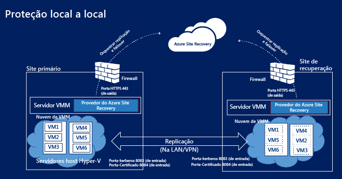
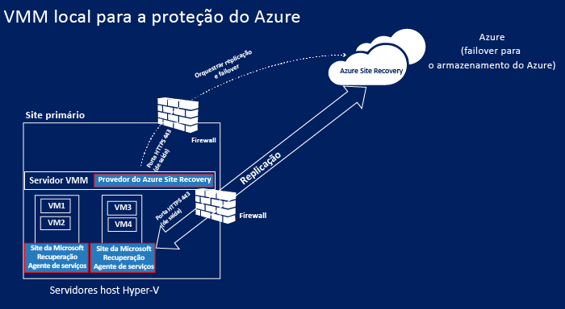
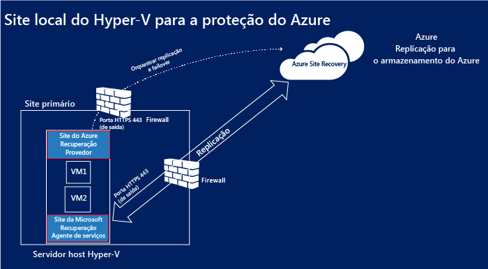
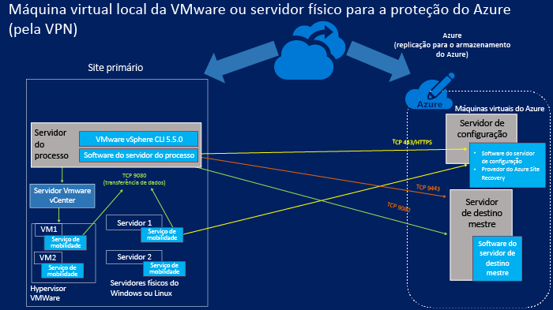
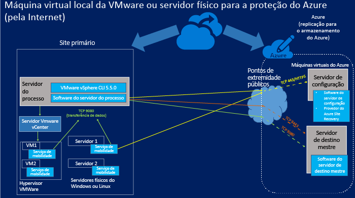

<properties
	pageTitle="Componentes da Recuperação de Site" 
	description="Este artigo fornece uma visão geral dos componentes da Recuperação de Site e como gerenciá-los" 
	services="site-recovery"
	documentationCenter=""
	authors="rayne-wiselman"
	manager="jwhit"
	editor=""/>

<tags
	ms.service="site-recovery"
	ms.workload="backup-recovery"
	ms.tgt_pltfrm="na"
	ms.devlang="na"
	ms.topic="article"
	ms.date="07/09/2015"
	ms.author="raynew"/>

# Componentes da Recuperação de Site

O Azure Site Recovery contribui para sua estratégia de BCDR (continuidade de negócios e recuperação de desastre) gerenciando replicação, failover e recuperação de máquinas virtuais em vários cenários de implantação. As máquinas podem ser replicadas no Azure ou em um datacenter local secundário. [Leia uma visão geral](site-recovery-overview.md).

Este artigo resume e descreve os componentes da Recuperação de Site instalados em servidores e máquinas virtuais.

Você pode publicar qualquer pergunta sobre este artigo no [Fórum dos Serviços de Recuperação do Azure](https://social.msdn.microsoft.com/forums/azure/home?forum=hypervrecovmgr).

## Visão geral

Os componentes da Recuperação de Site variam ligeiramente de acordo com o cenário de proteção.

### Proteção entre dois datacenters com a VMM

**Cenário** | **Descrição** | **Componentes necessários** | **Detalhes**
--- | --- | --- | ---
Implante o Azure Site Recovery para replicar máquinas virtuais entre dois datacenters | 
Cada datacenter tem um servidor VMM

Cada servidor VMM tem uma nuvem privada contendo um ou mais servidores de host Hyper-V com as máquinas virtuais que você deseja proteger
 | O Provedor do Azure Site Recovery será instalado nos dois servidores VMM. | 
Nenhum componente é instalado nos servidores de host Hyper-V ou nas máquinas virtuais protegidas

O Provedor do Azure Site Recovery no servidor VMM se comunica com o serviço de Recuperação de Site por HTTPS 443 a fim de orquestrar a proteção

A replicação ocorre entre os servidores de host Hyper-V primário e secundário pela Internet usando a autenticação Kerberos e autenticação de certificados nas portas 8083 e 8084.

### Proteção entre um datacenter com VMM e o Azure

**Cenário** | **Descrição** | **Componentes necessários** | **Detalhes**
--- | --- | --- | ---
Implante o Azure Site Recovery para replicar máquinas virtuais entre um datacenter e o Azure | 
O datacenter local tem um servidor VMM com uma nuvem privada contendo um ou mais servidores de host Hyper-V com as máquinas virtuais que você deseja proteger
 | 
O Provedor do Azure Site Recovery será instalado no servidor VMM

O agente dos Serviços de Recuperação da Microsoft serão instalados nos servidores de host Hyper-V de origem
 | 
Nenhum componente é instalado nas máquinas virtuais protegidas

O Provedor do Azure Site Recovery no servidor VMM se comunica com o serviço de Recuperação de Site por HTTPS 443 a fim de orquestrar a proteção

A replicação ocorre entre o agente dos Serviços de Recuperação da Microsoft em execução nos servidores de host Hyper-V de origem e o Azure por HTTPS 443.

###  Proteção entre um site do Hyper-V e o Azure

**Cenário** | **Descrição** | **Componentes necessários** | **Detalhes**
--- | --- | --- | ---
Implante o Azure Site Recovery para replicar máquinas virtuais entre um datacenter e o Azure | 
O datacenter local tem um ou mais servidores de host Hyper-V com as máquinas virtuais que você deseja proteger

Durante a configuração, você define um site do Hyper-V que contém um ou mais desses servidores de host Hyper-V
 | 
A instalação de um único componente é executada a fim de instalar o Provedor do Azure Site Recovery e o agente dos Serviços de Recuperação da Microsoft nos servidores de host Hyper-V
 | 
Nenhum servidor VMM na implantação

Nenhum componente é instalado nas máquinas virtuais protegidas

O Provedor do Azure Site Recovery no servidor de host Hyper-V se comunica com o serviço de Recuperação de Site por HTTPS 443 a fim de orquestrar a proteção

A replicação ocorre entre o agente dos Serviços de Recuperação da Microsoft em execução no servidor de host Hyper-V e o Azure por HTTPS 443.

### Proteção entre um servidor físico local ou máquina virtual VMWare e o Azure 

Neste cenário a replicação pode ocorrer de duas maneiras:

- Por uma conexão VPN (usando o Azure ExpressRoute ou uma VPN site a site)
- Por uma conexão segura na Internet

#### Por uma conexão VPN site a site (ou Rota Expressa)

As comunicações de servidores locais são direcionadas para portas internas na rede virtual do Azure às quais as máquinas virtuais de configuração e de destino mestre estão conectadas.

#### Pela Internet

Todas as comunicações de servidores locais são direcionadas para pontos de extremidade públicos mapeados no serviço de nuvem do Azure para a VM do servidor de configuração e para a VM de servidor mestre de destino. Os pontos de extremidade são criados dinamicamente durante a implantação das máquinas virtuais.

#### Portas

**Componente** | **Porta** | **Detalhes** 
--- | --- | --- | ---
**Servidor de processo** |9080 | As máquinas protegidas enviam dados para replicação ao servidor de processo pela porta TCP 9080.
**Servidor de configuração** | HTTPS/443 | O Serviço de Mobilidade em execução em máquinas protegidas envia metadados de replicação ao servidor de configuração na porta 443.
 | HTTPS/443 | O servidor de configuração coordena e orquestra a proteção da máquina. O servidor do processo se comunica com o servidor de configuração pela porta 443 ou com o ponto de extremidade público mapeado para receber informações de gerenciamento e controle. 
 | 9443 | Na direção do failback, a ferramenta vContinuum solicita controle e metadados do servidor de configuração na porta 9443 (não exibida no diagrama)
 | 5986 | O gerenciamento remoto com o PowerShell usa a porta 5986 (não exibida no diagrama)
 | 3389 | Conexão RDP com o servidor de configuração usando 3389 (não exibida no diagrama)
**Servidor de destino mestre** | 80 | O site do processo envia comunicações sobre o tráfego de replicação para o servidor de destino mestre pela porta 9080
 | HTTP/443 | O servidor do processo replica os dados para o servidor de destino mestre por HTTP ou 443 (VPN)
 | HTTP/443 | O servidor do processo replica os dados para o servidor de destino mestre por HTTP ou 443 (VPN)
**Regras de firewall** | | 
Para que a instalação por push do Serviço de Mobilidade funcione corretamente, o firewall em máquinas protegidas deve permitir o Compartilhamento de Arquivo e Impressora e a Instrumentação de Gerenciamento do Windows.

As regras de firewall em máquinas que você deseja proteger devem permitir que elas acessem o servidor de configuração.

Para se conectar a máquinas virtuais do Azure pela Internet após o failover, as regras de firewall nas máquinas devem permitir conexões de área de trabalho remota pela Internet. Para se conectar a uma máquina com Linux em estado de failover no Azure o serviço Secure Shell deve ser definido para começar automaticamente no sistema, e as regras de firewall devem permitir uma conexão ssh.

## Componentes da Recuperação de Site

**Componente** | **Detalhes** | **Instalação** | **Cenário de implantação**
--- | --- | --- | ---
**Provedor do Azure Site Recovery para VMM** | Gerencia a comunicação entre o servidor VMM e o serviço de Recuperação de Site. | Instalado em um servidor VMM | Usado quando você configura a proteção entre dois sites VMM ou entre um site VMM e o Azure
**Provedor do Azure Site Recovery para Hyper-V** | Gerencia a comunicação entre o host Hyper-V e o serviço de Recuperação de Site quando a VMM não está implantada. | Instalado em servidores de host Hyper-V | Usado quando você configura a proteção entre um site do Hyper-V e o Azure   
**Agente dos Serviços de Recuperação da Microsoft** | Gerencia a comunicação entre o servidor de host Hyper-V e o serviço de Recuperação de Site | Instalado no servidor de host Hyper-V | 
Usado quando você configura a proteção entre um site do Hyper-V e o Azure.

Baixe um único provedor que inclui o Provedor do Azure Site Recovery para Hyper-V e o agente dos Serviços de Recuperação da Microsoft.

**Servidor de processo/servidor de processo de failback** | 
Otimiza os dados de máquinas VMware protegidas ou do servidor físico com Windows/Linux antes de enviá-los ao servidor de destino mestre no Azure

Realiza a instalação por push do Serviço de mobilidade em máquinas virtuais VMWare ou servidores físicos

Realiza a descoberta automática de máquinas virtuais VMware.
 
Servidor de processo de failback: somente o primeiro ponto na otimização de dados antes da replicação é aplicável ao servidor de processo de failback
 | 
Instalado em um servidor local executando, no mínimo, o Windows Server 2012 R2

Servidor de processo de Failback: é executado em uma máquina virtual do Azure de tamanho A4 padrão
 | 
Usado quando você configura a proteção entre um servidor físico local ou máquinas virtuais VMware e o Azure.

Servidor de processo de failback: usado para failback do Azure para o local

**Serviço de mobilidade** | Captura as alterações nas máquinas protegidas e as comunica ao servidor de processo local para a replicação no Azure. | Instalado em máquinas virtuais VMware locais ou em servidores físicos que você deseja proteger| Usado quando você configura a proteção entre um servidor físico local ou máquinas virtuais VMWare e o Azure
**Servidor de destino mestre/servidor de destino mestre de failback** | 
Armazena dados replicados de suas máquinas protegidas usando VHDs anexados criados no armazenamento blob em sua conta de armazenamento do Azure

Servidor de destino mestre de failback: armazena dados de replicação de máquinas virtuais em estado de failover no Azure. Os dados são mantidos em VMDKs criados no repositório de dados selecionado quando a replicação inversa é habilitada para failback.
 | 
Instalado como uma máquina virtual do Azure, como um servidor com Windows baseado em uma imagem da galeria do Windows Server 2012 R2 (para proteger as máquinas com Windows) ou um servidor com Linux baseado em uma imagem da galeria OpenLogic CentOS 6.6 (para proteger máquinas com Linux)

Há duas opções de dimensionamento disponíveis – A3 padrão e D14 padrão

Servidor de destino mestre de failback: é executado em uma máquina virtual VMware. Ela é fornecida no mesmo host no qual a máquina será enviada por failback.
| 
Usado quando você configura a proteção entre um servidor físico local ou máquinas virtuais VMware e o Azure.

Servidor de destino mestre de failback: usado para failback ou failover virtual do Azure para o local

**Servidor de configuração** | 
Coordena a comunicação entre as máquinas protegidas, o servidor de processo e os servidores de destino mestre no Azure

Configura a replicação e coordena a recuperação no Azure quando o failover ocorre
 | Instalado em uma máquina virtual padrão A3 padrão do Azure na mesma assinatura do Azure que a Recuperação de Site. | Usado quando você configura a proteção entre um servidor físico local ou máquinas virtuais VMWare e o Azure

## Planejamento da implantação do componente

### Provedor do Azure Site Recovery

O provedor é executado nos servidores VMM, em servidores de host Hyper-V se você não tiver um servidor VMM em sua implantação, ou em um servidor de configuração. Ele se conecta ao serviço de Recuperação de Site pela Internet usando uma conexão HTTPS criptografada. Observe que:

- Você não precisa adicionar uma exceção de firewall específica para conectar o Provedor à Recuperação de Site.
- Se você quiser que o servidor no qual o provedor está em execução se conecte à Internet usando um servidor proxy, use as configurações de proxy existentes ou especifique um proxy personalizado.
- O proxy precisa permitir que esses endereços passem pelo firewall:

	-  *.accesscontrol.windows.net -  .backup.windowsazure.com
	-  *.blob.core.windows.net -  *.store.core.windows.net 	
- Se você tiver regras baseadas no endereço IP em seu firewall, certifique-se de que elas permitam a comunicação do servidor de configuração com os endereços IP descritos em [Intervalos IP do datacenter do Azure](https://www.microsoft.com/download/details.aspx?id=41653) e com HTTPS (443). Você precisará incluir em uma lista válida os intervalos de endereços IP da região do Azure que você pretende usar e do Oeste dos EUA.
- Se você estiver implantando a Recuperação de Site com o VMM e usar um proxy personalizado, uma conta de RunAs VMM (DRAProxyAccount) será criada automaticamente usando as credenciais de proxy especificadas nas configurações personalizadas de proxy no portal de Recuperação de Site. Será necessário configurar o servidor proxy para que essa conta possa ser autenticada.
- Se você estiver usando um tráfego de proxy enviado do provedor instalado em um servidor de host Hyper-V para o proxy será necessário enviar por HTTP.

### Agente dos Serviços de Recuperação da Microsoft

O agente se conecta ao serviço de Recuperação de Site pela Internet usando uma conexão HTTPS criptografada. Nenhuma exceção de firewall é necessária.

### Componentes para proteção de servidor físico ou VMware

#### Servidor de destino mestre

- O servidor de destino mestre pode ser uma máquina virtual A4 ou D14 padrão do Azure.
- Com um destino mestre A4 padrão, você pode adicionar 16 discos de dados (máximo de 1023 GB por disco de dados) a cada máquina virtual.
- Com um destino mestre D14 padrão, você pode adicionar 32 discos de dados (máximo de 1023 GB por disco de dados) a cada máquina virtual.
- Um servidor de destino mestre de tamanho D14 padrão é necessário apenas se você quiser proteger um servidor que tenha mais de 15 discos anexados a ele; para todas as outras configurações, você pode implantar servidores de destino mestre de tamanho A4 padrão.
- Observe que um disco conectado ao servidor de destino mestre é reservado como uma unidade de retenção. O Azure Site Recovery permite que você defina janelas de retenção e recupere máquinas protegidas em um ponto de recuperação dentro dessa janela. A unidade de retenção mantém um diário com as alterações realizadas no disco durante a janela. Isso reduz o máximo de discos disponível para replicação em um A4 para 15 e em um D14 para 31.

#### Servidor de processo 

- O servidor em processo usa o cache baseado em disco. Verifique se há espaço livre suficiente em C:/ para o cache. O dimensionamento de cache será afetado pela taxa de alteração de dados dos computadores que você está protegendo. Em geral, recomendamos um tamanho de diretório de cache de 600 GB para implantações de médio porte.
- Você deverá implantar um servidor em processo adicional se a taxa de alteração de dados de computadores protegidos exceder a capacidade de um servidor em processo existente.
- Para dimensionar sua implantação, você adiciona vários servidores em processo e servidores de destino mestre. Você deverá implantar um segundo servidor de destino mestre se não tiver discos suficientes livres em um servidor de destino mestre existente.
-  Observe que servidores em processo e servidores de destino mestres não exigem mapeamento. Você pode implantar o primeiro servidor em processo com o segundo servidor de destino mestre e assim por diante.

#### Servidor de configuração

- O servidor de configuração é uma máquina virtual A3 padrão com base no Azure Site Recovery. Uma imagem da galeria do Windows Server 2012 R2 será criada em sua assinatura para o servidor de configuração. Ela é criada como a primeira instância em um novo serviço de nuvem com um endereço IP público reservado.
- Caminho de instalação somente com caracteres em inglês.

#### Serviço de mobilidade

Instale em máquinas virtuais VMware ou servidores físicos. As máquinas e servidores devem estar de acordo com os requisitos a seguir:

- **Servidores Windows**:
	-  Sistema operacional de 64 bits: Windows Server 2012 R2, Windows Server 2012 ou Windows Server 2008 R2 com no mínimo SP1.
	-  O nome do host, os pontos de montagem, os nomes de dispositivo e o caminho de sistema do Windows (por exemplo: C:\\Windows) devem estar apenas em inglês.
	-  O sistema operacional na unidade C:\.
	-  Somente os discos básicos têm suporte. Os discos dinâmicos não têm suporte.

- **Servidores Linux**:
	- Um sistema operacional de 64 bits com suporte: Centos 6.4, 6.5, 6.6; Oracle Enterprise Linux 6.4, 6.5 executando o kernel compatível do Red Hat ou o Unbreakable Enterprise Kernel Release 3 (UEK3), SUSE Linux Enterprise Server 11 SP3.
	- /etc/os arquivos host em máquinas protegidas devem conter entradas que mapeiam o nome do host local para endereços IP associados a todos os NICs.
	- Nome do host, pontos de montagem, nomes de dispositivos e caminhos do sistema e nomes de arquivos do Linux (por exemplo, /etc/; /usr) devem ser somente em inglês.
	-  O seguinte armazenamento tem suporte: sistema de arquivos: EXT3, ETX4, ReiserFS, Mapeador de dispositivo de software XFS/Multipath (multicaminho)/Gerenciador de volumes: LVM2. Não há suporte para servidores físicos com o armazenamento de controlador HP CCISS.

Para obter informações detalhadas sobre o planejamento desses componentes leia a seção de planejamento de capacidade [neste artigo](site-recovery-vmware-to-azure.md).

## Manter componentes atualizados

**Componente** | **Como atualizar** 
--- | --- 

**Provedor do Azure Site Recovery para VMM**

**Agente dos Serviços de Recuperação do Azure**
 | 

**Primeira instalação**: baixe a versão mais recente da página de Início rápido

**Contínuo**: você pode baixar as versões mais recentes (e anteriores) do Painel na Recuperação de Site. Como alternativa se você optar pelo Microsoft Updates as versões mais recentes do Provedor e do agente serão instaladas automaticamente no servidor.

**Servidor de processo**

**Servidor de configuração**

**Servidor de destino mestre**
 | Confira as atualizações no Painel de Recuperação de Site. 
**Serviço de mobilidade** | 
Verifique se você tem as atualizações mais recentes do Serviço de mobilidade em cada máquina que deseja proteger:

Baixe as atualizações mais recentes:

[Windows](http://download.microsoft.com/download/7/C/7/7C70CA53-2D8E-4FE0-BD85-8F7A7A8FA163/Microsoft-ASR_UA_8.3.0.0_Windows_GA_03Jul2015_release.exe)

[RHELP6-64](http://download.microsoft.com/download/B/4/5/B45D1C8A-C287-4339-B60A-70F2C7EB6CFE/Microsoft-ASR_UA_8.3.0.0_RHEL6-64_GA_03Jul2015_release.tar.gz)

[OL6-64](http://download.microsoft.com/download/9/4/8/948A2D75-FC47-4DED-B2D7-DA4E28B9E339/Microsoft-ASR_UA_8.3.0.0_OL6-64_GA_03Jul2015_release.tar.gz)

[SLES11-SP3-64](http://download.microsoft.com/download/6/A/2/6A22BFCD-E978-41C5-957E-DACEBD43B353/Microsoft-ASR_UA_8.3.0.0_SLES11-SP3-64_GA_03Jul2015_release.tar.gz)

Como alternativa, depois de garantir que o servidor de processo está atualizado, você pode baixar a versão mais recente do Serviço de mobilidade da pasta C:\\pushinstallsvc\\repository no servidor de processo
  

## Próximas etapas

Comece a configurar os componentes para seu cenário de implantação. [Saiba mais](site-recovery-overview.md).

<!---HONumber=July15_HO2-->