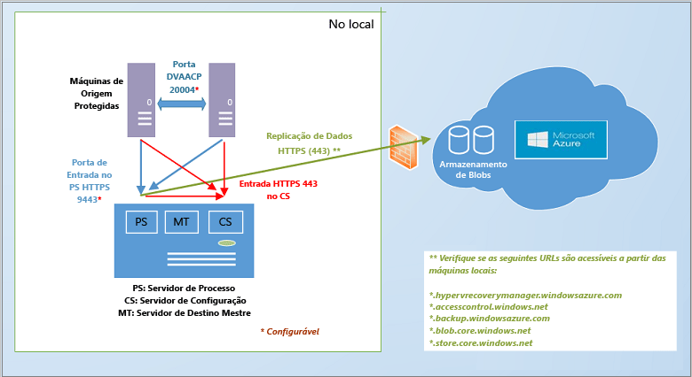

# Como funciona o Azure Site Recovery?
Leia este artigo para compreender a arquitetura subjacente do serviço Azure Site Recovery e os componentes que permitem o seu funcionamento.

Publique eventuais comentários ou perguntas no final deste artigo ou no [Fórum dos Serviços de Recuperação do Azure](https://social.msdn.microsoft.com/forums/azure/home?forum=hypervrecovmgr).

## Visão geral
As organizações precisam de uma estratégia de BCDR que determine como os aplicativos, as cargas de trabalho e os dados permanecerão em execução e disponíveis durante o tempo de inatividade planejado e não planejado, e como recuperarão as condições normais de trabalho assim que possível. Sua estratégia de BCDR devem manter os dados comerciais seguros e passíveis de recuperação e garantir que as cargas de trabalho permaneçam continuamente disponíveis mediante um desastre.

A Recuperação de Site é um serviço do Azure que colabora com sua estratégia de BCDR por meio da coordenação da replicação de servidores físicos e máquinas virtuais locais na nuvem (Azure) ou em um datacenter secundário. Quando ocorrem paralisações em seu local primário, você realiza o failover em um local secundário a fim de manter os aplicativos e cargas de trabalho disponíveis. Quando o local primário retoma as operações normais, você realiza o failback. Saiba mais em [O que é Recuperação de Site?](site-recovery-overview.md)

## Recuperação de Site no portal do Azure
O Azure tem dois [modelos de implantação](../resource-manager-deployment-model.md) diferentes para criar e trabalhar com recursos: o modelo Azure Resource Manager e o modelo de gerenciamento de serviços clássico. O Azure também tem dois portais: o [portal clássico do Azure](https://manage.windowsazure.com/), que dá suporte ao modelo de implantação clássico, e o [Portal do Azure](https://portal.azure.com), com suporte aos dois modelos de implantação.

A Recuperação de Site está disponível no portal clássico e no portal do Azure. No portal clássico do Azure, você pode dar suporte à Recuperação de Site com o modelo de gerenciamento de serviços clássico. No Portal do Azure, é possível oferecer suporte às implantações no modelo clássico ou do Resource Manager. [Ler mais](site-recovery-overview.md#site-recovery-in-the-azure-portal) sobre a implantação com o portal do Azure.

As informações neste artigo se aplicam às implantações clássicas e do portal do Azure. As diferenças são indicadas onde aplicável.

## Cenários de implantação
A Recuperação de Site pode ser implantada para orquestrar a replicação em vários cenários:

* **Replicar máquinas virtuais VMware**: você pode replicar máquinas virtuais VMware locais no Azure ou em um datacenter secundário.
* * **Replicar computadores físicos**: você pode replicar computadores físicos executando Windows ou Linux no Azure ou em um datacenter secundário. O processo de replicação de máquinas físicas é quase o mesmo que o processo de replicação de VMs VMware
* **Replicar máquinas virtuais Hyper-V (sem VMM)**: você pode replicar máquinas virtuais Hyper-V que não são gerenciadas pelo VMM no Azure.
* **Replicar VMs Hyper-V gerenciadas em nuvens do System Center VMM**: você pode replicar máquinas virtuais Hyper-V locais em execução em servidores host Hyper-V nas nuvens do VMM no Azure ou em um datacenter secundário. Você pode duplicar usando a Réplica do Hyper-V standard ou a replicação de SAN.
* **Migrar VMs**: você pode usar o Site Recovery para [migrar VMs IaaS do Azure](site-recovery-migrate-azure-to-azure.md) entre regiões ou para [migrar instâncias do Windows do AWS](site-recovery-migrate-aws-to-azure.md) para VMs IaaS do Azure. No momento, somente há suporte para migração, o que significa que essas VMs podem fazer failover, mas não failback.

A Recuperação de Site pode replicar a maioria dos aplicativos em execução nas VMs e nos servidores físicos. Você pode obter um resumo completo dos aplicativos com suporte em [Quais cargas de trabalho o Azure Site Recovery pode proteger?](site-recovery-workload.md)

## Replicar no Azure: máquinas virtuais VMware ou servidores físicos Windows/Linux
Há duas maneiras de replicar máquinas VMs VMware com a Recuperação de Site.

* **Como usar o Portal do Azure**- Ao implantar a Recuperação de Site no Portal do Azure, você pode realizar o failover de VMs no serviço clássico do gerenciador de recursos ou no Resource Manager. A replicação de VMs do VMware no Portal do Azure oferece várias vantagens, incluindo a capacidade de replicar no armazenamento clássico ou do Resource Manager no Azure. [Saiba mais](site-recovery-vmware-to-azure.md).
* **Como usar o Portal Clássico**- Você pode implantar a Recuperação de Site no Portal Clássico, usando uma experiência aprimorada. Isso deve ser usado para todas as novas implantações no Portal Clássico. Nessa implantação, você só pode realizar o failover de VMs no armazenamento clássico no Azure e não no armazenamento do Resource Manager. [Saiba mais](site-recovery-vmware-to-azure-classic.md). Também há um [experiência herdada](site-recovery-vmware-to-azure-classic-legacy.md) para configuração da replicação de VMware no Portal Clássico. Isso não deve ser usado para novas implantações.  Se você já implantou usando a experiência herdada, [saiba mais sobre migração](site-recovery-vmware-to-azure-classic-legacy.md#migrate-to-the-enhanced-deployment) para a implantação aprimorada.

Os requisitos de arquitetura para a implantação da Recuperação de Site a fim e replicar as VMs VMware/servidores físicos no Portal do Azure ou no Portal Clássico do Azure (aprimorado) são semelhantes, com algumas diferenças:

* Se você implantar no Portal do Azure, poderá replicar no armazenamento com base no Resource Manager e usar as redes do Resource Manager para conectar as VMs do Azure após o failover.
* Quando você implanta no Portal do Azure, há suporte para o armazenamento LRS e GRS. No Portal Clássico, o GRS é obrigatório.
* O processo de implantação é simplificado e mais amigável no Portal do Azure.

Você precisará de:

* **Conta do Azure**: você precisará de uma conta do Microsoft Azure.
* **Armazenamento do Azure**: você precisará de uma conta de armazenamento do Azure para armazenar os dados replicados. Você pode usar uma conta clássica ou uma conta de armazenamento do Resource Manager. A conta pode ser LRS ou GRS quando você implantar no Portal do Azure. Os dados replicados são armazenados no armazenamento do Azure e as VMs do Azure se adaptam quando ocorre failover.
* **Rede do Azure**: você precisará de uma rede virtual do Azure com a qual as máquinas virtuais do Azure se conectarão quando forem criadas no failover. No Portal do Azure, podem ser redes criadas no modelo clássico do gerenciador de serviço ou no modelo do Resource Manager.
* **Servidor de configuração local**: você precisará de uma máquina local com Windows Server 2012 R2 que execute o servidor de configuração e outros componentes de Recuperação de Site. Se você estiver replicando VMs VMware, deverá ser uma VM VMware altamente disponível. Se você quiser replicar servidores físicos, o computador poderá ser físico. Esses componentes da Recuperação de Site serão instalados no computador:
  * **Servidor de configuração**: coordena a comunicação entre o ambiente local e o Azure e gerencia a recuperação e a replicação de dados.
  * **Servidor de processo**: atua como um gateway de replicação. Ele recebe dados de replicação de computadores de origem protegida, otimiza-os com caching, compactação e criptografia e envia os dados para o armazenamento do Azure. Ele também manipula a instalação por push do Serviço de mobilidade em computadores protegidos e executa a descoberta automática de máquinas virtuais VMware. À medida que a implantação cresce, você pode adicionar outros servidores de processo dedicados separados para lidar com o aumento do volume de tráfego de replicação.
  * **Servidor de destino mestre**: lida com dados de replicação durante o failback do Azure.
* **VMs VMware ou servidores físicos para replicação**: cada computador que você desejar replicar para o Azure precisará ter o componente de Serviço de mobilidade instalado. Esse serviço captura gravações de dados no computador e as encaminha ao servidor de processo. Esse componente pode ser instalado manualmente ou pode ser enviado por push e instalado automaticamente pelo servidor de processo quando você habilita a replicação em um computador.
* **Hosts vSPhere/servidor vCenter**: você precisará de um ou mais servidores host vSPhere executando VMs VMware. Recomendamos que você tenha um servidor vCenter para gerenciar os hosts.
* **Failback**: você precisa do seguinte:
  * **Não há suporte para failback físico para físico**: isso significa que, se você realizar o failover de servidores físicos para o Azure e, depois, quiser realizar o failback, deverá realizar o failback para uma VM VMware. Você não pode realizar o failback para um servidor físico. Você precisará de uma VM do Azure para fazer o failback, e se você não tiver implantado o servidor de configuração como uma VM VMware, será necessário configurar um servidor de destino mestre separado como uma VM VMware. Isso é necessário porque o servidor de destino mestre interage e anexa no armazenamento VMware para restaurar os discos para uma VM VMware.
  * * **Servidor de processo temporário no Azure**: se você deseja fazer failback do Azure após o failover, precisa criar uma VM do Azure configurada como um servidor de processo para lidar com a replicação do Azure. Você pode excluir a VM após a conclusão do failback.
  * **Conexão de VPN**: em caso de failback, você precisará de uma conexão de VPN (ou Rota Expressa do Azure) configurada da rede do Azure para o site local.
  * **Servidor de destino mestre separado local**: o servidor de destino mestre local lida com o failback. O servidor de destino mestre está instalado por padrão no servidor de gerenciamento, mas se você estiver fazendo failback de volumes de tráfego maiores, deverá configurar um servidor de destino mestre separado local com essa finalidade.

**Arquitetura geral**

**Componentes de implantação**

**Failback**

* [Saiba mais](site-recovery-vmware-to-azure.md#azure-prerequisites) sobre os requisitos de implantação no Portal do Azure.
* [Saiba mais](site-recovery-vmware-to-azure-classic.md#before-you-start-deployment) sobre os requisitos de implantação aprimorada no Portal Clássico.
* [Saiba mais](site-recovery-failback-azure-to-vmware.md) sobre o failback no Portal do Azure.
* [Saiba mais](site-recovery-failback-azure-to-vmware-classic.md) sobre o failback no portal clássico.

## Replicar no Azure: VMs Hyper-V não gerenciadas pelo VMM
Você pode replicar VMs Hyper-V que não são gerenciadas pelo System Center VMM no Azure com a Recuperação de Site da seguinte maneira:

* **Como usar o Portal do Azure**- Ao implantar a Recuperação de Site no Portal do Azure, você pode realizar o failover de VMs no serviço clássico ou no Resource Manager. [Saiba mais](site-recovery-hyper-v-site-to-azure.md).
* **Como usar o Portal Clássico**- Você pode implantar a Recuperação de Site no Portal Clássico. Nessa implantação, você só pode realizar o failover de VMs no armazenamento clássico no Azure e não no armazenamento do Resource Manager. [Saiba mais](site-recovery-hyper-v-site-to-azure-classic.md).

A arquitetura das duas implantações é semelhante, exceto por:

* Se você implantar no Portal do Azure, poderá replicar no armazenamento do Resource Manager e usar as redes do Resource Manager para conectar as VMs do Azure após o failover.
* O processo de implantação é simplificado e mais amigável no Portal do Azure.

Você precisará de:

* **Conta do Azure**: você precisará de uma conta do Microsoft Azure.
* **Armazenamento do Azure**: você precisará de uma conta de armazenamento do Azure para armazenar os dados replicados. No Portal do Azure, você pode usar uma conta clássica ou uma conta de armazenamento do Resource Manager. No Portal Clássico, você pode usar somente uma conta clássica. Os dados replicados são armazenados no armazenamento do Azure e as VMs do Azure são criadas quando ocorre failover.
* **Rede do Azure**: você precisará de uma rede do Azure com a qual as máquinas virtuais do Azure se conectarão quando forem criadas após o failover.
* **Host Hyper-V**: você precisará de um ou mais servidores de host Hyper-V do Windows Server 2012 R2. Durante a implantação do Site Recovery, você instalará o Provedor do Azure Site Recovery e o agente dos Serviços de Recuperação do Microsoft Azure no host.
* **VMs Hyper-V**: você precisará de uma ou mais VMs no servidor de host Hyper-V. O Provedor do Azure Site Recovery e o agente dos Serviços de Recuperação do Azure no host Hyper-V durante a implantação da Recuperação de Site. O Provedor coordena e organiza a replicação com o serviço Recuperação de Site pela Internet. O agente manipula dados de replicação de dados através de HTTPS 443. As comunicações do provedor e do agente são protegidas e criptografadas. Os dados replicados no armazenamento do Azure também são criptografados.

**Arquitetura geral**

* [Saiba mais](site-recovery-hyper-v-site-to-azure.md#azure-prerequisites) sobre os requisitos de implantação no Portal do Azure.
* [Saiba mais](site-recovery-hyper-v-site-to-azure-classic.md#azure-prerequisites) sobre os requisitos de implantação no Portal Clássico.

## Replicar no Azure: VMs Hyper-V gerenciadas pelo VMM
É possível replicar VMs Hyper-V em nuvens do VMM no Azure com a Recuperação de Site da seguinte maneira:

* **Como usar o Portal do Azure**- Ao implantar a Recuperação de Site no Portal do Azure, você pode realizar o failover de VMs no serviço clássico ou no Resource Manager. [Saiba mais](site-recovery-vmm-to-azure.md).
* **Como usar o Portal Clássico**- Você pode implantar a Recuperação de Site no Portal Clássico. Nessa implantação, você só pode realizar o failover de VMs no armazenamento clássico no Azure e não no armazenamento do Resource Manager. [Saiba mais](site-recovery-vmm-to-azure-classic.md).

A arquitetura das duas implantações é semelhante, exceto por:

* Se você implantar no Portal do Azure, poderá replicar no armazenamento com base no Resource Manager e usar as redes do Resource Manager para conectar as VMs do Azure após o failover.
* O processo de implantação é simplificado e mais amigável no Portal do Azure.

Você precisará de:

* **Conta do Azure**: você precisará de uma conta do Microsoft Azure.
* **Armazenamento do Azure**: você precisará de uma conta de armazenamento do Azure para armazenar os dados replicados. No Portal do Azure, você pode usar uma conta clássica ou uma conta de armazenamento do Resource Manager. No Portal Clássico, você pode usar somente uma conta clássica. Os dados replicados são armazenados no armazenamento do Azure e as VMs do Azure são criadas quando ocorre failover.
* **Rede do Azure**: será necessário configurar o mapeamento de rede para que as VMs do Azure sejam conectadas às redes apropriadas quando forem criadas após o failover.
* **Servidor VMM**: você precisará de um ou mais servidores do VMM locais em execução no System Center 2012 R2 e configurados com uma ou mais nuvens privadas. Se você estiver implantando no Portal do Azure, você precisará de redes lógicas e de VM configuradas para que você possa configurar o mapeamento de rede. No Portal Clássico, isso é opcional.  Uma rede de VM deve ser vinculada a uma rede lógica associada à nuvem.
* **Host Hyper-V**: você precisará de um ou mais servidores de host Hyper-V do Windows Server 2012 R2 na nuvem do VMM.
* **VMs Hyper-V**: você precisará de uma ou mais VMs no servidor de host Hyper-V.

**Arquitetura geral**

* [Saiba mais](site-recovery-vmm-to-azure.md#azure-requirements) sobre os requisitos de implantação no Portal do Azure.
* [Saiba mais](site-recovery-vmm-to-azure-classic.md#before-you-start) sobre os requisitos de implantação no Portal Clássico.

## Replicar em um site secundário: máquinas virtuais VMware ou servidores físicos
Para replicar VMs VMware ou servidores físicos em um site secundário, você deve baixar o InMage Scout que está incluído na assinatura do Azure Site Recovery. Ele pode ser baixado do Portal do Azure ou no Portal Clássico do Azure.

Configure os servidores de componente em cada site (configuração, processo, destino mestre) e instale o Agente Unificado nos computadores que você deseja replicar. Após a replicação inicial, os agentes em cada computador enviam as alterações de replicação delta para o servidor de processo. O servidor de processo otimiza os dados e os transfere para o servidor de destino mestre no site secundário. O servidor de configuração gerencia o processo de replicação.

Você precisa do seguinte:

**Conta do Azure**: implante este cenário usando o InMage Scout. Para obtê-lo, você precisará de uma assinatura do Azure. Depois de criar um cofre de Recuperação de Site, baixe o InMage Scout e instale as atualizações mais recentes para configurar a implantação.
**Servidor de processo (site primário)**: configure o componente do servidor de processo em seu site primário para lidar com o armazenamento em cache, a compactação e a otimização de dados. Ele também trata da instalação por push do Agente Unificado nas máquinas que você deseja proteger.
**Servidor VMware ESX/ESXi e vCenter (site primário)**: se estiver protegendo VMs VMware, você precisará de um hipervisor VMware EXS/ESXi e, como opção, de um servidor VMware vCenter para gerenciar hipervisores.

* **VMs/servidores físicos (site primário)**: as VMs VMware ou os servidores físicos Windows/Linux que você deseja proteger precisarão ter o Agente Unificado instalado. O Agente Unificado também é instalado nas máquinas que atuam como servidor de destino mestre. O agente atua como um provedor de comunicação entre todos os componentes.
* * **Servidor de configuração (site secundário)**: o servidor de configuração é o primeiro componente que você instala, e é instalado no site secundário a fim de gerenciar, configurar e monitorar sua implantação, usando o site de gerenciamento ou o console do vContinuum. Há apenas um servidor de configuração única em uma implantação e ele deve ser instalado em um computador que esteja executando o Windows Server 2012 R2.
* **Servidor vContinuum (site secundário)**: instalado no mesmo local (site secundário) que o servidor de configuração. Ele fornece um console para o gerenciamento e monitoramento de seu ambiente protegido. Em uma instalação padrão, o servidor vContinuum é o primeiro servidor de destino mestre e possui o Agente Unificado instalado.
* **Servidor de destino mestre (site secundário)**: o servidor de destino mestre armazena os dados replicados. Ele recebe os dados do servidor de processo, cria uma máquina de réplica no site secundário e mantém os pontos de retenção dos dados. O número de servidores de destino mestre necessário depende do número de máquinas que você está protegendo. Se você quiser realizar o failback no site primário, também precisará de um servidor de destino mestre nesse local.

**Arquitetura geral**

## Replicar em um site secundário: VMs Hyper-V gerenciadas pelo VMM
Você pode replicar VMs Hyper-V que não são gerenciadas pelo System Center VMM em um datacenter secundário com a Recuperação de Site da seguinte maneira:

* **Usando o Portal do Azure**- Quando você implantar a Recuperação de Site no Portal do Azure. [Saiba mais](site-recovery-hyper-v-site-to-azure.md).
* **Como usar o Portal Clássico**- Você pode implantar a Recuperação de Site no Portal Clássico. [Saiba mais](site-recovery-hyper-v-site-to-azure-classic.md).

A arquitetura das duas implantações é semelhante, exceto por:

* Se você implantar no Portal do Azure, deverá configurar o mapeamento de rede. Isso é opcional no Portal Clássico.
* O processo de implantação é simplificado e mais amigável no Portal do Azure.
* * Se você implantar no Portal Clássico do Azure, o [mapeamento de armazenamento](site-recovery-storage-mapping.md) estará disponível.

Você precisará de:

* **Conta do Azure**: você precisará de uma conta do Microsoft Azure.
* **Servidor VMM**: recomendamos um servidor VMM no site primário e outro no site secundário, cada um contendo pelo menos uma nuvem privada do VMM. O servidor deve executar pelo menos o System Center 2012 SP1 com as atualizações mais recentes e estar conectado à Internet. As nuvens devem ter o perfil de recursos do Hyper-V definido. Você instalará o Provedor do Azure Site Recovery no servidor do VMM. O Provedor coordena e organiza a replicação com o serviço Recuperação de Site pela Internet. As comunicações entre o Provedor e o Azure são protegidas e criptografadas.
* **Servidor Hyper-V**: servidores host Hyper-V devem estar localizados nas nuvens VMM primárias e secundárias. Os servidores host devem estar executando pelo menos o Windows Server 2012 com as últimas atualizações instaladas e devem estar conectados à Internet. Os dados são replicados entre os servidores de host Hyper-V primários e secundários pela LAN ou VPN usando a autenticação Kerberos ou de certificados.  
* **Máquinas protegidas**: o servidor host Hyper-V de origem deve ter pelo menos uma VM que você deseja proteger.

**Arquitetura geral**

* [Saiba mais](site-recovery-vmm-to-vmm.md#azure-prerequisites) sobre os requisitos de implantação no Portal do Azure.
* * [Saiba mais](site-recovery-vmm-to-vmm-classic.md#before-you-start) sobre os requisitos de implantação no Portal Clássico do Azure.

## Replicar em um site secundário com replicação SAN: VMs Hyper-V gerenciadas pelo VMM
Você pode replicar VMs Hyper-V gerenciadas em nuvens do VMM para um site secundário usando a replicação de SAN usando o Portal Clássico do Azure. No momento, esse cenário não tem suporte no novo Portal do Azure.

Nesse cenário, o provedor do Azure Site Recovery é instalado durante a implantação da Recuperação de Site no servidor VMM. O Provedor coordena e organiza a replicação com o serviço Recuperação de Site pela Internet. Os dados são replicados entre as matrizes de armazenamento primária e secundária usando a replicação síncrona de SAN.

Você precisará de:

**Conta do Azure**: você precisará de uma assinatura do Azure

* **Matriz SAN**: uma [matriz SAN com suporte](http://social.technet.microsoft.com/wiki/contents/articles/28317.deploying-azure-site-recovery-with-vmm-and-san-supported-storage-arrays.aspx) gerenciada pelo servidor VMM primário. A SAN compartilha uma infraestrutura de rede com outra matriz de SAN no site secundário.
* **Servidor VMM**: recomendamos um servidor VMM no site primário e outro no site secundário, cada um contendo pelo menos uma nuvem privada do VMM. O servidor deve executar pelo menos o System Center 2012 SP1 com as atualizações mais recentes e estar conectado à Internet. As nuvens devem ter o perfil de recursos do Hyper-V definido.
* **Servidor Hyper-V**: servidores host Hyper-V localizados nas nuvens VMM primárias e secundárias. Os servidores host devem estar executando pelo menos o Windows Server 2012 com as últimas atualizações instaladas e devem estar conectados à Internet.
* **Máquinas protegidas**: o servidor host Hyper-V de origem deve ter pelo menos uma VM que você deseja proteger.

**Arquitetura de replicação de SAN**

[Saiba mais](site-recovery-vmm-san.md#before-you-start) sobre os requisitos de implantação.

### Configuração local
## Ciclo de vida de proteção do Hyper-V
Este fluxo de trabalho mostra o processo de proteção, replicação e failover em máquinas virtuais Hyper-V.

1. **Habilitar proteção**: configure o cofre do Site Recovery, defina as configurações de replicação para uma nuvem VMM ou um site Hyper-V e habilite a proteção para VMs. Um trabalho chamado **Habilitar Proteção** é iniciado e pode ser monitorado na guia **Trabalhos**. O trabalho verifica se a máquina está em conformidade com os pré-requisitos e, em seguida, invoca o método [CreateReplicationRelationship](https://msdn.microsoft.com/library/hh850036.aspx) que configura a replicação no Azure com as configurações definidas por você. O trabalho **Habilitar proteção** também invoca o método [StartReplication](https://msdn.microsoft.com/library/hh850303.aspx) para inicializar uma replicação completa da VM.
2. **Replicação inicial**: é tirado um instantâneo da máquina virtual, e os discos rígidos virtuais são replicados individualmente até que sejam todos copiados no Azure ou no datacenter secundário. O tempo de conclusão necessário depende do tamanho da VM, da largura de banda de rede e do método de replicação inicial. Se houver alterações no disco durante a replicação, o Controlador de Replicação de Réplica do Hyper-V mostrará essas alterações em Logs de Replicação do Hyper-V (.hrl) localizados na mesma pasta que os discos. Cada disco tem um arquivo .hrl associado que será enviado ao armazenamento secundário. Observe que o instantâneo e os arquivos de log consomem recursos de disco durante a replicação inicial. Após a conclusão da replicação inicial, o instantâneo da VM é excluído e as alterações de disco delta no log são sincronizadas e mescladas.
3. **Finalizar proteção**: após a conclusão da replicação inicial, o trabalho **Finalizar proteção** definirá outras configurações de rede e pós-replicação para que a máquina virtual fique protegida. Se você estiver replicando no Azure, talvez seja necessário ajustar as configurações para a máquina virtual de modo que ela fique pronta para o failover. Aqui você já pode executar um failover de teste para verificar se tudo está funcionando conforme o esperado.
4. **Replicação**: depois de iniciada a sincronização delta da replicação inicial, de acordo com as configurações de replicação.
   * **Falha de replicação**: se a replicação delta falhar, e uma replicação completa for dispendiosa em termos de largura de banda ou tempo, ocorre a ressincronização. Por exemplo, se os arquivos .hrl atingirem 50% do tamanho do disco, a VM será marcada para ressincronização. A ressincronização minimiza a quantidade de dados enviados calculando as somas de verificação das máquinas virtuais de origem e de destino e enviando apenas o delta. Após a conclusão da ressincronização, a replicação delta será retomada. Por padrão a ressincronização está agendada para execução automática fora do expediente, mas você pode ressincronizar uma máquina virtual manualmente.
   * **Erro de replicação**: se um erro de replicação ocorrer, haverá uma repetição interna. Se for um erro sem recuperação, por exemplo, um erro de autenticação ou de autorização, ou se uma máquina réplica estiver em um estado inválida, nenhuma repetição ocorrerá. Se for um erro recuperável, por exemplo, um erro de rede ou de espaço em disco/memória baixo(a), uma nova tentativa será realizada em intervalos crescentes (a cada 1, 2, 4, 8, 10 e 30 minutos).
5. **Failovers planejados/não planejados**: você pode executar failovers planejados ou não planejados, conforme necessário. Se você executar um failover planejado, as VMs de origem serão desligadas para evitar a perda de dados. Após a criação das VMs de réplica, elas entram em um estado de confirmação pendente. Você precisa confirmá-las para concluir o failover, a menos que esteja replicando com SAN, pois, nesse caso, a confirmação é automática. Assim que o site primário estiver em execução, o failback poderá ocorrer. Se você tiver replicado no Azure, a replicação inversa será automática. Caso contrário, você precisará iniciar uma replicação inversa manualmente.

## Próximas etapas
[Preparar para a implantação](site-recovery-best-practices.md)

<!--HONumber=Nov16_HO2-->

