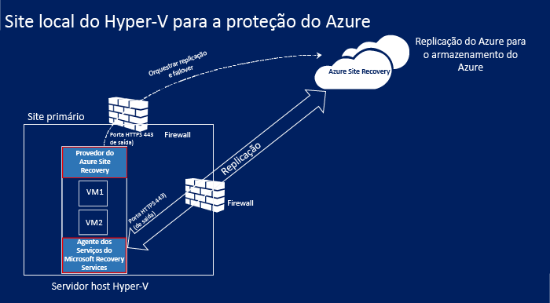
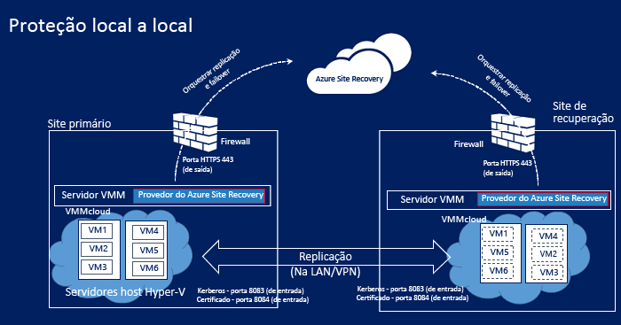
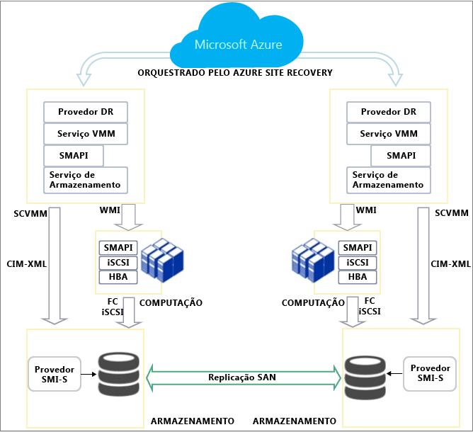
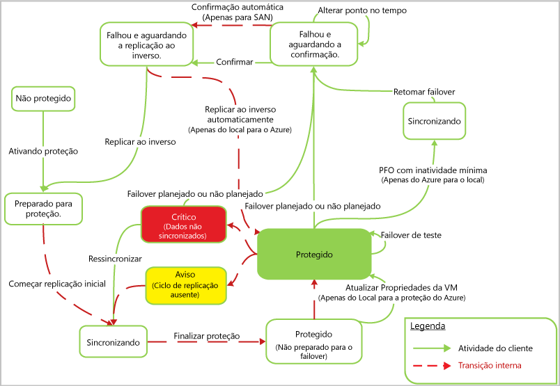

<properties
	pageTitle="Como funciona o Azure Site Recovery?"
	description="Este artigo fornece uma visão geral da arquitetura de Recuperação de Site"
	services="site-recovery"
	documentationCenter=""
	authors="rayne-wiselman"
	manager="jwhit"
	editor=""/>

<tags
	ms.service="site-recovery"
	ms.workload="backup-recovery"
	ms.tgt_pltfrm="na"
	ms.devlang="na"
	ms.topic="get-started-article"
	ms.date="11/29/2015"
	ms.author="raynew"/>

# Como funciona o Azure Site Recovery?

## Sobre este artigo

Este artigo descreve a arquitetura subjacente da Recuperação de Site e os componentes que realizam o trabalho. Após a leitura deste artigo, você poderá publicar perguntas sobre no [Fórum dos Serviços de Recuperação do Azure](https://social.msdn.microsoft.com/forums/azure/home?forum=hypervrecovmgr).

## Visão geral

As organizações precisam de uma estratégia de BCDR (continuidade dos negócios e recuperação de desastre) que determine como os aplicativos, as cargas de trabalho e os dados permanecerão disponíveis durante o tempo de inatividade planejado e não planejado, e como recuperarão as condições normais de trabalho assim que possível. Grande parte de sua estratégia de BCDR ficará centrada em soluções que mantêm os dados comerciais seguros e passíveis de recuperação, e as cargas de trabalho continuamente disponíveis, mediante um desastre.

A Recuperação de Site é um serviço do Azure que colabora com sua estratégia de BCDR por meio da coordenação da replicação de servidores físicos e máquinas virtuais locais na nuvem (Azure) ou em um datacenter secundário. Quando ocorrem paralisações em seu local primário, você realiza o failover em um local secundário a fim de manter os aplicativos e cargas de trabalho disponíveis. Quando o local primário retoma as operações normais, você realiza o failback.

A Recuperação de Site pode ser usada em vários cenários e pode proteger diversas cargas de trabalho.

- **Proteger máquinas virtuais VMware**: você pode proteger as máquinas virtuais VMware locais replicando-as no Azure ou em um datacenter secundário.- **Proteger VMs Hyper-V**: você pode proteger as máquinas virtuais Hyper-V locais replicando-as na nuvem (Azure) ou em um datacenter secundário.  
- **Proteger servidores físicos**: você pode proteger máquinas físicas que executam Windows ou Linux replicando-as no Azure ou em um datacenter secundário.
- **Migrar VMs**: você pode usar a Recuperação de Site para migrar VMs IaaS do Azure entre regiões ou para migrar instâncias do Windows do AWS para VMs IaaS do Azure.

Você pode obter um resumo completa das implantações com suporte em [O que é o Azure Site Recovery?](site-recovery-overview.md) e [Quais cargas de trabalho o Azure Site Recovery pode proteger?](site-recovery-workload.md)

## Replicar entre um servidor físico local ou máquina virtual VMware e o Azure

Se você quiser proteger VMs VMware ou máquinas físicas com Windows/Linux replicando-as no Azure, estas são as etapas necessárias.

**Localidade** | **O que você precisa** 
--- | --- 
 Configuração local | **Servidor de processo**: este servidor otimiza os dados de máquinas virtuais VMware protegidas ou de máquinas físicas com Windows/Linux antes de enviá-los ao Azure. Ele também manipula a instalação por push do componente de serviço de Mobilidade no computador protegido, e executa a descoberta automática de máquinas virtuais VMware.    **VMware vCenter Server**: se você estiver protegendo VMs da VMware, precisará de um VMware vCenter Server gerenciando seus hipervisores vSphere   **ESX Server**: se você estiver protegendo VMs da VMware, precisará de um servidor executando o ESX/ESXi versão 5.1 ou 5.5 com as atualizações mais recentes.   **Máquinas**: se você estiver protegendo a VMware, deverá ter VMs VMware com as ferramentas da VMware instaladas e em execução. Se você estiver protegendo máquinas físicas, eles deverão estar executando um sistema operacional Windows ou Linux com suporte. Confira [o que recebe suporte](site-recovery-vmware-to-azure/#before-you-start).    **Serviço de Mobilidade**: instale nos computadores que você quer proteger a fim de capturar as alterações e comunicá-las ao servidor de processo.   Componentes de terceiros: essa implantação depende de alguns [componentes de terceiros](http://download.microsoft.com/download/C/D/7/CD79E327-BF5A-4026-8FF4-9EB990F9CEE2/Third-Party_Notices.txt).
As tabelas | **Servidor de configuração**: a VM Azure A3 Padrão que coordena a comunicação entre as máquinas protegidas, o servidor de processo e os servidores de destino mestre no Azure. Ele configura a replicação e coordena a recuperação quando o failover ocorre.   **Servidor de destino mestre**: a VM Azure que armazena os dados replicados de máquinas protegidas usando VHDs anexados criados no Armazenamento de Blobs em sua conta de armazenamento do Azure. Um servidor de destino mestre de failback é executado localmente, para que você possa realizar o failback das VMs Azure para as VMs VMware.    **Cofre do Site Recovery**: pelo menos um cofre do Azure Site Recovery (configurado com uma assinatura do serviço Recuperação de Site)    **Rede virtual**: uma rede do Azure na qual o servidor de configuração e os servidores de destino mestre estão localizados, na mesma assinatura e região que o serviço Recuperação de Site.    **Armazenamento do Azure**: a conta de armazenamento do Azure para armazenar os dados replicados. Deve ser uma conta premium ou com redundância geográfica padrão na mesma região da assinatura de Recuperação de Site.

Nesse cenário, as comunicações podem ocorrer sobre uma conexão VPN com portas internas na rede do Azure (usando a Rota Expressa do Azure ou uma VPN site a site), ou sobre uma conexão de Internet segura com os pontos de extremidade públicos mapeados no serviço de nuvem do Azure para as VMs do servidor de destino mestre e de configuração.

O Serviço de Mobilidade em máquinas protegidas envia dados de replicação ao servidor de processo, e envia os metadados de replicação ao servidor de configuração. O servidor de processo comunica-se com o servidor de configuração para obtenção de informações de controle e gerenciamento. Ele envia informações de replicação ao servidor de destino mestre e otimiza e envia os dados replicados ao servidor de destino mestre.

## Replicando VMs Hyper-V no Azure (com a VMM)

Se suas VMs estiverem em um host Hyper-V gerenciado em uma nuvem do System Center VMM, você precisará do seguinte para replicá-las no Azure.

**Localidade** | **O que você precisa** 
--- | --- 
Configuração local | **Servidor VMM**: pelo menos um servidor VMM configurado com pelo menos uma nuvem privada VMM. O provedor do Azure Site Recovery será instalado em cada servidor VMM  **Servidor Hyper-V**: pelo menos um servidor de host Hyper-V localizado na nuvem VMM. O agente dos Serviços de Recuperação da Microsoft será instalado em cada servidor Hyper-V.    **Máquinas virtuais**: pelo menos uma máquina virtual em execução no servidor Hyper-V. Nada é instalado na máquina virtual.
As tabelas | **Cofre do Site Recovery**: pelo menos um cofre do Azure Site Recovery (configurado com uma assinatura do serviço Recuperação de Site)   **Conta de armazenamento**: uma conta de armazenamento do Azure na mesma assinatura que o serviço Recuperação de Site. As máquinas replicadas são armazenadas no armazenamento do Azure. 

Nesse cenário, o provedor em execução no servidor VMM coordena e organiza a replicação com o serviço Recuperação de Site pela Internet. Os dados são replicados entre o agente dos Serviços de Recuperação em execução no servidor Hyper-V local e o armazenamento do Azure por HTTPS 443. As comunicações do provedor e do agente são protegidas e criptografadas. Os dados replicados no armazenamento do Azure também são criptografados.

## Replicando VMs Hyper-V no Azure (sem a VMM)

Se suas VMs não forem gerenciadas por um servidor do System Center VMM, estas serão as etapas necessárias para replicá-las no Azure

**Localidade** | **O que você precisa**
--- | --- 
 Configuração local | **Servidor Hyper-V**: pelo menos um servidor de host Hyper-V. O provedor do Azure Site Recovery e o agente de Serviços de Recuperação da Microsoft serão instalados em cada servidor Hyper-V.   **Máquinas virtuais**: pelo menos uma máquina virtual em execução no servidor Hyper-V. Nada é instalado na máquina virtual.
As tabelas | **Cofre do Site Recovery**: pelo menos um cofre do Azure Site Recovery (configurado com uma assinatura do serviço Recuperação de Site)   **Conta de armazenamento**: uma conta de armazenamento do Azure na mesma assinatura que o serviço Recuperação de Site. As máquinas replicadas são armazenadas no armazenamento do Azure.

Nesse cenário, o provedor em execução no servidor Hyper-V coordena e organiza a replicação com o serviço Recuperação de Site pela Internet. Os dados são replicados entre o agente dos Serviços de Recuperação em execução no servidor Hyper-V local e o armazenamento do Azure por HTTPS 443. As comunicações do provedor e do agente são protegidas e criptografadas. Os dados replicados no armazenamento do Azure também são criptografados.

## Replicar VMs do Hyper-V em um datacenter secundário

Se você quiser proteger suas VMs do Hyper-V replicando-as em um datacenter secundário, estas são as etapas necessárias. Perceba que você só poderá fazer isso caso seu servidor de host Hyper-V seja gerenciado em uma nuvem do System Center VMM.

**Localidade** | **O que você precisa** 
--- | --- 
 Configuração local | **Servidor VMM**: um servidor VMM no site primário e outro no site secundário. O provedor do Azure Site Recovery será instalado em cada servidor VMM.  **Servidor Hyper-V**: pelo menos um servidor de host Hyper-V localizado em uma nuvem VMM nos sites primários e secundários. Nada é instalado nos servidores Hyper-V    **Máquinas virtuais**: pelo menos uma máquina virtual em execução no servidor Hyper-V. Nada é instalado na máquina virtual.
As tabelas | **Cofre do Site Recovery**: pelo menos um cofre do Azure Site Recovery (configurado com uma assinatura do serviço Recuperação de Site). 

Nesse cenário, o provedor no servidor VMM coordena e organiza a replicação com o serviço Recuperação de Site pela Internet. Os dados são replicados entre os servidores de host Hyper-V primários e secundários pela Internet usando a autenticação Kerberos ou de certificados. As comunicações do provedor e dos servidores de host Hyper-V são protegidas e criptografadas.

## Replicar VMs Hyper-V em um datacenter secundário com replicação SAN

Se suas VMs estiverem em um host Hyper-V gerenciado em uma nuvem do System Center VMM e você estiver usando o armazenamento SAN, você precisará do seguinte para replicá-las entre dois datacenters.

**Localidade** | **O que você precisa** 
--- | --- 
 Datacenter primário | **Matriz SAN**: uma [matriz SAN com suporte](http://social.technet.microsoft.com/wiki/contents/articles/28317.deploying-azure-site-recovery-with-vmm-and-san-supported-storage-arrays.aspx) gerenciada pelo servidor VMM primário. A SAN compartilha uma infraestrutura de rede com outra matriz SAN no site secundário    **Servidor VMM**: pelo menos um servidor VMM com uma ou mais nuvens VMM e grupos de replicação configurados. O provedor do Azure Site Recovery será instalado em cada servidor VMM.    **Servidor Hyper-V**: pelo menos um servidor de host Hyper-V com máquinas virtuais, localizado em um grupo de replicação. Nada é instalado no servidor de host Hyper-V.   **Máquinas virtuais**: pelo menos uma máquina virtual em execução no servidor de host Hyper-V. Nada é instalado na máquina virtual. 
Armazenamento de dados secundário | **Matriz SAN**: uma [matriz SAN com suporte](http://social.technet.microsoft.com/wiki/contents/articles/28317.deploying-azure-site-recovery-with-vmm-and-san-supported-storage-arrays.aspx) gerenciada pelo servidor VMM secundário.   **Servidor VMM**: pelo menos um servidor VMM com uma ou mais nuvens VMM.   **Servidor Hyper-V**: pelo menos um servidor de host Hyper-V. 
As tabelas | **Cofre do Site Recovery**: pelo menos um cofre do Azure Site Recovery (configurado com uma assinatura do serviço Recuperação de Site)

Nesse cenário, o provedor no servidor VMM coordena e organiza a replicação com o serviço Recuperação de Site pela Internet. Os dados são replicados entre as matrizes de armazenamento primária e secundária usando a replicação síncrona de SAN.

## Ciclo de vida de proteção do Hyper-V

Este fluxo de trabalho mostra o processo de proteção, replicação e failover em máquinas virtuais Hyper-V.

1. **Habilitar proteção**: configure o cofre do Site Recovery, defina as configurações de replicação para uma nuvem VMM ou um site Hyper-V e habilite a proteção para VMs. Um trabalho chamado **Habilitar proteção** é iniciado e pode ser monitorado na guia **Trabalhos**. O trabalho verifica se a máquina está em conformidade com os pré-requisitos e, em seguida, invoca o método [CreateReplicationRelationship](https://msdn.microsoft.com/library/hh850036.aspx) que configura a replicação no Azure com as configurações definidas por você. O trabalho **Habilitar proteção** também invoca o método [StartReplication](https://msdn.microsoft.com/library/hh850303.aspx)para inicializar uma replicação completa da VM.
2. **Replicação inicial**: é tirado um instantâneo da máquina virtual, e os discos rígidos virtuais são replicados individualmente até que sejam todos copiados no Azure ou no datacenter secundário. O tempo de conclusão depende do tamanho e da largura de banda de rede e do método de replicação inicial escolhido. Se houver alterações no disco durante a replicação, o Controlador de Replicação de Réplica do Hyper-V mostrará essas alterações em Logs de Replicação do Hyper-V (.hrl) localizados na mesma pasta que os discos. Cada disco tem um arquivo .hrl associado que será enviado ao armazenamento secundário. Observe que o instantâneo e os arquivos de log consomem recursos de disco durante a replicação inicial. Após a conclusão da replicação inicial, o instantâneo da VM é excluído e as alterações de disco delta no log são sincronizadas e mescladas.
3. **Finalizar proteção**: após a conclusão da replicação inicial, o trabalho **Finalizar proteção** define outras configurações de rede e pós-replicação, e a máquina virtual fica protegida. Se você estiver replicando no Azure, talvez seja necessário ajustar as configurações para a máquina virtual de modo que ela fique pronta para o failover. Neste ponto, você pode executar um failover de teste para verificar se tudo está funcionando conforme o esperado.
4. **Replicação**: após a replicação inicial, ocorre a sincronização delta, de acordo com as configurações e o método de replicação. 
	- **Falha de replicação**: se a replicação delta falhar, e uma replicação completa for dispendiosa em termos de largura de banda ou tempo, ocorre a ressincronização. Por exemplo, se os arquivos .hrl atingirem 50% do tamanho do disco, a máquina virtual será marcada para ressincronização. A ressincronização minimiza a quantidade de dados enviados calculando as somas de verificação das máquinas virtuais de origem e de destino e enviando apenas o delta. Após a conclusão da ressincronização, a replicação delta deverá ser retomada. Por padrão a ressincronização está agendada para execução automática fora do expediente, mas você pode ressincronizar uma máquina virtual manualmente.
	- **Erro de replicação**: se um erro de replicação ocorrer, haverá uma repetição interna. Se for um erro sem recuperação, por exemplo, um erro de autenticação ou de autorização, ou se uma máquina réplica estiver em um estado inválida, nenhuma repetição ocorrerá. Se for um erro recuperável, por exemplo, um erro de rede ou de espaço em disco/memória baixo(a), uma nova tentativa será realizada em intervalos crescentes (a cada 1, 2, 4, 8, 10 e 30 minutos).
4. **Failovers planejados/não planejados**: execute failovers planejados/não planejados quando surgir a necessidade. Se você executar um failover planejado, as VMs de origem serão desligadas para assegurar que nenhum dados seja perdido. Após a criação das VMs de réplica, elas ficam em um estado de confirmação pendente. Você precisa confirmá-las para concluir o failover, a menos que você esteja replicando com SAN, pois, nesse caso, a confirmação é automática. Assim que o site primário estiver em execução, o failback poderá ocorrer. Se você tiver replicado no Azure, a replicação inversa será automática. Caso contrário, você precisará iniciar uma replicação inversa.
 

## Replicar máquinas virtuais VMware e servidores físicos no Azure

Você pode replicar máquinas virtuais VMware e servidores físicos (Windows/Linux) no Azure por meio de uma conexão VPN site a site ou pela Internet.

### Replicar por uma conexão VPN site a site (ou Rota Expressa) no Azure

#### Replicar pela Internet

## Replicar entre servidores físicos locais ou máquinas virtuais VMware em datacenters primários e secundários

Se você quiser proteger as VMs VMware ou máquinas físicas com Windows/Linux replicando-as entre dois datacenters locais, estas são as etapas necessárias.

**Localidade** | **O que você precisa** 
--- | --- 
 Primário local | **Servidor de processo**: configure o componente do servidor de processo em seu site primário para lidar com o armazenamento em cache, a compactação e a otimização de dados. Ele também trata da instalação por push do Agente Unificado nas máquinas que você deseja proteger.    **Proteção de VMware**: se você estiver protegendo VMs da VMware, precisará de um hipervisor EXS/ESXi da VMware ou de um VMware vCenter Server gerenciando vários hipervisores   **Proteção de servidor físico**: se você estiver protegendo máquinas físicas, elas deverão executar o Windows ou o Linux.    **Agente Unificado**: instale nas máquinas que você quer proteger e na máquina que funciona como o servidor de destino mestre. Ele atua como um provedor de comunicação entre todos os componentes do InMage.
Secundário local | **Servidor de configuração**: o servidor de configuração é o primeiro componente que você instala, e é instalado no site secundário a fim de gerenciar, configurar e monitorar sua implantação, usando o site de gerenciamento ou o console do vContinuum. O servidor de configuração também inclui o mecanismo de envio por push para a implantação remota do Agente Unificado. Há apenas um servidor de configuração em uma implantação e ele deve ser instalado em uma máquina com o Windows Server 2012 R2.    **Servidor vContinuum**: instale no mesmo local (site secundário) que o servidor de configuração. Ele fornece um console para o gerenciamento e monitoramento de seu ambiente protegido. Em uma instalação padrão, o servidor vContinuum é o primeiro servidor de destino mestre e possui o Agente Unificado instalado.    **Servidor de destino mestre**: o servidor de destino mestre armazena os dados replicados. Ele recebe os dados do servidor de processo, cria uma máquina de réplica no site secundário e mantém os pontos de retenção dos dados. O número de servidores de destino mestre necessário depende do número de máquinas que você está protegendo. Se você quiser realizar o failback no site primário, também precisará de um servidor de destino mestre nesse local. 
As tabelas | **Cofre do Site Recovery**: pelo menos um cofre do Azure Site Recovery (configurado com uma assinatura do serviço Recuperação de Site). Baixe o InMage Scout para configurar a implantação após a criação do cofre. Instale também a atualização mais recente para todos os servidores de componente InMage.

Nesse cenário, as alterações de replicação delta são enviadas do Agente Unificado em execução na máquina protegida para o servidor de processo. O servidor de processo otimiza esses dados e os transfere para o servidor de destino mestre no site secundário. O servidor de configuração gerencia o processo de replicação.

## Próximas etapas

[Preparar-se para a implantação](site-recovery-best-practices.md).

<!---HONumber=AcomDC_1203_2015-->