#Planejador de Implantação do Azure Site Recovery
Este é o guia do usuário do Planejador de Implantação do Azure Site Recovery para implantações de produção do VMware para o Azure.

##Visão geral

Antes de proteger máquinas virtuais VMware usando o Azure Site Recovery, você precisa alocar largura de banda suficiente com base na taxa de alteração diária de dados para atender ao RPO desejado. Você precisa implantar o número correto de Servidores de Configuração e Servidores de Processo no local. Você também precisa criar o tipo e o número correto de contas de Armazenamento do Azure de destino: standard ou premium, levando em conta o crescimento nos servidores de produção de origem devido a aumento no uso ao longo do tempo. O tipo de armazenamento é decidido por máquina virtual com base em características de carga de trabalho (IOPS de L/G, variação de dados) e nos limites do Azure Site Recovery.  

A Visualização Pública do Planejador de Implantação do Azure Site Recovery é uma ferramenta de linha de comando atualmente disponível apenas para o cenário do VMware para o Azure. Você pode criar o perfil remotamente das máquinas virtuais do VMware usando essa ferramenta (sem nenhum impacto na produção) para entender os requisitos de largura de banda e do Armazenamento do Azure para o êxito da replicação e do Failover de Teste.  Você pode executar a ferramenta sem instalar componentes do Azure Site Recovery no local, embora, para obter resultados precisos da taxa de transferência alcançada, seja recomendável executar o Planejador em um Windows Server que atenda aos requisitos mínimos do Servidor de Configuração do Azure Site Recovery que, eventualmente, você precisará implantar como uma das primeiras etapas da implantação de produção.

A ferramenta fornece os seguintes detalhes:

**Avaliação de compatibilidade** 
* Avaliação de qualificação de máquina virtual com base no número de discos, no tamanho do disco, no IOPS e na variação

**Necessidade de largura de banda de rede vs. Avaliação de RPO** 
* Largura de banda de rede estimada necessária para a replicação delta 
* A taxa de transferência que o Azure Site Recovery pode obter do local para o Azure 
* Número de máquinas virtuais para incluir em um lote com base na largura de banda estimada para concluir a replicação inicial em determinado período de tempo 

**Requisitos de infraestrutura do Microsoft Azure** 
* Requisito de tipo de armazenamento (armazenamento standard ou premium) para cada máquina virtual 
* O número total de contas de armazenamento standard e premium a serem provisionadas para replicação 
* Sugestões de nomes de contas de armazenamento com base em diretrizes do Armazenamento do Azure 
* Posicionamento de conta de armazenamento de cada máquina virtual 
* Número de núcleos do Microsoft Azure a serem provisionados antes do failover de teste/failover na assinatura 
* Tamanho recomendado de máquina virtual do Microsoft Azure para cada máquina virtual local 

**Requisitos de infraestrutura local** 
* Número necessário de Servidores de Configuração e Servidores de Processo a serem implantados no local 

>[!IMPORTANT]
>
>Todos esses cálculos na ferramenta são feitos supondo um fator de crescimento de 30% nas características de carga de trabalho, devido ao possível aumento no uso ao longo do tempo e usando o 95º percentil de todas as medições de perfil (L/G IOPS, variação etc.) Ambos os parâmetros: o fator de crescimento e o cálculo de percentil são configuráveis. Saiba mais sobre o [fator de crescimento](site-recovery-deployment-planner.md#growth-factor) e o [valor percentual usado para o cálculo](site-recovery-deployment-planner.md#percentile-value-used-for-the-calculation).
>

## Requisitos
A ferramenta tem duas fases principais: criação de perfil e geração de relatórios. Também há uma terceira opção para calcular apenas a taxa de transferência. Abaixo estão os requisitos para o servidor do qual a criação de perfil/medida de taxa de transferência é iniciada.

| Requisito | Descrição|
|---|---|
|Medida de Criação de Perfil e Taxa de Transferência|  Sistema operacional: Microsoft Windows Server 2012 R2  A correspondência ideal é de pelo menos o seguinte [tamanho](https://aka.ms/asr-v2a-on-prem-components) do Servidor de Configuração Configuração de máquina: 8 vCPus, 16 GB de RAM, disco rígido de 300 GB [VMware vSphere PowerCLI 6.0 R3](https://developercenter.vmware.com/tool/vsphere_powercli/6.0) [Microsoft Visual C++ redistribuível para Visual Studio 2012](https://aka.ms/vcplusplus-redistributable)  Acesso à Internet para o Microsoft Azure deste servidor  Conta de armazenamento do Microsoft Azure Acesso de administrador no servidor Espaço livre em disco mínimo de 100 GB (pressupondo 1000 máquinas virtuais com três discos cada, em média, para criação de perfil por 30 dias)|
| Geração de Relatórios| Qualquer computador Windows/Windows Server com o Microsoft Excel 2013 e posterior |
| Permissões de Usuário | Permissão somente leitura para a conta de usuário usada para acessar o servidor VMware vSphere/vCenter durante a criação de perfil|

> [!NOTE]
>
> A ferramenta pode apenas criar o perfil de máquinas virtuais com discos VMDK e RDM. Ele não pode criar o perfil de máquinas virtuais com discos iSCSI ou NFS. Embora o Azure Site Recovery dê suporte a discos iSCSI e NFS para servidores VMware, como o planejador de implantação não está localizado no convidado e criando perfis usando apenas os contadores de desempenho do vCenter, a ferramenta não tem visibilidade para esses tipos de disco.
>

##Baixar
[Baixe](https://aka.ms/asr-deployment-planner) a versão mais recente da Visualização Pública do Planejador de Implantação do Azure Site Recovery.  A ferramenta é empacotada em formato zip.  A versão atual da ferramenta dá suporte apenas ao cenário do VMware para o Azure.

Copie o arquivo zip para o Windows Server do qual você deseja executar a ferramenta. Embora você possa executar a ferramenta em qualquer Windows Server 2012 R2 que tenha acesso à rede para conexão com o servidor VMware vCenter ou host VMware vSphere ESXi que contém as máquinas virtuais para criação de perfil, é recomendável executar a ferramenta em um servidor cuja configuração de hardware esteja de acordo com a [orientação de dimensionamento do Servidor de Configuração](https://aka.ms/asr-v2a-on-prem-components).  Se já tiver implantado componentes locais do Azure Site Recovery, você deverá executar a ferramenta do Servidor de Configuração. É recomendável ter a mesma configuração de hardware que o Servidor de Configuração (que tem um Servidor de Processo integrado) no servidor em que você executa a ferramenta para que a taxa de transferência relatada pela ferramenta corresponda à taxa de transferência real que o Azure Site Recovery pode atingir durante a replicação. O cálculo de taxa de transferência depende da largura de banda de rede disponível no servidor e da configuração de hardware (CPU armazenamento etc.) do servidor. Se você executar a ferramenta em qualquer outro servidor, a taxa de transferência será calculada desse servidor para o Microsoft Azure, e a configuração de hardware do servidor poderá ser diferente daquela do Servidor de Configuração. Assim, a taxa de transferência obtida relatada pela ferramenta não será precisa.

Extrai a pasta zip. Você pode ver vários arquivos e subpastas. O executável é ASRDeploymentPlanner.exe na pasta pai.

Exemplo: copiar o arquivo .zip para a unidade E:\ e extraí-lo.
E:\ASR Deployment Planner-Preview_v1.1.zip

E:\ASR Deployment Planner-Preview_v1.1\ ASR Deployment Planner-Preview_v1.1\ ASRDeploymentPlanner.exe

##Funcionalidades
A ferramenta de linha de comando (ASRDeploymentPlanner.exe) pode ser executada em qualquer um dos três seguintes modos:

1.    Criação de perfil  
2.    Geração de relatórios
3.    Obter taxa de transferência

Primeiro, você precisa executar a ferramenta no modo de criação de perfil para obter o IOPS e a variação de dados de máquinas virtuais.  Em seguida, execute a ferramenta para gerar o relatório e obter os requisitos de armazenamento e largura de banda de rede.

##Criação de perfil
No modo de criação de perfil, a ferramenta de Planejamento de Implantação se conecta ao servidor vCenter ou ao hosts ESXi vSphere para coletar dados de desempenho sobre a máquina virtual.

* A criação de perfil não afeta o desempenho das máquinas virtuais de produção, pois nenhuma conexão direta é feita com a máquina virtual de produção. Todos os dados de desempenho são coletados do servidor vCenter/host ESXi de vSphere.
* O servidor vCenter/host ESXi vSphere é consultado uma vez a cada 15 minutos, para garantir que haja impacto irrelevante no servidor devido à criação de perfil. No entanto, isso não compromete a precisão da criação de perfil, pois a ferramenta está armazenando dados de contador de desempenho de cada minuto.

####Criar uma lista de máquinas virtuais para criar o perfil
Primeiro, você precisa ter a lista de máquinas virtuais cujo perfil deseja criar. Você pode obter todos os nomes das máquinas virtuais em um host VMware vCenter ou VMware vSphere ESXi usando os comandos a seguir do VMware vSphere PowerCLI. Como alternativa, você pode simplesmente listar nomes amigáveis/endereços IP das máquinas virtuais para as quais deseja cria ro perfil manualmente em um arquivo.

1.    Faça logon na máquina virtual em que o VMware vSphere PowerCLI está instalado
2.    Abrir o console do VMware vSphere PowerCLI
3.    Verifique se a política de execução não está desabilitada para o script. Se for desabilitado, inicie o console do VMware vSphere PowerCLI no modo de administrador e execute o seguinte comando para habilitá-lo:

            Set-ExecutionPolicy –ExecutionPolicy AllSigned

4.    Execute os dois comandos a seguir para obter todos os nomes de máquinas virtuais em um VMware vCenter ou VMware vSphere ESXi e armazená-los em um arquivo .txt.
Substitua &lsaquo;nome do servidor&rsaquo;, &lsaquo;nome de usuário&rsaquo;, &lsaquo;senha&rsaquo; e &lsaquo;outputfile.txt&rsaquo;; por suas entradas.

            Connect-VIServer -Server <server name> -User <user name> -Password <password>

            Get-VM |  Select Name | Sort-Object -Property Name >  <outputfile.txt>

5.    Abra o arquivo de saída no Bloco de Notas. Copie os nomes de todas as máquinas virtuais para as quais você deseja criar o perfil para outro arquivo (por exemplo, ProfileVMList.txt), com um nome de máquina virtual por linha. Esse arquivo será usado como entrada para o parâmetro -VMListFile da ferramenta de linha de comando

    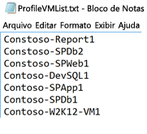

####Iniciar criação de perfil
Depois de obter a lista de VMs para criação de perfil, você pode executar a ferramenta no modo de criação de perfil. Aqui está a lista de parâmetros obrigatórios e opcionais da ferramenta para execução no modo de criação de perfil. Os parâmetros entre [] são opcionais.

ASRDeploymentPlanner.exe -Operation StartProfiling /?

| Nome do Parâmetro | Descrição |
|---|---|
| -Operation |      StartProfiling |
| -Server | Nome de domínio totalmente qualificado ou endereço IP do servidor vCenter/host ESXi cujas máquinas virtuais devem ser submetidas à criação de perfil.|
| -User | Nome de usuário para se conectar ao servidor vCenter/host ESXi. O usuário deve ter pelo menos um acesso somente leitura.|
| -VMListFile |    O arquivo com a lista de máquinas virtuais para criação de perfil. O caminho do arquivo pode ser absoluto ou relativo. Esse arquivo deve conter um endereço IP/nome de máquina virtual por linha. O nome de máquina virtual especificado no arquivo deve ser o mesmo que o nome da VM no servidor vCenter ou host ESXi.   Por exemplo: o arquivo "VMList.txt" contém as seguintes máquinas virtuais: máquina_virtual_A  10.150.29.110 máquina_virtual_B |
| -NoOfDaysToProfile | Número de dias pelos quais a criação de perfil deve ser executada. É recomendável executar a criação de perfil por mais de 15 dias garantir que o padrão de carga de trabalho no ambiente durante o período especificado seja observado e usado para fornecer uma recomendação precisa |
| [-Directory] |    Caminho de diretório local ou UNC para armazenar os dados de criação de perfil gerados durante a criação de perfil. Se não for especificado, o diretório chamado 'ProfiledData' no caminho atual será usado como diretório padrão. |
| [-Password ] | Senha para conexão com o servidor vCenter/host ESXi. Se não for especificado agora, você deverá fornecê-lo quando o comando for executado.|
|  [-StorageAccountName]  | Nome da conta de Armazenamento do Azure para obter a taxa de transferência viável para replicação de dados do local para o Azure. A ferramenta carrega dados de teste nessa conta de armazenamento para calcular a taxa de transferência.|
| [-StorageAccountKey] | Chave da conta de Armazenamento do Azure usada para acessar a conta de armazenamento. Acesse o portal do Azure > Contas de armazenamento > [Nome de conta de armazenamento] > Configurações > Chaves de acesso > Chave1 (ou Chave de acesso primário da conta de armazenamento clássico). |

É recomendável criar o perfil de suas máquinas virtuais pelo menos por 15 a 30 dias. Durante o período de criação de perfil, ASRDeploymentPlanner.exe continua em execução. A ferramenta aceita a entrada de tempo de criação de perfil em dias. Se quiser criar o perfil por algumas horas ou minutos para fazer um teste rápido da ferramenta, na Visualização Pública, você precisará converter o horário na medida equivalente de dias.  Por exemplo, para criar o perfil por 30 minutos, a entrada precisa ser 30/(60 * 24) = 0,021 dias.  O tempo de criação de perfil mínimo permitido é de 30 minutos.

Durante a criação de perfil, você pode, opcionalmente, passar um nome de conta de Armazenamento do Azure e uma chave para obter a taxa de transferência que o Azure Site Recovery pode alcançar no momento da replicação do Servidor de Configuração/Servidor de Processo para o Azure. Se a chave e o nome da conta de Armazenamento do Azure não forem passados durante a criação de perfil, a ferramenta não calculará a taxa de transferência possível.

Você pode executar várias instâncias da ferramenta para diferentes conjuntos de máquinas virtuais. Verifique se nomes de máquina virtual não são repetidos em qualquer um dos conjuntos de criação de perfil. Por exemplo, você criou o perfil de dez máquinas virtuais (VM1 - VM10) e, depois de alguns dias, deseja criar o perfil de outras cinco máquinas virtuais (VM11 - VM15). Você pode executar a ferramenta em outro console de linha de comando para o segundo conjunto de máquinas virtuais (VM11 - VM15). Porém, verifique se o segundo conjunto de máquinas virtuais não tem nomes de máquina virtual da primeira instância de criação de perfil ou se você usa um diretório de saída diferente para a segunda execução. Se duas instâncias da ferramenta forem usadas para a criação de perfil das mesmas máquinas virtuais e for usado o mesmo diretório de saída, o relatório gerado será incorreto.

A configuração de máquina virtual é capturada uma vez no início da operação de criação de perfil e armazenada em um arquivo chamado VMDetailList.xml. Essas informações serão usadas no momento da geração de relatórios. Qualquer alteração na configuração da VM (por exemplo, maior número de núcleos, discos, NICs etc.) do momento em que a criação de perfil foi iniciada até o término da criação de perfil não será capturada. Se você enfrenta uma situação em que qualquer configuração da máquina virtual com perfil criado foi alterada durante a criação de perfil, na Visualização Pública, aqui está a solução alternativa para obter os detalhes mais recentes da máquina virtual ao gerar o relatório.   

* Faça backup de 'VMdetailList.xml' e exclua o arquivo de seu local atual.
* Passe os argumentos -User e -Password no momento da geração de relatórios.

O comando de criação de perfil gera vários arquivos no diretório de criação de perfil. Não exclua nenhum deles, caso contrário, a geração de relatório será afetada.

#####Exemplo 1: para criar o perfil de máquinas virtuais para 30 dias e obter a taxa de transferência do local para o Azure
ASRDeploymentPlanner.exe **-Operation** StartProfiling -Directory “E:\vCenter1_ProfiledData” **-Server** vCenter1.contoso.com **-VMListFile** “E:\vCenter1_ProfiledData\ProfileVMList1.txt”  **-NoOfDaysToProfile**  30  **-User** vCenterUser1 **-StorageAccountName**  asrspfarm1 **-StorageAccountKey** Eby8vdM02xNOcqFlqUwJPLlmEtlCDXJ1OUzFT50uSRZ6IFsuFq2UVErCz4I6tq/K1SZFPTOtr/KBHBeksoGMGw==

#####Exemplo 2: para criar o perfil de máquinas virtuais para 15 dias
ASRDeploymentPlanner.exe **-Operation** StartProfiling **-Directory** “E:\vCenter1_ProfiledData” **-Server** vCenter1.contoso.com **-VMListFile** “E:\vCenter1_ProfiledData\ProfileVMList1.txt”  **-NoOfDaysToProfile**  15  -User vCenterUser1

#####Exemplo 3: para gerar o perfil de máquinas virtuais para uma hora para um teste rápido da ferramenta
ASRDeploymentPlanner.exe **-Operation** StartProfiling **-Directory** “E:\vCenter1_ProfiledData” **-Server** vCenter1.contoso.com **-VMListFile** “E:\vCenter1_ProfiledData\ProfileVMList1.txt”  **-NoOfDaysToProfile**  0.04  **-User** vCenterUser1

>[!NOTE]
>
> * Se o servidor em que a ferramenta está em execução for reinicializado ou falhar ou se você sair da ferramenta usando Ctrl + C, os dados cujo perfil foi criado serão preservados. Há uma possibilidade de perder os últimos 15 minutos de dados de geração de perfil devido a isso. Você precisa executar novamente a ferramenta no modo de criação de perfil depois que o servidor inicia o backup.
>
> * Quando o nome da conta de Armazenamento do Azure e a chave são passados, a ferramenta mede a taxa de transferência na última etapa de criação de perfil. Se a ferramenta for finalizada antes de a criação de perfil ser concluída normalmente, a taxa de transferência não será calculada. Você também pode executar a operação GetThroughput no console de linha de comando para obter a taxa de transferência antes de gerar o relatório. Caso contrário, o relatório gerado não terá as informações da taxa de transferência obtida.
>

##Gerar relatório
A ferramenta gera um XLSM (arquivo habilitado para macro do Microsoft Excel) como a saída de relatório que resume as recomendações de implantação. O relatório é denominado DeploymentPlannerReport_<Unique Numeric Identifier>. xlsm e colocado no diretório especificado.

Após a criação de perfil ser concluída, você poderá executar a ferramenta no modo de geração de relatório. Aqui está a lista de parâmetros obrigatórios e opcionais da ferramenta para execução no modo de geração de relatório. Os parâmetros entre [] são opcionais.

ASRDeploymentPlanner.exe -Operation GenerateReport /?

|Nome do Parâmetro | Descrição |
|-|-|
| -Operation | GenerateReport |
| -Server |  Nome de domínio totalmente qualificado ou endereço IP do servidor vCenter/vSphere (use o mesmo nome ou endereço IP que você usou no momento da criação de perfil) em que se encontram as máquinas virtuais com geração de perfil cujo relatório é gerado. Observe que, se usou um Servidor vCenter no momento da criação de perfil, você não pode usar um servidor vSphere para geração de relatórios e vice-versa.|
| -VMListFile | O arquivo com a lista de máquinas virtuais com criação de perfil para as quais o relatório deve ser gerado. O caminho do arquivo pode ser absoluto ou relativo. Esse arquivo deve conter um endereço IP/nome de máquina virtual por linha. Os nomes de máquina virtual especificados no arquivo devem ser iguais aos nomes de máquina virtual no servidor vCenter ou host ESXi e corresponder aos que foram usados no momento da criação de perfil.|
| [-Directory] | UNC ou caminho do diretório local em que os dados analisados (arquivos gerados durante a criação de perfil) são armazenados. Esses dados são necessários para gerar o relatório. Se não for especificado, o diretório 'ProfiledData' será usado. |
| [-GoalToCompleteIR] |    Número de horas em que a replicação inicial das máquinas virtuais com criação de perfil precisa ser concluída. O relatório gerado fornecerá o número de máquinas virtuais para as quais a replicação inicial pode ser concluída no tempo especificado. O padrão é de 72 horas. |
| [-User] | Nome de usuário para se conectar ao servidor vCenter/vSphere. Isso é usado para buscar as informações mais recentes de configuração das máquinas virtuais, como o número de discos, o número de núcleos, o número de NICs etc. a serem usados no relatório. Se não for fornecido, as informações de configuração coletadas no início da criação de perfil de lançamento serão usadas. |
| [-Password] | Senha para conexão com o servidor vCenter/host ESXi. Se não for especificado como um parâmetro, você deverá fornecê-lo mais tarde quando o comando for executado. |
| [-DesiredRPO] | RPO (Objetivo de Ponto de Recuperação) desejado em minutos. O padrão é de 15 minutos.|
| [-Bandwidth] | Largura de banda em Mbps. Isso é usado para calcular o RPO que pode ser obtido para a largura de banda. |
| [-StartDate]  | Data e hora de início em MM-DD-YYYY:HH:MM (no formato de 24 horas). 'StartDate' precisa ser especificado junto com 'EndDate'. Quando especificado, o relatório será gerado para os dados de perfil coletados entre StartDate e EndDate. |
| [-EndDate] | Data e hora de término em MM-DD-YYYY:HH:MM (no formato de 24 horas). 'EndDate' precisa ser especificado junto com 'StartDate'. Quando especificado, o relatório será gerado para os dados de perfil coletados entre StartDate e EndDate. |
| [-GrowthFactor] |Fator de crescimento em percentual. O padrão é de 30%.  |

##### Exemplo 1: para gerar o relatório com valores padrão quando os dados cujo perfil foi criado estão na unidade local
ASRDeploymentPlanner.exe **-Operation** GenerateReport **-Server** vCenter1.contoso.com **-Directory** “E:\vCenter1_ProfiledData” **-VMListFile** “E:\vCenter1_ProfiledData\ProfileVMList1.txt”

##### Exemplo 2: para gerar relatório quando os dados cujo perfil foi criado estão em um servidor remoto. O usuário deve ter acesso de leitura/gravação no diretório remoto.
ASRDeploymentPlanner.exe **-Operation** GenerateReport **-Server** vCenter1.contoso.com **-Directory** “\\\\PS1-W2K12R2\vCenter1_ProfiledData” **-VMListFile** “\\\\PS1-W2K12R2\vCenter1_ProfiledData\ProfileVMList1.txt”

##### Exemplo 3: para gerar relatório com uma largura de banda específica e com o objetivo de concluir IR no tempo especificado
ASRDeploymentPlanner.exe **-Operation** GenerateReport **-Server** vCenter1.contoso.com **-Directory** “E:\vCenter1_ProfiledData” **-VMListFile** “E:\vCenter1_ProfiledData\ProfileVMList1.txt” **-Bandwidth** 100 **-GoalToCompleteIR** 24

##### Exemplo 4: gerar oi relatório com o fator de aumento de 5%, em vez do padrão de 30%
ASRDeploymentPlanner.exe **-Operation** GenerateReport **-Server** vCenter1.contoso.com **-Directory** “E:\vCenter1_ProfiledData” **-VMListFile** “E:\vCenter1_ProfiledData\ProfileVMList1.txt” **-GrowthFactor** 5

##### Exemplo 5: gerar o relatório com um subconjunto dos dados analisados. Digamos que você tenha 30 dias de dados de criação de perfil deseje gerar o relatório apenas para 20 dias.
ASRDeploymentPlanner.exe **-Operation** GenerateReport **-Server** vCenter1.contoso.com **-Directory** “E:\vCenter1_ProfiledData” **-VMListFile** “E:\vCenter1_ProfiledData\ProfileVMList1.txt” **-StartDate**  01-10-2017:12:30 -**EndDate** 01-19-2017:12:30

##### Exemplo 6: gerar o relatório para o RPO de cinco minutos.
ASRDeploymentPlanner.exe **-Operation** GenerateReport **-Server** vCenter1.contoso.com **-Directory** “E:\vCenter1_ProfiledData” **-VMListFile** “E:\vCenter1_ProfiledData\ProfileVMList1.txt”  **-DesiredRPO** 5

### Valor de percentil usado para o cálculo
**Qual valor de percentil padrão das métricas de desempenho coletadas durante a criação de perfil é usado no momento da geração de relatórios?**

A ferramenta usa por padrão os valores do 95º percentil de IOPS de L/G, IOPS de gravação e variação de dados coletados durante a criação de perfil de todas as VMs. Isso garante que o pico do 100º percentil que suas VMs podem experimentar devido a eventos temporários, como um trabalho de backup uma vez por dia, uma indexação de banco de dados periódica, uma atividade de geração de relatório de análise ou qualquer outro evento de curta duração semelhante em um ponto no tempo que ocorra durante o período de criação de perfil não seja usado para determinar os requisitos de largura de banda de origem e Armazenamento do Azure de destino. O uso de valores do 95º percentil proporciona a visão verdadeira das características de carga de trabalho reais e oferece o melhor desempenho quando essas cargas de trabalho estão em execução no Microsoft Azure. Não esperamos que você altere esse número com frequência, mas se optar por usar um valor ainda menor, por exemplo, o 90º percentil, você poderá atualizar o arquivo de configuração 'ASRDeploymentPlanner.exe.config' na pasta padrão e salvá-lo para gerar um novo relatório sobre os dados de perfil existentes.

        &lsaquo;add key="WriteIOPSPercentile" value="95" /&rsaquo;>      
        &lsaquo;add key="ReadWriteIOPSPercentile" value="95" /&rsaquo;>      
        &lsaquo;add key="DataChurnPercentile" value="95" /&rsaquo;

### Fator de crescimento
**Por que considerar o fator de crescimento ao planejar a implantação?**

É fundamental levar em conta o crescimento em suas características de carga de trabalho, supondo um aumento potencial no uso ao longo do tempo. Isso ocorre porque, uma vez protegido, se as características de carga de trabalho são alteradas, atualmente não há um modo de alternar para outra conta do Armazenamento do Azure para proteção sem desabilitar e reabilitar a proteção. Por exemplo se hoje uma máquina virtual se encaixa em uma conta de replicação de armazenamento standard, em três meses, por exemplo, devido a um aumento no número de usuários do aplicativo em execução na máquina virtual, se a variação aumentar na VM e exigir que ela mude para o armazenamento premium para que a replicação do Azure Site Recovery possa manter a nova variação mais alta, você precisará desabilitar e reabilitar a proteção para uma conta de armazenamento premium. Portanto, é altamente recomendável planejar o crescimento durante o planejamento de implantação, e o valor padrão é 30%. Você sabe quais são suas projeções de crescimento e o padrão de uso de aplicativos e pode alterar esse número adequadamente ao gerar um relatório. De fato, você pode gerar vários relatórios com diferentes fatores de crescimento com os mesmos dados de perfil e ver quais recomendações de largura de banda de origem e do Armazenamento do Azure de destino funcionam melhor para você.

O relatório gerado do Microsoft Excel tem as planilhas a seguir

* [Input](site-recovery-deployment-planner.md#input)
* [Recomendações](site-recovery-deployment-planner.md#recommendations-with-desired-rpo-as-input)
* [Entrada de Recommedations-Bandwidth](site-recovery-deployment-planner.md#recommendations-with-available-bandwidth-as-input)
* [VM<->Posicionamento de Armazenamento](site-recovery-deployment-planner.md#vm-storage-placement)
* [VMs compatíveis](site-recovery-deployment-planner.md#compatible-vms)
* [VMs incompatíveis](site-recovery-deployment-planner.md#incompatible-vms)

##Obter taxa de transferência
Para estimar a taxa de transferência que o Azure Site Recovery pode obter do local para o Azure durante a replicação, execute a ferramenta no modo GetThroughput. A ferramenta calcula a taxa de transferência do servidor em que a ferramenta está sendo executada (o ideal é um servidor com base no guia de dimensionamento do Servidor de Configuração).  Se já tiver implantado componentes de infraestrutura locais do Azure Site Recovery, execute a ferramenta no Servidor de Configuração.

Abra um console de linha de comando e acesse a pasta da ferramenta de planejamento de implantação do ASR.  Execute ASRDeploymentPlanner.exe com os parâmetros a seguir. Os parâmetros entre [] são opcionais.

ASRDeploymentPlanner.exe -Operation GetThroughput /?

|Nome do Parâmetro | Descrição |
|-|-|
| -operation | GetThroughput |
| [-Directory] | UNC ou caminho do diretório local em que os dados analisados (arquivos gerados durante a criação de perfil) são armazenados. Esses dados são necessários para gerar o relatório. Se não for especificado, o diretório 'ProfiledData' será usado.  |
| -StorageAccountName | Nome de conta de Armazenamento do Azure para obter a largura de banda consumida para replicação de dados do local para o Azure. A ferramenta carrega dados de teste nessa conta de armazenamento para obter a largura de banda consumida. |
| -StorageAccountKey | Chave da Conta de Armazenamento do Azure usada para acessar a conta de armazenamento. Acesse o portal do Azure > Contas de armazenamento > [Nome de conta de armazenamento] > Configurações > Chaves de acesso > Chave1 (ou Chave de acesso primário da conta de armazenamento clássico). |
| -VMListFile | O arquivo com a lista de máquinas virtuais para criação de perfil para calcular a largura de banda consumida. O caminho do arquivo pode ser absoluto ou relativo. Esse arquivo deve conter um endereço IP/nome de máquina virtual por linha. Os nomes de máquina virtual especificados no arquivo devem ser iguais aos nomes de máquina virtual no servidor vCenter ou host ESXi. Por exemplo O arquivo "VMList.txt" contém as seguintes máquinas virtuais: máquina virtual_A  10.150.29.110 máquina virtual_B|

A ferramenta cria vários arquivos 'asrvhdfile<#>. vhd' de 64 MB (em que # é o número) no diretório especificado.  Carrega esses arquivos para a conta de Armazenamento do Azure para obter a taxa de transferência. Depois que a taxa de transferência é medida, exclui todos esses arquivos da conta de Armazenamento do Azure e do servidor local. Se a ferramenta for encerrada por qualquer motivo ao calcular a taxa de transferência, não excluirá os arquivos do Armazenamento do Azure ou do servidor local, e será preciso excluí-los manualmente.

A taxa de transferência é medida em determinado momento e é a taxa de transferência máxima que o Azure Site Recovery pode atingir durante a replicação, desde que todos os outros fatores permaneçam iguais. Por exemplo, se qualquer aplicativo começar a consumir mais largura de banda na mesma rede, a taxa de transferência real variará durante a replicação. Se você estiver executando o comando GetThroughput de um Servidor de Configuração, a ferramenta não estará ciente de máquinas virtuais protegidas e replicação contínua. O resultado da taxa de transferência medida será diferente se a operação GetThroughput for executada quando máquinas virtuais protegidas tiverem alta variação de dados em vez de quando tiverem baixa variação de dados.  É recomendável executar a ferramenta em momentos diferentes durante a criação de perfil para compreender qual taxa de transferência pode ser obtida em vários momentos. No relatório, a ferramenta mostra a taxa de transferência medida por último.

##### Exemplo
ASRDeploymentPlanner.exe **-Operation** GetThroughput **-Directory**  E:\vCenter1_ProfiledData **-VMListFile** E:\vCenter1_ProfiledData\ProfileVMList1.txt  **-StorageAccountName**  asrspfarm1 **-StorageAccountKey** by8vdM02xNOcqFlqUwJPLlmEtlCDXJ1OUzFT50uSRZ6IFsuFq2UVErCz4I6tq/K1SZFPTOtr/KBHBeksoGMGw==

>[!NOTE]
>
> * Execute a ferramenta em um servidor que tenha o mesmo armazenamento e as mesmas características de CPU que o Servidor de Configuração
>
> * Para a replicação, provisione a largura de banda que é recomendada para atender ao RPO 100% do tempo. Mesmo após provisionar a largura de banda correta, se você não vir um aumento na taxa de transferência obtida relatada pela ferramenta, verifique o seguinte:
>
> a. Verifique se há qualquer rede QoS (Qualidade de Serviço) que está limitando a taxa de transferência do Azure Site Recovery
>
> b. Verifique se o cofre do Azure Site Recovery está na região física mais próxima com suporte do Microsoft Azure para minimizar a latência da rede
>
> c. Verifique suas características de armazenamento local e tente melhorar o hardware (por exemplo, HDD SSD etc.)
>
> d. Altere as configurações do Azure Site Recovery no servidor de processo para [aumentar a quantidade de largura de banda de rede usada para replicação](./site-recovery-plan-capacity-vmware.md#control-network-bandwidth).
>

##Recomendações com RPO desejado como entrada

###Dados de criação de perfil

**Período de dados de criação de perfil** é a duração pela qual a criação de perfil foi executada. Por padrão, a ferramenta usa todos os dados de perfil para o cálculo, a menos que o relatório seja gerado por um período específico usando opções StartDate e EndDate durante a geração do relatório.

**Nome do Servidor** é o nome ou o endereço IP do host VMware vCenter ou ESXi cujo relatório de máquinas virtuais é gerado.

**RPO desejado** é a meta do RPO (Objetivo de Ponto de Recuperação) para sua implantação. Por padrão, a largura de banda de rede necessária é calculada para valores de RPO de 15, 30 e 60 minutos. Com base na seleção, os valores afetados são atualizados na planilha. Se você tiver usado o parâmetro DesiredRPOinMin ao gerar o relatório, esse valor será mostrado na lista suspensa RPO Desejado.

###Visão geral da criação de perfil

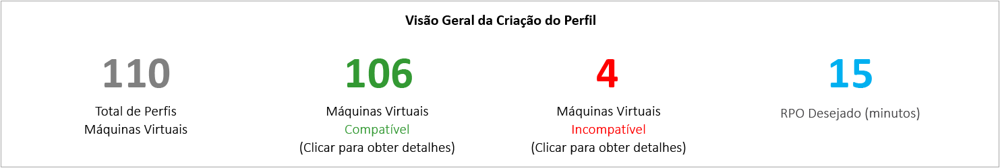

**Total de Máquinas Virtuais com Criação de Perfil** é o número total de máquinas virtuais cujos dados de criação de perfil estão disponíveis. Se VMListFile tiver nomes de máquinas virtuais cujo perfil não foi criado, essas máquinas virtuais não serão consideradas na geração de relatórios e serão excluídas da contagem total de máquinas virtuais com perfil criado.

**Máquinas Virtuais Compatíveis** é o número de máquinas virtuais que podem ser protegidas no Azure usando o Azure Site Recovery. É o número total de máquinas virtuais compatíveis para as quais a largura de banda de rede necessária, o número de contas de Armazenamento do Azure, o número de núcleos do Microsoft Azure e o número de Servidores de Configuração e Servidores de Processo adicionais são calculados. Os detalhes de cada máquina virtual compatível estão disponíveis na planilha de VMs Compatíveis do relatório.

**Máquinas Virtuais Incompatíveis** é o número de máquinas virtuais com criação de perfil que são incompatíveis para proteção com o Azure Site Recovery. Os motivos da incompatibilidade são indicados na seção de VMs incompatível abaixo. Se VMListFile tiver nomes de máquinas virtuais cujo perfil não foi criado, essas máquinas virtuais serão excluídas da contagem de máquinas virtuais incompatíveis. Essas máquinas virtuais são listadas como 'Dados não encontrados' ao fim da planilha de VMs Incompatíveis.

**RPO desejado** é o RPO desejado em minutos. O relatório é gerado para três valores de RPO: 15, 30 e 60 minutos, em que o padrão são 15 minutos. A recomendação de largura de banda no relatório será alterada com base em sua seleção na lista suspensa de RPO Desejado no canto superior direito da planilha. Se você tiver gerado o relatório usando o parâmetro "-DesiredRPO" com um valor personalizado, esse valor personalizado será exibido como o padrão na lista suspensa de RPO Desejado.

###Largura de Banda Necessária (Mbps)

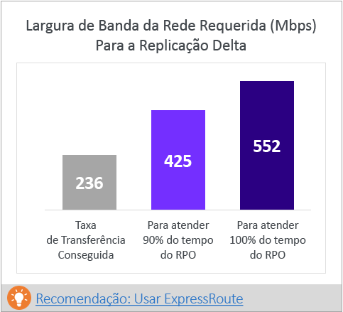

**Para atender ao RPO 100% do tempo:** é a largura de banda recomendada em Mbps a ser alocada para atender ao RPO desejado 100% do tempo. Essa quantidade de largura de banda deve ser dedicada para a replicação delta de estado estacionário de todas as suas máquinas virtuais compatíveis, para evitar violações de RPO.

**Para atender ao RPO 90% do tempo**: devido a preços de banda larga ou por qualquer outro motivo, se você não puder provisionar a largura de banda necessária para atender ao RPO desejado 100% do tempo, poderá optar por uma quantidade menor de largura de banda que possa satisfazer ao RPO desejado 90% do tempo de provisionamento. Para entender as implicações de provisionamento dessa largura de banda menos, o relatório fornece uma análise do tipo "e se" sobre o número e a duração de violações de RPO a serem esperados.

**Taxa de Transferência Obtida:** é a taxa de transferência do servidor em que você executou o comando GetThroughput para a região do Microsoft Azure em que se encontra a conta de Armazenamento do Azure. Indica a taxa de transferência aproximada que pode ser obtida quando você protege as máquinas virtuais compatíveis usando o Azure Site Recovery, desde que as características de rede e de armazenamento do Servidor de Configuração/Servidor de Processo permaneçam iguais às do servidor do qual você executa a ferramenta.    

Para a replicação, você deve provisionar a largura de banda que é recomendada para atender ao RPO 100% do tempo. Mesmo após provisionar a largura de banda correta, se você não vir um aumento na taxa de transferência obtida relatada pela ferramenta, verifique o seguinte:

a.    Verifique se há qualquer rede QoS (Qualidade de Serviço) que está limitando a taxa de transferência do Azure Site Recovery

b.    Verifique se o cofre do Azure Site Recovery está na região física mais próxima com suporte do Microsoft Azure para minimizar a latência da rede

c.    Verifique suas características de armazenamento local e tente melhorar o hardware (por exemplo, HDD SSD etc.)

d. Altere as configurações do Azure Site Recovery no servidor de processo para [aumentar o valor de largura de banda de rede usado para replicação](./site-recovery-plan-capacity-vmware.md#control-network-bandwidth).

Nos casos em que você executar a ferramenta em um Servidor de Configuração/Servidor de Processo que já tenha máquinas virtuais protegidas, execute a ferramenta algumas vezes, pois o número de taxas de transferência obtida mudará dependendo da quantidade de variação que estiver sendo processada nesse momento específico.

Para todas as implantações do Azure Site Recovery de empresa, é recomendável usar o [ExpressRoute](https://aka.ms/expressroute).

###Contas de Armazenamento do Azure necessárias
Este gráfico mostra o número total de contas de Armazenamento do Azure (standard e premium) necessárias para proteger todas as máquinas virtuais compatíveis.  Clique em [Plano de posicionamento de VM recomendado](site-recovery-deployment-planner.md#vm-storage-placement) para saber qual conta de armazenamento deve ser usada para cada máquina virtual.  

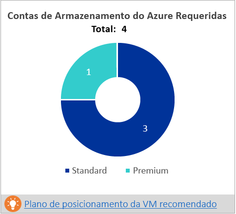

###Número Necessário de Núcleos do Azure
Este é o número total de núcleos a serem provisionados antes do failover ou failover de teste de todas as máquinas virtuais compatíveis. Se núcleos suficientes não estiverem disponíveis na assinatura, o Azure Site Recovery não criará máquinas virtuais no momento do failover de teste ou do failover.

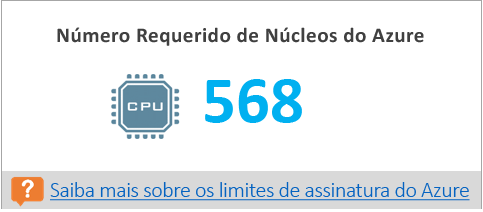

###Infraestrutura Local Necessária
É o número total de Servidores de Configuração e Servidores de Processo adicionais a serem configurados para proteger todas as máquinas virtuais compatíveis. Com base nos [limites](https://aka.ms/asr-v2a-on-prem-components) com suporte na maior configuração, a variação por dia ou o número máximo de máquinas virtuais (supondo a média de três discos por máquina virtual), o que for atingido primeiro no Servidor de Configuração ou no Servidor de Processo adicional, a ferramenta recomenda servidores adicionais. Os detalhes de variação total por dia e o número total de discos protegidos estão na planilha [Entrada](site-recovery-deployment-planner.md#input).

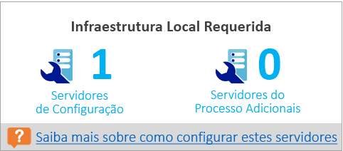

###Análise E Se
Essa análise descreve quantas violações podem ocorrer durante o período de criação de perfil quando você provisiona menos largura de banda para que o RPO desejado seja atingido somente 90% do tempo. Podem ocorrer uma ou mais violações de RPO em qualquer dia. O gráfico mostra o pico de RPO do dia.
Com base nesta análise, você pode decidir se o número de violações de RPO em todos os dias e o pico de ocorrências de RPO por dia são aceitáveis com a menor largura de banda especificada. Se for aceitável, você poderá alocar menos largura de banda para replicação. Caso contrário, aloque a maior largura de banda sugerida para atender ao RPO desejado 100% do tempo.

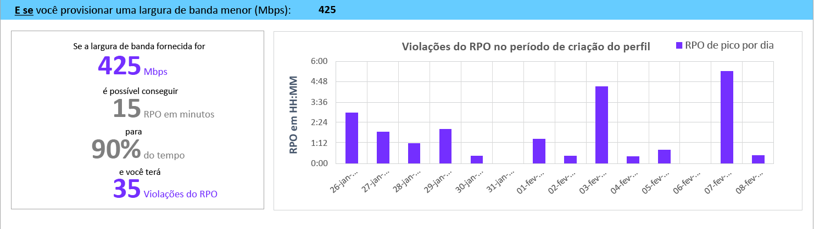

###Tamanho de lote de VMs recomendado para a replicação inicial
Esta seção recomenda o número de máquinas virtuais que podem ser protegidos em paralelo para concluir a replicação inicial dentro de 72 horas (valor configurável – use o parâmetro GoalToCompleteIR no momento da geração de relatório para alterar isso) com a largura de banda sugerida para atender ao RPO desejado 100% do tempo de provisionamento.  O gráfico mostra um intervalo de valores de largura de banda e contagem de tamanho de lote calculado de máquinas virtuais para concluir a replicação inicial em 72 horas, com base na média detectada do tamanho de máquina virtual em todas as máquinas virtuais compatíveis.  

Na Visualização Pública, o relatório não especifica quais máquinas virtuais devem ser incluídas em um lote. Você pode usar o tamanho de disco mostrado na planilha de VMs Compatíveis para obter o tamanho de cada máquina virtual e selecionar as máquinas virtuais para um lote ou selecionar com base nas características de carga de trabalho conhecidas.  O tempo de conclusão da replicação inicial muda proporcionalmente com base no tamanho de disco da máquina virtual real, no espaço em disco usado e na taxa de transferência de rede disponível.

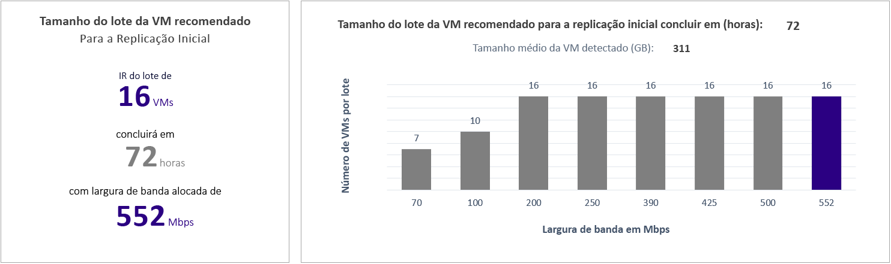

###Fator de crescimento e valores de percentil usados
Esta seção na parte inferior da planilha mostra o valor de percentil usado para todos os contadores de desempenho das máquinas virtuais com criação de perfil (95º percentil por padrão) e o fator de crescimento em % usado em todos os cálculos (30% por padrão).

##Recomendações com largura de banda disponível como entrada

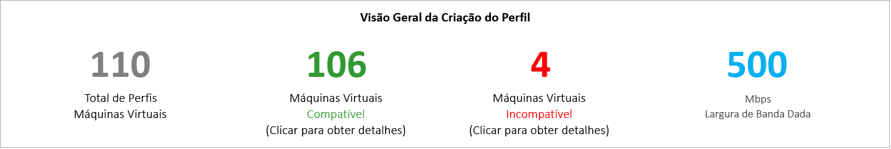

Pode haver uma situação em que você saiba que não é possível provisionar mais do que x Mbps de largura de banda para a replicação do Azure Site Recovery. A ferramenta permite que você insira a largura de banda de entrada (usando o parâmetro -Bandwidth durante a geração de relatórios) e obtenha o RPO possível em minutos. Com esse valor RPO viável, você pode decidir se precisará provisionar largura de banda adicional ou se é suficiente ter uma solução de recuperação de desastres com este RPO.

##Entrada
A página de Entrada fornece uma visão geral do ambiente VMware com criação de perfil.

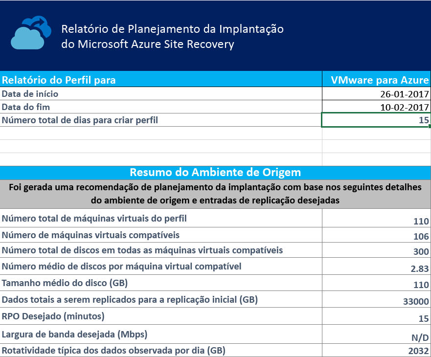

**Data de Início e Data de Término** são as datas de início e término dos dados de criação de perfil considerados para a geração de relatórios. Por padrão, a data de início é a data em que a criação de perfil começou, e a data de término é a data em que a criação de perfil é interrompida.  Poderão ser os valores 'StartDate' e 'EndDate' se o relatório for gerado com esses parâmetros. Data de Início e Data de Término: essas são as datas de início e término dos dados de criação de perfil considerados para a geração de relatórios. Por padrão, a data de início é a data em que a criação de perfil começou, e a data de término é a data em que a criação de perfil é interrompida.  Poderão ser os valores 'StartDate' e 'EndDate' se o relatório for gerado com esses parâmetros.

**Número total de dias de criação de perfil** é o número total de dias de criação de perfil entre as datas de início e de término para as quais o relatório é gerado. O número total de dias de criação de perfil é o número total de dias de criação de perfil entre as datas de início e término para as quais o relatório é gerado.

**Número de máquinas virtuais compatíveis** é o número total de máquinas virtuais compatíveis para as quais a largura de banda de rede necessária, o número necessário de contas de Armazenamento do Azure, os núcleos do Microsoft Azure, os Servidores de Configuração e Servidores de Processo adicionais são calculados.
O número total de discos em todas as máquinas virtuais compatíveis é o número total de discos em todas as máquinas virtuais compatíveis. Esse número é usado como uma das entradas para decidir o número de Servidores de Configuração e outros Servidores de Processo a serem usados na implantação.

**Número médio de discos por máquina virtual compatíveis** é o número médio de discos calculado em todas as máquinas virtuais compatíveis.

**Média de tamanho de disco (GB)** é o tamanho médio de disco calculado entre todas as máquinas virtuais compatíveis.

**RPO desejado (minutos)** é o RPO padrão ou o valor passado para o parâmetro 'DesiredRPO' no momento da geração de relatórios para estimar a largura de banda necessária.

**Largura de banda desejada (Mbps)** é o valor passado para o parâmetro 'Bandwidth' no momento da geração de relatórios para estimar o RPO atingível.

**Variação de dados típica observada por dia (GB)** é a variação de dados média observada em todos os dias de criação de perfil. Esse número é usado como uma das entradas para decidir o número de Servidores de Configuração e outros Servidores de Processo a serem usados na implantação.

##Posicionamento de VM-Storage

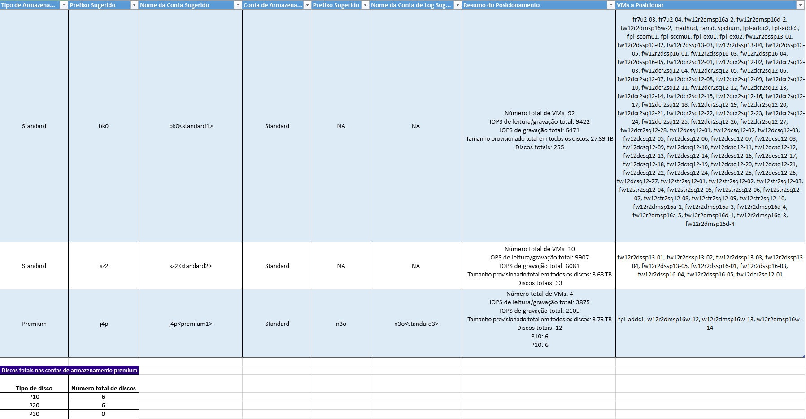

**Tipo de Armazenamento de Disco** é a conta de Armazenamento do Azure 'Standard' ou 'Premium' usada para replicar todas as máquinas de virtuais correspondentes mencionadas na coluna 'VMs para posicionar'.

**Prefixo Sugerido** é o prefixo de três caracteres sugerido que pode ser usado para nomear a conta de Armazenamento do Azure. Você sempre pode usar seu próprio prefixo, mas o que a ferramenta sugere é seguir a [convenção de nomenclatura de partição de contas de Armazenamento do Azure](https://aka.ms/storage-performance-checklist).

**Nome de Conta Sugerido** indica como o nome da conta de Armazenamento do Azure deve ser depois da inclusão do prefixo sugerido. Substitua o nome entre <> pela entrada personalizada.

**Conta de Armazenamento de Log:** todos os logs de replicação são armazenados em uma conta de Armazenamento do Azure standard. Para as máquinas virtuais que estão sendo replicadas para uma conta de Armazenamento do Azure premium, uma conta de Armazenamento do Azure standard adicional precisa ser provisionada para o armazenamento de log. Uma conta de armazenamento de log standard pode ser usada por várias contas de armazenamento de replicação premium. Máquinas virtuais replicadas para contas de armazenamento standard usam a mesma conta de armazenamento para logs.

**Nome de Conta de Log Sugerido** indica como o nome da conta de Armazenamento do Azure de log deve ser depois da inclusão do prefixo sugerido. Substitua o nome entre <> pela entrada personalizada.

**Resumo de Posicionamento** fornece um resumo da carga total de máquinas virtuais na conta de Armazenamento do Azure no momento da replicação e failover de teste/failover. Inclui o número total de máquinas virtuais mapeadas para a conta de Armazenamento do Azure, o total de IOPS de leitura/gravação em todas as máquinas virtuais que estão sendo colocadas nessa conta de Armazenamento do Azure, o IOPS total de gravação (replicação), o tamanho total provisionado em todos os discos e o número total de discos.

**Máquinas Virtuais a serem Posicionadas** lista todas as máquinas virtuais devem ser colocadas em determinada conta de Armazenamento do Azure para oferecer melhor desempenho e utilização.

## VMs compatíveis
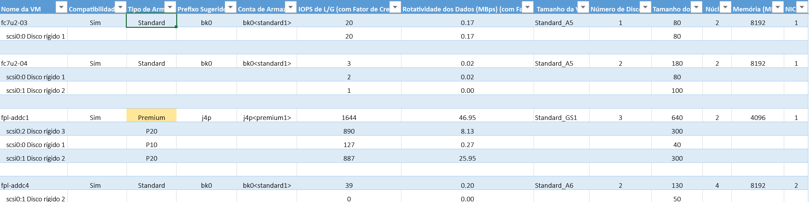

**Nome da VM** é o nome da máquina virtual ou o endereço IP, conforme usado em VMListFile no momento da geração de relatórios. Essa coluna também lista os discos (VMDKs) anexados às máquinas virtuais. As máquinas virtuais em um vCenter com nomes ou endereços IP duplicados são mencionados com o nome de host ESXi para distinguir cada máquina virtual. O host ESXi listado é o host no qual a máquina virtual foi colocada quando a ferramenta a descobriu pela primeira vez durante o período de criação de perfil.

**Compatibilidade de VM** tem dois valores: Sim/Sim*. Sim* é para os casos em que a máquina virtual é uma opção para o [armazenamento premium do Azure](https://aka.ms/premium-storage-workload) com disco IOPS/alta variação de criação de perfil se adequando à categoria P20 ou P30, mas o tamanho do disco faz com que ele deva ser mapeado para P10 ou P20. O Armazenamento do Azure decide para qual tipo de disco de armazenamento premium mapear um disco com base em seu tamanho, ou seja, < 128 GB é P10, 128 a 512 GB é P20 e 512 GB a 1023 GB é P30. Portanto, se as características de carga de trabalho de um disco o colocarem em um P20 ou P30, mas o tamanho for mapeado para um tipo de disco de armazenamento premium inferior, a ferramenta marcará essa máquina virtual como Sim* e recomendará que você altere o tamanho do disco de origem para se ajustar ao tipo de disco de armazenamento premium recomendado correto ou altere o pós-failover de tipo de disco de destino.
O Tipo de Armazenamento é standard ou premium.

**Prefixo Sugerido** é o prefixo da conta de Armazenamento do Azure com três caracteres

**Conta de Armazenamento** é o nome que usa o prefixo sugerido

**IOPS de L/G (com Fator de Crescimento)** é o pico de IOPS de carga de trabalho no disco (95º percentil padrão), incluindo o fator de crescimento futuro (30% por padrão). Observe que o IOPS de L/G total da máquina virtual não será sempre a soma de IOPS de L/G dos discos individuais da máquina virtual, pois o IOPS de L/G de pico da máquina virtual é o pico da soma dos IOPS de L/G dos discos individuais a cada minuto do período de criação de perfil.

**Variação nos dados em Mbps (com Fator de Crescimento)** é a taxa de variação de pico no disco (95º percentil padrão), incluindo o fator de crescimento futuro (30% por padrão). Observe que a variação total nos dados da máquina virtual nem sempre será sempre a soma da variação nos dados dos discos individuais da máquina virtual, pois a variação de dados de pico da máquina virtual é o pico da soma da variação dos discos individuais a cada minuto do período de criação de perfil.

**Tamanho de VM do Azure** é o tamanho mapeado ideal de máquina virtual de Computação do Azure para essa máquina virtual local. Esse mapeamento é feito com base na memória da máquina virtual local, no número de núcleos/discos/NICs e IOPS de L/G. A recomendação é sempre o menor tamanho de máquina virtual do Azure que corresponde a todas essas características da máquina virtual local.

**Número de Discos** é o número total de discos (VMDKs) na máquina virtual

**Tamanho (GB) de disco** é o tamanho total provisionado de todos os discos da máquina virtual. A ferramenta também mostra o tamanho do disco para os discos individuais na máquina virtual.

**Núcleos** é o número de núcleos de CPU na máquina virtual.

**Memória (MB)** é a RAM na máquina virtual.

**NICs** é o número de NICs na máquina virtual.

##VMs incompatíveis

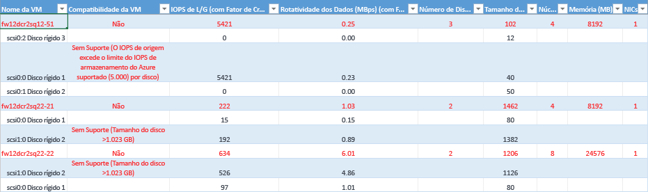

**Nome da VM** é o nome da máquina virtual ou o endereço IP, conforme usado em VMListFile no momento da geração de relatórios. Essa coluna também lista os discos (VMDKs) anexados às máquinas virtuais. As máquinas virtuais em um vCenter com nomes ou endereços IP duplicados são mencionados com o nome de host ESXi para distinguir cada máquina virtual. O host ESXi listado é o host no qual a máquina virtual foi colocada quando a ferramenta a descobriu pela primeira vez durante o período de criação de perfil.

**Compatibilidade de VM** indica por que a máquina virtual específica é incompatível com o Azure Site Recovery. Os motivos são descritos por disco incompatível da máquina virtual e podem ser uma das seguintes opções, com base nos [limites](https://aka.ms/azure-storage-scalbility-performance) publicados do Armazenamento do Azure.

* Tamanho de disco > 1023 GB – o Armazenamento do Azure atualmente não dá suporte a tamanhos de disco > 1 TB
* O tamanho total da VM (replicação + TFO) excede o limite de tamanho de conta de Armazenamento do Azure com suporte (35 TB). Isso geralmente ocorre quando há um único disco na máquina virtual que tem algumas características de desempenho que excedem os limites máximos com suporte do Microsoft Azure/Azure Site Recovery para armazenamento standard, o que coloca a máquina virtual na zona de armazenamento premium. No entanto, o tamanho máximo com suporte de uma conta de Armazenamento do Azure premium é de 35 TB, e uma única máquina virtual protegida não podem ser protegida em várias contas de armazenamento. Além disso, observe que quando um TFO (failover de teste) é executado em uma máquina virtual protegida, ele é executado na mesma conta de armazenamento em que a replicação está em andamento. Portanto, precisamos provisionar duas vezes o tamanho do disco para a replicação para que o failover de teste e o progresso sejam bem-sucedidos em paralelo.
* O IOPS de origem excede o limite de IOPS de Armazenamento do Azure com suporte de 5000 por disco
* O IOPS de origem excede o limite de IOPS de Armazenamento do Azure com suporte de 80.000 por VM
* A variação de dados média excede o limite de variação de dados do Azure Site Recovery com suporte de 10 MBps para o tamanho médio de E/S de disco
* A variação total de dados em todos os discos na VM excede o limite máximo com suporte de variação de dados do Azure Site Recovery de 54 MBps por VM
* O IOPS médio de gravação eficiente excede o limite de IOPS do Azure Site Recovery de 840 com suporte para disco
* O armazenamento de instantâneos calculado excede o limite com suporte de 10 TB para armazenamento de instantâneos

**IOPS de L/G (com Fator de Crescimento)** é o pico de IOPS de carga de trabalho no disco (95º percentil padrão), incluindo o fator de crescimento futuro (30% por padrão). Observe que o IOPS de L/G total da máquina virtual não será sempre a soma de IOPS de L/G dos discos individuais da máquina virtual, pois o IOPS de L/G de pico da máquina virtual é o pico da soma dos IOPS de L/G dos discos individuais a cada minuto do período de criação de perfil.

**Variação nos dados em Mbps (com Fator de Crescimento)** é a taxa de variação de pico no disco (95º percentil padrão), incluindo o fator de crescimento futuro (30% por padrão). Observe que a variação total nos dados da máquina virtual nem sempre será sempre a soma da variação nos dados dos discos individuais da máquina virtual, pois a variação de dados de pico da máquina virtual é o pico da soma da variação dos discos individuais a cada minuto do período de criação de perfil.

**Número de Discos** é o número total de discos (VMDKs) na máquina virtual

**Tamanho (GB) de disco** é o tamanho total provisionado de todos os discos da máquina virtual. A ferramenta também mostra o tamanho do disco para os discos individuais na máquina virtual.

**Núcleos** é o número de núcleos de CPU na máquina virtual.

**Memória (MB)** é a RAM na máquina virtual.

**NICs** é o número de NICs na máquina virtual.

##Limites da Azure Site Recovery

**Destino de Armazenamento de Replicação** | **Tamanho de E/S de Disco de Origem Médio** |**Variação nos Dados Média do Disco de Origem** | **Total de Variação de Dados de Disco de Origem por Dia**
---|---|---|---
Armazenamento Standard | 8 KB    | 2 MB/s | 168 GB por disco
Disco Premium P10 | 8 KB    | 2 MB/s | 168 GB por disco
Disco Premium P10 | 16 KB | 4 MB/s |    336 GB por disco
Disco Premium P10 | 32 KB ou mais | 8 MB/s | 672 GB por disco
Disco Premium P20/P30 | 8 KB    | 5 MB/s | 421 GB por disco
Disco Premium P20/P30 | 16 KB ou mais |10 MB/s    | 842 GB por disco

Esses são números médios, pressupondo uma sobreposição de E/S de 30%. O Azure Site Recovery pode lidar com uma maior taxa de transferência com base na taxa de sobreposição, tamanhos maiores de gravação e comportamento de E/S de carga de trabalho real. Os números acima pressupõem uma lista de pendências típica de aproximadamente cinco minutos, ou seja, uma vez carregados, os dados serão processados, e um ponto de recuperação será criado em cinco minutos.

Os limites publicados acima se baseiam em nossos testes, mas não podem abranger todas as combinações de E/S de aplicativos. Os resultados reais variarão dependendo da combinação de E/S do aplicativo. Para obter melhores resultados, mesmo depois de planejar a implantação, é sempre recomendável executar extensos testes de aplicativos usando o teste de failover para obter a verdadeira imagem de desempenho.

## Como atualizar o Planejador de implantação?
[Baixe](site-recovery-deployment-planner.md#download) a versão mais recente do Planejador de Implantação do Azure Site Recovery. Copie o arquivo zip em um servidor no qual você deseja executar. Extraia o arquivo zip.
Se você já tiver a versão anterior do planejador de implantação e a criação de perfil estiver ocorrendo, não será necessário interromper a criação de perfil, a menos que a nova versão tem uma correção de criação de perfil. Se a versão de lançamento contiver correções no componente de criação de perfil, recomendamos que você pare a criação de perfil usando a versão mais antiga e inicie a criação de perfil novamente usando a nova versão. Observe que quando você começa a criação de perfil usando a nova versão, precisa passar o mesmo caminho de diretório de saída para que a ferramenta acrescente os dados de perfil aos arquivos existentes, e o conjunto completo de dados com perfil será usado na geração de relatórios. Se você passar um diretório de saída diferente, os novos arquivos serão criados e os dados com perfil antigos não poderão ser usados na geração do relatório.  Cada atualização é uma atualização cumulativa com um arquivo zip. Não é necessário copiar os novos arquivos de versão para a pasta de versão anterior para usá-los. Você pode usar a nova pasta.

##Histórico de Versões
### 1,1
Atualizado em: 09 de março 2017  

Os problemas a seguir foram corrigidos 

* Não pode criar o perfil de máquinas virtuais se o vCenter tiver duas ou mais máquinas virtuais com o mesmo nome/endereço IP em hosts ESXi diferentes. 
* As ações de copiar e pesquisar foram desabilitadas para as folhas de VMs compatíveis e incompatíveis.

### 1.0 
Atualizado em: 23 de fevereiro de 2017 

A Visualização Pública do Planejador de Implantação 1.0 do Azure Site Recovery tem os problemas conhecidos a seguir, que serão abordados em atualizações futuras.

* A ferramenta funciona somente para o cenário do VMware para o Azure, não para implantações do Hyper-V para o Azure. Para o cenário de Hyper-v para o Azure, use a [ferramenta de planejamento de capacidade do Hyper-V](./site-recovery-capacity-planning-for-hyper-v-replication.md).
* Não há suporte para a operação GetThroughput nas regiões do Microsoft Azure do governo dos EUA e da China.
* A ferramenta não poderá criar o perfil de máquinas virtuais se vCenter tiver duas ou mais máquinas virtuais com o mesmo nome/endereço IP em hosts ESXi diferentes. Nesta versão, a ferramenta ignora a criação de perfil para nomes de máquina virtual/endereços IP duplicados em VMListFile. A solução alternativa é criar o perfil de máquinas virtuais com o host ESXi em vez do servidor vCenter. Você precisa executar uma instância de cada host ESXi.

