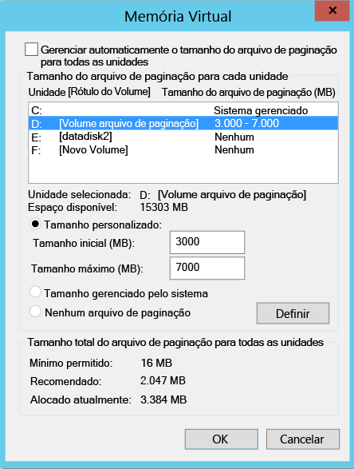
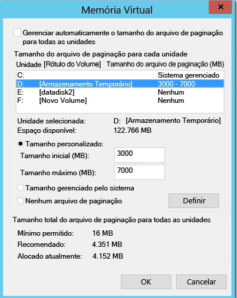
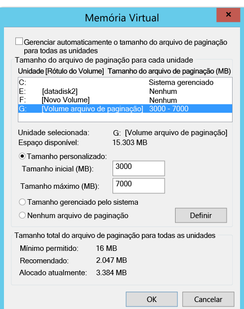
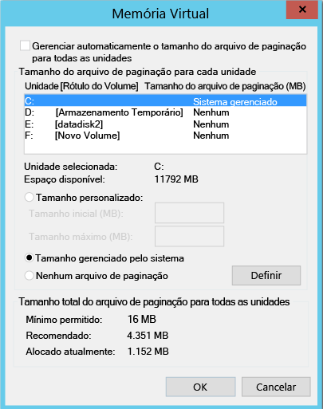

#Excluir disco da replicação
Este artigo descreve como excluir discos de replicação para otimizar a largura de banda de replicação consumida ou otimizar os recursos de destino utilizados por esses discos. O recurso tem suporte para VMware no Azure e Hyper-V para cenários do Azure.

##Pré-requisitos

Por padrão, todos os discos em um computador são replicados. Para excluir um disco da replicação, o serviço de Mobilidade deve ser instalado manualmente no computador antes de habilitar a replicação, se você estiver replicando do **VMware para o Azure**

## Por que excluir discos da replicação?
Excluir discos da replicação geralmente é necessário porque:

1. Os dados formados no disco excluído não é importantes ou não precisam ser replicados.

2. Recursos de armazenamento e rede podem ser salvos não replicando essa variação.

##Quais são os cenários típicos?
Há alguns exemplos específicos de rotatividade de dados que possa ser facilmente identificada e é bons candidatos para exclusão – por exemplo grava qualquer arquivo de paginação, gravações de tempdb do Microsoft SQL server, etc. Dependendo da carga de trabalho e o subsistema de armazenamento, o arquivo de paginação pode registrar uma variação considerável. No entanto, replicar esses dados do site primário para o Azure seria muitos recursos. Portanto, a replicação de uma VM com um único disco virtual com o sistema operacional e o arquivo de paginação pode ser otimizada por:

1. Dividir o disco virtual em dois discos virtuais – uma com o sistema operacional e outra com o arquivo de paginação
2. Excluindo o disco do arquivo de página da replicação

Da mesma forma, do Microsoft SQL Server com o banco de dados tempdb e do sistema de arquivos no mesmo disco podem ser otimizados com:

1. Manter o banco de dados do sistema e tempdb em dois discos diferentes
2. Excluindo o disco de tempdb da replicação.

##Como excluir disco da replicação?

###VMware no Azure
Execute o [habilitar replicação](site-recovery-vmware-to-azure.md#enable-replication) fluxo de trabalho para proteger uma máquina virtual do portal do Azure Site Recovery. Na etapa 4 de habilitar a replicação, há uma coluna - **disco REPLICAR** que pode ser usado para excluir o disco da replicação. Por padrão, todos os discos são selecionados. Desmarque o disco que você deseja excluir da replicação e conclua as etapas para habilitar a replicação. 

    
    
>[!NOTE]
> 
> * Você pode excluir somente os discos que já têm o serviço de Mobilidade instalado. Você precisa instalar o serviço de Mobilidade manualmente porque ele só é instalado usando o mecanismo de push depois que a replicação é habilitada.
> * Apenas discos básicos podem ser excluídos da replicação. Você não pode excluir o sistema operacional ou os discos dinâmicos.
> * Depois que a replicação estiver habilitada, você não poderá adicionar ou remover discos para replicação. Se desejar adicionar ou excluir um disco, você precisará desabilitar a proteção do computador e habilitá-la novamente.
> * Se você excluir um disco necessário para um aplicativo operar, após o failover no Azure você precisará criá-lo manualmente no Azure para que possa executar o aplicativo replicado. Como alternativa, integre a automação do Azure em um plano de recuperação para criar o disco durante o failover do computador.
> * VM do Windows: os discos que você criar manualmente no Azure não sofrerão failback. Por exemplo, se você executar failover de três discos e criar dois diretamente na VM do Azure, apenas os três discos com failover serão enviados por failback. Não é possível incluir discos criados manualmente em failback ou em nova proteção do local para o Azure.
> * VM Linux: os discos criados manualmente no Azure sofrem failback. Por exemplo, se você executar failover de três discos e criar dois diretamente no Azure, todos os cinco farão failback. Você não pode excluir os discos criados manualmente do failback.
> 

###Hyper-V para Azure
Execute o [habilitar replicação](site-recovery-hyper-v-site-to-azure.md#step-6-enable-replication) fluxo de trabalho para proteger uma máquina virtual do portal do Azure Site Recovery. Na etapa 4 de habilitar a replicação, há uma coluna - **disco REPLICAR** que pode ser usado para excluir discos da replicação. Por padrão, todos os discos são selecionados para a replicação. Desmarque o disco que você deseja excluir da replicação e conclua as etapas para habilitar a replicação. 

    
>[!NOTE]
> 
> * Apenas discos básicos podem ser excluídos da replicação. Você não pode excluir o disco do sistema operacional e é recomendável não excluir discos dinâmicos. O ASR não pode identificar qual disco VHD é um disco básico ou dinâmico dentro da VM convidada.  Se todos os discos de volume dinâmico dependentes não forem excluídos, o disco protegido dinâmico aparecerá como um disco com falha na VM de failover e os dados nesse disco não poderão ser acessados.    
> * Depois que a replicação estiver habilitada, você não poderá adicionar ou remover discos para replicação. Se desejar adicionar ou excluir um disco, você precisará desabilitar a proteção da VM e habilitá-la novamente.
> * Se você excluir um disco necessário para um aplicativo operar, após o failover no Azure você precisará criá-lo manualmente no Azure para que possa executar o aplicativo replicado. Como alternativa, integre a automação do Azure em um plano de recuperação para criar o disco durante o failover do computador.
> * Não haverá failback de discos que você criar manualmente no Azure. Por exemplo, se houver failover de três discos e dois discos forem criados diretamente na VM do Azure, apenas três discos que sofreram failover terão failback do Azure para o Hyper-V. Você não pode incluir discos criados manualmente em failback ou em replicação reversa do Hyper-V para o Azure.
 

##Ponta a ponta de cenários de excluir discos
Vamos considerar dois cenários para uma melhor compreensão do recurso de disco de exclusão.

1. Disco de tempdb do SQL Server
2. Arquivo de paginação disco

###Excluindo o disco de tempdb do SQL Server
Vamos considerar uma máquina virtual do SQL Server que tenha um tempdb que possa ser excluído.

Nome da VM: SalesDB Disks na VM de origem:

**Nome do Disco** | **Nº do Disco do Sistema Operacional Convidado** | **Letra da unidade** | **Tipo de dados no disco**
--- | --- | --- | ---
DB-Disk0-OS | DISK0 | C:\ | Disco do sistema operacional
DB-Disk1| Disk1 | D:\ | Banco de dados do sistema SQL e User Database1
DB-disco&2; (excluídos do disco de proteção) | Disk2 | E:\ | Arquivos temporários
DB-Disk3 (excluídos do disco de proteção) | Disk3 | F:\ | Banco de dados tempdb do SQL (caminho da pasta (F:\MSSQL\Data\) -->, anote o caminho da pasta antes do failover
DB-Disk4 | Disk4 |G:\ |User Database2

Como variação de dados em dois discos da VM são temporárias por natureza, enquanto protegem SalesDB VM, exclua o 'disco&2;' e 'Disk3' da replicação. O Azure Site Recovery não serão replicadas desses discos e no failover desses discos não estarão presentes no failover de VM no Azure

Discos na VM do Azure após o failover:

**Nº do Disco do Sistema Operacional Convidado** | **Letra da unidade** | **Tipo de dados no disco**
--- | --- | ---
DISK0 |    C:\ | Disco do sistema operacional
Disk1 |    E:\ | Armazenamento temporário [o Azure adiciona este disco e atribui a primeira letra da unidade disponível]
Disk2 | D:\ | Banco de dados do sistema SQL e User Database1
Disk3 | G:\ | User Database2

Como o disco&2; e Disk3 foram excluídos da VM SalesDB, e é a primeira letra de unidade na lista disponível. O Azure atribui e volume de armazenamento temporário. Para todos os discos replicados, a letra da unidade permanece igual.

Disk3 que era o disco de tempdb do SQL (caminho da pasta tempdb F:\MSSQL\Data\) e excluídos da replicação, o disco não está disponível no failover de VM. Como resultado, o serviço do SQL está no estado parado e é necessário o caminho F:\MSSQL\Data.

Há duas maneiras em que você pode criar esse caminho.

1. Adicionar um novo disco e atribua o caminho da pasta tempdb ou
2. Usar o disco de armazenamento temporário existente para o caminho de pasta de tempdb

####Adicione um novo disco:

1. Anote o caminho de mdf e tempdb.ldf SQL antes do failover.
2. No portal do Azure, adicione um novo disco para o failover de VM com o mesmo ou mais o tamanho do disco de tempdb SQL de origem (Disk3).
3. Faça logon na VM do Azure. No console de gerenciamento (diskmgmt.msc) do disco, inicialize e formate o disco recém-adicionado.
4. Atribua a mesma letra de unidade que foi usada pelo disco de tempdb do SQL (F:).
5. Crie pasta de tempdb no volume F: (F:\MSSQL\Data).
6. Inicie serviço SQL no console do serviço.

####Use o disco de armazenamento temporário existente para o caminho de pasta tempdb do SQL:

1. Abrir um console de linha de comando
2. Executar o SQL Server no modo de recuperação no console de linha de comando

        Net start MSSQLSERVER /f / T3608

3. Execute o seguinte sqlcmd para alterar o caminho de tempdb para o novo caminho

        sqlcmd -A -S SalesDB        **Use your SQL DBname**
        USE master;        
        GO        
        ALTER DATABASE tempdb        
        MODIFY FILE (NAME = tempdev, FILENAME = 'E:\MSSQL\tempdata\tempdb.mdf');
        GO        
        ALTER DATABASE tempdb        
        MODIFY FILE (NAME = templog, FILENAME = 'E:\MSSQL\tempdata\templog.ldf');        
        GO

4. Pare o serviço do Microsoft SQL Server.

        Net stop MSSQLSERVER
5. Inicie serviço do Microsoft SQL Server.

        Net start MSSQLSERVER

Consulte as seguintes diretrizes do Azure para o disco de armazenamento temporário

* Uso de SSDs em VMs do Azure para armazenar o TempDB do SQL Server e Extensões do Pool de Buffer
* Práticas recomendadas relacionadas ao desempenho para o SQL Server em máquinas virtuais do Azure

###Failback (do Azure para o local)
Agora vamos entender que todos os discos serão replicados ao fazer failover do Azure para seu host do Hyper-V ou VMware no local. Os discos criados manualmente no Azure não serão replicados. Por exemplo, se você executar failover de três discos e criar dois diretamente na VM do Azure, apenas os três discos com failover serão enviados por failback. Não é possível incluir discos criados manualmente em failback ou em nova proteção do local para o Azure. Ele também não replicar disco de armazenamento temporário para o local.

####Failback para Recuperação no local original (OLR)

No exemplo acima, configuração de disco de VM do Azure:

**Nº do Disco do Sistema Operacional Convidado** | **Letra da unidade** | **Tipo de dados no disco** 
--- | --- | --- 
DISK0 | C:\ | Disco do sistema operacional
Disk1 |    E:\ | Armazenamento temporário [o Azure adiciona este disco e atribui a primeira letra da unidade disponível]
Disk2 |    D:\ | Banco de dados do sistema SQL e User Database1
Disk3 |    G:\ | User Database2

####VMware no Azure
Quando é feito failback para o local original, configuração de disco VM do failback não tem excluídos do disco. Que significa que os discos que foram excluídos do VMware no Azure, não estarão disponíveis na VM de failback. 

Após o failover planejado do Azure para o VMware no local, discos na VM VMWare (local Original):

**Nº do Disco do Sistema Operacional Convidado** | **Letra da unidade** | **Tipo de dados no disco** 
--- | --- | --- 
DISK0 | C:\ | Disco do sistema operacional
Disk1 |    D:\ | Banco de dados do sistema SQL e User Database1
Disk2 |    G:\ | User Database2

####Hyper-V para Azure
Quando é feito failback para o local original, configuração de disco VM do failback permanecerá a mesma da configuração original de disco VM do Hyper-V. Isso significa que os discos que foram excluídos do site do Hyper-V para o Azure, estará disponível em failback de VM.

Após o failover planejado do Azure para locais Hyper-V, discos na VM do Hyper-V (local Original):

**Nome do Disco** | **Nº do Disco do Sistema Operacional Convidado** | **Letra da unidade** | **Tipo de dados no disco**
--- | --- | --- | ---
DB-Disk0-OS | DISK0 |    C:\ | Disco do sistema operacional
DB-Disk1 | Disk1 | D:\ | Banco de dados do sistema SQL e User Database1
DB-disco&2; (disco excluídos) | Disk2 | E:\ | Arquivos temporários
DB-Disk3 (disco excluídos) | Disk3 | F:\ | Banco de dados do tempdb do SQL (caminho da pasta (F:\MSSQL\Data\)
DB-Disk4 | Disk4 | G:\ | User Database2

####Excluir o disco do arquivo de paginação

Vamos considerar uma máquina virtual que tem um disco de arquivo de paginação que pode ser excluído.
Existem dois casos:

####Caso 1: O arquivo de paginação é configurado na unidade D:
Configuração de disco:

**Nome do disco** | **Nº do Disco do Sistema Operacional Convidado** | **Letra da unidade** | **Tipo de dados no disco**
--- | --- | --- | ---
DB-Disk0-OS | DISK0 | C:\ | Disco do sistema operacional
DB-Disk1 (disco excluído da proteção) | Disk1 | D:\ | pagefile.sys
DB-Disk2 | Disk2 | E:\ | User data 1
DB-Disk3 | Disk3 | F:\ | User data 2

Configurações do arquivo de paginação na VM de origem:

    

Após o failover a VM do VMware no Azure ou Hyper-V no Azure, discos na VM do Azure:
**Nome do disco** | **Nº do Disco do Sistema Operacional Convidado** | **Letra da unidade** | **Tipo de dados no disco**
--- | --- | --- | ---
DB-Disk0-OS | DISK0 | C:\ | Disco do sistema operacional
DB-Disk1 | Disk1 | D:\ | Armazenamento temporário – > pagefile.sys
DB-Disk2 | Disk2 | E:\ | User data 1
DB-Disk3 | Disk3 | F:\ | User data 2

Como Disk1 (D:) foi excluído, D: é a primeira letra de unidade na lista disponível, o Azure atribui a letra D: ao volume de armazenamento temporário.  Como a unidade D: está disponível na VM do Azure, a configuração do arquivo de paginação da VM permanece a mesma.

Configurações do arquivo de paginação em VM do Azure:

####Caso 2: O arquivo de paginação é configurado em qualquer outra unidade (que não seja a unidade D:)

Configuração de disco VM de origem:

**Nome do disco** | **Nº do Disco do Sistema Operacional Convidado** | **Letra da unidade** | **Tipo de dados no disco**
--- | --- | --- | ---
DB-Disk0-OS | DISK0 | C:\ | Disco do sistema operacional
DB-Disk1 (disco excluído da proteção) | Disk1 | G:\ | pagefile.sys
DB-Disk2 | Disk2 | E:\ | User data 1
DB-Disk3 | Disk3 | F:\ | User data 2

Configurações do arquivo de paginação na VM local:

Após o failover a VM do VMware/Hyper-V no Azure, os discos na VM do Azure:

**Nome do disco**| **Nº do Disco do Sistema Operacional Convidado**| **Letra da unidade** | **Tipo de dados no disco**
--- | --- | --- | ---
DB-Disk0-OS | DISK0  |C:\ |Disco do sistema operacional
DB-Disk1 | Disk1 | D:\ | Armazenamento temporário – > pagefile.sys
DB-Disk2 | Disk2 | E:\ | User data 1
DB-Disk3 | Disk3 | F:\ | User data 2

Como D: é a primeira letra de unidade disponível na lista, o Azure atribui D: ao volume de armazenamento temporário. Para todos os discos replicados, a letra da unidade permanece igual. Como disco G: não está disponível, o sistema usará unidade C: para o arquivo de paginação.

Configurações do arquivo de paginação em VM do Azure:

## Próximas etapas
Depois que a implantação estiver configurada e em funcionamento, [saiba mais](site-recovery-failover.md) sobre o os diferentes tipos de failover.

