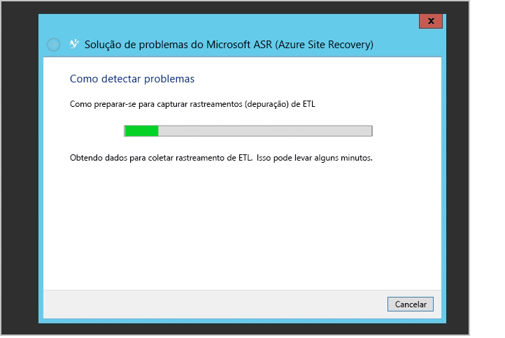

# Monitorar e solucionar problemas de proteção para máquinas virtuais e sites físicos
Este guia de monitoramento e solução de problemas ajuda você a aprender a controlar a integridade da replicação e técnicas de solução de problemas para o Azure Site Recovery.

## Compreender os componentes
### Implantação de máquina virtual VMware ou site do servidor físico para replicação entre locais e o Azure
Para configurar a recuperação de banco de dados entre uma máquina virtual VMware local ou servidor físico e o Azure, é preciso configurar o servidor de configuração, o servidor de destino mestre e os componentes do servidor de processo no servidor ou máquina virtual. Ao habilitar a proteção do servidor de origem, o Azure Site Recovery instala o recurso Aplicativos Móveis do Serviço de Aplicativo do Microsoft Azure. Depois de uma interrupção local e depois do failover do servidor de origem para o Azure, os clientes precisam configurar um servidor de processo no Azure e um servidor de destino mestre local para recompilar o servidor de origem local.

### Implantação de site do Virtual Machine Manager para a replicação entre sites locais
Para configurar a recuperação de banco de dados entre dois pontos locais, é preciso baixar o provedor Azure Site Recovery e instalá-lo no servidor do Virtual Machine Manager. O provedor precisa de conectividade com a Internet para garantir que todas as operações disparadas pelo portal do Azure sejam convertidas em operações locais.

### Implantação de site do Virtual Machine Manager para replicação entre localizações locais e o Azure
Ao configurar a recuperação de banco de dados entre pontos locais e o Azure, é preciso baixar o provedor Azure Site Recovery e instalá-lo no servidor do Virtual Machine Manager. Também é preciso instalar o Agente de Serviços de Recuperação do Azure, que deve ser instalado em cada host Hyper-V. Consulte [Noções básicas sobre a proteção do site para o Azure](site-recovery-understanding-site-to-azure-protection.md) para saber mais.

### Implantação de site do Hyper-V para replicação entre pontos locais e o Azure
Esse processo é semelhante à implantação do Virtual Machine Manager. A única diferença é que o provedor do Azure Site Recovery e o Agente de Serviços de Recuperação do Azure são instalados no próprio host Hyper-V. Consulte [Noções básicas sobre a proteção do site para o Azure](site-recovery-understanding-site-to-azure-protection.md) para saber mais.

## Monitorar as operações de configuração, proteção e recuperação
Cada operação no Azure Site Recovery é auditada e rastreada na guia **TRABALHOS**. Para qualquer erro de configuração, proteção ou recuperação, vá para a guia **TRABALHOS** e procure falhas.

Se você encontrar falhas na guia **TRABALHOS**, clique no trabalho e clique em **DETALHES DO ERRO** para o trabalho.

Os detalhes do erro ajudarão a identificar uma possível causa e uma recomendação para o problema.

No exemplo anterior, outra operação em andamento parece estar causando a falha da configuração de proteção. Resolva o problema com base na recomendação e, em seguida, clique em **REINICIAR** para iniciar a operação novamente.

A opção **REINICIAR** não está disponível para todas as operações. Se uma operação não tiver a opção **REINICIAR**, volte para o objeto e refaça a operação. É possível cancelar qualquer trabalho em andamento usando o botão **CANCELAR**.

## Monitorar a integridade da replicação para máquinas virtuais
Você pode usar o portal do Azure para monitorar remotamente provedores do Azure Site Recovery para cada uma das entidades protegidas. Clique em **ITENS PROTEGIDOS** e, em seguida, clique em **NUVENS DO VMM** ou **GRUPOS DE PROTEÇÃO**. A guia **NUVENS DO VMM** só está disponível para implantações baseadas no Virtual Machine Manager. Para outros cenários, as entidades protegidas estão sob a guia **GRUPOS DE PROTEÇÃO**.

Clique em uma entidade protegida sob a nuvem ou o grupo de proteção correspondente para ver todas as operações disponíveis mostradas no painel inferior.

Como mostrado na captura de tela anterior, a integridade da máquina virtual é **Crítica**. Você pode clicar no botão **DETALHES DO ERRO** na parte inferior para ver o erro. Com base nas **Possíveis causas** e na **Recomendação** mencionadas, resolva o problema.

> [!NOTE]
> Se quaisquer operações ativas estiverem em andamento ou falharem, vá para a exibição **TRABALHOS**, como mencionado anteriormente, para exibir o erro para um trabalho específico.
> 
> 

## Solucionar problemas do Hyper-V no local
Conecte-se ao console do gerenciador do Hyper-V local, selecione a máquina virtual e veja a integridade da replicação.

Neste caso, a **Integridade da Replicação** é **Crítica**. Clique na máquina virtual e, em seguida, clique com o botão direito do mouse em **Replicação** > **Exibir Integridade da Replicação** para ver os detalhes.

Se a replicação estiver em pausa para a máquina virtual, clique com o botão direito do mouse na máquina virtual e, em seguida, clique em **Replicação** > **Retomar replicação**.

Se uma máquina virtual migrar um novo host Hyper-V que esteja dentro do cluster ou computador autônomo e o host Hyper-V tiver sido configurado por meio do Azure Site Recovery, a replicação para a máquina virtual não será afetada. Verifique se o novo host Hyper-V atenda a todos os pré-requisitos e seja configurado usando o Azure Site Recovery.

### Log de Eventos
| Origens de eventos | Detalhes |
| --- |:--- |
| **Applications and Service Logs/Microsoft/VirtualMachineManager/Server/Admin** (servidor do Virtual Machine Manager) |Fornece registro em log útil para solucionar muitos problemas diferentes do Virtual Machine Manager. |
| **Applications and Service Logs/MicrosoftAzureRecoveryServices/Replication** (host Hyper-V) |Fornece registro em log útil para solucionar muitos problemas com o Agente de Serviços de Recuperação do Microsoft Azure.    |
| **Applications and Service Logs/Microsoft/Azure Site Recovery/Provider/Operational** (host Hyper-V) |Fornece registro em log útil para solucionar muitos problemas com o Serviço do Microsoft Azure Site Recovery.    |
| **Applications and Service Logs/Microsoft/Windows/Hyper-V-VMMS/Admin** (host Hyper-V) |Fornece registros em log útil para solucionar muitos problemas de gerenciamento de máquina virtual do Hyper-V.    |

### Opções de registro em log de replicação do Hyper-V
Todos os eventos relativos à replicação do Hyper-V são registrados no log do Hyper-V-VMMS\\Admin localizado em Logs de Aplicativos e Serviços\\Microsoft\\Windows. Além disso, você pode habilitar um log analítico para o Serviço de Gerenciamento de Máquinas Virtuais do Hyper-V. Para habilitar esse log, primeiro exiba os logs analíticos e de depuração no Visualizador de Eventos. Abra Visualizador de Eventos e, em seguida, clique em **Exibir** > **Mostrar Logs Analíticos e de Depuração**.

Um log Analítico está visível em **VMMS do Hyper-V**.

No painel **Ações**, clique em **Habilitar Log**. Depois de habilitado, ele é exibido no **Monitor de Desempenho** como uma **Sessão de Rastreamento de Evento** localizada em **Conjuntos de Coletores de Dados**.

Para exibir as informações coletadas, primeiro interrompa a sessão de rastreamento desabilitando o log. Salve o log e abra-o novamente no Visualizador de Eventos ou use outras ferramentas para convertê-lo conforme desejado.

## Entre em contato com o Suporte da Microsoft
### Coleta de logs
Para proteção de site do Virtual Machine Manager, consulte a [Coleção de log do Azure Site Recovery usando a Ferramenta SDP (Plataforma de Diagnóstico de Suporte)](http://social.technet.microsoft.com/wiki/contents/articles/28198.asr-data-collection-and-analysis-using-the-vmm-support-diagnostics-platform-sdp-tool.aspx) para coletar os logs necessários.

Para proteção do site do Hyper-V, baixe a [ferramenta](https://dcupload.microsoft.com/tools/win7files/DIAG_ASRHyperV_global.DiagCab) e execute-a no host Hyper-V para coletar os logs.

Para cenários do servidor VMware/físico, consulte [Azure Site Recovery log collection for VMware and physical site protection](http://social.technet.microsoft.com/wiki/contents/articles/30677.azure-site-recovery-log-collection-for-vmware-and-physical-site-protection.aspx) (Coleta de logs do Azure Site Recovery para proteção de site físico e do VMware) para coletar os logs necessários.

A ferramenta coleta os logs localmente em uma subpasta nomeada de modo aleatório em %LocalAppData%\ElevatedDiagnostics.

### Abra um tíquete de suporte
Para acionar um tíquete de suporte para o Azure Site Recovery, acesse o Suporte do Azure usando a URL em <http://aka.ms/getazuresupport>.

## Artigos da Base de Dados de Conhecimento
* [Como preservar a letra da unidade das máquinas virtuais protegidas com failover ou migradas para o Azure](http://support.microsoft.com/kb/3031135)
* [Como gerenciar localmente o uso de largura de banda de rede para proteção do Azure](https://support.microsoft.com/kb/3056159)
* [Azure Site Recovery: erro "O recurso de cluster não pôde ser encontrado" quando você tenta habilitar a proteção para uma máquina virtual](http://support.microsoft.com/kb/3010979)
* [Guia para Compreender e solucionar problemas de replicação do Hyper-V](http://social.technet.microsoft.com/wiki/contents/articles/21948.hyper-v-replica-troubleshooting-guide.aspx)

## Erros comuns do Azure Site Recovery e suas resoluções
A seguir estão os erros comuns e suas resoluções. Cada erro é documentado em uma página separada do wiki.

### Geral
* NOVO [Trabalhos que falham com um erro "Operação em andamento". Erros 505, 514, 532.](http://social.technet.microsoft.com/wiki/contents/articles/32190.azure-site-recovery-jobs-failing-with-error-an-operation-is-in-progress-error-505-514-532.aspx)
* NOVO [Trabalhos que falham com o erro "O servidor não está conectado à Internet". Erro 25018.](http://social.technet.microsoft.com/wiki/contents/articles/32192.azure-site-recovery-jobs-failing-with-error-server-isn-t-connected-to-the-internet-error-25018.aspx)

### Configuração
* [O servidor do Virtual Machine Manager não pode ser registrado devido a um erro interno. Consulte a exibição de trabalhos no portal do Site Recovery para obter mais detalhes sobre o erro. Execute a configuração novamente para registrar o servidor.](http://social.technet.microsoft.com/wiki/contents/articles/25570.the-vmm-server-cannot-be-registered-due-to-an-internal-error-please-refer-to-the-jobs-view-in-the-site-recovery-portal-for-more-details-on-the-error-run-setup-again-to-register-the-server.aspx)
* [Não é possível estabelecer uma conexão com o cofre do Gerenciador de Recuperação do Hyper-V. Verifique as configurações de proxy ou tente novamente mais tarde.](http://social.technet.microsoft.com/wiki/contents/articles/25571.a-connection-cant-be-established-to-the-hyper-v-recovery-manager-vault-verify-the-proxy-settings-or-try-again-later.aspx)

### Configuração
* [Não é possível criar o Grupo de Proteção: ocorreu um erro ao recuperar a lista de servidores.](http://blogs.technet.com/b/somaning/archive/2015/08/12/unable-to-create-the-protection-group-in-azure-site-recovery-portal.aspx)
* [O cluster do host Hyper-V contém pelo menos um adaptador de rede estático ou nenhum adaptador conectado está configurado para usar DHCP.](http://social.technet.microsoft.com/wiki/contents/articles/25498.hyper-v-host-cluster-contains-at-least-one-static-network-adapter-or-no-connected-adapters-are-configured-to-use-dhcp.aspx)
* [O Virtual Machine Manager não tem permissões para completar uma ação.](http://social.technet.microsoft.com/wiki/contents/articles/31110.vmm-does-not-have-permissions-to-complete-an-action.aspx)
* [Não é possível selecionar a conta de armazenamento na assinatura durante a configuração da proteção.](http://social.technet.microsoft.com/wiki/contents/articles/32027.can-t-select-the-storage-account-within-the-subscription-while-configuring-protection.aspx)

### Proteção
* NOVO [Falha em Habilitar Proteção com o erro "Não foi possível configurar a proteção para a máquina virtual". Erros 60007, 40003.](http://social.technet.microsoft.com/wiki/contents/articles/32194.azure-site-recovery-enable-protection-failing-with-error-protection-couldn-t-be-configured-for-the-virtual-machine-error-60007-40003.aspx)
* NOVO [Falha em Habilitar Proteção com o erro "Não foi possível habilitar a proteção para a máquina virtual". Erro 70094.](http://social.technet.microsoft.com/wiki/contents/articles/32195.azure-site-recovery-enable-protection-failing-with-error-protection-couldn-t-be-enabled-for-the-virtual-machine-error-70094.aspx)
* NOVO [Erro 23848 de migração dinâmica — a máquina virtual será movida usando o tipo Live. Isso pode interromper o status da proteção de recuperação da máquina virtual.](http://social.technet.microsoft.com/wiki/contents/articles/32021.live-migration-error-23848-the-virtual-machine-is-going-to-be-moved-using-type-live-this-could-break-the-recovery-protection-status-of-the-virtual-machine.aspx)
* [Falha na habilitação da proteção, pois o Agente não está instalado no computador host.](http://social.technet.microsoft.com/wiki/contents/articles/31105.enable-protection-failed-since-agent-not-installed-on-host-machine.aspx)
* [Não foi possível localizar um host adequado para a máquina virtual de réplica, pois há poucos recursos de computação.](http://social.technet.microsoft.com/wiki/contents/articles/25501.a-suitable-host-for-the-replica-virtual-machine-can-t-be-found-due-to-low-compute-resources.aspx)
* [Não é possível localizar um host adequado para a máquina virtual de réplica, pois não há uma rede lógica anexada.](http://social.technet.microsoft.com/wiki/contents/articles/25502.a-suitable-host-for-the-replica-virtual-machine-can-t-be-found-due-to-no-logical-network-attached.aspx)
* [Não é possível conectar-se ao computador host de réplica, pois não foi possível estabelecer a conexão.](http://social.technet.microsoft.com/wiki/contents/articles/31106.cannot-connect-to-the-replica-host-machine-connection-could-not-be-established.aspx)

### Recuperação
* O Virtual Machine Manager não pode concluir a operação de host:
  * [Failover para o ponto de recuperação selecionado para a máquina virtual: erro geral de acesso negado.](http://social.technet.microsoft.com/wiki/contents/articles/25504.fail-over-to-the-selected-recovery-point-for-virtual-machine-general-access-denied-error.aspx)
  * [O Hyper-V não conseguiu fazer failover para o ponto de recuperação selecionado para a máquina virtual: operação anulada.  Tente um ponto de recuperação mais recente. (0x80004004).](http://social.technet.microsoft.com/wiki/contents/articles/25503.hyper-v-failed-to-fail-over-to-the-selected-recovery-point-for-virtual-machine-operation-aborted-try-a-more-recent-recovery-point-0x80004004.aspx)
  * Não foi possível estabelecer uma conexão com o servidor (0x00002EFD).
    * [O Hyper-V não conseguiu habilitar a replicação inversa para a máquina virtual.](http://social.technet.microsoft.com/wiki/contents/articles/25505.a-connection-with-the-server-could-not-be-established-0x00002efd-hyper-v-failed-to-enable-reverse-replication-for-virtual-machine.aspx)
    * [O Hyper-V não conseguiu habilitar a replicação para a máquina virtual.](http://social.technet.microsoft.com/wiki/contents/articles/25506.a-connection-with-the-server-could-not-be-established-0x00002efd-hyper-v-failed-to-enable-replication-for-virtual-machine-virtual-machine.aspx)
  * [Não foi possível confirmar o failover para a máquina virtual.](http://social.technet.microsoft.com/wiki/contents/articles/25508.could-not-commit-failover-for-virtual-machine.aspx)
* [O plano de recuperação contém máquinas virtuais que não estão prontas para o failover planejado.](http://social.technet.microsoft.com/wiki/contents/articles/25509.the-recovery-plan-contains-virtual-machines-which-are-not-ready-for-planned-failover.aspx)
* [A máquina virtual não está pronta para o failover planejado.](http://social.technet.microsoft.com/wiki/contents/articles/25507.the-virtual-machine-isn-t-ready-for-planned-failover.aspx)
* [A máquina virtual não está em execução e não está desligada.](http://social.technet.microsoft.com/wiki/contents/articles/25510.virtual-machine-is-not-running-and-is-not-powered-off.aspx)
* [Ocorreu uma operação fora de banda em uma máquina virtual e não foi possível confirmar o failover.](http://social.technet.microsoft.com/wiki/contents/articles/25507.the-virtual-machine-isn-t-ready-for-planned-failover.aspx)
* Failover de Teste
  * [Não foi possível iniciar o failover, pois o failover de teste está em andamento.](http://social.technet.microsoft.com/wiki/contents/articles/31111.failover-could-not-be-initiated-since-test-failover-is-in-progress.aspx)
* NOVO O failover atinge o tempo limite com 'WaitForScriptExecutionTaskTimeout da tarefa PreFailoverWorkflow' devido às definições de configuração do Grupo de Segurança de Rede associado à Máquina Virtual ou a sub-rede à qual o computador pertence. Veja ['WaitForScriptExecutionTaskTimeout da tarefa PreFailoverWorkflow'](https://aka.ms/troubleshoot-nsg-issue-azure-site-recovery) para obter detalhes.

### Servidor de configuração, servidor de processo, destino mestre
* [O host ESXi no qual o PS/CS está hospedado como uma VM falha com uma tela roxa.](http://social.technet.microsoft.com/wiki/contents/articles/31107.vmware-esxi-host-experiences-a-purple-screen-of-death.aspx)

### Solução de problemas da área de trabalho remota após failover
* Muitos clientes têm enfrentado problemas para conexão com a máquina virtual de failover no Azure. [Use o documento de solução de problemas para fazer o RDP para a máquina virtual](http://social.technet.microsoft.com/wiki/contents/articles/31666.troubleshooting-remote-desktop-connection-after-failover-using-asr.aspx).

#### Adicionando um IP público em uma máquina virtual do Gerenciador de recursos
Se o botão **Conectar** no portal estiver esmaecido e você não estiver conectado ao Azure por meio do ExpressRoute ou de uma conexão VPN Site a Site, será necessário criar e atribuir à sua máquina virtual um endereço IP público antes de usar Área de Trabalho Remota/Shell Compartilhado. Então é possível adicionar um IP Público na interface de rede da máquina virtual.  

<!--HONumber=Nov16_HO3-->

