<properties
	pageTitle="Considerações de infraestrutura de rede para o Site Recovery | Microsoft Azure" 
	description="Este artigo aborda considerações de design de rede práticas para failover com Recuperação de Site" 
	services="site-recovery" 
	documentationCenter="" 
	authors="rayne-wiselman" 
	manager="jwhit" 
	editor=""/>

<tags 
	ms.service="site-recovery" 
	ms.devlang="na"
	ms.topic="get-started-article"
	ms.tgt_pltfrm="na"
	ms.workload="storage-backup-recovery" 
	ms.date="12/14/2015" 
	ms.author="raynew"/>

#  Considerações de infraestrutura de rede para Recuperação de Site

O serviço de Azure Site Recovery contribui para uma solução robusta de recuperação de desastre e continuidade de negócios (BCDR), através da proteção e recuperação de seus servidores físicos locais e máquinas virtuais com orquestração e automação de replicação e failover no Azure ou em um data center local secundário.

Este artigo destina-se à equipe de virtualização responsável pela arquitetura, pela implementação e pelo suporte a uma solução BCDR e pela infraestrutura que inclui o System Center VMM e o Azure Site Recovery.

## Visão geral

A finalidade de sua estratégia de BCDR é manter seus aplicativos de negócios em execução e restaurar as cargas de trabalho com falha e os serviços para que a organização possa retomar rapidamente a operação normal. Desenvolver estratégias de recuperação de desastres é um desafio, devido à dificuldade inerente de prever eventos imprevisíveis e o alto custo da implementação de uma proteção adequada contra falhas de longo alcance. O Azure Site Recovery ajuda a implementar proteção e failover de seu data center principal em um data center secundário (ou no Azure), copiando inicialmente (replicando) os dados principais e, em seguida, atualizando periodicamente as réplicas.

Como uma parte essencial do planejamento BCDR, você precisa definir o objetivo do tempo de recuperação (RTO) e o objetivo do ponto de recuperação (RPO) para que possa colocar novamente os dados da organização online o mais rápido possível (com um baixo RTO) e com perda mínima de dados (RPO baixo). O design de rede de sua organização representa um gargalo potencial para os objetivos de RTO e RPO, e um planejamento de design sólido pode ajudar a evitar esse desafio.

Se você decidiu usar o serviço de Azure Site Recovery para ajudar a implementar proteção e failover existem algumas questões principais no design de rede para BCDR:

- **Design VMM**: Estou usando o System Center VMM. Como eu devo tratar o design de rede para integrar o VMM e a Recuperação de Site?
- **Conectividade após o failover**: Estou usando Recuperação de Site para executar um failover. O que posso fazer para que meus aplicativos e minhas cargas de trabalho estejam disponíveis e acessíveis após a conclusão do failover?

## Design VMM

A Recuperação de Site pode ser feita como uma camada sobre o seu design de VMM existente, independentemente se o design usa um único ou vários servidores do VMM.

### Servidor VMM Autônomo

Nessa topologia, você implantará um servidor VMM em uma máquina virtual no site principal e, em seguida, replicará essa máquina virtual para um site secundário com Réplica do Hyper-V e Recuperação de Site. Convém considerar que a instalação do servidor VMM e do respectivo SQL Server de suporte na mesma máquina virtual pode reduzir o tempo de inatividade, porque apenas uma máquina virtual deve ser instanciada. Quando o serviço VMM está usando um SQL Server remoto, você precisa recuperar a instância do SQL Server antes de recuperar o servidor VMM.

Para implantar um único VMM em uma máquina virtual com o Hyper-V Replica:

1. Configure o VMM em uma VM com o SQL Server instalado.
2. Adicione hosts a serem gerenciados a nuvens no servidor VMM.
3. Faça logon no portal do Azure e, em seguida, configure nuvens para proteção.
4. Habilite a replicação para todas as VMs que precisam ser protegidas pelo servidor VMM.
5. Vá para o console do Gerenciador do Hyper-V, escolha o Hyper-V Replica e, em seguida, habilite a replicação na VM do VMM.
6. Certifique-se de que a VM do VMM não é adicionada para as nuvens que estão protegidas pelo serviço ASR para que as configurações de replicação do Hyper-V não sejam substituídas pelo ASR.

No caso de um desastre, as cargas de trabalho podem ser recuperadas da seguinte maneira:

1. Faça o failover da VM do VMM para o site de recuperação, usando o Gerenciador do Hyper-V.
2. Depois que a VM do VMM for recuperada, o usuário poderá fazer logon no Hyper-V Recovery Manager do site secundário.
3. Após a conclusão do failover não planejado os usuários poderão acessar todos os recursos no site principal.
4. Observe que a VM do VMM precisa sofrer failover manualmente para o site secundário antes de as cargas de trabalho falharem. 

### Servidor VMM clusterizado.

[Implantar o VMM em um cluster](https://technet.microsoft.com/library/gg610675.aspx) fornece alta disponibilidade e proteção contra failover de hardware. Se você estiver implantando o cluster do VMM com a Recuperação de Site, observerá que:

O servidor do VMM deve ser implantado em um cluster ampliado em sites geograficamente separados. O banco de dados SQL Server usados pelo VMM deve ser protegido com os grupos de disponibilidade AlwaysOn do SQL Server com uma réplica no site secundário. Se o desastre ocorrer o servidor VMM e o SQL Server correspondente irão automaticamente fazer failover para o site de recuperação. Em seguida, é possível realizar failover de cargas de trabalho com a Recuperação de Site.

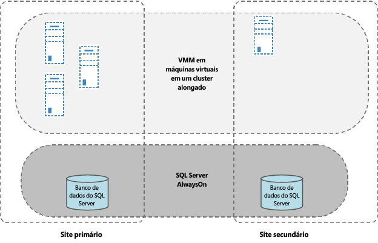

## Conectividade após o failover

Até certo ponto, aplicativos modernos são quase sempre dependentes da rede, então mover fisicamente um serviço de um site para outro representa um desafio de rede para certificar-se de que os aplicativos e as cargas de trabalho estejam acessíveis após o failover. Há duas soluções principais para esse problema:

- **Endereços IP fixos**: A primeira abordagem é manter os endereços IP fixos. Apesar da movimentação dos serviços e dos servidores de hospedagem estarem em locais físicos diferentes, os aplicativos levam a configuração de endereço IP com eles para o novo local.
- **Endereços IP modificados**: A segunda abordagem exige a alteração de endereço IP durante a transição para o site recuperado. 

### Opção 1: Endereços IP fixo

De uma perspectiva de recuperação de desastres, usar endereços IP fixos parece ser o método mais fácil de implementar. No entanto, há alguns desafios que tornam a abordagem menos popular na prática. O Azure Site Recovery fornece a capacidade de manter os endereços IP em todos os cenários. Antes de decidir usar essa abordagem vamos examinar as considerações para os cenários principais (sub-rede ampliada e failover de sub-rede).

#### Sub-rede ampliada

Em uma sub-rede ampliada a sub-rede está disponível ao mesmo tempo no local primário e no local de destino. Simplificando, isso significa que você pode mover um servidor e sua configuração IP (Camada 3) para o site secundário, e a rede roteará o tráfego para o novo local automaticamente. Isso é trivial para se lidar do ponto de vista do servidor, mas há uma série de desafios:

- Do ponto de vista da Camada 2 (camada de link de dados) requer o equipamento de rede que pode gerenciar uma VLAN ampliada, embora esse tipo de equipamento agora seja amplamente disponível.
- O segundo e mais difícil problema é que, ampliando a VLAN estende o potencial domínio de falha estende-se para os dois sites, essencialmente tornando-se um ponto único de falha. Embora isso seja improvável pode haver uma tempestade de transmissão que não pode ser isolada. Já vimos opiniões mistas sobre esse problema, que variam de implementação bem sucedida para "nunca".
- Uma sub-rede ampliada não é possível se você estiver efetuando failover do Azure como seu site de recuperação de desastres.

#### Failover de sub-rede

É possível implementar failover de sub-rede para obter os benefícios de uma sub-rede ampliada sem, na verdade, ampliá-la. Nessa configuração qualquer sub-rede está presente no Site 1 ou Site 2, mas nunca em ambos os sites simultaneamente. Para manter o espaço de endereço IP no caso de um failover, você pode organizar por meio de programação para a infra-estrutura do roteador mover as sub-redes de um site para outro. Em um cenário de failover as sub-redes são movidas com suas respectivas VMs protegidas. A principal desvantagem dessa abordagem é que no caso de falha você precisa mover toda a sub-rede, o que pode ser uma solução razoável, mas pode afetar as considerações de granularidade de failover.

Vamos dar uma olhada em como uma empresa fictícia (Contoso) é capaz de replicar suas VMs em um local de recuperação, durante o failover na sub-rede inteira. Vamos examinar como a Contoso é capaz de gerenciar suas sub-redes enquanto replica máquinas virtuais entre duas posições locais e discutir como o failover de sub-rede funciona quando o Azure é usado como a recuperação de desastres.

##### Exemplo - failover de sub-rede em uma empresa
 
- O site principal tem aplicativos em execução na sub-rede 192.168.1.0/24.
- Toda a sub-rede realizará o failover, e todas as máquinas virtuais na sub-rede realizarão failover para o local de recuperação e manterão seus endereços IP
- Conforme mostrado no diagrama abaixo as rotas entre o site principal e o site de recuperação, o terceiro site e o site principal e o terceiro site e o site de recuperação terá que ser modificado de forma adequada para refletir o fato de que todas as máquinas virtuais que pertencem à sub-rede 192.168.1.0/24 foram movidas para o local de recuperação.
- Este diagrama supõe que:
	-  Cada data center é atendido por sua própria instância do VMM. Não haverá nenhuma replicação de bancos de dados do System Center VMM entre data centers.
	-  Cada data center usa endereços IP estáticos para as máquinas virtuais.
	-  A conectividade entre os data centers é por meio de um circuito dedicado e não por meio de conectividade VPN pela internet.

**Antes do failover**

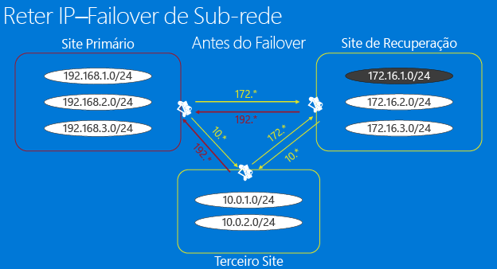

**Após o failover**

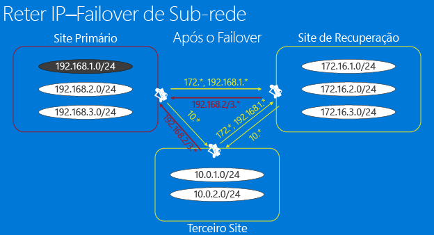

Ao habilitar a proteção para uma máquina virtual específica, a Recuperação de Site aloca recursos de rede da seguinte maneira:

1. A Recuperação de site aloca um endereço IP para cada interface de rede na máquina virtual a partir do pool de endereços IP estáticos definido na rede relevante para cada instância do VMM.
2. Se o administrador define o mesmo pool de endereços IP que é usado no site principal para a rede no local de recuperação a Recuperação de Site alocará o mesmo endereço IP que está alocado para a máquina virtual principal para o endereço de IP de máquina virtual de réplica O endereço de IP é reservado no VMM, mas não está definido como o endereço IP de failover. O endereço IP de failover é definido apenas antes do failover. Esta captura de tela mostra o failover de configurações de TCP/IP para a máquina virtual de réplica (no console do Hyper-V). Essas configurações são replicadas antes do início de failover para a máquina virtual.

	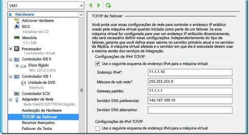

3. Se o mesmo endereço IP não estiver disponível, a Recuperação de Site alocará um endereço diferente do pool.
4. Depois que a máquina virtual estiver habilitada para proteção você pode usar o seguinte script de exemplo para verificar o endereço IP que foi alocado para a máquina virtual. O mesmo endereço IP seria definido como o endereço IP de failover e atribuído à VM no momento do failover.

    $vm = Get-SCVirtualMachine -Name $na = $vm[0].VirtualNetworkAdapters $ip = Get-SCIPAddress -GrantToObjectID $na[0].id $ip.address

Observe que, se as máquinas virtuais usam DHCP, o gerenciamento de endereço IP não é manipulado pela Recuperação de Site. Você precisará garantir que o servidor DHCP alocando os endereços IP no site de recuperação poderá alocar endereços do mesmo intervalo que o site principal.

##### Exemplo - Failover de sub-rede para o Azure

Se você estiver efetuando failover no Azure, há algumas restrições a mais. Vamos dar uma olhada em uma empresa fictícia (Banco Woodgrove) que tem a infraestrutura local que hospeda a linha de aplicativos de negócios e o Azure hospedando os aplicativos móveis.

- A conectividade entre as VMs do Banco Woodgrove no Azure e os servidores locais é por VPN site a site que mostra a rede virtual no Azure como uma extensão da rede do local do Banco Woodgrove. 
- O Woodgrove deseja usar Recuperação de Site para replicar suas cargas de trabalho locais para Azure. 
- O Woodgrove tem de lidar com aplicativos e configurações que dependem de endereços IP embutidos, então eles precisam manter endereços IP para seus aplicativos após o failover no Azure.
- A Infraestrutura de local do Woodgrove é gerenciada por um servidor VMM 2012 R2.
- Há uma rede lógica baseada em VLAN (rede de aplicativos) que foi criada no servidor VMM. 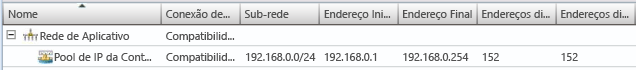
- Uma rede VM (rede de VM do aplicativo) foi criada usando a rede lógica. 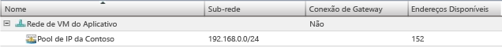
- Todas as máquinas virtuais no aplicativo usam endereços IP estáticos, para que um pool de IP estático também seja definido para a rede lógica. 
- O Woodgrove está atribuindo endereços IP do intervalo de endereços IP (172.16.1.0/24, 172.16.2.0/24) a seus recursos em execução no Azure.

Para o Woodgrove implantar a replicação e manter endereços IP é necessário o seguinte:

- Uma máquina virtual do Azure que seja uma extensão da rede local para que os aplicativos possam fazer failover de forma ininterrupta.
- Observe que quando você configurar sua conexão site a site no Azure, uma rede do Azure permite rotear o tráfego para o caminho local (o Azure chama de rede local) somente se o intervalo de endereços IP é diferente do intervalo de endereços IP local, porque o Azure não oferece suporte à ampliação de sub-redes. Isso significa que, se você tiver uma sub-rede 192.168.1.0/24 local, não é possível adicionar 192.168.1.0/24 na rede do Azure. Isso é esperado porque o Azure não sabe que não há nenhuma VMs ativa na sub-rede e que a sub-rede está sendo criada apenas para fins de recuperação de desastres. Para poder rotear corretamente o tráfego para fora de uma rede do Azure, as sub-redes na rede e a rede local não devem entrar em conflito. 
- Vamos precisar criar uma rede adicional no Azure (Rede de recuperação) onde as VMs de failover serão criadas.

	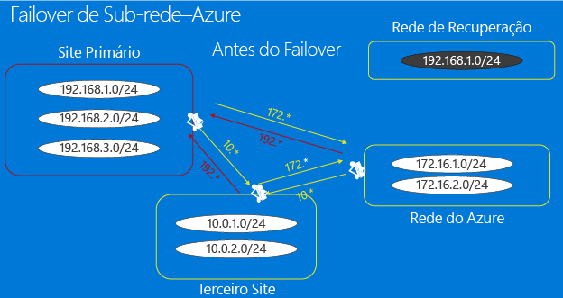

- Para garantir que o endereço IP para a máquina virtual seja mantido, nas propriedades da VM na Recuperação de Site especificaremos que o mesmo endereço IP deve ser usado. Em seguida, após o failover a Recuperação Site atribuirá o endereço IP especificado para a máquina virtual. 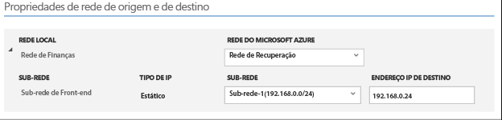

- Quando o failover é acionado e as VMs são criadas na Rede de Recuperação com o endereço IP, a conectividade com a máquina virtual pode ser estabelecida com um. Essa ação pode ser por script. Como discutido na seção anterior sobre o failover de sub-rede, também no caso de failover para o Azure as rotas teriam que ser adequadamente modificadas para refletir que 192.168.1.0/24 agora foi movido para o Azure. 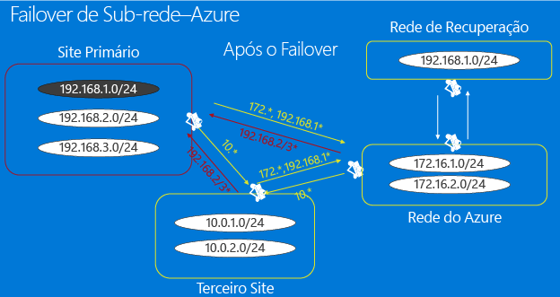

### Opção 2: Endereços IP modificados

Essa abordagem parece ser a mais comum e significa que o endereço IP de cada VM que executa o failover será alterado. A principal desvantagem dessa abordagem é que sua infraestrutura de rede precisa estar ciente de que os endereços IP foram alterados e que as entradas DNS normalmente precisarão ser alteradas ou liberadas em toda a rede, assim como as entradas armazenadas nas tabelas de rede. Isso poderia incorrer em tempo de inatividade dependendo de como a infraestrutura do DNS está configurada. Esses problemas podem ser reduzidos usando valores de TTL baixos no caso de aplicativos de intranet e usando o [Gerenciador de Tráfego do Azure](http://azure.microsoft.com/blog/2015/03/03/reduce-rto-by-using-azure-traffic-manager-with-azure-site-recovery/)para aplicativos baseados na internet.

#### Exemplo - endereços IP modificados

Vamos analisar esse cenário com um exemplo que tem um terceiro local a partir do qual os aplicativos hospedados no site principal ou de recuperação podem ser acessados.

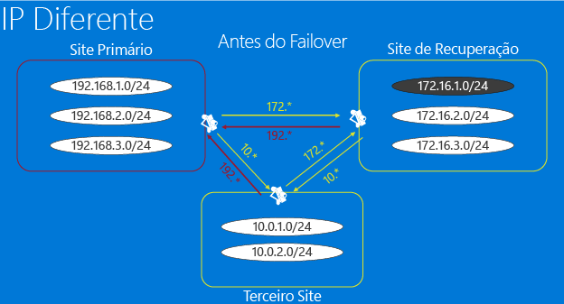

- Alguns aplicativos são hospedados na sub-rede de 192.168.1.0/24 da sub-rede no site principal e eles foram configurados para surgir no site de recuperação na sub-rede 172.16.1.0/24 após um failover.
- Rotas de rede/conexões de VPN foram configuradas corretamente para que todos os três sites possam acessar um ao outro. 
- Depois do failover de um ou mais aplicativos, eles serão restaurados na sub-rede de recuperação. Nesse caso, não precisamos fazer failover na sub-rede inteira ao mesmo tempo, e nenhuma alteração é necessária para reconfigurar as rotas de rede ou VPN.
- Um failover e algumas atualizações DNS manterão os aplicativos acessíveis. Se o servidor DNS estiver configurado para permitir atualizações dinâmicas então as máquinas virtuais seria registrariam-se usando o novo endereço IP quando eles iniciarem após um failover.

	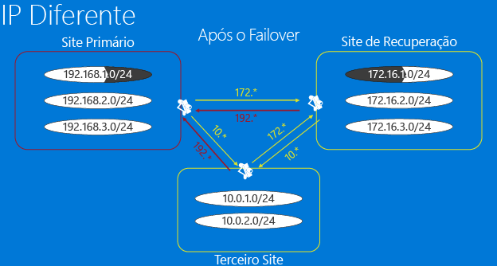

- Após o failover a máquina virtual de réplica pode ter um endereço IP que não é o mesmo que o endereço IP da máquina virtual principal.
- As máquinas virtuais atualizarão o servidor DNS que estiverem usando depois que forem iniciadas. As entradas DNS normalmente precisam ser alteradas ou liberadas em toda a rede e as entradas em cache nas tabelas de rede precisam ser atualizadas ou liberadas, portanto, não é incomum enfrentar tempo de inatividade enquanto ocorrem essas alterações de estado. Isso pode ser reduzido:

	- Usando valores TTL baixos para aplicativos de intranet.
	- Usando [Azure Traffic Manager com o Site Recovery] (http://azure.microsoft.com/blog/2015/03/03/reduce-rto-by-using-azure-traffic-manager-with-azure-site-recovery/ para aplicativos baseados em internet).
	- Usando o script a seguir em seu plano de recuperação para atualizar o servidor DNS para garantir uma atualização em tempo hábil (o script não é necessário se o registro de DNS dinâmico estiver configurado)

    string]$Zone, [string]$name, [string]$IP ) $Record = Get-DnsServerResourceRecord -ZoneName $zone -Name $name $newrecord = $record.clone() $newrecord.RecordData[0].IPv4Address = $IP Set-DnsServerResourceRecord -zonename $zone -OldInputObject $record -NewInputObject $Newrecord

#### Exemplo - Failover para o Azure

A configuração de infra-estrutura de rede do Azure como uma [postagem de blog](http://azure.microsoft.com/blog/2014/09/04/networking-infrastructure-setup-for-microsoft-azure-as-a-disaster-recovery-site/) de Local de Recuperação de Desastres explica como configurar a infra-estrutura de rede do Azure necessária quando reter endereços IP não é um requisito. Ela começa descrevendo o aplicativo e, em seguida, analisa como configurar a rede local e no Azure. Depois conclui com instruções para executar um teste de failover e um failover planejado.

## Próximas etapas

[Saiba](site-recovery-network-mapping.md) como a Recuperação de Site mapeia redes de origem e destino.

<!---HONumber=AcomDC_1217_2015-->